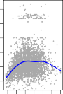
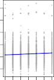
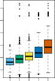
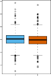
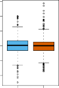
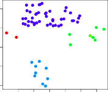

[< 1. Introduction](../trans1.html) | [1.2 A Brief History Of Statistical Learning >](../1_2_a_brief_history_of_statistical_learning/trans1.html)

> 💡 **학습 팁:** 통계 수식과 용어가 낯설고 어렵다면? 아주 쉽게 풀어쓴 [📖 쉬운 해설(의역본) 보기](./trans2.html)를 추천합니다!

# An Overview of Statistical Learning

# 통계적 학습 개요

*Statistical learning* refers to a vast set of tools for *understanding data*.

*통계적 학습*은 *데이터 이해*를 위한 방대한 도구들의 집합을 의미합니다.

These tools can be classified as *supervised* or *unsupervised*.

이러한 도구들은 *지도 학습* 또는 *비지도 학습*으로 분류될 수 있습니다.

Broadly speaking, supervised statistical learning involves building a statistical model for predicting, or estimating, an *output* based on one or more *inputs*.

크게 말해 지도 통계적 학습은 하나 이상의 *입력*을 기반으로 *출력*을 예측하거나 추정하기 위한 통계 모델을 구축하는 것을 포함합니다.

Problems of this nature occur in fields as diverse as business, medicine, astrophysics, and public policy.

이러한 성격의 문제는 비즈니스, 의학, 천체 물리학, 공공 정책 등 다양한 분야에서 발생합니다.

With unsupervised statistical learning, there are inputs but no supervising output; nevertheless we can learn relationships and structure from such data.

비지도 통계적 학습에서는 입력은 있지만 감독하는 출력이 없습니다. 그럼에도 불구하고 우리는 이러한 데이터로부터 관계와 구조를 학습할 수 있습니다.

To provide an illustration of some applications of statistical learning, we briefly discuss three real-world data sets that are considered in this book.

통계적 학습이 응용되는 몇 가지 예를 제공하기 위해 이 책에서 다루는 세 가지 실제 데이터 세트를 간략하게 논의합니다.

## Wage Data

## 임금 데이터

In this application (which we refer to as the `Wage` data set throughout this book), we examine a number of factors that relate to wages for a group of men from the Atlantic region of the United States.

이 애플리케이션(이 책 전체에서 `Wage` 데이터 세트라고 부름)에서는 미국 대서양 지역 남성 그룹의 임금과 관련된 여러 요인을 조사합니다.

In particular, we wish to understand the association between an employee's `age` and `education`, as well as the calendar `year`, on his `wage`.

특히 직원의 `age(연령)` 및 `education(교육)`과 함께 연도(`year`)가 `wage(임금)`에 미치는 연관성을 이해하고자 합니다.

Consider, for example, the left-hand panel of Figure 1.1, which displays `wage` versus `age` for each of the individuals in the data set.

예를 들어 데이터 세트의 각 개인에 대한 `wage(임금)` 대 `age(연령)`를 보여주는 그림 1.1의 왼쪽 패널을 고려해 보십시오.

There is evidence that `wage` increases with `age` but then decreases again after approximately age 60.

`wage(임금)`가 `age(연령)`와 함께 증가하다가 대략 60세 이후에는 다시 감소한다는 증거가 있습니다.

The blue line, which provides an estimate of the average `wage` for a given `age`, makes this trend clearer.

주어진 `age(연령)`에 대한 평균 `wage(임금)`의 추정치를 제공하는 파란색 선이 이러한 추세를 더 명확하게 보여줍니다.

Given an employee's `age`, we can use this curve to *predict* his `wage`.

직원의 `age(연령)`가 주어지면 이 곡선을 사용하여 그의 `wage(임금)`를 *예측*할 수 있습니다.

However, it is also clear from Figure 1.1 that there is a significant amount of variability associated with this average value, and so `age` alone is unlikely to provide an accurate prediction of a particular man's `wage`.

그러나 그림 1.1에서 이 평균값과 관련된 상당한 양의 변동성이 있는 것이 분명하므로, `age(연령)` 만으로는 특정 남성의 `wage(임금)`를 정확하게 예측할 수 없을 것입니다.

 

 

**FIGURE 1.1.** *Wage data, which contains income survey information for men from the central Atlantic region of the United States. Left: wage as a function of age. On average, wage increases with age until about 60 years of age, at which point it begins to decline. Center: wage as a function of year. There is a slow but steady increase of approximately $10,000 in the average wage between 2003 and 2009. Right: Boxplots displaying wage as a function of education, with 1 indicating the lowest level (no high school diploma) and 5 the highest level (an advanced graduate degree). On average, wage increases with the level of education.*

**그림 1.1.** *미국 중부 대서양 지역 남성에 대한 소득 조사 정보를 포함하는 임금 데이터. 왼쪽: 연령에 따른 임금. 평균적으로 임금은 약 60세까지 연령과 함께 증가하다가 그 시점에서 감소하기 시작합니다. 가운데: 연도에 따른 임금. 2003년과 2009년 사이에 평균 임금이 약 $10,000의 느리지만 꾸준한 증가를 보입니다. 오른쪽: 교육 수준에 따른 임금을 나타내는 상자 수염 그림으로, 1은 가장 낮은 수준(고등학교 졸업장 없음)을 나타내고 5는 가장 높은 수준(고급 대학원 학위)을 나타냅니다. 평균적으로 임금은 교육 수준에 따라 증가합니다.*

We also have information regarding each employee's education level and the year in which the wage was earned.

또한 각 직원의 교육 수준과 임금을 받은 연도에 대한 정보도 있습니다.

The center and right-hand panels of Figure 1.1, which display `wage` as a function of both `year` and `education`, indicate that both of these factors are associated with `wage`.

그림 1.1의 가운데 및 오른쪽 패널은 연도(`year`)와 교육(`education`) 모두의 함수로 임금(`wage`)을 표시하고 있으며, 이러한 요인들이 모두 `wage(임금)`와 연관되어 있음을 나타냅니다.

Wages increase by approximately $10,000, in a roughly linear (or straight-line) fashion, between 2003 and 2009, though this rise is very slight relative to the variability in the data.

임금은 2003년과 2009년 사이에 선형적(또는 직선)인 형태로 대략 $10,000 정도 증가하지만, 이러한 상승은 데이터의 변동성에 비하면 매우 미미합니다.

Wages are also typically greater for individuals with higher education levels: men with the lowest education level (1) tend to have substantially lower wages than those with the highest education level (5).

임금은 일반적으로 교육 수준이 높은 개인에게도 더 높습니다. 즉, 가장 낮은 교육 수준(1)을 가진 남성은 가장 높은 교육 수준(5)을 가진 남성보다 실질적으로 임금이 낮은 경향이 있습니다.

Clearly, the most accurate prediction of a given man's `wage` will be obtained by combining his `age`, his `education`, and the `year`.

분명히, 주어진 남성의 `wage(임금)`에 대한 가장 정확한 예측은 그의 `age(연령)`, `education(교육)` 및 `year(연도)`를 결합하여 얻을 수 있습니다.

In Chapter 3, we discuss *linear regression*, which can be used to predict `wage` from this data set.

3장에서 우리는 이 데이터 세트에서 `wage(임금)`를 예측하는 데 사용할 수 있는 *선형 회귀*를 논의합니다.

Ideally, we should predict `wage` in a way that accounts for the non-linear relationship between `wage` and `age`.

이상적으로, 우리는 `wage(임금)`와 `age(연령)` 간의 비선형적 관계를 설명하는 방식으로 `wage(임금)`를 예측해야 합니다.

In Chapter 7, we discuss a class of approaches for addressing this problem.

7장에서 우리는 이 문제를 해결하기 위한 방법론들에 대해 논의합니다.

## Stock Market Data

## 주식 시장 데이터

The `Wage` data involves predicting a continuous or quantitative output value.

`Wage(임금)` 데이터는 연속적이거나 정량적인 출력 값을 예측하는 것과 관련이 있습니다.

This is often referred to as a *regression* problem.

이것은 종종 *회귀* 문제라고 합니다.

However, in certain cases we may instead wish to predict a non-numerical value—that is, a categorical or *qualitative* output.

그러나 경우에 따라서 우리는 숫자가 아닌 값, 즉 범주형이거나 *질적인* 출력을 예측하고자 할 수 있습니다.

For example, in Chapter 4 we examine a stock market data set that contains the daily movements in the Standard & Poor's 500 (S&P) stock index over a 5-year period between 2001 and 2005.

예를 들어, 4장에서 우리는 2001년과 2005년 사이의 5년 기간 동안 S&P 500 주가지수의 일일 변동을 포함하는 주식 시장 데이터 세트를 조사합니다.

We refer to this as the `Smarket` data.

우리는 이것을 `Smarket` 데이터라고 부릅니다.

The goal is to predict whether the index will increase or decrease on a given day, using the past 5 days' percentage changes in the index.

목표는 과거 5일간의 지수 변동률을 사용하여 특정 날짜에 지수가 상승할지 또는 하락할지를 예측하는 것입니다.

Here the statistical learning problem does not involve predicting a numerical value.

여기서 통계적 학습 문제는 숫자를 예측하는 것을 포함하지 않습니다.

Instead it involves predicting whether a given day's stock market performance will fall into the `Up` bucket or the `Down` bucket.

대신에 주어진 날의 주식 시장 성과가 `Up(상승)` 그룹에 속할지 `Down(하락)` 그룹에 속할지 예측하는 것을 포함합니다.

This is known as a *classification* problem.

이것은 *분류* 문제로 알려져 있습니다.

A model that could accurately predict the direction in which the market will move would be very useful!

시장이 움직일 방향을 정확하게 예측할 수 있는 모델은 매우 유용할 것입니다!

 

**FIGURE 1.2.** *Left: Boxplots of the previous day's percentage change in the S&P index for the days for which the market increased or decreased, obtained from the Smarket data. Center and Right: Same as left panel, but the percentage changes for 2 and 3 days previous are shown.*

**그림 1.2.** *왼쪽: Smarket 데이터에서 얻은, 시장이 상승하거나 하락한 날에 대한 전날의 S&P 지수 변동률의 상자 수염 그림. 가운데 및 오른쪽: 왼쪽 패널과 같지만 이틀 전 및 3일 전의 비율 변동이 표시됩니다.*

The left-hand panel of Figure 1.2 displays two boxplots of the previous day's percentage changes in the stock index: one for the 648 days for which the market increased on the subsequent day, and one for the 602 days for which the market decreased.

그림 1.2의 왼쪽 패널은 주가지수에서 전날의 비율 변동에 대한 두 개의 상자 수염 그림을 보여줍니다. 하나는 다음 날 시장이 상승한 648일에 대한 것이고, 다른 하나는 시장이 하락한 602일에 대한 것입니다.

The two plots look almost identical, suggesting that there is no simple strategy for using yesterday’s movement in the S&P to predict today’s returns.

두 그래프는 거의 동일해 보여서 어제의 S&P 움직임을 사용하여 오늘의 수익률을 예측하는 간단한 전략은 없다는 것을 암시합니다.

The remaining panels, which display boxplots for the percentage changes 2 and 3 days previous to today, similarly indicate little association between past and present returns.

오늘 이전 2일과 3일 전의 비율 변동성에 대한 상자 수염 그림을 표시하는 나머지 패널들도 유사하게 과거 수익률과 현재 수익률 사이에 거의 연관성이 없음을 나타냅니다.

Of course, this lack of pattern is to be expected: in the presence of strong correlations between successive days' returns, one could adopt a simple trading strategy to generate profits from the market.

물론 이러한 패턴의 부족은 예상되는 일입니다. 연속적인 날짜의 수익률 사이에 강한 상관관계가 존재하는 경우 간단한 거래 전략을 채택하여 시장에서 수익을 창출할 수 있기 때문입니다.

Nevertheless, in Chapter 4, we explore these data using several different statistical learning methods.

그럼에도 불구하고 4장에서는 여러 가지 통계적 학습 방법을 사용하여 이 데이터를 탐색합니다.

Interestingly, there are hints of some weak trends in the data that suggest that, at least for this 5-year period, it is possible to correctly predict the direction of movement in the market approximately 60% of the time (Figure 1.3).

흥미롭게도 최소한 이 5년 기간 동안 시장의 움직임 방향을 시간의 약 60% 정도를 올바르게 예측할 수 있음을 시사하는 데이터상의 약한 추세의 징후가 있습니다(그림 1.3).

**FIGURE 1.3.** *We fit a quadratic discriminant analysis model to the subset of the Smarket data corresponding to the 2001–2004 time period, and predicted the probability of a stock market decrease using the 2005 data. On average, the predicted probability of decrease is higher for the days in which the market does decrease. Based on these results, we are able to correctly predict the direction of movement in the market 60% of the time.*

**그림 1.3.** *우리는 2001~2004년 기간에 해당하는 Smarket 데이터의 하위 세트에 이차 판별 분석 모델을 맞추고, 2005년 데이터를 사용하여 주식 시장 하락 확률을 예측했습니다. 평균적으로 예측된 하락 확률은 시장이 하락하는 날에 더 높습니다. 이러한 결과를 바탕으로 우리는 시장의 움직임 방향을 60% 올바르게 예측할 수 있습니다.*

## Gene Expression Data

## 유전자 발현 데이터

The previous two applications illustrate data sets with both input and output variables.

이전의 두 가지 애플리케이션은 입력 및 출력 변수 둘 다 있는 데이터 세트를 설명합니다.

However, another important class of problems involves situations in which we only observe input variables, with no corresponding output.

그러나 또 다른 중요한 문제 범주는 대응하는 출력은 없고 입력 변수만 관찰하는 상황을 포함합니다.

For example, in a marketing setting, we might have demographic information for a number of current or potential customers.

예를 들어 마케팅 환경에서 현재 또는 잠재 고객의 인구 통계 정보가 있을 수 있습니다.

We may wish to understand which types of customers are similar to each other by grouping individuals according to their observed characteristics.

관찰된 특성에 따라 개인을 그룹화함으로써 어떤 유형의 고객이 서로 유사한지 이해하고 싶을 수 있습니다.

This is known as a *clustering* problem.

이것은 *클러스터링(군집화)* 문제로 알려져 있습니다.

Unlike in the previous examples, here we are not trying to predict an output variable.

이전 예시와는 달리 여기서는 출력 변수를 예측하려고 하지 않습니다.

We devote Chapter 12 to a discussion of statistical learning methods for problems in which no natural output variable is available.

우리는 자연스러운 출력 변수를 사용할 수 없는 문제에 대한 통계적 학습 방법의 논의를 12장에 할애합니다.

We consider the `NCI60` data set, which consists of 6,830 gene expression measurements for each of 64 cancer cell lines.

64개 암 세포주 각각에 대한 6,830개의 유전자 발현 측정값으로 구성된 `NCI60` 데이터 세트를 고려합니다.

Instead of predicting a particular output variable, we are interested in determining whether there are groups, or clusters, among the cell lines based on their gene expression measurements.

특정 출력 변수를 예측하는 대신 우리는 유전자 발현 측정값을 기반으로 세포주 사이에 그룹이나 클러스터가 있는지 확인하는 데 관심이 있습니다.

This is a difficult question to address, in part because there are thousands of gene expression measurements per cell line, making it hard to visualize the data.

이것은 세포주당 수천 개의 유전자 발현 측정값이 있어서 데이터를 시각화하기 어렵기 때문에 다루기 어려운 질문입니다.

**FIGURE 1.4.** *Left: Representation of the NCI60 gene expression data set in a two-dimensional space, $Z_1$ and $Z_2$. Each point corresponds to one of the 64 cell lines. There appear to be four groups of cell lines, which we have represented using different colors. Right: Same as left panel except that we have represented each of the 14 different types of cancer using a different colored symbol. Cell lines corresponding to the same cancer type tend to be nearby in the two-dimensional space.*

**그림 1.4.** *왼쪽: 2차원 공간 $Z_1$ 및 $Z_2$에서 NCI60 유전자 발현 데이터 세트의 표현. 각 지점은 64개 세포주 중 하나에 해당합니다. 4개 그룹의 세포주가 있는 것으로 보이며 이를 서로 다른 색상으로 표시했습니다. 오른쪽: 14가지의 서로 다른 유형의 암을 각각 다른 색상의 기호를 사용하여 나타냈다는 점을 제외하면 왼쪽 패널과 같습니다. 동일한 암 유형에 해당하는 세포주는 2차원 공간에서 서로 가까이 있는 경향이 있습니다.*

The left-hand panel of Figure 1.4 addresses this problem by representing each of the 64 cell lines using just two numbers, $Z_1$ and $Z_2$.

그림 1.4의 왼쪽 패널은 64개 암 세포주 각각을 단 두 개의 숫자 $Z_1$과 $Z_2$를 사용하여 표현함으로써 이 문제를 다룹니다.

These are the first two principal components of the data, which summarize the 6,830 expression measurements for each cell line down to two numbers or dimensions.

이들은 각 세포주에 대한 6,830개의 발현 측정값을 의미 있는 두 개의 숫자나 차원으로 요약하는 데이터의 처음 두 개의 주성분입니다.

While it is likely that this dimension reduction has resulted in some loss of information, it is now possible to visually examine the data for evidence of clustering.

이러한 차원 축소로 인해 일부 정보 손실이 발생했을 가능성이 높지만, 클러스터링 증거를 얻기 위해 데이터를 시각적으로 조사하는 것이 이제 가능해 졌습니다.

Deciding on the number of clusters is often a difficult problem.

클러스터 수를 결정하는 것은 종종 어려운 문제입니다.

But the left-hand panel of Figure 1.4 suggests at least four groups of cell lines, which we have represented using separate colors.

그러나 그림 1.4의 왼쪽 패널은 우리가 서로 다른 색상으로 나타낸 세포주가 적어도 네 그룹을 이룬다는 것을 시사합니다.

In this particular data set, it turns out that the cell lines correspond to 14 different types of cancer.

이 특정 데이터 세트에서 세포주는 14가지의 다양한 암에 해당하는 것으로 나타났습니다.

(However, this information was not used to create the left-hand panel of Figure 1.4.)

(그러나 이 정보는 그림 1.4의 왼쪽 패널을 만드는 데 사용되지 않았습니다.)

The right-hand panel of Figure 1.4 is identical to the left-hand panel, except that the 14 cancer types are shown using distinct colored symbols.

그림 1.4의 오른쪽 패널은 14가지 암 종류를 구별되는 색상의 기호로 표시한 것을 제외하고는 왼쪽 패널과 동일합니다.

There is clear evidence that cell lines with the same cancer type tend to be located near each other in this two-dimensional representation.

이 2차원 표현에서 동일한 암 유형의 세포주들이 서로 가까이 위치하는 경향이 있다는 확실한 증거가 있습니다.

In addition, even though the cancer information was not used to produce the left-hand panel, the clustering obtained does bear some resemblance to some of the actual cancer types observed in the right-hand panel.

게다가 암 정보를 왼쪽 패널을 생성하는 데 사용하지 않았음에도 불구하고, 얻은 클러스터링이 오른쪽 패널에서 관찰된 실제 암 종류들과 어느 정도 유사합니다.

This provides some independent verification of the accuracy of our clustering analysis.

이것은 우리의 클러스터링 분석 정확성에 대해 독립적인 검증을 제공합니다.

---

## Sub-Chapters (하위 목차)

[< 1. Introduction](../trans1.html) | [1.2 A Brief History Of Statistical Learning >](../1_2_a_brief_history_of_statistical_learning/trans1.html)
