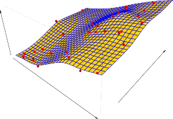

# Prediction 

# 예측

In many situations, a set of inputs _X_ are readily available, but the output _Y_ cannot be easily obtained.

많은 상황에서 입력 세트 _X_ 는 쉽게 이용할 수 있지만, 출력 세트 _Y_ 는 쉽게 얻을 수 없습니다.

In this setting, since the error term averages to zero, we can predict _Y_ using 

이러한 설정에서는 오차 항의 평균이 0이 되므로, 우리는 다음을 사용하여 _Y_ 를 예측할 수 있습니다.

$$ \hat{Y} = \hat{f}(X) \tag{2.2} $$

where $\hat{f}$ represents our estimate for _f_, and $\hat{Y}$ represents the resulting prediction for _Y_.

여기서 $\hat{f}$ 는 _f_ 에 대한 우리의 추정치를 나타내며, $\hat{Y}$ 는 _Y_ 에 대한 결과 예측값을 나타냅니다.

In this setting, $\hat{f}$ is often treated as a _black box_, in the sense that one is not typically concerned with the exact form of $\hat{f}$, provided that it yields accurate predictions for _Y_.

이 설정에서 _Y_ 에 대해 정확한 예측을 제공하기만 한다면 일반적으로 $\hat{f}$ 의 정확한 형태에 관여하지 않는다는 점에서 $\hat{f}$ 는 종종 _블랙박스(black box)_ 로 취급됩니다.

As an example, suppose that $X_1, \dots, X_p$ are characteristics of a patient’s blood sample that can be easily measured in a lab, and _Y_ is a variable encoding the patient’s risk for a severe adverse reaction to a particular drug.

예를 들어, $X_1, \dots, X_p$ 가 실험실에서 쉽게 측정할 수 있는 환자 혈액 샘플의 특성이며, _Y_ 가 특정 약물에 대한 환자의 심각한 부작용 위험을 인코딩하는 변수라고 가정해보겠습니다.

It is natural to seek to predict _Y_ using _X_, since we can then avoid giving the drug in question to patients who are at high risk of an adverse reaction—that is, patients for whom the estimate of _Y_ is high. 

우리가 _X_ 를 사용하여 _Y_ 를 예측하고자 하는 것은 자연스럽습니다. 왜냐하면 부작용 위험이 높은 환자들, 즉 _Y_ 추정치가 높은 환자들에게 문제의 약물을 투여하는 것을 피할 수 있기 때문입니다.

The accuracy of $\hat{Y}$ as a prediction for _Y_ depends on two quantities, which we will call the _reducible error_ and the _irreducible error_.

_Y_ 에 대한 예측으로서 $\hat{Y}$ 의 정확도는 두 가지 양에 의존하며, 우리는 이를 _축소 가능한 오차(reducible error)_ 와 _축소 불가능한 오차(irreducible error)_ 라고 부를 것입니다.

In general, $\hat{f}$ will not be a perfect estimate for _f_, and this inaccuracy will introduce some error.

일반적으로 $\hat{f}$ 는 _f_ 에 대한 완벽한 추정치가 되지 않을 것이며, 이러한 부정확성은 약간의 오차를 발생시킵니다.

This error is _reducible_ because we can potentially improve the accuracy of $\hat{f}$ by using the most appropriate statistical learning technique to estimate _f_.

우리가 _f_ 를 추정하기 위해 가장 적절한 통계적 학습 기법을 사용하여 $\hat{f}$ 의 정확도를 잠재적으로 향상시킬 수 있기 때문에 이 오차는 _축소 가능(reducible)_ 합니다.

However, even if it were possible to form a perfect estimate for _f_, so that our estimated response took the form $\hat{Y} = f(X)$, our prediction would still have some error in it! 

그러나 만약 _f_ 에 대한 완벽한 추정치를 형성하는 것이 가능하여 우리의 추정 반응값이 $\hat{Y} = f(X)$ 형태를 취하게 된다 하더라도, 우리의 예측 결과에는 여전히 약간의 오차가 있을 것입니다!

This is because _Y_ is also a function of $\epsilon$, which, by definition, cannot be predicted using _X_.

이는 _Y_ 가 $\epsilon$ 의 함수이기도 하기 때문이며, 정의상 이는 _X_ 를 사용하여 예측될 수 없습니다.

Therefore, variability associated with $\epsilon$ also affects the accuracy of our predictions.

그러므로 $\epsilon$ 과 연관된 변동성은 우리 예측의 정확도에도 영향을 미칩니다.

This is known as the _irreducible_ error, because no matter how well we estimate _f_, we cannot reduce the error introduced by $\epsilon$.

우리가 _f_ 를 아무리 잘 예측한다 할지라도 $\epsilon$ 에 의해 도입된 오차를 줄일 수 없으므로 이것은 _축소 불가능한(irreducible)_ 오차로 알려져 있습니다.

Why is the irreducible error larger than zero? 

왜 축소 불가능한 오차는 0보다 큽니까?

The quantity $\epsilon$ may contain unmeasured variables that are useful in predicting _Y_: since we don't measure them, _f_ cannot use them for its prediction. 

양 $\epsilon$ 은 _Y_ 를 예측하는 데 유용하지만 측정되지 않은 변수들을 포함할 수 있습니다: 우리가 이를 측정하지 않기 때문에 _f_ 는 예측을 위해 그 변수들을 사용할 수 없습니다.

**FIGURE 2.3.** _The plot displays_ `income` _as a function of_ `years of education` _and_ `seniority` _in the_ `Income` _data set. The blue surface represents the true underlying relationship between_ `income` _and_ `years of education` _and_ `seniority`, _which is known since the data are simulated. The red dots indicate the observed values of these quantities for 30 individuals._ 

**그림 2.3.** _이 구성도는_ `Income` _데이터 세트에서_ `years of education(교육 연수)`_과_ `seniority(근속 연수)`_의 함수로서_ `income(소득)`_을 보여줍니다. 파란색 표면은_ `income`_과_ `years of education` _그리고_ `seniority` _간의 진정한 기저 관계를 나타내며, 이는 데이터가 시뮬레이션 되었기 때문에 알려져 있습니다. 빨간색 점들은 30명의 개인에 대한 측정값을 나타냅니다._

The quantity $\epsilon$ may also contain unmeasurable variation. 

이러한 양 $\epsilon$ 에는 측정 불가능한 변동성이 포함되어 있을 수도 있습니다.

For example, the risk of an adverse reaction might vary for a given patient on a given day, depending on manufacturing variation in the drug itself or the patient’s general feeling of well-being on that day. 

예를 들어, 부작용 위험은 약물 자체의 제조 변동성이나 당일 환자의 웰빙 컨디션에 따라 특정 날짜의 환자에게 다르게 나타날 수 있습니다.

Consider a given estimate $\hat{f}$ and a set of predictors _X_, which yields the prediction $\hat{Y} = \hat{f}(X)$. 

예측 $\hat{Y} = \hat{f}(X)$ 를 산출하는 주어진 추정치 $\hat{f}$ 와 예측 변수 세트 _X_ 를 고려해 보십시오.

Assume for a moment that both $\hat{f}$ and _X_ are fixed, so that the only variability comes from $\epsilon$. 

유일한 변동성이 $\epsilon$ 에서 오도록 잠시 $\hat{f}$ 와 _X_ 양측 모두 고정되었다고 가정하겠습니다.

Then, it is easy to show that 

그러면, 다음을 쉽게 보여줄 수 있습니다:

$$ 
\begin{align*}
E(Y - \hat{Y})^2 &= E[f(X) + \epsilon - \hat{f}(X)]^2 \\
&= [f(X) - \hat{f}(X)]^2 + \text{Var}(\epsilon)
\end{align*} \tag{2.3} 
$$

where $E(Y - \hat{Y})^2$ represents the average, or _expected value_, of the squared difference between the predicted and actual value of _Y_, and $\text{Var}(\epsilon)$ represents the _variance_ associated with the error term $\epsilon$. 

여기서 $E(Y - \hat{Y})^2$ 는 _Y_ 의 예측값과 실제값 사이 제곱된 차이의 평균, 즉 _기댓값(expected value)_ 을 나타내며, $\text{Var}(\epsilon)$ 은 오차항 $\epsilon$ 과 연관된 _분산(variance)_ 을 나타냅니다.

The focus of this book is on techniques for estimating _f_ with the aim of minimizing the reducible error. 

이 책의 초점은 축소 가능한 오차를 최소화할 목적으로 _f_ 를 측정하기 위한 기법들에 있습니다.

It is important to keep in mind that the irreducible error will always provide an upper bound on the accuracy of our prediction for _Y_. 

축소 불가능한 오차가 언제나 _Y_ 에 대한 우리 예측의 정확도에 상한선을 제공할 것이라는 점을 반드시 유념해야 합니다.

This bound is almost always unknown in practice. 

이 상한선은 실제적으로 항상 미지수입니다.

# Inference 

# 추론

We are often interested in understanding the association between _Y_ and $X_1, \dots, X_p$. 

우리는 종종 _Y_ 와 $X_1, \dots, X_p$ 사이의 연관성을 이해하는 것에 관심이 있습니다.

In this situation we wish to estimate _f_, but our goal is not necessarily to make predictions for _Y_. 

이 상황에서 우리는 _f_ 를 추정하기를 희망하지만, 목표가 반드시 _Y_ 에 대한 예측을 하는 것만은 아닙니다.

Now $\hat{f}$ cannot be treated as a black box, because we need to know its exact form. 

이제 $\hat{f}$ 는 정확한 형태를 알아야 하므로 블랙박스로 취급할 수 없습니다.

In this setting, one may be interested in answering the following questions: 

이러한 설정 하에서, 여러분은 다음 질문들에 대답하는 것에 관심이 있을 수 있습니다:

- _Which predictors are associated with the response?_ 

- _어느 예측 변수들이 응답과 연관되어 있는가?_

It is often the case that only a small fraction of the available predictors are substantially associated with _Y_. 

이용 가능한 예측 변수들 중에서 소수의 부분만이 실질적으로 _Y_ 와 관련되는 경우가 흔합니다.

Identifying the few _important_ predictors among a large set of possible variables can be extremely useful, depending on the application. 

사용할 수 있는 무수히 많은 변수들 중에서 소수의 _중요한(important)_ 예측 변수를 식별하는 것은 ứng용 분야에 따라 다르게 극히 유용할 수 있습니다.

- _What is the relationship between the response and each predictor?_ 

- _응답과 각 예측 변수 사이에는 어떤 관계가 있는가?_

Some predictors may have a positive relationship with _Y_, in the sense that larger values of the predictor are associated with larger values of _Y_. 

일부 예측 변수들은 값이 커지면 _Y_ 값 또한 커진다는 점에서, _Y_ 와 긍정적 관계를 가질 수 있습니다.

Other predictors may have the opposite relationship. 

다른 예측 변수들은 반대되는 관계를 가질 수도 있습니다.

Depending on the complexity of _f_, the relationship between the response and a given predictor may also depend on the values of the other predictors. 

_f_ 의 복잡성에 따라 응답과 특정 예측 변수 간의 관계성은 다른 예측 변수들의 값에 의존할 수도 있습니다.

- _Can the relationship between Y and each predictor be adequately summarized using a linear equation, or is the relationship more complicated?_ 

- _Y 와 각 예측 변수 사이의 관계가 선형 방정식으로 적절히 요약될 수 있는가 아니면 더 복잡한 관계인가?_

Historically, most methods for estimating _f_ have taken a linear form. 

역사적으로 _f_ 를 추정하는 대다수의 방법들은 선형 형식을 취해 왔습니다.

In some situations, such an assumption is reasonable or even desirable. 

일부 상황에서 이러한 가정은 합리적이거나 심지어 바람직합니다.

But often the true relationship is more complicated, in which case a linear model may not provide an accurate representation of the relationship between the input and output variables. 

그러나 종종 참된 연관성은 조금 더 복잡하며, 이 경우 선형 모델이 입력과 출력 변수 사이 관계에 대한 정확한 표현을 제공하지 못할 수 있습니다.

In this book, we will see a number of examples that fall into the prediction setting, the inference setting, or a combination of the two. 

이 책에서 우리는 예측 설정, 추론 설정 혹은 이 둘의 조합에 해당하는 몇 가지 사례들을 볼 것입니다.

For instance, consider a company that is interested in conducting a direct-marketing campaign. 

예를 들어, 다이렉트 마케팅 캠페인을 실시하는 데 관심이 있는 회사를 생각해보십시오.

The goal is to identify individuals who are likely to respond positively to a mailing, based on observations of demographic variables measured on each individual. 

목표는 각 개인에 측정된 인구통계 변수들을 바탕으로, 메일링에 긍정적으로 반응할 개인들을 식별하는 것입니다.

In this case, the demographic variables serve as predictors, and response to the marketing campaign (either positive or negative) serves as the outcome. 

이 경우 인구통계 변수들은 예측 변수로 작용하며, 마케팅 캠페인에 대한 반응(긍정이든 부정이든)이 결과 역할을 합니다.

The company is not interested in obtaining a deep understanding of the relationships between each individual predictor and the response; instead, the company simply wants to accurately predict the response using the predictors. 

회사는 각 예측 변수와 반응 사이의 깊은 이해를 얻는 것에는 관심이 없습니다; 대신 회사는 단순히 예측 변수를 사용하여 반응을 정확하게 예측하고자 합니다.

This is an example of modeling for prediction. 

이것은 예측 목적의 모델링 예시입니다.

In contrast, consider the `Advertising` data illustrated in Figure 2.1. 

대조적으로 그림 2.1에 설명된 `Advertising` 데이터를 생각해 보십시오.

One may be interested in answering questions such as: 

어떤 이는 다음과 같은 질문에 답하는 것에 호기심을 가질 수 있습니다:

- _Which media are associated with sales?_ 

- _어느 미디어가 판매와 연관되는가?_

- _Which media generate the biggest boost in sales?_ or 

- _어느 미디어가 매출에 가장 큰 증대를 발생시키는가?_ 또는

- _How large of an increase in sales is associated with a given increase in TV advertising?_ 

- _TV 광고의 증가에 따라 얼마나 큰 판매 증가가 관련이 있는가?_

This situation falls into the inference paradigm. 

이 상황은 추론 패러다임에 속합니다.

Another example involves modeling the brand of a product that a customer might purchase based on variables such as price, store location, discount levels, competition price, and so forth. 

다른 예시는 가격, 상점 위치, 할인 일수, 경쟁자 가격 등과 같은 예측 변수를 기반으로 고객이 구매할 제품 브랜드를 모델링하는 것과 관련됩니다.

In this situation one might really be most interested in the association between each variable and the probability of purchase. 

이러한 경우 사람들은 각 변수와 그 예상 구매 확률 사이 상관성에 대해 진정으로 가장 관심이 있을 것입니다.

For instance, _to what extent is the product’s price associated with sales?_ 

예를 들어, _그 산출 제품의 가격이 어느 한도까지 판매와 상관이 있는가?_

This is an example of modeling for inference. 

이것은 추론 목적의 모델링 예시입니다.

Finally, some modeling could be conducted both for prediction and inference. 

마지막으로 일부 모델링은 예측과 추론 모두를 위해 수행될 수도 있습니다.

For example, in a real estate setting, one may seek to relate values of homes to inputs such as crime rate, zoning, distance from a river, air quality, schools, income level of community, size of houses, and so forth. 

예를 들어, 부동산 현장에서 집의 가치들을 범죄율, 구역화, 강으로부터의 거리, 공기 품질, 학교, 이웃 소득 수준, 집 크기 등과 같은 요인과 관련시키려 할 수도 있습니다.

In this case one might be interested in the association between each individual input variable and housing price—for instance, _how much extra will a house be worth if it has a view of the river?_ 

이 경우 이런 개별 입력 변수와 주택 가격의 연관성에 관심을 가질 수 있습니다—예를 들어, _강 전망이 있을 때 집이 얼마나 더 가치가 있을 것인가?_

This is an inference problem. 

이것은 추론 문제입니다.

Alternatively, one may simply be interested in predicting the value of a home given its characteristics: _is this house under- or over-valued?_ 

달리 누군가는 주택의 특성이 주어졌을 때 단순히 가치를 예측하는 것에만 흥미가 있을 수 있습니다: _이 주택은 저평가되었나, 고평가되었나?_

This is a prediction problem. 

이것은 예측 문제입니다.

Depending on whether our ultimate goal is prediction, inference, or a combination of the two, different methods for estimating _f_ may be appropriate. 

우리의 궁극적인 도달 목표가 예측, 추론 혹은 두 가지의 조합이냐에 따라 _f_ 를 추정하는 각기 다른 방식이 적합할 수 있습니다.

For example, _linear models_ allow for relatively simple and interpretable inference, but may not yield as accurate predictions as some other approaches. 

예를 들어, _선형 모델(linear models)_ 은 비교적 간단하고 해석 가능한 추론을 허용하지만, 몇몇 다른 접근법들만큼 정확한 예측을 만들어 내지 못할 수 있습니다.

In contrast, some of the highly non-linear approaches that we discuss in the later chapters of this book can potentially provide quite accurate predictions for _Y_, but this comes at the expense of a less interpretable model for which inference is more challenging. 

대조적으로, 이 책 후반부에서 논의할 수많은 비선형 접근 방식들은 _Y_ 에 대해 상당히 정확한 예측을 잠재적으로 제공할 수 있지만, 이것은 추론이 더 어려워지는 해석이 덜 되는 모델의 대가를 치러야 합니다.
