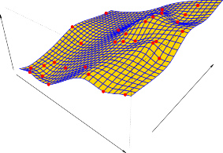

# Parametric Methods 

Parametric methods involve a two-step model-based approach. 

1. First, we make an assumption about the functional form, or shape, of _f_ . For example, one very simple assumption is that _f_ is linear in _X_ : 

$$ f(X) \approx \beta_0 + \beta_1 X_1 + \dots + \beta_p X_p \tag{2.4} $$

This is a _linear model_ , which will be discussed extensively in Chapter 3. Once we have assumed that _f_ is linear, the problem of estimating _f_ is greatly simplified. Instead of having to estimate an entirely arbitrary _p_ -dimensional function _f_ ( _X_ ), one only needs to estimate the _p_ + 1 coefficients _β_ 0 _, β_ 1 _, . . . , βp_ . 

 

2. After a model has been selected, we need a procedure that uses the training data to _fit_ or _train_ the model. In the case of the linear model fit (2.4), we need to estimate the parameters $\beta_0, \beta_1, \dots, \beta_p$. That is, we want to find values of these parameters such that

$$ Y \approx \hat{\beta}_0 + \hat{\beta}_1 X_1 + \dots + \hat{\beta}_p X_p \tag{2.5} $$

The most common approach to fitting the model (2.4) is referred to as _(ordinary) least squares_, which we discuss in Chapter 3. However, least squares is one of many possible ways to fit the linear model. In Chapter 6, we discuss other approaches for estimating the parameters in (2.4).

The model-based approach just described is referred to as _parametric_; it reduces the problem of estimating $f$ down to one of estimating a set of parameters. Assuming a parametric form for $f$ simplifies the problem of estimating $f$ because it is generally much easier to estimate a set of parameters, such as $\beta_0, \beta_1, \dots, \beta_p$ in the linear model (2.4), than it is to fit an entirely arbitrary function $f$. The potential disadvantage of a parametric approach is that the model we choose will usually not match the true unknown form of $f$. If the chosen model is too far from the true $f$, then our estimate will be poor. We can try to address this problem by choosing _flexible_ models that can fit many different possible functional forms for $f$. But in general, fitting a more flexible model requires estimating a greater number of parameters. These more complex models can lead to a phenomenon known as _overfitting_ the data, which essentially means they follow the errors, or _noise_, too closely. These issues are discussed throughout this book.

Figure 2.4 shows an example of the parametric approach applied to the `Income` data from Figure 2.3. We have fit a linear model of the form

$$ \text{income} \approx \beta_0 + \beta_1 \times \text{education} + \beta_2 \times \text{seniority} $$

**FIGURE 2.4.** _A linear model fit by least squares to the_ `Income` _data from Figure 2.3. The observations are shown in red, and the yellow plane indicates the least squares fit to the data._ 

22 

2. Statistical Learning 

**----- Start of picture text -----** 
a Years of Education Seniority Income **----- End of picture text -----** 

**FIGURE 2.5.** _A smooth thin-plate spline fit to the_ `Income` _data from Figure 2.3 is shown in yellow; the observations are displayed in red. Splines are discussed in Chapter 7._ 

Since we have assumed a linear relationship between the response and the two predictors, the entire fitting problem reduces to estimating _β_ 0, _β_ 1, and _β_ 2, which we do using least squares linear regression. Comparing Figure 2.3 to Figure 2.4, we can see that the linear fit given in Figure 2.4 is not quite right: the true _f_ has some curvature that is not captured in the linear fit. However, the linear fit still appears to do a reasonable job of capturing the positive relationship between `years of education` and `income` , as well as the slightly less positive relationship between `seniority` and `income` . It may be that with such a small number of observations, this is the best we can do. 
