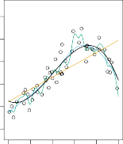
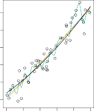

# Non-Parametric Methods 

**FIGURE 2.5.** _A smooth thin-plate spline fit to the_ `Income` _data from Figure 2.3 is shown in yellow; the observations are displayed in red. Splines are discussed in Chapter 7._ 

Non-parametric methods do not make explicit assumptions about the functional form of _f_ . Instead they seek an estimate of _f_ that gets as close to the data points as possible without being too rough or wiggly. Such approaches can have a major advantage over parametric approaches: by avoiding the assumption of a particular functional form for _f_ , they have the potential to accurately fit a wider range of possible shapes for _f_ . Any parametric approach brings with it the possibility that the functional form used to estimate _f_ is very different from the true _f_ , in which case the resulting model will not fit the data well. In contrast, non-parametric approaches completely avoid this danger, since essentially no assumption about the form of _f_ is made. But non-parametric approaches do suffer from a major disadvantage: since they do not reduce the problem of estimating _f_ to a small number of parameters, a very large number of observations (far more than is typically needed for a parametric approach) is required in order to obtain an accurate estimate for _f_ . 

An example of a non-parametric approach to fitting the `Income` data is shown in Figure 2.5. A _thin-plate spline_ is used to estimate _f_ . This ap- thin-plate proach does not impose any pre-specified model on _f_ . It instead attempts spline 

2.1 What Is Statistical Learning? 

**FIGURE 2.6.** _A rough thin-plate spline fit to the_ `Income` _data from Figure 2.3. This fit makes zero errors on the training data._ 

to produce an estimate for _f_ that is as close as possible to the observed data, subject to the fit—that is, the yellow surface in Figure 2.5—being _smooth_ . In this case, the non-parametric fit has produced a remarkably accurate estimate of the true _f_ shown in Figure 2.3. In order to fit a thin-plate spline, the data analyst must select a level of smoothness. Figure 2.6 shows the same thin-plate spline fit using a lower level of smoothness, allowing for a rougher fit. The resulting estimate fits the observed data perfectly! However, the spline fit shown in Figure 2.6 is far more variable than the true function _f_ , from Figure 2.3. This is an example of overfitting the data, which we discussed previously. It is an undesirable situation because the fit obtained will not yield accurate estimates of the response on new observations that were not part of the original training data set. We discuss methods for choosing the _correct_ amount of smoothness in Chapter 5. Splines are discussed in Chapter 7. 

As we have seen, there are advantages and disadvantages to parametric and non-parametric methods for statistical learning. We explore both types of methods throughout this book. 
