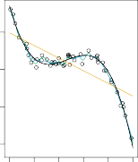

# _2.1.3 The Trade-Off Between Prediction Accuracy and Model Interpretability_ 

Of the many methods that we examine in this book, some are less flexible, or more restrictive, in the sense that they can produce just a relatively small range of shapes to estimate _f_ . For example, linear regression is a relatively inflexible approach, because it can only generate linear functions such as the lines shown in Figure 2.1 or the plane shown in Figure 2.4. Other methods, such as the thin plate splines shown in Figures 2.5 and 2.6, are considerably more flexible because they can generate a much wider range of possible shapes to estimate _f_ . 

**FIGURE 2.7.** _A representation of the tradeoff between flexibility and interpretability, using different statistical learning methods. In general, as the flexibility of a method increases, its interpretability decreases._ 

One might reasonably ask the following question: _why would we ever choose to use a more restrictive method instead of a very flexible approach?_ There are several reasons that we might prefer a more restrictive model. If we are mainly interested in inference, then restrictive models are much more interpretable. For instance, when inference is the goal, the linear model may be a good choice since it will be quite easy to understand the relationship between _Y_ and _X_ 1 _, X_ 2 _, . . . , Xp_ . In contrast, very flexible approaches, such as the splines discussed in Chapter 7 and displayed in Figures 2.5 and 2.6, and the boosting methods discussed in Chapter 8, can lead to such complicated estimates of _f_ that it is difficult to understand how any individual predictor is associated with the response. 

Figure 2.7 provides an illustration of the trade-off between flexibility and interpretability for some of the methods that we cover in this book. Least squares linear regression, discussed in Chapter 3, is relatively inflexible but is quite interpretable. The _lasso_ , discussed in Chapter 6, relies upon the linear model (2.4) but uses an alternative fitting procedure for estimating the coefficients _β_ 0 _, β_ 1 _, . . . , βp_ . The new procedure is more restrictive in estimating the coefficients, and sets a number of them to exactly zero. Hence in this sense the lasso is a less flexible approach than linear regression. It is also more interpretable than linear regression, because in the final model the response variable will only be related to a small subset of the predictors—namely, those with nonzero coefficient estimates. _Generalized additive models_ (GAMs), discussed in Chapter 7, instead extend the linear model (2.4) to allow for certain non-linear relationships. Consequently, GAMs are more flexible than linear regression. They are also somewhat less interpretable than linear regression, because the relationship between each predictor and the response is now modeled using a curve. Finally, fully non-linear methods such as _bagging_ , _boosting_ , _support vector machines_ with non-linear kernels, and _neural networks_ (deep learning), discussed in Chapters 8, 9, and 10, are highly flexible approaches that are harder to interpret. 

We have established that when inference is the goal, there are clear advantages to using simple and relatively inflexible statistical learning methods. In some settings, however, we are only interested in prediction, and the interpretability of the predictive model is simply not of interest. For instance, if we seek to develop an algorithm to predict the price of a stock, our sole requirement for the algorithm is that it predict accurately— interpretability is not a concern. In this setting, we might expect that it will be best to use the most flexible model available. Surprisingly, this is not always the case! We will often obtain more accurate predictions using a less flexible method. This phenomenon, which may seem counterintuitive at first glance, has to do with the potential for overfitting in highly flexible methods. We saw an example of overfitting in Figure 2.6. We will discuss this very important concept further in Section 2.2 and throughout this book. 
