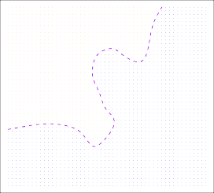

[< 2.1.3 The Trade-Off Between Prediction Accuracy And Model Interpretability](../2_1_3_the_trade-off_between_prediction_accuracy_and_model_interpretability/index.html) | [2.1.5 Regression Versus Classification Problems >](../2_1_5_regression_versus_classification_problems/index.html)

> 💡 **학습 팁:** 원문 해석이 어렵다면? 한 줄씩 나란히 번역된 [📖 직역본 보기](./trans1.html)를 추천합니다!

# 2.1.4 Supervised Versus Unsupervised Learning

Most statistical learning problems fall into one of two categories: _supervised_ or _unsupervised_.

The examples that we have discussed so far in this chapter all fall into the supervised learning domain.

For each observation of the predictor measurement(s) $x_i$, $i = 1, \dots, n$ there is an associated response measurement $y_i$.

We wish to fit a model that relates the response to the predictors, with the aim of accurately predicting the response for future observations (prediction) or better understanding the relationship between the response and the predictors (inference).

Many classical statistical learning methods such as linear regression and _logistic regression_ (Chapter 4), as well as more modern approaches such as GAM, boosting, and support vector machines, operate in the supervised learning domain.

The vast majority of this book is devoted to this setting.

By contrast, unsupervised learning describes the somewhat more challenging situation in which for every observation $i = 1, \dots, n$, we observe a vector of measurements $x_i$ but no associated response $y_i$.

It is not possible to fit a linear regression model, since there is no response variable to predict.

In this setting, we are in some sense working blind; the situation is referred to as _unsupervised_ because we lack a response variable that can supervise our analysis.

What sort of statistical analysis is possible?

We can seek to understand the relationships between the variables or between the observations.

One statistical learning tool that we may use in this setting is _cluster analysis_, or clustering.

The goal of cluster analysis is to ascertain, on the basis of $x_1, \dots, x_n$, whether the observations fall into relatively distinct groups.

For example, in a market segmentation study we might observe multiple characteristics (variables) for potential customers, such as zip code, family income, and shopping habits.

We might believe that the customers fall into different groups, such as big spenders versus low spenders.

If the information about each customer’s spending patterns were available, then a supervised analysis would be possible.

However, this information is not available—that is, we do not know whether each potential customer is a big spender or not.

In this setting, we can try to cluster the customers on the basis of the variables measured, in order to identify distinct groups of potential customers.

Identifying such groups can be of interest because it might be that the groups differ with respect to some property of interest, such as spending habits.

**FIGURE 2.8.** _A clustering data set involving three groups. Each group is shown using a different colored symbol. Left: The three groups are well-separated. In this setting, a clustering approach should successfully identify the three groups. Right: There is some overlap among the groups. Now the clustering task is more challenging._

Figure 2.8 provides a simple illustration of the clustering problem.

We have plotted 150 observations with measurements on two variables, $X_1$ and $X_2$.

Each observation corresponds to one of three distinct groups.

For illustrative purposes, we have plotted the members of each group using different colors and symbols.

However, in practice the group memberships are unknown, and the goal is to determine the group to which each observation belongs.

In the left-hand panel of Figure 2.8, this is a relatively easy task because the groups are well-separated.

By contrast, the right-hand panel illustrates a more challenging setting in which there is some overlap between the groups.

A clustering method could not be expected to assign all of the overlapping points to their correct group (blue, green, or orange).

In the examples shown in Figure 2.8, there are only two variables, and so one can simply visually inspect the scatterplots of the observations in order to identify clusters.

However, in practice, we often encounter data sets that contain many more than two variables.

In this case, we cannot easily plot the observations.

For instance, if there are _p_ variables in our data set, then $p(p - 1) / 2$ distinct scatterplots can be made, and visual inspection is simply not a viable way to identify clusters.

For this reason, automated clustering methods are important.

We discuss clustering and other unsupervised learning approaches in Chapter 12.

Many problems fall naturally into the supervised or unsupervised learning paradigms.

However, sometimes the question of whether an analysis should be considered supervised or unsupervised is less clear-cut.

For instance, suppose that we have a set of _n_ observations.

For _m_ of the observations, where $m < n$, we have both predictor measurements and a response measurement.

For the remaining $n - m$ observations, we have predictor measurements but no response measurement.

Such a scenario can arise if the predictors can be measured relatively cheaply but the corresponding responses are much more expensive to collect.

We refer to this setting as a _semi-supervised learning_ problem.

In this setting, we wish to use a statistical learning method that can incorporate the _m_ observations for which response measurements are available as well as the $n - m$ observations for which they are not.

Although this is an interesting topic, it is beyond the scope of this book.

---

## Sub-Chapters

[< 2.1.3 The Trade-Off Between Prediction Accuracy And Model Interpretability](../2_1_3_the_trade-off_between_prediction_accuracy_and_model_interpretability/index.html) | [2.1.5 Regression Versus Classification Problems >](../2_1_5_regression_versus_classification_problems/index.html)
