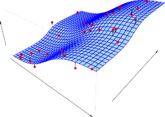
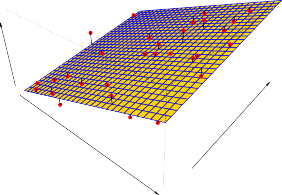

# 2.1 What Is Statistical Learning?
# 2.1 통계적 학습이란 무엇인가?

In order to motivate our study of statistical learning, we begin with a simple example.

통계적 학습에 대한 우리의 연구 동기를 부여하기 위해 간단한 예부터 시작해 보겠습니다.

Suppose that we are statistical consultants hired by a client to investigate the association between advertising and sales of a particular product.

우리가 특정 제품의 광고와 판매 간의 연관성을 조사하기 위해 클라이언트가 고용한 통계 컨설턴트라고 가정해 봅시다.

The `Advertising` data set consists of the `sales` of that product in 200 different markets, along with advertising budgets for the product in each of those markets for three different media: `TV` , `radio` , and `newspaper` .

`Advertising` 데이터 세트는 200개의 서로 다른 시장에서 해당 제품의 판매량(`sales`) 및 세 가지 다른 매체인 `TV`, 라디오(`radio`), 식문(`newspaper`)에 대한 각 시장의 해당 제품 광고 예산으로 구성됩니다.

The data are displayed in Figure 2.1.

이 데이터는 다음 그림 2.1에 표시되어 있습니다.

It is not possible for our client to directly increase sales of the product.

우리 클라이언트가 제품의 판매량을 직접적으로 늘리는 것은 불가능합니다.

On the other hand, they can control the advertising expenditure in each of the three media.

반면에 이들은 세 매체 각각에 지출되는 광고 비용은 제어할 수 있습니다.

Therefore, if we determine that there is an association between advertising and sales, then we can instruct our client to adjust advertising budgets, thereby indirectly increasing sales.

따라서 광고와 판매 사이에 연관성이 있다고 판단되면 파악된 분석을 기반으로 클라이언트에게 광고 예산을 조정하도록 코치하여 간접적으로 판매를 늘리도록 지시할 수 있습니다.

In other words, our goal is to develop an accurate model that can be used to predict sales on the basis of the three media budgets.

다시 말해서, 우리의 최종 목표는 이러한 세 가지 미디어 예산을 토대로 판매를 예측하는 데 쓰일 수 있는 매우 정확한 모델을 개발하는 것입니다.

In this setting, the advertising budgets are _input variables_ while `sales` is an _output variable_ .

이러한 설정에서 광고 예산은 _입력 변수_ 인 반면 `sales` 는 _출력 변수_ 입니다.

The input variables are typically denoted using the variable symbol _X_ , with a subscript to distinguish them.

입력 변수는 일반적으로 이들을 구별하기 위한 아래첨자와 함께 변수 기호 _X_ 를 사용하여 표시됩니다.

So $X_1$ might be the `TV` budget, $X_2$ the `radio` budget, and $X_3$ the `newspaper` budget.

따라서 $X_1$ 는 `TV` 예산, $X_2$ 는 `radio` 예산, $X_3$ 는 `newspaper` 예산일 수 있습니다.

The input variables go by different names, such as _predictors_ , _independent variables_ , _features_ , or sometimes just _variables_ .

입력 변수는 _예측 변수(predictors)_, _독립 변수(independent variables)_, _특징(features)_ 또는 때로는 단순하게 _변수(variables)_ 와 같이 다양한 이름으로 사용됩니다.

The output variable—in this case, `sales` —is often called the _response_ or _dependent variable_ , and is typically denoted using the symbol _Y_ .

이 경우 `sales(판매량)`에 해당하는 출력 변수는 종종 _응답(response)_ 또는 _종속 변수(dependent variable)_ 라고 불리며 일반적으로 _Y_ 기호를 사용하여 표시됩니다.

Throughout this book, we will use all of these terms interchangeably.

이 책 전체에 걸쳐 우리는 이 모든 용어를 혼용하여 사용할 것입니다.

More generally, suppose that we observe a quantitative response _Y_ and _p_ different predictors, $X_1, X_2, . . . , X_p$.

보다 일반적으로, 우리가 정량적 응답 _Y_ 와 서로 다른 _p_ 개의 예측 변수 $X_1, X_2, . . . , X_p$ 를 관측한다고 가정해 보십시오.

We assume that there is some relationship between _Y_ and $X = (X_1, X_2, . . . , X_p)$, which can be written in the very general form

우리는 _Y_ 와 $X = (X_1, X_2, . . . , X_p)$ 사이에 특정 형태의 함수적 관계가 있다고 가정하며, 이를 다음과 같은 매우 일반적인 형태로 기술할 수 있습니다.

$$ Y = f(X) + \epsilon \tag{2.1} $$

  

**FIGURE 2.1.** _The `Advertising` data set. The plot displays `sales` , in thousands of units, as a function of `TV` , `radio` , and `newspaper` budgets, in thousands of dollars, for 200 different markets. In each plot we show the simple least squares fit of `sales` to that variable, as described in Chapter 3. In other words, each blue line represents a simple model that can be used to predict `sales` using `TV` , `radio` , and `newspaper` , respectively._

**그림 2.1.** _`Advertising` 데이터 세트. 플롯은 200개의 서로 다른 시장에 대해 수천 단위의 달러화로 측정된 `TV` , `radio(라디오)` 및 `newspaper(신문)` 투입 자본 비용 예산의 함수적 결과로 산출된 수천 단위의 `sales` 금액을 각 분면에 표시합니다. 이어진 각각 플롯 축에서는 향후 도래할 제3장 단락에서 설명될 바와 같이, 해당 변수에 대해 `sales` 가 지니게 되는 단순 최소 제곱 적합(simple least squares fit)을 보여주고 있습니다. 즉 요약하자면 각각 단일 파란색 선은 각각 `TV` , `radio` 및 `newspaper` 를 사용하여 `sales` 매출 비율에 대해 그 양상을 분석 및 예측하는 데 사용할 수 있는 비교적 단순한 1차적 성격 모델을 그대로 나타냅니다._

Here _f_ is some fixed but unknown function of $X_1, . . . , X_p$ , and _ϵ_ is a random _error term_ , which is independent of _X_ and has mean zero.

여기서 _f_ 는 각각의 특성 $X_1, . . . , X_p$ 에 대한 어느 고정되어 있는 상수 규칙이자 동시에 구체적인 미지의 함수이고, _ϵ_ 은 특정 _X_ 의 값 변화와 철저하게 무관하게 독립적이고 그 변동의 평균이 0인 성질을 지닌 무작위 _오차 항(error term)_ 입니다.

In this formulation, _f_ represents the _systematic_ information that _X_ provides about _Y_ .

이러한 수식적 정립 모델 공식 체계에서, 함수 모형의 중심 _f_ 는 _X_ 가 출력 지표 _Y_ 에 대해 제공하는 체계적인 구조적 논리 정보(systematic information)를 본질적으로 나타냅니다.

  

**FIGURE 2.2.** _The `Income` data set. Left: The red dots are the observed values of `income` (in thousands of dollars) and `years of education` for 30 individuals. Right: The blue curve represents the true underlying relationship between `income` and `years of education` , which is generally unknown (but is known in this case because the data were simulated). The black lines represent the error associated with each observation. Note that some errors are positive (if an observation lies above the blue curve) and some are negative (if an observation lies below the curve). Overall, these errors have approximately mean zero._

**그림 2.2.** _`Income` 데이터 세트._ 왼쪽: _도표 상의 붉은 점 표기 부분들은 30명에 표본 달하는 한정 개인들의 `years of education(교육 연수 대비 집중 인지 연수)`에 관련하여 도출된 `income(개별 관측 수입)`(수천 달러)의 실 관측 값들을 나타냅니다._ 오른쪽: _그려진 굴곡진 파란색 곡선 라인은 `income` 과 `years of education` 사이의 실제 숨겨져 있는 기반 구조적 관계를 명확히 나타내며, 이는 일반적으로는 파악하기 어렵습니다 (단, 이 특수한 경우에는 데이터가 시뮬레이션 환경 기반이기 때문으로 파악 및 통제가 완전하게 가능합니다). 검은색 수직 선 구조들은 각 관측치와 이어진 파란색 선과의 개별 차이, 즉 오차를 시각적으로 나타냅니다. 그중 일부 발생 오차 관측치들은 양수이고 (관찰된 좌표가 파란색 실제 라인 선상보다 위측 분면에 상회해 있는 경우), 반대로 또 일부 오차 관측은 오차 차이가 음수 (관찰된 좌표가 그 파란선보다 하단 구역에 위치해 분포)입니다. 종합적으로 이러한 개별 오차 발생 비율 편차들은 상쇄되어 대략적인 평균 0의 값을 지닙니다._

As another example, consider the left-hand panel of Figure 2.2, a plot of `income` versus `years of education` for 30 individuals in the `Income` data set.

또 다른 대표 예로, `Income` 데이터 세트 내 30명 개인의 `years of education(교육 연수)`에 대한 `income(수입)`을 나타낸 2차원 도표 구조인 가장 왼쪽의 그림 2.2 패널을 집중하여 살펴보십시오.

The plot suggests that one might be able to predict `income` using `years of education`.

이 제시된 데이터 분산 플롯 구조 형태는 `years of education` 을 사용하여 관측 대상자의 경제 수치적 `income` 을 합리적으로 타당하게 예측할 수 있다는 가능성을 상당히 강력히 시사합니다.

However, the function _f_ that connects the input variable to the output variable is in general unknown.

그러나 이러한 단순한 연결과 구도 시사에도 불구하고, 두 독립-종속의 입력 변수와 출력 변수를 이어 붙이는 핵심 매개인 숨겨진 함수 _f_ 의 본질은 일반적으로 통계학적 관점에서 전혀 알려져 있지 않습니다.

In this situation one must estimate _f_ based on the observed points.

이런 상황 환경에서는 오로지 과거 및 현재에 관찰되어 기록에 남은 분포 요소 점들을 기반으로 철저하게 원론적인 _f_ 를 거꾸로 추적해 추정해야 합니다.

Since `Income` is a simulated data set, _f_ is known and is shown by the blue curve in the right-hand panel of Figure 2.2.

본 데이터인 시뮬레이션 기반의 인공 구성 조작 세트 `Income` 덕분에, 다행스럽게도 기반의 함수 구조 _f_ 는 우리 관측자에게 확실히 직접적으로 이미 알려져 있으며 이 사실은 그림 2.2의 가장 오른쪽 도표 패널에 파란 곡선을 통해서 구조적으로 정교하게 표시되어 있습니다.

The vertical lines represent the error terms _ϵ_ .

이 패널 위에 덧그려진 빽빽하고 짧은 수직선 오차 간극의 줄들은 오차 항에 해당하는 요소인 잔차 _ϵ_ 을 직접적으로 상징하고 나타냅니다.

We note that some of the 30 observations lie above the blue curve and some lie below it; overall, the errors have approximately mean zero.

이 부분에서 눈여겨봐야 할 특징으로 시뮬레이션에 관찰된 모든 30개의 표본 개체 가운데 어떤 여러 관측치는 이 본연 형태 파란색 곡선 위에 위치하고 있으며 어떤 대상의 일부 편차는 그 아래에 속해 있다는 점에 주목합니다; 전반적으로 볼 때, 모든 이 분산 표본의 이런 각 방향 오차들은 상쇄 작용을 거쳐 대략 평균 0을 갖도록 유지됩니다.

In general, the function _f_ may involve more than one input variable.

일반적으로, 통계 예측 모델에 차용되는 구성 기여 함수인 모형 _f_ 는 상황과 차원에 의거하여 결코 1개뿐만이 아니라, 그 이상의 한 쌍 또는 복수의 입력 요인 변수가 관절처럼 얽히도록 복잡하게 포함되어 구성될 수 있습니다.

In Figure 2.3 we plot `income` as a function of `years of education` and `seniority` .

나아가 그림 2.3에서는 이전에 언급된 `years of education(교육 연수)` 과 더하여 회사 내 소속 기간 서열을 칭하는 `seniority(근속 연수)` 라는 2개의 함수 예측 요인 조건에 대한 함수 척도로 `income` 구조를 복합한 플롯 모델을 보여줍니다.

Here _f_ is a two-dimensional surface that must be estimated based on the observed data.

여기서 결합에 쓰여진 복합 구조 _f_ 모형 시스템은 관측 데이터를 기반으로 반드시 역추적하여 추정해야 만 하는 입체적 2차원 공간 표면 구조 모형 체계를 형성합니다.

In essence, statistical learning refers to a set of approaches for estimating _f_ .

본질적으로 통계적 학습이란 미지의 함수 구조인 함수 _f_ 를 가장 근접해 가며 온전하게 추정해 내기 위한 거대한 모델적 통계학적인 일련의 다수 접근 방식 전체의 총칭이라 할 수 있습니다.

In this chapter we outline some of the key theoretical concepts that arise in estimating _f_ , as well as tools for evaluating the estimates obtained.

따라서 2장 본 내용에서부터, 우리는 이렇듯 고난도의 과정 요구인 함수 _f_ 를 온전히 추적해 추정함에 따라 수없이 발생하여 부딪치게 될 가장 핵심적 측면에 부수되는 몇 가지 이론적 중심 및 주변 주요 개념에 대한 대략적 본질 개요를, 그 결과로써 취득하여 획득한 추정 검증치의 성능과 오차 분산을 논리 정연하게 검사 판단 및 측정 평가해 나갈 분석 검증용 평가 핵심 도구론 및 기술 논거들과 더불어 차례로 안내하고 서술할 것입니다.

---

## Sub-Chapters (하위 목차)

### 2.1.1 Why Estimate f ? (왜 f를 추정해야 하는가?)
* [문서로 이동하기](./2_1_1_why_estimate_f/)

새로운 데이터 포인트에 대해 출력값을 예측하기 위한 예측(Prediction) 중심의 이유와, 
각 입력 변수가 출력 변수에 미치는 영향을 분석하기 위한 추론(Inference) 중심의 이유를 배웁니다.

### 2.1.2 How Do We Estimate f ? (어떻게 f를 추정하는가?)
* [문서로 이동하기](./2_1_2_how_do_we_estimate_f/)

학습 데이터(Training Data)를 활용하여 가장 적합한 함수 $f$를 수학적으로 구성하는 접근 방식을 소개합니다.
파라미터 모델(Parametric)과 비-파라미터 모델(Non-Parametric)의 근본적인 차이점과 작동 원리를 다룹니다.

### 2.1.3 The Trade-Off Between Prediction Accuracy and Model Interpretability (예측 정확도와 모델 해석력 간의 트레이드오프)
* [문서로 이동하기](./2_1_3_the_trade-off_between_prediction_accuracy_and_model_interpretability/)

모델이 유연하고 강력해질수록 내부 구조가 복잡해지며 원인 분석과 해석이 크게 어려워지는 블랙박스 구조 현상을 다룹니다.
분석의 근본 목적(높은 정확성 vs 구체적인 원인 규명 필요성)에 따라 유연성 수준을 결정하는 능력을 기릅니다.

### 2.1.4 Supervised Versus Unsupervised Learning (지도 학습과 비지도 학습)
* [문서로 이동하기](./2_1_4_supervised_versus_unsupervised_learning/)

예측 대상이 되는 정답(Label/Response)이 주어지는 환경에서의 지도 학습과 구조적인 특징만을 파악하는 비지도 학습의 차이를 짚어봅니다.
결과적으로 지도-비지도 중간의 성격을 지닌 반지도 학습(Semi-Supervised) 개념도 짧게 소개됩니다.

### 2.1.5 Regression Versus Classification Problems (회귀 문제와 분류 문제)
* [문서로 이동하기](./2_1_5_regression_versus_classification_problems/)

반응 변수가 수치적으로 연속형인 회귀(Regression) 상황과 질적으로 나뉘는 이산형인 분류(Classification) 상황을 정의합니다.
각 문제 유형에 알맞은 알고리즘과 평가지표 체계가 본질적으로 달라져야 함을 설명합니다.
