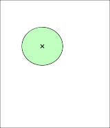
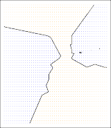

[< 2.2 Assessing Model Accuracy](../trans2.html) | [2.2.2 The Bias-Variance Trade-Off >](../2_2_2_the_bias-variance_trade-off/trans2.html)

> 💡 **학습 팁:** 조금 더 쉽고 재미있게 공부하고 싶으신가요? 이 페이지는 중학생도 이해할 수 있는 친절한 '쉬운 해설판'입니다! 영어 원문을 문장 단위로 꼼꼼하게 번역한 느낌을 원하신다면 [📖 직역본 보기](./trans1.html) 메뉴를 활용하세요!

# 2.2.1 Measuring the Quality of Fit_
# 2.2.1 적합성 품질 측정 (내 기계에게 점수 매기기)

In order to evaluate the performance of a statistical learning method on a given data set, we need some way to measure how well its predictions actually match the observed data.
어떤 데이터가 주어졌을 때 우리가 만든 인공지능이나 통계 기계가 얼마나 똘똘한지(성능)를 평가하려면, 이 녀석이 찍은 답(예측)이 우리가 쥐고 있는 진짜 정답(관측 데이터)이랑 도대체 얼마나 똑같은지를 재는 '채점 기준'이 필요합니다.

That is, we need to quantify the extent to which the predicted response value for a given observation is close to the true response value for that observation.
다시 말해서, "기계가 예측한 값"이 "진짜 찐 정답"에 얼마나 가깝게 비비고 들어갔는지 그 오차 거리를 숫자로 딱 떨어지게(정량화) 계산해 내야 한다는 뜻이죠.

In the regression setting, the most commonly-used measure is the _mean squared error_ (MSE), given by
주가 맞추기나 집값 맞추기 같은 숫자 맞추기(회귀) 동네에서는 전 세계인들이 가장 사랑하고 만만하게 쓰는 국민 채점표가 있습니다. 바로 **'평균 제곱 오차(Mean squared error, MSE)'** 라는 놈인데, 공식은 다음과 같습니다.

$$ MSE = \frac{1}{n} \sum_{i=1}^n (y_i - \hat{f}(x_i))^2 \tag{2.5} $$

where $\hat{f}(x_i)$ is the prediction that $\hat{f}$ gives for the $i$th observation.
여기서 $\hat{f}(x_i)$ 는 우리의 짝퉁 함수 기계 $\hat{f}$ 에 $i$번째 아저씨의 힌트 $x$를 집어넣었을 때 기계가 뱉어낸 '예측(찍은 답)'을 뜻합니다.

The MSE will be small if the predicted responses are very close to the true responses, and will be large if for some of the observations, the predicted and true responses differ substantially.
위에 공식을 뜯어보세요. 기계가 정답을 기가 막히게 잘 찍어 맞추면 괄호 안의 차이가 줄어들어 MSE 점수가 한없이 작아집니다. 반대로 기계가 몇몇 정답을 안드로메다처럼 헛다리로 찍어버리면, 제곱 때문에 뻥튀기가 되어서 MSE 점수가 하늘 무서운 줄 모르고 미친 듯이 치솟게 됩니다.

The MSE in (2.5) is computed using the training data that was used to fit the model, and so should more accurately be referred to as the _training MSE_ .
근데 조심할 게 있습니다! 이 (2.5) 공식으로 계산한 MSE는, 사실 아까 기계한테 "옛다, 공부 좀 해라!" 하고 던져줬던 연습용 오답 노트(훈련 데이터)를 가지고 고스란히 복습 채점만 한 겁니다. 그래서 이 점수를 좀 더 깐깐하게 부르면 **'훈련 MSE(Training MSE, 즉 연습 모의고사 성적)'** 라고 불러야 합니다.

But in general, we do not really care how well the method works on the training data.
근데 솔직히 말해서, 사장님들은 기계가 이미 다 외워버린 연습장 모의고사(훈련 데이터)에서 몇 점을 받든 1도 관심이 없습니다!

Rather, _we are interested in the accuracy of the predictions that we obtain when we apply our method to previously unseen test data_ .
오히려 사장님들이 피가 끓게 알고 싶은 건 따로 있습니다. _기계에게 태어나서 단 한 번도 구경해 본 적 없는 살벌한 낯선 실전 수능 문제(시험 데이터, Test data)를 던져줬을 때 기계가 과연 정답을 찰떡같이 맞춰낼(예측 정확도) 수 있는가?_ 바로 이것에만 혈안이 되어 있죠!

Why is this what we care about?
아니, 대체 왜 훈련 성적은 버리고 실전 시험 성적에만 목숨을 거는 걸까요?

Suppose that we are interested in developing an algorithm to predict a stock’s price based on previous stock returns.
예를 하나 들어보죠. 우리가 지난 몇 년 치 주식 차트를 가지고 내일 주가를 맞추는 미친 인공지능 봇을 개발한다고 쳐봅시다.

We can train the method using stock returns from the past 6 months.
우리는 지난 6개월 동안의 과거 거래 내역(훈련 데이터)을 봇에게 달달 외우게 학습시킵니다.

But we don’t really care how well our method predicts last week’s stock price.
하지만 우리가 진정으로 신경 쓰는 게 과연 "와! 우리 봇이 '지난주' 주가를 100% 완벽하게 찍어 맞췄어!" 일까요? 과거로 타임머신 탈 일 있습니까? 당연히 1도 안 중요하죠!

We instead care about how well it will predict tomorrow’s price or next month’s price.
우리의 찐 목표는 그 봇이 아직 현실에 오지도 않은 **내일의 주가, 혹은 다음 달의 주가(시험 데이터, 처음 보는 미래)** 를 얼마나 족집게처럼 때려 맞추느냐에 걸려있습니다.

On a similar note, suppose that we have clinical measurements (e.g. weight, blood pressure, height, age, family history of disease) for a number of patients, as well as information about whether each patient has diabetes.
비슷한 이야기로, 동네 병원 차트에 수많은 환자들의 몸무게, 혈압, 키, 나이, 가족력(임상 측정치)들이 쫙 적혀있고, 이 사람들이 당뇨 판정을 받았는지 아닌지(정답)에 대한 정보도 다 갖고 있다고 해봅시다.

We can use these patients to train a statistical learning method to predict risk of diabetes based on clinical measurements.
우리는 이 과거 환자 차트들을 전부 기계에 밀어 넣어서, 신체 힌트만 보고도 당뇨병 위험을 때려 맞추는 통계 모델을 빡세게 훈련시킬 수 있습니다.

In practice, we want this method to accurately predict diabetes risk for _future patients_ based on their clinical measurements.
근데 실제 돈을 버는 현장에서는, 예전 환자 기록이 중요한 게 아닙니다. 내일 문을 열고 처음으로 병원에 걸어 들어온 _쌩판 남인 새로운 환자(미래 환자, 시험 데이터)_ 가 잰 혈압과 몸무게만 딱 보고 "당신, 당뇨 위험이 높소!" 하고 칼같이 예측 진단해 내길 원하는 거죠.

We are not very interested in whether or not the method accurately predicts diabetes risk for patients used to train the model, since we already know which of those patients have diabetes.
이미 차트에 당뇨라고 크게 동그라미 쳐진 옛날 연습용 환자들을 놓고 기계가 "이 사람은 당뇨병입니다!" 하고 뒷북 쳐봐야 쓸데없는 짓 아닙니까? 정답을 이미 우리가 알고 있는데 말이죠.

To state it more mathematically, suppose that we fit our statistical learning method on our training observations $\{(x_1, y_1), (x_2, y_2), \dots, (x_n, y_n)\}$, and we obtain the estimate $\hat{f}$.
이 빡치는 상황을 수학쟁이들처럼 고도로 수학적으로 폼나게 써봅시다. 우리가 $x_1$ 부터 $x_n$ 까지 바리바리 싸 들고 온 훈련용 오답 노트들에다가 인공지능을 존버시켜 훈련시켰고, 드디어 기계가 $\hat{f}$ 라는 짝퉁 함수(모델)를 뱉어냈습니다.

We can then compute $\hat{f}(x_1), \hat{f}(x_2), \dots, \hat{f}(x_n)$.
그럼 이 완성된 $\hat{f}$ 에다가 방금 훈련에 썼던 힌트들 $x_1, \dots, x_n$ 을 도루묵처럼 다시 집어넣어 봅니다.

If these are approximately equal to $y_1, y_2, \dots, y_n$, then the training MSE given by (2.5) is small.
찍어낸 예측값들이 옛날 정답 $y_1, \dots, y_n$ 이랑 기가 막히게 똑같다면, (2.5) 공식에 넣었을 때 에러(훈련 MSE)가 거의 0에 수렴하는 '모의고사 만점자'가 탄생합니다.

However, we are really not interested in whether $\hat{f}(x_i) \approx y_i$; instead, we want to know whether $\hat{f}(x_0)$ is approximately equal to $y_0$, where $(x_0, y_0)$ is a _previously unseen test observation not used to train the statistical learning method_.
하지만 우리가 두 손 모아 기도하고 기다리는 건 기계가 모의고사 오답 노트($\hat{f}(x_i) \approx y_i$)를 잘 외우는지 따위가 아닙니다! 우리의 진짜 피 말리는 관심사는 기계가 _머리털 나고 한 번도 본 적 없는 철통 보완의 새로운 수능 시험지, 즉 **새로운 관측치 $(x_0, y_0)$**_ 가 주어졌을 때 과연 $\hat{f}(x_0)$ 가 진짜 실전 정답 $y_0$ 랑 거짓말처럼 똑같이 맞춰낼 수 있는가? 입니다. 

**FIGURE 2.9.** Left: _Data simulated from $f$, shown in black. Three estimates of $f$ are shown: the linear regression line (orange curve), and two smoothing spline fits (blue and green curves)._ Right: _Training MSE (grey curve), test MSE (red curve), and minimum possible test MSE over all methods (dashed line). Squares represent the training and test MSEs for the three fits shown in the left-hand panel._

**그림 2.9.** (왼쪽) _시커먼 선은 조물주만이 아는 진리의 함수 $f$ 고요. 도화지에 그려진 3개의 다른 색(주황, 파랑, 초록) 선은 우리가 여러 기법(선형 회귀, 스플라인)을 써서 기계한테 억지로 그리라고 시켜본 모델들입니다._ (오른쪽 도화지) _바로 과적합의 호러쇼 현장! 회색 선은 연습 모의고사 성적(훈련 MSE)이고 빨간 선은 실전 수능 성적(시험 MSE)입니다. 네모 박스는 왼쪽의 세 가지 선이 각각 성적이 얼마나 나왔는지 위치를 찍어준 겁니다._

We want to choose the method that gives the lowest _test MSE_, as opposed to the lowest training MSE.
결론적으로 우리가 픽해야 하는 영웅은 연장전 연습 모의고사 만점자(가장 낮은 훈련 MSE)가 아닙니다. 실전 수능에서 제일 에러 안 내고 과녁을 뚫는 놈, 즉 **가장 낮은 '시험 MSE(Test MSE)'** 를 뽑아내는 기계(방법)를 골라야 합니다!

In other words, if we had a large number of test observations, we could compute
이를 수학적으로 다시 써보면, 만약 우리 창고에 기계가 평생 본 적 없는 낯선 실전 수능 문제 데이터($x_0, y_0$)가 미친 듯이 쌓여있다면 우리는 이걸 계산해 볼 수 있습니다.

$$ \text{Ave}(y_0 - \hat{f}(x_0))^2 \tag{2.6} $$

the average squared prediction error for these test observations $(x_0, y_0)$.
위 식은 실전 시험 문제들($x_0$)을 싹 다 넣고 돌려서 기계가 진짜 정답($y_0$)이랑 얼마나 어긋났는지 에러 거리를 제곱해서 평균 친, "진짜 실전 평균 오차"입니다.

We’d like to select the model for which this quantity is as small as possible.
당연히 우리는 이 실전 오차 수량이 티끌만치도 없는, 가능한 한 가장 작은 점수를 가진 모델 하나를 무조건 셀렉 해야 합니다.

How can we go about trying to select a method that minimizes the test MSE?
아니 그럼 이 그토록 바라는 '시험 MSE 최소화' 모델을 도대체 어떻게 무슨 마법으로 골라낸다는 걸까요?

In some settings, we may have a test data set available—that is, we may have access to a set of observations that were not used to train the statistical learning method.
제일 개꿀인 상황은 하늘이 도와서, 애초에 분석가 손에 "기계는 한 번도 엿보지 못한 봉인된 수능 문제지(실전 시험 데이터 세트)"가 한 트럭 준비되어 있는 경우입니다.

We can then simply evaluate (2.6) on the test observations, and select the learning method for which the test MSE is smallest.
이러면 고민할 거 없이 편하게 모델들 쭉 세워놓고, 봉인된 수능 문제지 뜯어서 (2.6) 공식대로 채점만 쫙 한 다음, 시험 MSE 오차 점수 제일 낮은 우등생 놈을 골라잡으면 끝입니다!

But what if no test observations are available?
근데 현실은 시궁창이죠. 만약 여러분한테 봉인된 수능 문제지(시험 관측치) 따위가 하나도 없고 그냥 모의고사 연습장 딸랑 하나뿐이라면 어쩌실 건가요?

In that case, one might imagine simply selecting a statistical learning method that minimizes the training MSE (2.5).
아마 십중팔구 바보들은 귀찮아서 "아잇, 몰라! 그냥 내가 가진 모의고사 떡칠 훈련장(훈련 데이터)에서라도 만점(가장 낮은 훈련 MSE (2.5)) 받는 놈 고르면 똑같이 잘하겠지!" 하고 대충 모델을 픽하는 멍청한 판단을 상상하게 될 겁니다.

This seems like it might be a sensible approach, since the training MSE and the test MSE appear to be closely related.
얼핏 들으면 코드가 꽤나 합리적인 접근 같습니다. 왜냐면 모의고사 만점 받을 정도로 똑똑한 기계라면 당연히 실전 수능 에러(시험 MSE)도 덩달아 떡상해 줄 것 같은 강한 믿음이 생기거든요.

Unfortunately, there is a fundamental problem with this strategy: there is no guarantee that the method with the lowest training MSE will also have the lowest test MSE.
하지만 슬프게도 이 작전엔 당신의 목을 칠 아주 치명적이고 근본적인 맹점(오류)이 도사리고 있습니다! _모의고사 문제 은행만 다 외워서 시험 잘 본 놈(가장 낮은 훈련 MSE)이, 진짜 한 번도 본 적 없는 응용문제(가장 낮은 시험 MSE)까지 잘 푼다는 보장은 하늘이 두 쪽 나도 절대 없습니다!_

Roughly speaking, the problem is that many statistical methods specifically estimate coefficients so as to minimize the training set MSE.
돌직구를 날리자면, 이 기계 놈들(통계 방법들)이 사실 엄청 야비해서 훈련 데이터 던져주면 그 패턴 배후의 진리를 깨우치려 하지는 않고 오로지 당장 눈앞의 훈련 에러 점수만 깎기 위해(최소화) 편법으로 $\beta$ 숫자 계수들을 억지로 때려 맞춰버리기 때문입니다.

For these methods, the training set MSE can be quite small, but the test MSE is often much larger.
이렇게 공부한 애들은 모의고사 문제집만 딸딸 외웠으니 훈련 세트 MSE 성적은 100점 만점에 거의 0 오차로 경이롭지만 막상 실전 시험(시험 MSE)장에 나가선 탈탈탈 영혼까지 털리면서 점수가 무참히 박살 나버리기 일쑤라는 거죠.

Figure 2.9 illustrates this phenomenon on a simple example.
방금 본 그림 2.9가 이 잔인한 현상을 아주 적나라하고 유치하게 묘사해 놓은 현장입니다.

In the left-hand panel of Figure 2.9, we have generated observations from (2.1) with the true $f$ given by the black curve.
그림 2.9의 왼쪽 도화지를 봅시다. 우리는 신의 방정식 (2.1)에서 떨어진 진리의 우아한 검은색 곡선($f$) 주변으로 억지로 노이즈를 흔들어서 데이터 점들을 생성해 놨습니다.

The orange, blue and green curves illustrate three possible estimates for $f$ obtained using methods with increasing levels of flexibility.
여기에 빳빳한 주황색 젓가락, 적당히 낭창거리는 파란 선, 미친 듯이 꼬인 초록 선 이렇게 세 가지 모델을 던졌습니다. 색깔이 변할수록 점점 고무줄처럼 더 유연하게(융통성 있게) 구부러지도록 기법을 세팅한 겁니다.

The orange line is the linear regression fit, which is relatively inflexible.
주황색 선은 가장 깡통이고 뻣뻣하기 그지없는 '선형 회귀' 아저씨입니다. 곡선이라곤 그릴 줄 모르는 바보죠.

The blue and green curves were produced using _smoothing splines_ , discussed in Chapter 7, with different levels of smoothness.
파란 선과 초록 선은 나중에 7장에서 등장할 **'평활 스플라인(smoothing splines)'** 이라는 마법 수건인데, 한 놈은 살짝만 다림질(파랑)했고, 다른 한 놈은 그냥 마구잡이로 구겨서 던진(초록) 겁니다.

It is clear that as the level of flexibility increases, the curves fit the observed data more closely.
보다시피 기계에게 고무줄 같은 유연성(융통성)을 허락할수록, 선은 검은 점(관측 데이터) 하나하나를 향해 거미줄처럼 미친 듯이 기어가서 찰싹 밀착하려고 한다는 게 육안으로도 보입니다.

The green curve is the most flexible and matches the data very well; however, we observe that it fits the true $f$ (shown in black) poorly because it is too wiggly.
그래서 초록색 선이 가장 고무줄처럼 엄청나게 유연해서 찍힌 점들을 거진 100% 관통(매치)하며 미친 성능을 보여줍니다. 그러나! 충격적이게도 조물주 만이 아는 진리의 검은 곡선(진짜 $f$)이랑 대조해보면, 이 초록 선은 데이터의 사소한 떨림(운빨)조차 집착하며 다 외우느라 너무 뾰족하게 구불구불(wiggly) 발작을 일으키는 바람에, 오히려 진리를 찾는 데는 형편없이 폭망해버렸다는 걸 목격하게 됩니다.

By adjusting the level of flexibility of the smoothing spline fit, we can produce many different fits to this data.
이렇게 모델의 다이얼을 틱틱 돌려서 유연성 수준만 조절해 줘도 우리는 동일한 데이터 위에서 엄청나게 다양한 결과 선들을 막 찍어낼 수 있는 겁니다.

We now move on to the right-hand panel of Figure 2.9.
자, 이제 이 대참사의 참혹한 결과가 담긴 그림 2.9의 오른쪽 도화지(그래프)로 넘어가 보겠습니다.

The grey curve displays the average training MSE as a function of flexibility, or more formally the _degrees of freedom_ , for a number of smoothing splines.
여기서 바닥으로 곤두박질치는 **회색 썰매 선(회색 곡선)** 은 모델이 고무줄처럼 점점 유연해질 때(전문 용어로 '자유도'를 높일 때) 연습 문제에서 얼마나 점수를 잘 받는지를 보여주는 '평균 훈련 MSE'의 행방을 의미합니다.

The degrees of freedom is a quantity that summarizes the flexibility of a curve; it is discussed more fully in Chapter 7.
방금 말한 그 낯선 단어인 '자유도(Degrees of freedom)'는 아주 쉽게 말해 곡선이 얼마나 제멋대로 미쳐 날뛸 수 있는지 자유로운 관절 숫자가 몇 개인가(유연성)를 잰 수치입니다. (자세한 해부는 7장에 가서 합시다.)

The orange, blue and green squares indicate the MSEs associated with the corresponding curves in the left-hand panel.
그래프 중간중간에 박힌 주황, 파랑, 초록 네모점들은, 아까 왼쪽에서 그렸던 그 각 색깔 모델들의 진짜 실전 수능 오차점수 위치를 쾅 박아놓은 좌표상입니다.

A more restricted and hence smoother curve has fewer degrees of freedom than a wiggly curve—note that in Figure 2.9, linear regression is at the most restrictive end, with two degrees of freedom.
아주 꼼짝 못 하게 손발이 묶여 뻣뻣하고 둥근 녀석일수록, 제멋대로 요동치는 구불구불한 놈보다 관절(자유도) 숫자가 적습니다. 그림 2.9의 맨 왼쪽, 제일 뻣뻣한 주황색 선형 회귀 녀석은 자유도 관절이 달랑 2개뿐인 불쌍하고 제한적인 끝판왕이 기생하고 있죠.

The training MSE declines monotonically as flexibility increases.
회색 썰매 선(훈련 MSE)을 보세요. 이 모의고사 에러 점수는 기계에게 자유(유연성)를 줄수록 마치 브레이크 고장 난 트럭처럼 단 한 번의 반등도 없이 0을 향해 단조롭게 바닥으로 처박힙니다! 모델이 꼬일수록 오답 노트를 기가 막히게 싹싹 외워버리기 때문이죠.

In this example the true $f$ is non-linear, and so the orange linear fit is not flexible enough to estimate $f$ well.
이 실험에선 애초에 신이 만든 진리의 정답 $f$ 가 곡선(비선형)이었어요. 그래서 관절이 고작 2개뿐인 뻣뻣한 주황색 선형 회귀 녀석은 그 곡선의 진리를 쫓아가기엔 턱없이 둔하고 모자랐던(유연하지 못한) 겁니다.

The green curve has the lowest training MSE of all three methods, since it corresponds to the most flexible of the three curves fit in the left-hand panel.
반면 엄청난 관절 개수를 자랑하는 초록색 발작 곡선은, 세 모델 중 가장 고무줄처럼 유연하다 보니, 모의고사 오답은 죄다 암기해 버려 가장 기가 막히게 낮은 훈련 MSE(연습장 만점) 성적을 뽐내고 있습니다.

In this example, we know the true function $f$ , and so we can also compute the test MSE over a very large test set, as a function of flexibility.
우리는 조물주라 진리의 함수 $f$ 를 몰래 들여다볼 수 있기 때문에, 뒷돈을 주고 엄청나게 방대한 실전 수능 데이터 시험지(시험 세트)를 무한정 뽑아와서, 과연 모델이 유연해질 때 실전 시험 에러(시험 MSE)가 어떻게 변하는지 몰래 계산해서 까볼 수 있었습니다.

(Of course, in general $f$ is unknown, so this will not be possible.)
(물론 일반적인 닝겐 분석가는 세상의 진리 $f$ 를 눈으로 볼 수 없기 때문에 실전에선 이런 미친 짓이 절대 불가능합니다.)

The test MSE is displayed using the red curve in the right-hand panel of Figure 2.9.
아무튼 조물주인 우리가 그 무한의 수능 시험지에 매겨본 진짜 잔혹한 실전 에러 점수, 그 '시험 MSE'의 곡선이 바로 **오른쪽 그림의 U자형 빨간 선**입니다.

As with the training MSE, the test MSE initially declines as the level of flexibility increases.
시작은 회색 썰매 선(훈련 성적)이랑 비슷합니다. 주황색 막대기보다 기계의 관절(유연성 수준)을 조금씩 풀어주기 시작하면 기계가 똑똑해져서 빨간 선(수능 에러)도 덩달아 쑥쑥 떨어집니다. 와! 만세!

However, at some point the test MSE levels off and then starts to increase again.
하지만! 그 기쁨도 잠시. 기계가 적당히 유연하다 못해 점점 미쳐 날뛰어 초록색 괴물이 되는 어떤 임계점(바닥)에 도달하면, 빨간 선(시험 오차) 성적의 하락이 우뚝 멈추더니 뜬금없이 이내 고개를 쳐들고 무섭게 에러가 하늘로 다시 뾰족하게 치솟아 오르기 시작합니다!

Consequently, the orange and green curves both have high test MSE.
결과론적으로 까고 보니 너무 뻣뻣하고 바보인 주황 모델도 똥볼을 찼고, 연습장만 다 외워버린 1등 우등생 초록 모델도 수능 시험장 가서는 대판 깨져버려(높은 시험 MSE) 사이좋게 나란히 망했다는 걸 의미합니다.

The blue curve minimizes the test MSE, which should not be surprising given that visually it appears to estimate $f$ the best in the left-hand panel of Figure 2.9.
오직 너무 딱딱하지도, 너무 구불구불하지도 않게 적당히 타협을 본 '파란색 곡선'만이 이 피 튀기는 실전 수능 오차 곡선(U자 형태)의 한가운데 꿀단지(최소점)를 차지했습니다! 왼쪽 그림을 보면 파란 선이 진짜 검은 곡선 $f$ 랑 제일 찰떡으로 생겼단 걸 생각하면, 이건 사실 하나도 놀라운 반전이 아니죠.

The horizontal dashed line indicates \text{Var}(\epsilon), the irreducible error in (2.3), which corresponds to the lowest achievable test MSE among all possible methods.
그래프 밑바닥에 쭉 그어진 수평 점선은 뭔가요? 이건 조물주가 박아놓은 한계선, 아까 앞서 (2.3)에서 배웠던 "우주의 기운, 즉 찌꺼기 운빨( irreducible error $\text{Var}(\epsilon)$)" 입니다. 세상 어떤 외계인 기계가 와도 수능 오차 점수가 절대 이 점선 밑으로는 못 내려간다는 수학적 마지노선을 뜻합니다.

Hence, the smoothing spline represented by the blue curve is close to optimal.
그러니까 고로 파란색 선이 만들어낸 적당한 스플라인 모델은 우주의 수학적 한계에 가장 근접하게 들러붙어 있는 궁극의 최적(optimal) 모범 답안에 가깝다는 결론이 나옵니다.

In the right-hand panel of Figure 2.9, as the flexibility of the statistical learning method increases, we observe a monotone decrease in the training MSE and a _U-shape_ in the test MSE.
이번 실험을 통해 우리는 기계에게 많은 자유(유연성)를 줄 때, 훈련장 에러(회색 곡선)는 미끄럼틀처럼 쭉쭉 바닥 치며 떨어지지만 반면에 실전 수능 에러(빨간 곡선)는 소름 돋게도 바위계곡 사이의 **_U자 모양(U-shape)_** 을 그려버린다는 법칙을 뼈저리게 관측했습니다.

This is a fundamental property of statistical learning that holds regardless of the particular data set at hand and regardless of the statistical method being used.
가장 무서운 진실은 이 U자 모양의 저주가 무슨 기법을 쓰든, 어떤 신기방기한 데이터를 가져오든 간에 기계 학습 세계관 전체를 지배하는 절대 불변의 근본 우주 법칙이라는 사실입니다.

As model flexibility increases, the training MSE will decrease, but the test MSE may not.
이 말을 벽에 새기 십시오: 기계가 말랑말랑(유연) 해질수록 "모의고사 에러는 깎인다. 그러나 수능 에러는 언제 뒤통수치며 돌변할지 모른다!"

When a given method yields a small training MSE but a large test MSE, we are said to be _overfitting_ the data.
어떤 기계 놈이 연습용 오답 노트(훈련 MSE)는 에러 하나 없이 0으로 만점을 찍었는데, 막상 낯선 실전 수능(시험 MSE)장에서는 오답 폭발을 일으키며 장렬히 박살 났다면? 바로 이때 우리는 그 기계놈이 문제집의 쓰레기 패턴까지 탈탈 다 외워버려서 돌이킬 수 없는 **'과적합(Overfitting) 병'** 에 걸렸다고 사형 선고를 내립니다.

This happens because our statistical learning procedure is working too hard to find patterns in the training data, and may be picking up some patterns that are just caused by random chance rather than by true properties of the unknown function $f$ .
이 끔찍한 병의 원인은, 기계가 문제집에서 눈치 없게 너무 과분하게 부지런을 떨면서 진리의 함수 $f$ 의 뼈대를 공부한 게 아니라, 그 옆에 묻어 있던 우주 찌꺼기의 우연한 떨림(운빨 노이즈 패턴)까지 마치 "오? 이게 필승 공식이구나!" 하고 오해하여 달달 외워버렸기 때문에 일어난 참사입니다.

When we overfit the training data, the test MSE will be very large because the supposed patterns that the method found in the training data simply don’t exist in the test data.
기계가 문제집의 그 운빨 노이즈까지 목숨 걸고 (과적합해서) 다 외웠다 한들, 막상 새로운 실전 시험지에 들어가면 그 옛날의 우연한 패턴 따윈 1도 존재하지 않기 때문에 완전히 헛다리를 짚을 수밖에 없고 결국 수능 에러(시험 MSE)가 미친 듯이 떡상할 수밖에 없는 악순환인 겁니다.

Note that regardless of whether or not overfitting has occurred, we almost always expect the training MSE to be smaller than the test MSE because most statistical learning methods either directly or indirectly seek to minimize the training MSE.
그리고 이 잔인한 세상에선, 설령 과적합 늪에 아직 안 빠졌다 하더라도 애초에 모든 기계들의 알고리즘 대원칙 자체가 '연습 문제 오차 최소화'로 짜여 있기 때문에, 웬만하면 언제나 항상 집구석 연습장 에러 점수가 밖에서 보는 실전 실력보다 구라 핑처럼 뻥튀기(더 작게 에러가 나옴) 되어 있다고 깐깐하게 믿으셔야 뒷목 잡는 일이 없습니다.

Overfitting refers specifically to the case in which a less flexible model would have yielded a smaller test MSE.
결국 이 '과적합'이라는 오명은 정확히 말하면 "차라리 멍청하고 뻣뻣한(덜 유연한) 구식 모델을 썼더라면 진작에 실전 점수를 훨씬 더 잘 받았을 텐데, 괜히 잘난 척 깝치다가 점수를 더 까먹고 피 본 호구 상황"을 전문적이고 아주 정확하게 가리키는 뼈 때리는 용어입니다. 

**FIGURE 2.10.** _Details are as in Figure 2.9, using a different true $f$ that is much closer to linear. In this setting, linear regression provides a very good fit to the data._

**그림 2.10.** _이번엔 조물주가 진리의 $f$ 를 거의 일직선에 가까운 S라인으로 아주 뻣뻣하게 만들어서 던져준 세상(다른 상황)입니다. 이런 동네에선 멍청한 선형 회귀(주황색)가 오히려 대역전극을 펼치며 가장 데이터를 기가 막히게 찰떡으로 맞춰내는 기적을 보여줍니다._

Figure 2.10 provides another example in which the true $f$ is approximately linear.
자, 그림 2.10의 도화지는 아까랑 다르게, 진리의 $f$ 자체가 구불거리지 않고 거의 막대기 일직선에 가깝게 누워있는 또 다른 평행 세계의 예시입니다.

Again we observe that the training MSE decreases monotonically as the model flexibility increases, and that there is a U-shape in the test MSE.
여기서도 어김없이, 기계의 고무줄 관절(유연성)을 풀면 연습 모의고사 성적(회색 선)은 끝을 모르고 0을 향해 단조롭게 수직 낙하하며 떨어지고, 수능 시험 성적(빨간 선)은 다시 영락없이 그놈의 U자 곡선을 그려대는 똑같은 짓거리를 목격합니다.

However, because the truth is close to linear, the test MSE only decreases slightly before increasing again, so that the orange least squares fit is substantially better than the highly flexible green curve.
하지만! 이번엔 진리의 모양 자체가 워낙 뻣뻣한 판자(일직선)에 가까웠던지라, 기계에 유연성을 찔끔 주자마자 수능 에러가 아주 조금 떨어지더니 바로 최저점을 찍고 바로 다시 위로 확 대가리를 들어 상승장에 돌입해버립니다. 덕분에 이 동네에선 아주 멍청하기 짝이 없던 뻣뻣한 주황색 깡통 회귀 로봇이 온갖 진상을 부리며 구불거리는 초록색 천재 봇보다 실전 점수를 압도적으로 더 잘 쓸어 담는(substantially better) 기현상이 벌어지는 겁니다!

Finally, Figure 2.11 displays an example in which $f$ is highly non-linear.
마지막 예시! 그림 2.11은 조물주가 그냥 작정을 하고 진리의 $f$ 를 정신 나간 진동 파동처럼 아주 극도로 구불구불하게 꼬아놓은 잔혹한(고도로 비선형적인) 세계입니다.

The training and test MSE curves still exhibit the same general patterns, but now there is a rapid decrease in both curves before the test MSE starts to increase slowly.
여기서도 연장전 에러와 수능 에러 곡선은 항상 그렇듯 비슷한 루틴 패턴을 탑니다. 다만 이 동네에선 진짜 진리 자체가 워낙 구불구불하니까, 기계한테 어느 정도 확실하게 고무줄 관절(유연성)을 왕창 선물해 줄 때까지, 두 에러 곡선 성적 둘 다 허공에서 절벽 떨어지듯이 수직으로 확 급격하게 하락을 하다가, 한참 뒤에야 비로소 U자의 오른쪽 구멍이 열리며 시험 에러가 서서히 올라가기 시작하는 차이가 있죠.

In practice, one can usually compute the training MSE with relative ease, but estimating the test MSE is considerably more difficult because usually no test data are available.
현실 도피를 좀 일깨워 볼까요? 현업 분석가 컴퓨터에선 버튼 하나만 딸깍 누르면 훈련장 모의고사 에러(MSE) 따윈 진짜 하품 나오게 쉽게 구할 수 있습니다. 그러나 실전 수능 에러 점수라는 건 애초에 미래에서 데이터를 훔쳐 올(가용한 시험 데이터 부재) 수가 없으므로, 진짜 상상초월 수준으로 이 악물고 구하기 어렵고 빡센 일입니다!

As the previous three examples illustrate, the flexibility level corresponding to the model with the minimal test MSE can vary considerably among data sets.
게다가 방금 본 3개의 그림이 피 토하며 증명했듯이, 그 황금 단지에 닿는, 즉 U자 곡선 바닥(가장 낮은 수능 에러)에 도달하기 위한 그 기계의 '최적 유연성 관절 꺾기 수준'이라는 것은 데이터가 아저씨냐 아줌마냐 삼성전자냐에 따라(데이터 세트마다) 매번 지멋대로 소름 돋게 휙휙 심하게 달라집니다.

Throughout this book, we discuss a variety of approaches that can be used in practice to estimate this minimum point.
그리하여 이 두꺼운 책이 끝날 때까지 우리는 현업에서 피 눈물 흘리며 저 미지의 U자 곡선 바닥 꿀단지 좌표(최소 지점)를 한 땀 한 땀 추정하고 캐내는데 필요한 수많은 삽질의 꼼수 접근법들을 신나게 논쟁할 것입니다.

One important method is _cross-validation_ (Chapter 5), which is a method for estimating the test MSE using the training data.
그 꼼수 중 현업 최고의 비기가 바로 5장에서 등장하는 **'교차 검증(Cross-validation)'** 입니다. 이건 미래의 시험지가 없을 때, 우리가 가진 연습 피 묻은 모의고사(훈련 데이터)를 이리저리 스스로 돌려 깎고 쪼개서 기적처럼 미래의 수능 에러 점수(시험 MSE)를 훔쳐보는 기적의 연금술 방법입니다.

---

## Sub-Chapters (하위 목차)

[< 2.2 Assessing Model Accuracy](../trans2.html) | [2.2.2 The Bias-Variance Trade-Off >](../2_2_2_the_bias-variance_trade-off/trans2.html)
