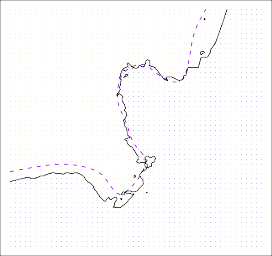
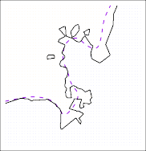

# _2.2.2 The Bias-Variance Trade-Off_ 

The U-shape observed in the test MSE curves (Figures 2.9–2.11) turns out to be the result of two competing properties of statistical learning methods. 

**FIGURE 2.11.** _Details are as in Figure 2.9, using a different $f$ that is far from linear. In this setting, linear regression provides a very poor fit to the data._ 

Though the mathematical proof is beyond the scope of this book, it is possible to show that the expected test MSE, for a given value $x_0$, can always be decomposed into the sum of three fundamental quantities: the _variance_ of $\hat{f}(x_0)$, the squared _bias_ of $\hat{f}(x_0)$ and the variance of the error terms $\epsilon$. That is, 

$$ E(y_0 - \hat{f}(x_0))^2 = \text{Var}(\hat{f}(x_0)) + [\text{Bias}(\hat{f}(x_0))]^2 + \text{Var}(\epsilon) \tag{2.7} $$

$^2$ Here the notation $E(y_0 - \hat{f}(x_0))^2$ defines the *expected test MSE* at $x_0$, and refers to the average test MSE that we would obtain if we repeatedly estimated $f$ using a large number of training sets, and tested each at $x_0$. The overall expected test MSE can be computed by averaging $E(y_0 - \hat{f}(x_0))^2$ over all possible values of $x_0$ in the test set.

Equation 2.7 tells us that in order to minimize the expected test error, we need to select a statistical learning method that simultaneously achieves _low variance_ and _low bias_ . Note that variance is inherently a nonnegative quantity, and squared bias is also nonnegative. Hence, we see that the expected test MSE can never lie below Var( _ϵ_ ), the irreducible error from (2.3). 

What do we mean by the _variance_ and _bias_ of a statistical learning method? _Variance_ refers to the amount by which _f_[ˆ] would change if we estimated it using a different training data set. Since the training data are used to fit the statistical learning method, different training data sets will result in a different _f_[ˆ] . But ideally the estimate for _f_ should not vary too much between training sets. However, if a method has high variance then small changes in the training data can result in large changes in _f_[ˆ] . In general, more flexible statistical methods have higher variance. Consider the green and orange curves in Figure 2.9. The flexible green curve is following the observations very closely. It has high variance because changing any one of these data points may cause the estimate _f_[ˆ] to change considerably. 

**FIGURE 2.12.** _Squared bias (blue curve), variance (orange curve), Var_ ( $\epsilon$ ) _(dashed line), and test MSE (red curve) for the three data sets in Figures 2.9–2.11. The vertical dotted line indicates the flexibility level corresponding to the smallest test MSE._ 

In contrast, the orange least squares line is relatively inflexible and has low variance, because moving any single observation will likely cause only a small shift in the position of the line. 

On the other hand, _bias_ refers to the error that is introduced by approximating a real-life problem, which may be extremely complicated, by a much simpler model. For example, linear regression assumes that there is a linear relationship between _Y_ and _X_ 1 _, X_ 2 _, . . . , Xp_ . It is unlikely that any real-life problem truly has such a simple linear relationship, and so performing linear regression will undoubtedly result in some bias in the estimate of _f_ . In Figure 2.11, the true _f_ is substantially non-linear, so no matter how many training observations we are given, it will not be possible to produce an accurate estimate using linear regression. In other words, linear regression results in high bias in this example. However, in Figure 2.10 the true _f_ is very close to linear, and so given enough data, it should be possible for linear regression to produce an accurate estimate. Generally, more flexible methods result in less bias. 

As a general rule, as we use more flexible methods, the variance will increase and the bias will decrease. The relative rate of change of these two quantities determines whether the test MSE increases or decreases. As we increase the flexibility of a class of methods, the bias tends to initially decrease faster than the variance increases. Consequently, the expected test MSE declines. However, at some point increasing flexibility has little impact on the bias but starts to significantly increase the variance. When this happens the test MSE increases. Note that we observed this pattern of decreasing test MSE followed by increasing test MSE in the right-hand panels of Figures 2.9–2.11. 

The three plots in Figure 2.12 illustrate Equation 2.7 for the examples in Figures 2.9–2.11. In each case the blue solid curve represents the squared bias, for different levels of flexibility, while the orange curve corresponds to the variance. The horizontal dashed line represents Var( _ϵ_ ), the irreducible error. Finally, the red curve, corresponding to the test set MSE, is the sum 

of these three quantities. In all three cases, the variance increases and the bias decreases as the method’s flexibility increases. However, the flexibility level corresponding to the optimal test MSE differs considerably among the three data sets, because the squared bias and variance change at different rates in each of the data sets. In the left-hand panel of Figure 2.12, the bias initially decreases rapidly, resulting in an initial sharp decrease in the expected test MSE. On the other hand, in the center panel of Figure 2.12 the true _f_ is close to linear, so there is only a small decrease in bias as flexibility increases, and the test MSE only declines slightly before increasing rapidly as the variance increases. Finally, in the right-hand panel of Figure 2.12, as flexibility increases, there is a dramatic decline in bias because the true _f_ is very non-linear. There is also very little increase in variance as flexibility increases. Consequently, the test MSE declines substantially before experiencing a small increase as model flexibility increases. 

The relationship between bias, variance, and test set MSE given in Equation 2.7 and displayed in Figure 2.12 is referred to as the _bias-variance trade-off_ . Good test set performance of a statistical learning method re- bias-variance quires low variance as well as low squared bias. This is referred to as a trade-off trade-off because it is easy to obtain a method with extremely low bias but high variance (for instance, by drawing a curve that passes through every single training observation) or a method with very low variance but high bias (by fitting a horizontal line to the data). The challenge lies in finding a method for which both the variance and the squared bias are low. This trade-off is one of the most important recurring themes in this book. 

In a real-life situation in which _f_ is unobserved, it is generally not possible to explicitly compute the test MSE, bias, or variance for a statistical learning method. Nevertheless, one should always keep the bias-variance trade-off in mind. In this book we explore methods that are extremely flexible and hence can essentially eliminate bias. However, this does not guarantee that they will outperform a much simpler method such as linear regression. To take an extreme example, suppose that the true _f_ is linear. In this situation linear regression will have no bias, making it very hard for a more flexible method to compete. In contrast, if the true _f_ is highly non-linear and we have an ample number of training observations, then we may do better using a highly flexible approach, as in Figure 2.11. In Chapter 5 we discuss cross-validation, which is a way to estimate the test MSE using the training data. 
