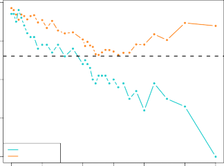
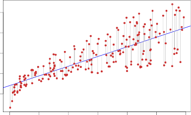
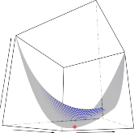
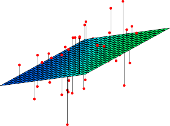

# _K_ -Nearest Neighbors 

In theory we would always like to predict qualitative responses using the Bayes classifier. But for real data, we do not know the conditional distribution of _Y_ given _X_ , and so computing the Bayes classifier is impossible. Therefore, the Bayes classifier serves as an unattainable gold standard against which to compare other methods. Many approaches attempt to estimate the conditional distribution of _Y_ given _X_ , and then classify a given observation to the class with highest _estimated_ probability. One such method is the _K-nearest neighbors_ (KNN) classifier. Given a positive in- _K_ -nearest 

neighbors 

In theory we would always like to predict qualitative responses using the Bayes classifier. But for real data, we do not know the conditional distribution of $Y$ given $X$, and so computing the Bayes classifier is impossible. Therefore, the Bayes classifier serves as an unattainable gold standard against which to compare other methods. Many approaches attempt to estimate the conditional distribution of $Y$ given $X$, and then classify a given observation to the class with highest _estimated_ probability. One such method is the _K-nearest neighbors_ (KNN) classifier. Given a positive integer $K$ and a test observation $x_0$, the KNN classifier first identifies the $K$ points in the training data that are closest to $x_0$, represented by $\mathcal{N}_0$. It then estimates the conditional probability for class $j$ as the fraction of points in $\mathcal{N}_0$ whose response values equal $j$:

$$ Pr(Y = j|X = x_0) = \frac{1}{K} \sum_{i \in \mathcal{N}_0} I(y_i = j) \tag{2.12} $$

Finally, KNN classifies the test observation _x_ 0 to the class with the largest probability from (2.12). 

Figure 2.14 provides an illustrative example of the KNN approach. In the left-hand panel, we have plotted a small training data set consisting of six blue and six orange observations. Our goal is to make a prediction for the point labeled by the black cross. Suppose that we choose _K_ = 3. Then KNN will first identify the three observations that are closest to the cross. This neighborhood is shown as a circle. It consists of two blue points and one orange point, resulting in estimated probabilities of 2 _/_ 3 for the blue class and 1 _/_ 3 for the orange class. Hence KNN will predict that the black cross belongs to the blue class. In the right-hand panel of Figure 2.14 we have applied the KNN approach with _K_ = 3 at all of the possible values for _X_ 1 and _X_ 2, and have drawn in the corresponding KNN decision boundary. 

Despite the fact that it is a very simple approach, KNN can often produce classifiers that are surprisingly close to the optimal Bayes classifier. Figure 2.15 displays the KNN decision boundary, using _K_ = 10, when applied to the larger simulated data set from Figure 2.13. Notice that even though the true distribution is not known by the KNN classifier, the KNN decision boundary is very close to that of the Bayes classifier. The test error rate using KNN is 0 _._ 1363, which is close to the Bayes error rate of 0 _._ 1304. The choice of _K_ has a drastic effect on the KNN classifier obtained. Figure 2.16 displays two KNN fits to the simulated data from Figure 2.13, using _K_ = 1 and _K_ = 100. When _K_ = 1, the decision boundary is overly flexible and finds patterns in the data that don’t correspond to the Bayes decision boundary. This corresponds to a classifier that has low bias but very high variance. As _K_ grows, the method becomes less flexible and produces a decision boundary that is close to linear. This corresponds to a low-variance but high-bias classifier. On this simulated data set, neither _K_ = 1 nor _K_ = 100 give good predictions: they have test error rates of 0 _._ 1695 and 0 _._ 1925, respectively. 

Just as in the regression setting, there is not a strong relationship between the training error rate and the test error rate. With $K=1$, the KNN training error rate is 0, but the test error rate may be quite high. In general, as we use more flexible classification methods, the training error rate will decline but the test error rate may not. In Figure 2.17, we have plotted the KNN test and training errors as a function of $1/K$. As $1/K$ increases, the method becomes more flexible. As in the regression setting, the training error rate consistently declines as the flexibility increases. However, the test error exhibits a characteristic U-shape, declining at first (with a minimum at approximately $K=10$) before increasing again when the method becomes excessively flexible and overfits.

**FIGURE 2.14.** _The KNN approach, using K_ = 3 _, is illustrated in a simple situation with six blue observations and six orange observations._ Left: _a test observation at which a predicted class label is desired is shown as a black cross. The three closest points to the test observation are identified, and it is predicted that the test observation belongs to the most commonly-occurring class, in this case blue._ Right: _The KNN decision boundary for this example is shown in black. The blue grid indicates the region in which a test observation will be assigned to the blue class, and the orange grid indicates the region in which it will be assigned to the orange class._ 

**FIGURE 2.15.** _The black curve indicates the KNN decision boundary on the data from Figure 2.13, using K_ = 10 _. The Bayes decision boundary is shown as a purple dashed line. The KNN and Bayes decision boundaries are very similar._ 

In both the regression and classification settings, choosing the correct level of flexibility is critical to the success of any statistical learning method. The bias-variance tradeoff, and the resulting U-shape in the test error, can make this a difficult task. In Chapter 5, we return to this topic and discuss 

**FIGURE 2.16.** _A comparison of the KNN decision boundaries (solid black curves) obtained using $K=1$ and $K=100$ on the data from Figure 2.13. With $K=1$, the decision boundary is overly flexible, while with $K=100$ it is not sufficiently flexible. The Bayes decision boundary is shown as a purple dashed line._ 

**FIGURE 2.17.** _The KNN training error rate (blue, 200 observations) and test error rate (orange, 5,000 observations) on the data from Figure 2.13, as the level of flexibility (assessed using $1/K$ on the log scale) increases, or equivalently as the number of neighbors $K$ decreases. The black dashed line indicates the Bayes error rate. The jumpiness of the curves is due to the small size of the training data set._ 

various methods for estimating test error rates and thereby choosing the optimal level of flexibility for a given statistical learning method. 
