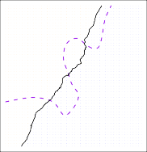

[< 2.2.2 The Bias-Variance Trade-Off](../2_2_2_the_bias-variance_trade-off/index.html) | [2.2.3.1 K Nearest Neighbors >](2_2_3_1_k_nearest_neighbors/index.html)

> 💡 **학습 팁:** 원문 해석이 어렵다면? 한 줄씩 나란히 번역된 [📖 직역본 보기](./trans1.html)를 추천합니다!

# 2.2.3 The Classification Setting_

Thus far, our discussion of model accuracy has been focused on the regression setting. But many of the concepts that we have encountered, such as the bias-variance trade-off, transfer over to the classification setting with only some modifications due to the fact that $y_i$ is no longer quantitative.

Suppose that we seek to estimate $f$ on the basis of training observations $\{(x_1, y_1), \dots , (x_n, y_n)\}$, where now $y_1, \dots , y_n$ are qualitative.

The most common approach for quantifying the accuracy of our estimate $\hat{f}$ is the training _error rate_ , the proportion of mistakes that are made if we apply our estimate $\hat{f}$ to the training observations:

$$ \frac{1}{n} \sum_{i=1}^n I(y_i \neq \hat{y}_i) \tag{2.8} $$

Here $\hat{y}_i$ is the predicted class label for the $i$th observation using $\hat{f}$. And $I(y_i \neq \hat{y}_i)$ is an _indicator variable_ that equals 1 if $y_i \neq \hat{y}_i$ and zero if $y_i = \hat{y}_i$.

If $I(y_i \neq \hat{y}_i) = 0$ then the $i$th observation was classified correctly by our classification method; otherwise it was misclassified.

Hence Equation 2.8 computes the fraction of incorrect classifications.

Equation 2.8 is referred to as the _training error rate_ because it is computed based on the data that was used to train our classifier.

As in the regression setting, we are most interested in the error rates that result from applying our classifier to test observations that were not used in training.

The _test error rate_ associated with a set of test observations of the form $(x_0, y_0)$ is given by

$$ \text{Ave}(I(y_0 \neq \hat{y}_0)) \tag{2.9} $$

where $\hat{y}_0$ is the predicted class label that results from applying the classifier to the test observation with predictor $x_0$.

A _good_ classifier is one for which the test error (2.9) is smallest.

### The Bayes Classifier It is possible to show (though the proof is outside of the scope of this book) that the test error rate given in (2.9) is minimized, on average, by a very simple classifier that _assigns each observation to the most likely class, given its predictor values_ .

In other words, we should simply assign a test observation with predictor vector $x_0$ to the class $j$ for which

$$ Pr(Y = j|X = x_0) \tag{2.10} $$

Note that (2.10) is a _conditional probability_ : it is the probability that $Y = j$, given the observed predictor vector $x_0$.

This very simple classifier is called the _Bayes classifier_ .

In a two-class problem where there are only two possible response values, say _class 1_ or _class 2_ , the Bayes classifier corresponds to predicting class one if $Pr(Y = 1 | X = x_0) > 0.5$, and class two otherwise.

Figure 2.13 provides an example using a simulated data set in a two-dimensional space consisting of predictors $X_1$ and $X_2$.

The orange and blue circles correspond to training observations that belong to two different classes.

For each value of $X_1$ and $X_2$, there is a different probability of the response being orange or blue.

Since this is simulated data, we know how the data were generated and we can calculate the conditional probabilities for each value of $X_1$ and $X_2$.

The orange shaded region reflects the set of points for which $Pr(Y = \text{orange} | X)$ is greater than 50 %, while the blue shaded region indicates the set of points for which the probability is below 50 %.

The purple dashed line represents the points where the probability is exactly 50 %.

This is called the _Bayes decision boundary_ .

The Bayes classifier’s prediction is determined by the Bayes decision boundary; an observation that falls on the orange side of the boundary will be assigned to the orange class, and similarly an observation on the blue side of the boundary will be assigned to the blue class.

**FIGURE 2.13.** _A simulated data set consisting of 100 observations in each of two groups, indicated in blue and in orange. The purple dashed line represents the Bayes decision boundary. The orange background grid indicates the region in which a test observation will be assigned to the orange class, and the blue background grid indicates the region in which a test observation will be assigned to the blue class._

The Bayes classifier produces the lowest possible test error rate, called the _Bayes error rate_.

Since the Bayes classifier will always choose the class for which (2.10) is largest, the error rate will be $1 - \max_j Pr(Y=j | X=x_0)$ at $X=x_0$.

In general, the overall Bayes error rate is given by

$$ 1 - E(\max_j Pr(Y=j|X)) \tag{2.11} $$

where the expectation averages the probability over all possible values of $X$ .

For our simulated data, the Bayes error rate is 0.133.

It is greater than zero, because the classes overlap in the true population, which implies that $\max_j Pr(Y = j|X = x_0) < 1$ for some values of $x_0$.

The Bayes error rate is analogous to the irreducible error, discussed earlier.

---

### 2.2.3.1 K-Nearest Neighbors

Learn the K-Nearest Neighbors (KNN) technique, the most intuitive algorithm as a practical implementation in a non-parametric classification setting.
Learn how the Decision Boundary changes based on the size of the K value, and how the bias-variance trade-off appears in the process.

---

## Sub-Chapters

[< 2.2.2 The Bias-Variance Trade-Off](../2_2_2_the_bias-variance_trade-off/index.html) | [2.2.3.1 K Nearest Neighbors >](2_2_3_1_k_nearest_neighbors/index.html)
