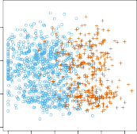

# 4.2 Why Not Linear Regression? 

We have stated that linear regression is not appropriate in the case of a qualitative response. Why not? 

Suppose that we are trying to predict the medical condition of a patient in the emergency room on the basis of her symptoms. In this simplified example, there are three possible diagnoses: `stroke` , `drug overdose` , and 

4.2 Why Not Linear Regression? 137 

**FIGURE 4.1.** _The_ `Default` _data set._ Left: _The annual incomes and monthly credit card balances of a number of individuals. The individuals who defaulted on their credit card payments are shown in orange, and those who did not are shown in blue._ Center: _Boxplots of_ `balance` _as a function of_ `default` _status._ Right: _Boxplots of_ `income` _as a function of_ `default` _status._ 

`epileptic seizure` . We could consider encoding these values as a quantitative response variable, $Y$, as follows:

$$
Y = egin{cases} 
1 & 	ext{if stroke} \ 
2 & 	ext{if drug overdose} \ 
3 & 	ext{if epileptic seizure} 
\end{cases}
$$

Using this coding, least squares could be used to fit a linear regression model to predict $Y$on the basis of a set of predictors $X_1$ _, . . . , Xp_ . Unfortunately, this coding implies an ordering on the outcomes, putting `drug overdose` in between `stroke` and `epileptic seizure` , and insisting that the difference between `stroke` and `drug overdose` is the same as the difference between `drug overdose` and `epileptic seizure` . In practice there is no particular reason that this needs to be the case. For instance, one could choose an equally reasonable coding,

$$
Y = egin{cases} 
1 & 	ext{if epileptic seizure} \ 
2 & 	ext{if stroke} \ 
3 & 	ext{if drug overdose} 
\end{cases}
$$

which would imply a totally different relationship among the three conditions. Each of these codings would produce fundamentally different linear models that would ultimately lead to different sets of predictions on test observations. 

If the response variable’s values did take on a natural ordering, such as _mild_ , _moderate_ , and _severe_ , and we felt the gap between mild and moderate was similar to the gap between moderate and severe, then a 1, 2, 3 coding would be reasonable. Unfortunately, in general there is no natural way to 

138 4. Classification 

convert a qualitative response variable with more than two levels into a quantitative response that is ready for linear regression. 

For a _binary_ (two level) qualitative response, the situation is better. For binary instance, perhaps there are only two possibilities for the patient’s medical condition: `stroke` and `drug overdose` . We could then potentially use the _dummy variable_ approach from Section 3.3.1 to code the response as follows: 

$$
Y = egin{cases} 
0 & 	ext{if stroke} \ 
1 & 	ext{if drug overdose} 
\end{cases} \quad (4.1)
$$

We could then fit a linear regression to this binary response, and predict `drug overdose` if _Y_[ˆ] _>_ 0 _._ 5 and `stroke` otherwise. In the binary case it is not hard to show that even if we flip the above coding, linear regression will produce the same final predictions. 

For a binary response with a 0/1 coding as above, regression by least squares is not completely unreasonable: it can be shown that the _Xβ_[ˆ] obtained using linear regression is in fact an estimate of Pr( `drug overdose` _|X_ ) in this special case. However, if we use linear regression, some of our estimates might be outside the [0 _,_ 1] interval (see Figure 4.2), making them hard to interpret as probabilities! Nevertheless, the predictions provide an ordering and can be interpreted as crude probability estimates. Curiously, it turns out that the classifications that we get if we use linear regression to predict a binary response will be the same as for the linear discriminant analysis (LDA) procedure we discuss in Section 4.4. 

To summarize, there are at least two reasons not to perform classification using a regression method: (a) a regression method cannot accommodate a qualitative response with more than two classes; (b) a regression method will not provide meaningful estimates of Pr( _Y |X_ ), even with just two classes. Thus, it is preferable to use a classification method that is truly suited for qualitative response values. In the next section, we present logistic regression, which is well-suited for the case of a binary qualitative response; in later sections we will cover classification methods that are appropriate when the qualitative response has two or more classes. 
