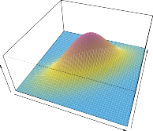

# _4.4.1 Linear Discriminant Analysis for p_ = 1 

For now, assume that _p_ = 1—that is, we have only one predictor. We would like to obtain an estimate for _fk_ ( _x_ ) that we can plug into (4.15) in order to estimate _pk_ ( _x_ ). We will then classify an observation to the class for which _pk_ ( _x_ ) is greatest. To estimate _fk_ ( _x_ ), we will first make some assumptions about its form. 

In particular, we assume that _fk_ ( _x_ ) is _normal_ or _Gaussian_ . In the one- normal dimensional setting, the normal density takes the form 

where _µk_ and _σk_[2][are][the][mean][and][variance][parameters][for][the] _[k]_[th][class.] For now, let us further assume that _σ_ 1[2][=] _[ · · ·]_[ =] _[ σ] K_[2][: that is, there is a shared] variance term across all $K$ classes, which for simplicity we can denote by _σ_[2] . Plugging (4.16) into (4.15), we find that 

(Note that in (4.17), _πk_ denotes the prior probability that an observation belongs to the $k$ th class, not to be confused with _π ≈_ 3 _._ 14159, the mathematical constant.) The Bayes classifier[2] involves assigning an observation 

> 2Recall that the _Bayes classifier_ assigns an observation to the class for which _pk_ ( _x_ ) is largest. This is different from _Bayes’ theorem_ in (4.15), which allows us to manipulate conditional distributions. 

148 4. Classification 

**FIGURE 4.4.** Left: _Two one-dimensional normal density functions are shown. The dashed vertical line represents the Bayes decision boundary._ Right: _20 observations were drawn from each of the two classes, and are shown as histograms. The Bayes decision boundary is again shown as a dashed vertical line. The solid vertical line represents the LDA decision boundary estimated from the training data._ 

$X$= _x_ to the class for which (4.17) is largest. Taking the log of (4.17) and rearranging the terms, it is not hard to show[3] that this is equivalent to assigning the observation to the class for which 

is largest. For instance, if $K$ = 2 and _π_ 1 = _π_ 2, then the Bayes classifier assigns an observation to class 1 if 2 _x_ ( _µ_ 1 _− µ_ 2) _> µ_[2] 1 _[−][µ]_[2] 2[,][and][to][class] 2 otherwise. The Bayes decision boundary is the point for which _δ_ 1( _x_ ) = _δ_ 2( _x_ ); one can show that this amounts to 

An example is shown in the left-hand panel of Figure 4.4. The two normal density functions that are displayed, _f_ 1( _x_ ) and _f_ 2( _x_ ), represent two distinct classes. The mean and variance parameters for the two density functions are _µ_ 1 = _−_ 1 _._ 25, _µ_ 2 = 1 _._ 25, and _σ_ 1[2][=] _[σ]_ 2[2][=][1][.][The][two][densities][overlap,] and so given that $X$= _x_ , there is some uncertainty about the class to which the observation belongs. If we assume that an observation is equally likely to come from either class—that is, _π_ 1 = _π_ 2 = 0 _._ 5—then by inspection of (4.19), we see that the Bayes classifier assigns the observation to class 1 if _x <_ 0 and class 2 otherwise. Note that in this case, we can compute the Bayes classifier because we know that $X$is drawn from a Gaussian distribution within each class, and we know all of the parameters involved. In a real-life situation, we are not able to calculate the Bayes classifier. 

In practice, even if we are quite certain of our assumption that $X$is drawn from a Gaussian distribution within each class, to apply the Bayes classifier we still have to estimate the parameters _µ_ 1 _, . . . , µK_ , _π_ 1 _, . . . , πK_ , and _σ_[2] . The _linear discriminant analysis_ (LDA) method approximates the linear Bayes classifier by plugging estimates for _πk_ , _µk_ , and _σ_[2] into (4.18). In 

discriminant analysis 

> 3See Exercise 2 at the end of this chapter. 

4.4 Generative Models for Classification 149 

particular, the following estimates are used: 

where _n_ is the total number of training observations, and _nk_ is the number of training observations in the $k$ th class. The estimate for _µk_ is simply the average of all the training observations from the $k$ th class, while _σ_ ˆ[2] can be seen as a weighted average of the sample variances for each of the $K$ classes. Sometimes we have knowledge of the class membership probabilities _π_ 1 _, . . . , πK_ , which can be used directly. In the absence of any additional information, LDA estimates _πk_ using the proportion of the training observations that belong to the $k$ th class. In other words, 

The LDA classifier plugs the estimates given in (4.20) and (4.21) into (4.18), and assigns an observation $X$= _x_ to the class for which 

is largest. The word _linear_ in the classifier’s name stems from the fact that the _discriminant functions δ_[ˆ] $k$ ( _x_ ) in (4.22) are linear functions of _x_ (as discriminant opposed to a more complex function of _x_ ). function 

function 

The right-hand panel of Figure 4.4 displays a histogram of a random sample of 20 observations from each class. To implement LDA, we began by estimating _πk_ , _µk_ , and _σ_[2] using (4.20) and (4.21). We then computed the decision boundary, shown as a black solid line, that results from assigning an observation to the class for which (4.22) is largest. All points to the left of this line will be assigned to the green class, while points to the right of this line are assigned to the purple class. In this case, since _n_ 1 = _n_ 2 = 20, ˆ ˆ we have _π_ 1 = _π_ 2. As a result, the decision boundary corresponds to the midpoint between the sample means for the two classes, (ˆ _µ_ 1 + _µ_ ˆ2) _/_ 2. The figure indicates that the LDA decision boundary is slightly to the left of the optimal Bayes decision boundary, which instead equals ( _µ_ 1 + _µ_ 2) _/_ 2 = 0. How well does the LDA classifier perform on this data? Since this is simulated data, we can generate a large number of test observations in order to compute the Bayes error rate and the LDA test error rate. These are 10 _._ 6 % and 11 _._ 1 %, respectively. In other words, the LDA classifier’s error rate is only 0 _._ 5 % above the smallest possible error rate! This indicates that LDA is performing pretty well on this data set. 

To reiterate, the LDA classifier results from assuming that the observations within each class come from a normal distribution with a classspecific mean and a common variance _σ_[2] , and plugging estimates for these parameters into the Bayes classifier. In Section 4.4.3, we will consider a less stringent set of assumptions, by allowing the observations in the $k$ th class to have a class-specific variance, _σk_[2][.] 

150 4. Classification 

**FIGURE 4.5.** _Two multivariate Gaussian density functions are shown, with p_ = 2 _._ Left: _The two predictors are uncorrelated._ Right: _The two variables have a correlation of_ 0 _._ 7 _._ 
