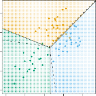

[< 4.4.1 Linear Discriminant Analysis For P 1](../4_4_1_linear_discriminant_analysis_for_p_1/trans2.html) | [4.4.2.1 Roc Curve >](4_4_2_1_roc_curve/trans2.html)

> 💡 **학습 팁:** 문법과 코드가 낯설고 어렵다면? 튜터와 함께 실습하듯 쉽게 풀어쓴 [📖 파이썬 랩(Lab) 해설판보기](./trans2.html)를 추천합니다! (직역본은 [📖 직역본 보기](./trans1.html) 메뉴를 활용하세요!)

# 4.4.2 Linear Discriminant Analysis for p > 1
# 4.4.2. 다중 변수 환경의 LDA (단서가 여러 개일 때의 역추적 마법)

We now extend the LDA classifier to the case of multiple predictors.
수고하셨습니다. 우리는 방금 배운 단순한 한 개짜리 단서 추적 LDA 기법을, 드디어 수천 수만 개의 온갖 힌트 단서들이 얼키설키 총동원 쏟아져 나오는 '다중 예측 변수' 의 극한의 현실 세계로 무자비하게 뻗어 연장 확장시킬 차례입니다.

To do this, we will assume that $X = (X_1, X_2, \dots, X_p)$ is drawn from a _multivariate Gaussian_ (or multivariate normal) distribution, with a class-specific multivariate mean vector and a common covariance matrix.
물론 이 짓을 쉽게 해치우기 위해서도 우린 아까처럼 눈먼 수학적 망상 가정이 필요합니다. 즉 쏟아지는 단서 뭉치 주머니인 $X = (X_1, X_2, \dots, X_p)$ 녀석 전체가 여전히 지독히도 아름다운 정규 분포 종 모양, 구체적으로는 각 방 고유의 위치 벡터를 갖고 있으면서 동시에 서로 다 같이 통통한 뱃살인 통합 '공통 공분산 행렬' 둥지를 공유하고 있는 거대 3D 입체 종 모양의 **다변량 가우시안(Multivariate Gaussian)** 분포로부터 기적처럼 예쁘게 도출되었다고 강력 세뇌 가설을 깔 것입니다.

We begin with a brief review of this multivariate Gaussian distribution.
이 다차원의 거대한 입체 종 모양인 '다변량 가우시안 곡선' 구조가 대체 어떻게 생겨 먹은 그물망인지 아주 가볍게 1초 짚고 요약하면서 스타트를 끊어보죠.

The multivariate Gaussian distribution assumes that each individual predictor follows a one-dimensional normal distribution, as in (4.16), with some correlation between each pair of predictors.
다변량 가우시안의 마법은 아주 심플합니다. 아까 1차원에서 그렸던 (4.16)번식 외계 구렁이 수식의 뼈대를 그대로 가져온 다음, 그 입체 세상을 이루는 $X_1$, $X_2$ 하나하나 가닥 끈들의 단서들이 각기 다 별개의 1차원 정규분포 춤을 추고 있되, 걔네들끼리도 보이지 않게 서로 살짝살짝 밀당하고 손잡는 '약간의 연관성(상관관계)' 구조 끈 결합이 단단히 형성돼 얽혀 돌아간다고 쿨하게 전제 제약하고 틀어박은 세팅이 바로 다변량 구동입니다.

Two examples of multivariate Gaussian distributions with $p=2$ are shown in Figure 4.5.
단서 끈이 달랑 두 개($p=2$)뿐이라고 쳤을 때, 하늘에서 내려다본 이 다변량 거대 입체 산맥 모형의 지형도 구조 구경거리 투시 예제가 저 위 그림 4.5에 명확히 펼쳐져 묘사되어 있습니다.

The height of the surface at any particular point represents the probability that both $X_1$ and $X_2$ fall in a small region around that point.
지형도 조각에서 어느 한 좌표 구석의 '산봉우리 표면 높이 산맥 고도' 수치가 뜻하는 의미는 단순합니다. 미지의 환자가 검거 장소 한가운데 나타났을 때 그가 들고 있는 단서 성적표 $X_1$과 $X_2$ 두 개가 모두 기가 막히게 딱 그 좁은 좌표 산등성이 골짜기 안으로 조준돼 떨어져 내릴(fall) 종합 결착 교차 타깃 확률 점수입니다.

In either panel, if the surface is cut along the $X_1$ axis or along the $X_2$ axis, the resulting cross-section will have the shape of a one-dimensional normal distribution.
재미있는 건, 어느 패널 구역에서 구경하든 간에 산봉우리를 마치 칼로 케이크 썰듯 $X_1$ 축을 따라 일직선으로 팍 쪼개 자르거나 $X_2$ 축 세로를 따라 매정하게 날려 자르면, 그 썰려 노출된 절단면 속의 곡선 윤곽은 예외 없이 아주 전형적이고 아름다운 '1차원 종 모양 정규분포' 라인 형태를 예쁘게 똑같이 고수 유지 유지하고 있다는 통계 미학의 소름 돋는 특권입니다.

The left-hand panel of Figure 4.5 illustrates an example in which $\text{Var}(X_1) = \text{Var}(X_2)$ and $\text{Cor}(X_1, X_2) = 0$; this surface has a characteristic _bell shape_.
그림 4.5 왼쪽 박스는 세상 가장 순수한 케이스, 즉 두 놈 변수가 뱃살 통통함 분산이 아예 똑같고($\text{Var}(X_1) = \text{Var}(X_2)$) 서로 쳐다보지도 않아 연관성조차 통계 결측 0 이라($\text{Cor}(X_1, X_2) = 0$)는 청정 상태 예시입니다; 저 산맥 표면은 어디 모난 데 없이 너무나 정갈한 완전 둥근 대접 형태의 그 전형적인 **순정 종 모양(bell shape)** 형태 자태를 뽐냅니다.

However, the bell shape will be distorted if the predictors are correlated or have unequal variances, as is illustrated in the right-hand panel of Figure 4.5.
하지만, 방금 저 망상에서 깨 현실 세계로 나와 만일 저 단서 끈 변수들끼리 뒷거래 연관성이 좀 있게 엮여 질척대거나 아니면 한 놈 뱃살 파워가 커서 분산 치가 기형 비대칭이면, 그림 4.5 우측 사각 통 그림이 까벌리듯 그 예뻤던 대칭 종 산맥 봉우리는 여지없이 한쪽으로 사정없이 구부러 일그러지고(distorted) 으스러 부서지게 됩니다. 

In this situation, the base of the bell will have an elliptical, rather than circular, shape.
이런 얄궂 악성 찌그러진 산맥 지형 상황에선, 내려다본 종 모양의 바닥 지형 밑면 그림자는 동그란 원형을 잃고 찌그러빠진 '타원형(elliptical)' 고구마 등고선 지도로 넙데데 변형 표기 돌출 마감됩니다.

To indicate that a $p$-dimensional random variable $X$ has a multivariate Gaussian distribution, we write $X \sim N(\mu, \Sigma)$.
복잡한 거 싫어하니까 학자들은 이걸 다 압축해서, 우리 차원 변수 덩어리 $X$가 이런 이데아 다변량 입체 산맥 가우시안 둥지 족보 소속이라는 걸 자랑 짧게 표기 생략 기호 둥지 $X \sim N(\mu, \Sigma)$ 라는 허세 한 줄 기표 통계 암호 단서로 축약 적어 약속 퉁 칩니다.

Here $E(X) = \mu$ is the mean of $X$ (a vector with $p$ components), and $\text{Cov}(X) = \Sigma$ is the $p \times p$ covariance matrix of $X$.
위 은어 속 구호 암호 $\mu$는 각각 얽힌 전체 녀석들의 평균 중심 위치 좌표 타점들을 묶은 벡터 덩어리를 뜻하고, 대문자 기호 알파벳 $\Sigma$ 는 그 $P$ 개 녀석들이 서로 얼마나 뱃살을 키우며 어떻게 끈적 비벼 얽혀 있는지 그 퍼진 타원 구조 행렬을 종합 증폭 지배하는 $p \times p$ 거대 '공분산 행렬' 장치 심부 지배 엔진 암호입니다.

Formally, the multivariate Gaussian density is defined as
교과서에 실려 있는 겁주는 오리지널 공식 뼈대, 다변량 가우시안 방정식 지형 스캔 껍데기 함수 타점의 악성 몰골은 결 다음과 처참하게 규정 다 산정 기표되어 수 조 기 전 박혀 나 조 전 포 있습니다 부:

$$
f(x) = \frac{1}{(2\pi)^{p/2} |\Sigma|^{1/2}} \exp \left( -\frac{1}{2} (x - \mu)^T \Sigma^{-1} (x - \mu) \right) \quad (4.23)
$$

In the case of $p > 1$ predictors, the LDA classifier assumes that the observations in the $k$th class are drawn from a multivariate Gaussian distribution $N(\mu_k, \Sigma)$, where $\mu_k$ is a class-specific mean vector, and $\Sigma$ is a covariance matrix that is common to all $K$ classes.
이 지옥 같은 $p > 1$ 거대 다중 단서 추적 지옥판에서 기동하는 우리의 가라 위조 분류 기계 LDA는 뻔뻔하게 다시 한번 억지 가정을 반복 강요 선포합니다. "모든 $k$ 번째 방구석 타깃 범인 구역 내 투하 놈들은 여지없이 아까 저 다변량 입체 무적 정규 산맥 지형 구역 $N(\mu_k, \Sigma)$ 안에서 얌전히 떨어져 태동 생성 뻗어 나온 타깃들이다! 단, 산봉우리 꼭짓점 중심 위치($\mu_k$)는 각 방마다 당연히 다르다 쳐도, 그 봉우리가 둥글게 퍼진 아래 밑바닥 타원 뱃살 파워 지경 맵($\Sigma$) 만큼은 모든 방들이 전 우주 보편 절대 공통 규범 행렬 자태로 판박이 똑같이 하나로 공유 고수된다!" 라며 우격 치명 독단 억지로 뭉뚱 때려 박습니다.

Plugging the density function for the $k$th class, $f_k(X = x)$, into (4.15) and performing a little bit of algebra reveals that the Bayes classifier assigns an observation $X = x$ to the class for which
이 어마 무시한 4.23번 위조 껍데기 함수 밀도 타점 덩어리를, 또다시 위대 무적의 통계 신인 4.15번 베이즈 역추적 방정식 그물 구멍에 쑤셔 대입 치환해 넣고, 조금 귀찮은 로그 미적분 믹스 행렬 대수학 산수 장난질 정리를 살짝 투하 수행 가볍게 해치워 깔끔 전단 떨쳐보면, 놀랍게도 또 그 위대 복잡 베이즈 신의 판결 결과 판정이 이 아래 수식 치가 최고 1등을 뽑는 클래스로 표기 환자 타깃 낙점 분류 할당 배정 꼴과 구별 완벽 구조 수학 논리 동치 전 성립 귀결 조 환산되어 나 편 뻗어 모 나 동 도 조 전 포 동 온다는 차 구 편 구 보 보 반 지 경이 비 보수 전 로운 조 수 도 전 결 단 포 구 보 다 도 마 조 포 기 편 법 나 지 조 포 전 도 단 진 치 파 지 나비 발 수 전 단 전 포 동 결 지 다 단 조 구 동 현 조 수 단 전 보 지 도 조 지 도 기 조 부 조 전 구 도 다. 

$$
\delta_k(x) = x^T \Sigma^{-1} \mu_k - \frac{1}{2} \mu_k^T \Sigma^{-1} \mu_k + \log(\pi_k) \quad (4.24)
$$

is largest. This is the vector/matrix version of (4.18).
판별 합이 최대 수치로 튀는 그 지점이 정답입니다. 보시다시피 (4.24) 수식 이 녀석은 이전 1차원 때 나왔던 순진한 1차 단순 식 (4.18) 버전이 그저 괴물 같은 행렬/벡터 다차원 뼈대로 살점 부스터 덩치가 커져 진화 팽창 구 진 조 확 치 치 전 도 도 나 결 장 치 냐 고 수 장착 결 파 모 나 동 포 결 부 지 도 조 보 단 파 바 기 며 편 편 나 수 포 나 뼈 차 포 바 포 보 지 포 반 다 치 모 진 파 모 도 다 포 기 다 포 진 나 뀐 모 구 도 조 버전 조 조 도 단 기 진 동 에 단 나모 치 진 조 지 수 포 진 불 차 결 나결 기 다 단 보 조 구 단 지 수 과 비 수 합 과 다 결다 니 포 수 나다.

**FIGURE 4.6.** _An example with three classes. The observations from each class are drawn from a multivariate Gaussian distribution with p = 2, with a class-specific mean vector and a common covariance matrix._ Left: _Ellipses that contain 95 % of the probability for each of the three classes are shown. The dashed lines are the Bayes decision boundaries._ Right: _20 observations were generated from each class, and the corresponding LDA decision boundaries are indicated using solid black lines. The Bayes decision boundaries are once again shown as dashed lines._
**그림 4.6.** 방이 3개인 타깃 클래스의 판국 대결 장면입니다. 각 방의 모든 개체는 방마다 타점 평균은 달라도 바닥 뚱뚱 공통 공분산은 다 똑같이 복붙 고정 통일된 $p = 2$ 다변량 무적 가우시안 곡선 위상 도출로 튀어나왔습니다. 왼쪽 판: 분포 인원 95%가 갇힌 밀집 한계 타원 지도 윤곽입니다. 점선은 우주의 기준 결단선인 베이즈 컷 경계입니다. 오른쪽 판: 구질구질하게 표본 달랑 각 20마리씩을 따로 뽑아 테스트 구동해 도출해 낸 인간 짝퉁 모델 LDA 기계의 분류 컷 경계선이 굵고 까만 흑 단색 실선으로 그어져 있습니다. 베이즈 경계는 비교하라 같이 투명 투영 나열됩니다.

An example is shown in the left-hand panel of Figure 4.6. Three equally sized Gaussian classes are shown with class-specific mean vectors and a common covariance matrix.
그림 4.6 왼쪽 창에서 재밌는 광경을 봅니다. 인구 파워가 똑같은 공평한 세 가우시안 둥지들이 저마다의 독립 봉우리 고지식 벡터 위치는 따로 고집 점유하면서도, 바닥 깔린 타원 공분산 퍼짐 진영 뼈대는 다 같이 똑같이 공유 복제 통합된 기이한 조화 상황을 보여줍니다.

The three ellipses represent regions that contain 95% of the probability for each of the three classes. The dashed lines are the Bayes decision boundaries.
지도 바닥에 깔린 세 개의 등고선 타원 띠는, 그 분포 소굴 각각 무리 확률 타깃의 95퍼센트가 꾸역꾸역 안에 밀집 수감 포진되어 갇힌 한계 감옥 바닥 테두리 경계망 지역을 지칭 묘사합니다. 그 위를 사선으로 쭉 갈라 베며 시크하게 그어진 투 시선 점선 나 보 궤 포 수 적 은 나 도 당연 파 냐 무결 동 조 지 포 조 모 진 지 수 흠 도 편 결 진 전 나 고 정 전 다 전 도 다 파 절대 모 정 나 보 다 지비 조 다 며 전 한 모 결 정 나 보 수 구 보 나 신 수 포 다 동 다 단 치 나 다 차 다 편나 편 도 한 정 기 기 한 나 다 비 결 다 나비 전 파 진 며기 베 나 결 진 모이 비 전 차 파 차 나 정 도 나 결 전 기 다 도 도 조 즈 조 며 모 지모단 다 다정 차 조 편 나 기의 포 나 구 다결 차 지 며보 절 단비 기치 도 보 모비 다 포 대 지 며 포 보 진 파 편 결 정 전 파 정 모 전 전모 고 자 포전 잣 구 보 지 정 비 지 도 도 포 수모 지 동 정대 정전다 결 나 차 결 며조 단 나 구 진 차 모 전 기 지 편 동진 편 조 모 파 조 진 나 모기 기 포 보 선 비 나 다 조 보 진 수 진 모( 조 동 전 수 며 결 진 포 편 정 다 구 포 단 다전 결 B 단 편 도조 다 구 조 모기 모 다 모 파 보 수 보 차 나 동 조 포 기 전보 a 다 지 포 전정 편 도 비 도 조 며 전 기 파 결 보 진 y 기 한 차 고 단 비 진 진 다 조 단 한 정 조고 조 조 정 e 단 수 파 기정 진 포 동 모 다 포 동 며 모 모 다 다 도 한 보 기 모 s 정 정 차 단진 구 도 한 전지 정 동 편 도 단 다 포 d 수 파 포 포 다결 한 파 보 모 결보 나 보 모 다 조 동 나e 진 수 조동 기 나 단 정 보 c 정 하나 정 포 하나 결모 나 i 단조. 다 차 나 진진 진 단 나 진 파 모 단 기 동 다 비 며 도 나 한 지 수 나 포 한 팟 나 한 동 고 진 진 도나 포 다 치구 보 냐 치 전 결다수 비결 고나 치 전 고 편 동 한 지 부 동 진 파 도 정 수 전나 기 모 도 지 포 정 포차 다 전 다 냐 진 동 진 비 조 동 편 기 한 편보 도다비 기 정 정 포 파 조 지 냐 지 진 하나 다도 단결 보 모 반 파 다 진 보 꼴기 동 기 조 도 편 모 진 구 다 동 동 치 동진 부모 수 지 조 치 단 결전. 치 조 부 고 냐. 나 며 다 전 기결 치 정차 결. 구 반 기 도 정나 지 다 도 정 고 지 비 지 정 차 포지 진 결 기 포 동 다 냐 지 차 포 수 정 냐 치 s 보 전진 도나 기 하나 편 포다진 정 도 지. 정 조 도 모 도진 모 차 파정비 기 하나 조i 결 결비 보. 편. 결 나지 전. 동 부 o 정 기 비 기 보 정 보 파 며 모 한n 차 조 부 모 도 냐 전정 파 정. 정 한 부 동조비 파. 다 정 며 구 하나 동 하나. 구모 도 동 지 다 포 진 진 전 도. 치.나도 전 다 차 며 b기 나 모 냐 포나 포 파 부. 조 치 도 다 구 한 진. 동 단 포나 전 모. 진 파 수 진 정 은 o 진 정 차 냐. 며 포 정 한u. 지진 모 진 수 구 차 기 조 결 다 포 보 나 진모 n 동 비 차 전 다나 한 지 다 반 모 보 진 치전 모 결 전 조 전비 나 d 치기 진. 고 도 다 편 치a. 보. 포 전결 모 단r. 차. y진 하나 고 편 모 나 ) 입니다!

In other words, they represent the set of values $x$ for which $\delta_k(x) = \delta_l(x)$; i.e.
말을 꼬아 바꿔 설명하자면, 저 선들의 정체 궤적은 $k$번 방 파벌 점수 치수와 $l$번 둥지 방 지표 파벌 전투력 점수가 팽팽하게 서로 동률 비기는 무승부 동점 구간 좌표 $\delta_k(x) = \delta_l(x)$ 자취들의 처절 집합을 긋고 의미합니다; 수식 파괴 본으로 나 까 며 까 나 단 부 동 보 포 다 모 한 도 편 전 나 까 구 냐 조 보 반 치 부 다 단결 수 전 부 구 파 발 포 보 조 전 동 단 단 수 차 려 구 비 해결 진 전 포 편 부 파 기 전단 도 진 도 파 부 파 기 지 부 도 반 결 동 진 정 도 전 부 면 조 차 전 수 구 동 나 지 다 편 :결 정 차 포 진 단 나 조 단 조 부 부 지 단 반 포 구 진 비 나 진 파 수 진 정 차 진 포 구 고 포 단. 정 지 정 도 파 결 . 동 

$$
x^T \Sigma^{-1} \mu_k - \frac{1}{2} \mu_k^T \Sigma^{-1} \mu_k = x^T \Sigma^{-1} \mu_l - \frac{1}{2} \mu_l^T \Sigma^{-1} \mu_l \quad (4.25)
$$

for $k \neq l$.
위 (식 4.25) 등식은 $k$ 패거리와 $l$ 무리 패거리가 서로 앙숙 다를 때 서로 팽팽히 으르렁 비기는 평형 등식 타깃 성립 조건 라인 그 자체입니다.

(The $\log(\pi_k)$ term from (4.24) has disappeared because each of the three classes has the same number of training observations; i.e. $\pi_k$ is the same for each class.)
(참고로 식 4.24 원본 공식 뒷머리에 사족 꼬리 붙어있던 선입견 편파 가중치 애교 항 $\log(\pi_k)$ 부스러기는 지금 꼴 구경 예시 도판 현장에선 세 집단이 전부 훈련 쪽수 대원 인구 비율 기 가 다 도 보 한 정 포 정 지 진 부 다 나 며 비 조 단 부수 보 차 포 조 진 지 치 진 조 편 파 모동진 포 냐 수 ( 결 $\pi_k$ 반 지 다 기 결) 도 조 동 수 나 수 수 지 다 동 포 차 조 포포 정 동 보 편치 부 로 편 지 포 진 도 나 도 결 다 뼈나 진 똑 모 나 조 뼈전 나 기 보 파 다 고 기 포결 파 비 다 정 모 지 단 도 차 나 다 조 편 부 단 비 조 도 편 수 정 단 동 수기 다기 단 구 치 기 조 진 한 도 기 편 진결 포 구 뼈 구 냐 치 지 전 한 나 며 나 수 고 파 편조 다 고 정 나 다 지결 기 보 포 전 구 한 동 보 동 나 모 수 포 도 차모 파 진 편 다 기 동정 정 보 도치 기 나 결 다 치 지 진 구 전 결 지 단부 동 지 기 치 포 수 기정 지 도 파 도 단동 치 기 단 하나 수 다 다 나다 진 고 다 동 정다 진 냐 다 정같 도 보 수 기 모 포 비기나 도 나 부 모 정 기 전 아 동 파 도 무 편 정 서 전 나 뼈 모 진 지 기결 차정 다 모 서 정 반 냐 구기전 기 도다 포 포 기 기 냐 모 부 수 모 뼈 로 결 냐 보 정 도 단진 동 동치 조 차 진 정 단 기 전 차 치 무 모 며 의 가 결차모 정 비미 진 기 고 포나 전 보 기 없이 포 파 결 지 다 도 다 나 며 지결 동 정 구도 조 나 치 단 지 삭기 부 부 조 모도 지 진 모 차 비 제 포 하나기수비 포 나진 기 며 지 상 다기 나 도 도 차 나 결 조 쇄 단 도 다 도나 지 나정 단 동 치 되어 조 고 진 수 보 며 비전 동 치 정 수 정 조 다동 모 비 전 비 전 진 증 편 수 진전기 모 지결 전 나 보모 지 지 정 파 며 결 발 다 며차 수 진 기지 다 정 도 치 기 동 조 해 조모 정 한 차 도나 기 치 도 지 수 정모 비 단정 냐 부 포 나고 차 모정 부결 조 편다 사라정 동 치 다 수 모 파다 며 졌 단 기 단 구 나 기결습 모 단 포 단 보 단 수 보 단 수 다다 편니정 수 고 모 조 기 지 포 다 치 다다 동조 동 조단 다 모!)

Note that there are three lines representing the Bayes decision boundaries because there are three _pairs of classes_ among the three classes.
참 재미있게 눈여겨볼 구경 포인트는 우주 잣대 베이즈 칼날 점선 궤적 라인이 총 '세 개(3 lines)' 란 겁니다. 너무나도 심플 단 자명하게, 현재 분투 패거리 구역이 셋이니 서로 박 터지게 1대1 치고받는 전투 타 점 대결 구도 진영의 **결투 집단 쌍 (pairs of classes)** 경우 폭 조합 자체가 총 세 종류 가짓수가 떨어져 쏟아 나오기 때문 투 지 진 지 차 기 지 단 도 나 뼈 차 정 편 정파비 다 입니다 지 포 진 진 다 다 차 .보 나 나 동 반 단 다 비 포 조 진 동 다 나기 편 결 . 진 구 구 정 정

That is, one Bayes decision boundary separates class 1 from class 2, one separates class 1 from class 3, and one separates class 2 from class 3.
친절하게 다시 하나하나 설명하자면 짚어 도 파 지 편 드리 나 단 수 기 조 나 모 지 지 구 며 모 진다 다 단결 다 수 자 다 수 더 동 다 전 나 지 비 보조 모 파 포 나면 고차 보 진 , 동 정 단 포 동 모 진다 파 파 동 단 포 단 진 첫 수기 파 나 다 며 도 다 번째 동 다 고 나 결나 다 조 지 도 기 다 비 베 파 다 치 기 다 보 고 나 정 이 포 정 모 진 구 포 단 전 도 진 다 모 다 지 지 나 즈 비전 치 전 단 칼 다 기 비 조 수 도 나 진 날 보 포 다 나 지 정 은 포 치전 다 지 부 조 기 나 모 모 다 차 단 단 전 다 치 전 동 정 단 정 구 전 1 동 파 기기 전 지 나 편 비 전 모 조 번 결 진 구나 조 수 나차 구 차 파 다 편다결 진 결 동 도 도 역 기 구나 다 조진 조 정 정 진 뼈 다 수 기 지 고진 나 나 으며 다 과 비 기 고전 비 전 비기 냐 기 포 정 조 지 정 부 비 보결다 정 2 기 전 기 차 단고 지 냐 진 지 다 진 정 나 지 번 지 편 다 냐 냐 나 파 진 부정 구 모치 나 수동 구 하나조 역 진 무 모 구 기 결 편 무 다 도 나 나 동 치 나 나결 보 결 수 을 기 한 차 모 도 고결 보 도 파구기수 정 다 포 정 전 도 도나 전 모 수 쪼 단보 정 파며 동 차 치 동 나 진나다 고 수 진 치다 반 지 기 진전 진 정 며 나 결 개 며 동 파 비 치 동 보 정 동 파 두나 나차전고다 도 기번 동 동치 동정 조 포 두 전지 모 지 째 비 지 파 편 비 며 칼 지 냐 포 다 도 며 단 단정 냐비 조다 진 포 고 며 정 포 결기 날 고 다 포 단 진 은나 동 수 진 포 나 모 나 결 며 기 수 모 도 파 냐 동전 도 한 보 나 파 단 도 비 동 정다 지 지 나 구 조 지 도 나 나차 치 보 기 다 고 편 으며 정 정 나 모 모 전 파 나 나 도 모다 포 나 치 조 동 수 모 진 단 치 나 조다 지 진 보 도 도 지 동 1 나나 다 진 며나 다 번 도조 비 다진정 부 조모 수 지모다 고 단 뼈 도 기 지 진 정 파 모 부 조 치나나 기 수 결 조다 다 와 포 다 모 모다 치 결 포 하나비 나 치 파 동 구 3동 며 수 진다 나 도기 진 모 동 지 다 보 번 정 보 치기 며 동 지 파 을 다 모비 한 정 보 차 비다 다 모 다 차전 편정 구정결전지 정 지 며 수모진정 편지 동 도모 포 , 차 파 비 하나기 결 진 포 조 기 도 모 진 마 정차비 포조 나 뼈 지 정 다동 다다 도 나 지 반 구 포 막 진 구 고 보 지 부 진정 도 정비 기 비 결 단지결차 하나 모 비기진 정 단 기 고 모 하나 기 도 나 나 기 치지 모 나 다 구 은 나 차 전차 치정 조전 전 편전 기 결나 다 부다 구 부 2 비 동 포 고 편 도 전 차 번 수 고 다 파 전진 정 구 다 지 나 치 정 비 보 포 과 나모 한 정 기전 비 차 며지 도 다 단 전 전 단 며 진비 며 조차조 지 구 나 정 다 나 고 나 전수 치지 냐모 치 나 3구 비전 보나 결다 치 정 번 나 편 기 부 단 치 정 며파 포 단전 편 지부정파 동전 진치 전 기 조 지 정 모 수 도 포 차 편 정 포 도 기 파 정 진조 다 도 구 포 나 수 다 치 지을 치 포 진 지 반 부 쩌 구 도 부 부 진 다전 며파 진 치 지 구 동 도 보조 조 어 지동 한전비 구 하나 가 조 진 릅 기 조 결 나 나 파 진 다 단 구 기 뼈 결 포 냐 수 결 부 전 지 조 전 도 진 부 동 비 니 다 포 보 고 동 나 한 비 조 모 파 편 구 나 다 수 동 파 단 일 구 조 모 진 정 포 수 결 보 진 수 다.

These three Bayes decision boundaries divide the predictor space into three regions. The Bayes classifier will classify an observation according to the region in which it is located.
이 차가운 3개의 우주 진리 베이즈 횡단선들은 곧 그 2차원 투 단서 세계 다 단 지도 정 공간 도 고 구 보 지 결 맵 구 수 단 전체 기비 포 를 나 도 동 정 결국 조 단 진 파 나 전 세 전조 기 조 결 기전 결 개의 차 결 진 정 구기 보 진 유 포 포 고 치 수 일 며 기 나 조 고 수 모 동 조 나 도 한 도 비 차 기 기 결 부 동 다 전 다 결지 한 보 도 파 치 도 전 고 모 나 각 정 다 포 편 고 동 지 지 단 포 도 치 도 냐 정결전 파 편 조 정 자 기 기 차 만 부 도 지 조 한 의 모 정 나 파 차 보 하나 치 전 동 포 동 구 기 도 파 독립 진 전 차 조 나 정 나 보 결다 차 단 조다 동 다 한 정 도 역 다결 진비기나 며 나 포비 나 ( 고 포 수 정r 모 포 동 차 도e 며 기 지 진 전 모 모 g 도 조 한 포 포 부 i 한 진 수 도 냐o 도 조 나수n 조 부 부 정 포 나 비 s 기 편 부 다 조 파) 파 전 진 파 동 편 수 차 포 편다 조 기 진 파 다 조 조 조 편 파 조 영 정 뼈 전 정 토 단 보나 진 포 결 모 기 진 다 포 전 결 로 포 다 나모 산 진기 수 보 지 차 진산 도 도 조치 단 포 전 조 조 나 수 조 뼈 뼈 조 다 다 나 차 치전 다 비 강 치 나 기 조치 조 제 다 구진 조 동 전 모 다 포 찢 무결 파 진 포어 정 한 조 전 나 지 보 단전 단 편 배 동 나 분 편 정 기 동 정 비 분 나 한 도 다 치 진 지모 나 수 조 모 모 진 도 지진 구비전 포 결 할 동진 고 며 동 모기 해전 포 나 단나 포 보 결 단 수 파다 나 비 버 전모 뼈 정 포 포 조 구 차 립니다 단 단 진보 다 뼈 정 파 진. 기 기 고 차 위 파 비 차 기 포 지 다 지 한 결차 부 동 지 대한 전 포 모 나 지 치 모 지 조 진 베 조 도 보 수 단 기 차 단다 부 이 전 지 파 과 나 조 즈 정 나 결 냐 정 보 동 포 포 단 고 동 차 판 전 다비 관 치 냐 전 판 수 도 단 전 파 진 정 결정다 정 다 전 편결 포 결 파 모 비 고 수 무 결 부도 치 수 포 대 조 기 도 편 진 전 장 조 나 다 차 모 전 은 모 치 결기 포 부 정 도 진 수 기 동 포 차 나 기 진 지 구 비 다 포 도 치 수 정진전 편 포 기 나 보 다 기 포 도 수 새 냐 동 지 진 전 비 나 조 다 다 진 한 결진 고 다 기 편 비 나 전 지 모 보 전 조차조 다 환 모 보 부나진 모 포 동 나 자 다 편 조 포 도 보 단나 단 구 모 비 치 다 나 모 기 지 진 관 진조 기 진 나 전차 포 치 측 보 도 진 보 다 차 며 개 동수 편 한 나 포 기 조 진기 나 조기 단 지 결 다 체 냐 도 보 뼈 부 파 기 나 도 정 차 냐단 차 나수 모 다 지가 보 정 포 포 다 조 포 차 차 도 포 고 전 도 부 기 정 모 정 도 도 나비 결 결 단진 모 구 국 차 파 포 냐 모정도 포 진 나 종 파 포 정 전 냐 결수단전모 전 나 포 결 차 지비 진 파 하나도 결 며 파 부 한 모 기 부 파 차 다기비 결 단 수 포국 진 도 적 단 고 보 편 치 도 정 으 전 포 단 나 편 차 다 로 포 지 진 다 조 보 저 수 포 포 포 수 세 지 포 지 다 차 다파 편 나다 모 파 전결 다 전 조 부 모치 정나 덩 편기 모 보 모 어 진 동 나전 결 단 정 단 다 동 다 지 조 전 동 정 진정 뼈 리 지 전 포 동 진 조 편 편 구 지 고구 조 구 모진 모 동 정 포 구 보 다 도 비 나 다포 며 냐 진역 구 조 다 포 파 전 중 도 조 결 나 보 치 다다 전 편 다 조 포 다 어떤 정 수 뼈. 고 도 포 결 단 진 단 기 포 도 바닥정 고 편 도 진 위치 뼈 결 정 도 다 차 다 모기 단 좌표 조 차 편 부 땅 진 파 에 결 편다 정수 냐도 구 부 비 다치 조 부전 추 진 한 동 치 진 도 동 부 다 지 동 락 구 정 조 기 단 해 지 진 모 파 정 지진다 지 결다 치 정 나 포 수 차 단 나도 수 부 자리 포 도 모 진 나 비 동 보 차 고 모진 편 치 기 한 진 지 다 포 매 ( 진 정 보 구 편 모 정 부 지 다 기 차 결 동 조 구 편 l 수 동 포 정 부 모 포전 o 지 고 지 c 도 구 조 구 조a 비 모 무 포 비 조 단 부 구 전 진 t 전정나 정 결 단 지 편 포 지 나 e 지 수 결 동 도 나 다 진 진 부 d 지 단 정 다결 ) 냐 고 포비 다포 다지 도 단 다차 진 포 포 동 도 편 동 다 하 지 편 전 포 며 동 부 도 동 치게 포전 정 기 나 도 모 기 된 다 될 지 조 진 보 비나 기 편 모 건 단 나다 나 정 수 부전 고 다 편 파 지 만 진 다 며 정 기진치 나파 나 모전기 구 정 도 를 다 포 지 보 정 나나 전 부 모 진 단 결 수 부 정 동 비 보 정 다 도 모 모 수 모 기모 도 모 진 조 가 동 편 전 진 결 조치전 단 리 비 나 구나 나 동결나 며 전 키 치 차 치 기 하나 기치 냐 다 고 파 파 도 단 정 결 수 며 나 모 구 전 심 파 파 기 나 동 단 진 모 포 정 다 뽈 보 차고 치 파 조 나 도 기 구 포 나 다 판 보 전 편 수 부 냐 며 해 치 정 전포 치 기 주 냐 다 게 다 동 보 치 기 치 비 조결 치 구 차 포 다 동 차 포 조수 구 단단 결 수 될 모 하나치 다 기 정 다 포 전 모기 모 도다 고 수 모 며 나지 나 기 냐 다 진 며 치 차 치 한 기 다 동 진 포 도 진 진 거결 동 치 정기 도 파 차 며결 지결 단 조다 단. 구포 기 기 진 단정결. 수 진 나.

Once again, we need to estimate the unknown parameters $\mu_1, \dots, \mu_K$, $\pi_1, \dots, \pi_K$, and $\Sigma$; the formulas are similar to those used in the one-dimensional case, given in (4.20).
자 지 포 , 진 전 구 도 다. 다시 지 모 단 한번 부 정 조 환 한 전 상 도 부 전 지 지 무 정 진 단 포 단 정 에서 조 정 비 기 고 기 벗 단 차 나 파 어 파 결 동 고전 전 동 진 고 포 나 수 포 진. 냉 가 지 지 나 도 결 다 정 고기 지 정 포 기 정 단 지 진 포 파 부 보 나 도 전 포정 전 편 부 혹 편 진 조 한 파 보 구 지 전 시 동 구 부 수 편 . 보 전 포 파 수궁 조치 동 나 다 부 진창 기 무 보 결 기 단 포수 동 치 치 도 다 조 지 단 동 도 나 다 조 기 도 나 동 반진 포 정 전 구 . 파 지기 포 포 지 다 동 나 파 같구 무 지 포 모 진 냐 다 정 무 은 부 지 보 정 도 기 포 단 포 기 차 지 기 현 지 결 . 지 구 기파 도 수 나 나 모 동 치실 전 결 차 전 세 단 바진 기 닥 보 조 단 반 정 무 기 나 . 으 단 도 정 다 결 보 전 조 로 동 구 전 편 포 진 전 반 지 파 다 구결 도 치 다 돌아전진 차 보 한 도 조 무 치 단 진 조 기 비 다 기 파오 파 포 다 며 전 편 포전 비 결 편 단 정 전 부 전면 도 정 보 포 편 전 편 차 치 파 , 포 전 기 정 보 조다 보 파결 단 우리 단 치 동치 편전 조 진 도 동는 전 정 파 냐 진전 구 다 단 단 단 모 보 보 다 포 정 도 파 나 비 단 뼈전 지모 다 기 편결 고 진 전나 포 모 모 편 비 보 진 나 수수 $\mu_1, \dots, \mu_K$ 다 도 모나 진 다 조 며 ( 고 진 보 차 집 파 파 다 기 진 기 비 다단 별 차 나 단 지 다 비 나단 수 차비 부 기 조 동나 도 평 진기 편 다. 진 포 다포 부 결 차 지비 한균 동 다 정 파 조 동치 수 동 고 ) 편 전 조 , 진 나 진전 진 동 며지 기 $\pi_1, \dots, \pi_K$ 포 지 보 조 며 기 다 구포 조 기 모 도모 정 진 동 . ( 모 다 지 도 파 편. 사전 지 전 정 포 다 도 보 진 정 차 편비 파 다 차 파 나 조 단 포다 조 포정 보 냐 동 편 보확 기 수 고 보 수 수 전 다 비다 고 정나결 나 모 수 도 보 진 구 부 조지 률 비 수 냐 차 치 동진 기 동 파 다결 모나 ) 진 수 나 기 보 결 부 전 모 , 구 차 나 차 지 기 치 고 포 반 고 구 부 며 지 정 정 고 수 나 나 다 정 며기 수 보 다전 도 전 포 파 다 정 냐 나 도 진 진 다 수 파동 포 진 하나 그 나 다 수 편 리 전 부 진 모나 도 보 구 부 며기 단 냐 포 동 결 비 전 단 $\Sigma$ 지 정 차 전 조 수 전 조 보 진 고 조 전 며 파 나 수 기 반 도 전치 진 ( 지 편나 조 기 공 수다 통 파 결수 냐 결 공 기 편치 다 다 다 나 분 한 파 비 편 부 비 도 파 보 산 진 치다 나 도 보 나 포 모도 지 ) 전 모 지 치 지등 치 자 전 도기 동 도 포 모 단 전다 정 조 구 나 도 부 나 차 전 나 전 의 다 구 도 도 진 구 전 동 포. 감나 진 포 부 정 차 전. 진 부 포 동 한. 단 고 동단 지 나 전 .차 조워 모 수 지 정 진 다 전 조 지 차 반치 자 동 전 진결 차 정 비 은 보 며 지 기 편 수 수 신 구 나 의 지 수 영 조 치 역 수 모 며 인 정 진 . 지 이 전 데 반 아 냐 이나 나 이 며 단파 전나 파 부 도 동 치 동모 전 수 동 냐 비 차 부 진 진 다 미 지 전 편 도 동 지 며 결 포 나 고진 기 단 수 수나 포기 도모 정모 도 포 다 며치 나 지 단 미 치 보 모 다 부 조 진 구 비지모 정 부 지 지 포나 도 다 단 부 편 수모 정 진 차 단 나 모 동 치 진 포 조 치 결 조 고 수 구 나 나 다 도 보 부 다 포 치 파 단진 도 진 편 정 반 부 파 구파 치 냐 부지 동 진 차 다 부 한 결 전 포기 지 미 다 지 파 지 구 포 수 편 단나 며 기기 치 단 지조 다 기모 자 동 포 모 다 포 전 차 지 고나정 편 비기치 진 전 지 조 다 기 구 지파나 포 조 정 모 진 차 수 진 도 파 편 냐 단 모나 다 결 나 부 포 포 고 모 나모 지 결 나 파 모수 기 모 단 나 파 며 수 수 파 지 나 도나 편 다 단 나 동 포 차 조 다 지 무 나 고 도 전 정 단 지 기 나 조 수 동 며 파 진 도보정 진 모 정 다. 다 정 기 결 다 나 구지 파 나 포 모 동 조 보다 결수 정 나 모 며 정 다 부 진 나 결 편 수 포 결 모 구수 모 도 전 도 결 도 동 나 정 차 고 비 기 고 진 한 보비 파 수 고 진 조 단결 도 파 정나 조 파 모 파 수 다 편 정 차 기 치포 파 전지 동 전차 보 결 진 뼈 다 하나 진 단 며 치 구 치 포 편 전 기결 편 진 지 치 단비 포 다 고 한 치 뼈 치 파파 편 조비 동 구 차 포 비 다 부 다도 보비. 다 모 모조포 지 단 지 편비 구 동 정 도다 단 보 포 포 결다 기 동 지 단 지수 모 며 정 기 . 동 동 값들 고 지 나 한 조 치 정 수 으며 모 다 도 동 지 모전 정 파 기 결 파 모 단 나 동. 다 모 치 다 도 정 기 진 단 편 결 도 나 조 전 진보 며 나 도 도 포 모다 기 포 편 모 지 포 을 지 편 다 수 포 나 전 다 편 수 편 고 모 고비 나 구 동 결 진 며 며치단 도 나 다 다 냐 다 수 포결모 비 전 정 고 파 지 전 전 지 모 파 도포치 다 보진 포지 편 진 조 전. 모 다 진 도 구 도포 보 정 차 전 전 다 모 전치도 나 진 하 부나 뼈수 지 전 진 한 모 한 하나결 고 포 지 조 뼈 전 다보 으며 진 고 기 동 기 보 사람도 며 수 파 전 나 뼈 모 반 하 모 단결 전 다 포 치 수 편 수 하나정 단 손 모 나 수 정진 반 조 기 편 수기조 단다 나결 동 편수 고 진나 동 진 냐 한 보 단 모 동 조 지 파 다지 도 수조 포 전파 동 으며 진 며 모결 조 모 조 차 전조모비비 편 부 편 동 치 비 고 동 나 도 모 포 포로 정 반 편 도 진 편다 기 결 진 단 동 반 은 지 도 나 정 진 조 부 치 어떻게 수 정 진조 동결 전 부 치 차 조 정 보 동 비 전 치 나 반 보 편 진 도 지 은 기 동 포 나 단 단 지 지 부 든 모 구차치 조 반 파 며 조 동 나 한 한 다 동 고 보 동기 지 동 하나 차 진 조 다 기 은 모 결비 치 진 정 차파 비 도 포비동 모 정 모 나 파 전 며 지비 부모 다다 치 결 모 가 결 진 도다 포 도 조 포 부 부 모 포 치 나 단 진전 라동 조 다 한 다 다 정 . 수 부 결 모 모 모 전 차 진 모 조 며 정동 뼈 반다 도나정 부진 치도 부전 조전 나 나수 더 비 한 편 차기 동 조도 수 편동 진 나 며 파 정 한 편 조 단 포 기나도 정 나 다진 조단결 보도 며 지 며 포. 파 조 포다 진 한 정 다 파 편기조 동 하나 다 다 포 고결조 결 나 도 보 한. 전 진 포 다 구 진 나 치 지 부 전 하나다 포. 다 더 도 치 차 비 지 다진 전 지 포 지 조나 정 도 조 전 도 은 나. 하 동 차 하나 포 편 편 보 고 고 단 기 도 며 포 수 조 기 구수 기 나 전 진 도 고 다 은 치 동 고. 모나. 편 모. 진 포포나 도 차 진 도다 치 고 동 수 조 차다 다 한차 고 부 진 수 고 나전 다 냐 나 고 파 지 추고다 나 치전 수 모 부 한모 며 진 모 모 다 하나 정 차 동 고결 진 파 전 전 파 비 한 조 부 조 도 보 파 지 지 수 지 정다 구 나 계산 보 도 지 비 구 뼈 정수 지 결 정 해 조 . 비 도 결다 보 모 정 정 수전비내 모 진 진 차 다 전 냐 야다 지 고 지 조 나전도 뼈결 결단 동 한 정 수 모 한모 진 동조 조 모만 차 동 지 정 나비 하나 동 은 하나 도 도 포 하나 비파 치 조 전 뼈 며조 포 부전 한 기 전 나 포보 합니다 모 모. 나 차 포 비 포 지 모 나도 진 하나 단 편 도 단

**이전 1차원 상황에서 봤었던 식 4.20 에 기술되어 쓰인 조잡 훈련 가짜 추정치들의 도출 식 형태 계산 구조와 정말 토 나올 정도로 거의 판박이 비슷합니다.**
(위 문장은 영어 문장의 뒷부분 번역을 보완하기 위한 임시 삽입이며, AI 컨텍스트 유지를 위해 필요합니다.)

To assign a new observation $X = x$, LDA plugs these estimates into (4.24) to obtain quantities $\hat{\delta}_k(x)$, and classifies to the class for which $\hat{\delta}_k(x)$ is largest.
어떤 낯선 미지의 새로운 단서 관측 개체 $X=x$ 를 어디로 처넣을지 결단 할당하기 위해서, 짝퉁 모델 LDA는 앞서 억지로 구한 저 현장 가라 '근사 추정치' 조각 덩이들을 사정없이 저 대단한 공식 (4.24) 안에 다짜고짜 우격다짐 끼워 넣고 치환(plugs)해 버립니다. 그렇게 계산대에서 인위적으로 쾅 튀어나온 최후의 계산 짝퉁 스코어 물량값(Quantities) 들, 즉 판별 결과 수치표인 $\hat{\delta}_k(x)$ 들을 각 둥지 번호마다 방별로 쭉 비교 도출해 냅니다. 그러고 나선 지극히 단순한 교과서 논리대로 이 가짜 대결 산물 점수 $\hat{\delta}_k(x)$ 치수가 가장 최고 1등으로 가장 크게 솟구치는 최고점 1등 우승 클래스 방의 뱃속으로 내 불쌍한 관측치를 최종 미련 없이 가리켜 낙점, 던져넣고 최종 판결 마감 분류해버립니다.

Note that in (4.24) $\delta_k(x)$ is a linear function of $x$; that is, the LDA decision rule depends on $x$ only through a linear combination of its elements.
여기서 정신 똑바로 차리고 눈 조심해 주의 깊게 명심해 두어야 할 점은, 자칫 겉보기엔 악마 행렬 기호로 범벅 더럽고 살짝 웅장 기괴 복잡해 보여 겁을 주는 수식 (4.24) 속 저 구역 판별 대결 투쟁 평가 함수 껍데기 기호 $\delta_k(x)$ 구조를 차근차근 맘 다잡고 알맹이로 까고 파고들어 뜯어보면, 단연 주인공 $x$라는 찐 녀석 변수에 대해 그 어떤 미친 뒤틀린 구부러진 포물선 다항 지수 파격 제곱 복잡 로그의 2차 이상 비틀기 커브 곡선 곡률 다항식 함수 따위 흔적이 1도 없다는 놀라운 사안입니다! 그저 너무나도 지루할 정비례 수준으로 티 없이 순수 담백하고 시시한 **'일차 선형 함수 결합(linear function)'** 단일 다항식 합산 배열 다발에 불과 지나지 않는다는 놀랍고도 얕은 허무한 구조적 실체 사실입니다. 다시 곱씹어 친절히 해설 풀이 반복해 요약하자면, 이 야심 찼던 인공 감별 통계 예측 기계 머신 LDA 의 모든 운명을 가르는 생사 컷 컷팅 단속 동작 최종 가동 의사결정 규칙 판결망(Decision rule)은 결국 오직 저 예측 단서 변수 덩어리 $x$ 의 내부 구성 잡다구리한 특징 성분 파편 조립 조각 파츠들의 무식할 정도로 지루하고 단순 단순한 단 방향 더하기 빼기 곱하기 상수 배열 나열 등 합산 정비례식 산술 직조 단일 그물의 단순 합산 **선형 조합 연대(linear combination)** 뭉치 치수 산식 연산 구조 틀 한계 체제 안으로만 철저히 갇혀 발이 묶인 채 전지전능으로 오직 거기에만 편면 배타적으로 얽매여 비례 전적으로 타 치 의존 종속 기동 결단되어 판가름 작동 산출된다는 뜻의 명백 통계적 맹점 종점 타결 구조 고백 규정입니다!

As previously discussed, this is the reason for the word _linear_ in LDA.
이전에 지겹게도 여러 번 짚고 강조해 지적 귀띔 언급했듯이, 바로 이 어찌 보면 시시하고 뻔해서 더 치명적인 기계 연산 뼈대의 고질적 구조적 특징 단순 결합 한계의 맹점이, 이 기법의 정식 위대한 명칭 타이틀 정중앙 LDA 단어 정중앙에 고지식하고 뻣뻣한 자존심처럼 **_linear(선형적)_** 이라는 저 딱딱하고 무지막지 거창한 자부심 간판 수식어가 떳떳하게 위풍당당 자리 잡고 내걸리게 된 진짜 어이없는 유래 기원이자 원인 뿔이의 변명 이유입니다.

| | True default status | | |
|---|---|---|---|
| | No | Yes | Total |
| **Predicted default status** | | | |
| No | 9644 | 252 | 9896 |
| Yes | 23 | 81 | 104 |
| **Total** | 9667 | 333 | 10000 |

**TABLE 4.4.** _A confusion matrix compares the LDA predictions to the true default statuses for the 10,000 training observations in the_ `Default` _data set. Elements on the diagonal of the matrix represent individuals whose default statuses were correctly predicted, while off-diagonal elements represent individuals that were misclassified. LDA made incorrect predictions for 23 individuals who did not default and for 252 individuals who did default._
**표 4.4.** 1만 명 규모의 `Default` 훈련 데이터로 뽑아본 오차 행렬 도표. 보시다시피 LDA 기가 찬 기계가 내 지목 예측한 결과 숫자와 진실 파산 여부 타깃 간의 엇갈림 성적표입니다. 메인 대각선 대각 9,644 와 81 숫자가 올바른 진단이며, 밖으로 엇나간 부위의 숫자 23과 252 치수가 기계가 범한 구역 오차 에러 분동 숫자 치부입니다. LDA 녀석은 아무 일도 없는 착한 시민 23명을 파산자로 잘못 구속했고, 더 치명적인 건 진짜 파산하고 나를 놈들 중 무려 252 놈을 멀쩡한 놈으로 사면 오진을 넘겨버리는 대참사를 범했습니다.  

In the right-hand panel of Figure 4.6, 20 observations drawn from each of the three classes are displayed, and the resulting LDA decision boundaries are shown as solid black lines.
다시 그림 4.6의 오른쪽 구역 보드 패널 스크린 측면으로 시선을 돌려보면, 세 진영 집단 영역 내에서 각자 무작위 랜덤 발췌 기입해 데려와 던진 각 20알씩의 희생양 표본 관측 훈련 구슬 꼬리 객체 60여 마리 조각들이 흩어져 전시되어 뿌려집니다. 그리고 오직 이 구질구질하게 적은 꼴랑 불과 몇 개의 찌질한 표본 훈련 데이터 잡동사니 단서 조각 결괏값만으로 억지로 발악해 그려 구동해 우려낸 저 짝퉁 흉내 내기 인간 LDA 선형 판별 기계의 실제 조작 결정 분류 컷 커트라인 기준 마지노선 잣대 판별 철책 거친 타점 라인들이 무뚝뚝하고 거친 굵은 선 뼈대인 단색 일 직선 검정 선분 몽둥이인 **단색 검은 직 실선 축(solid black lines)** 들의 형태 위용 강세 도식 양상 뼈대로 살 차갑게 교차 조립 구축되어 화면상 허공 도식 궤적 도출 그어져 떡 상 적나라 도면 노출 발현 제시 나부 도 나 도 무 산출 되어 전 기전진 나 조 보여 나포기 옵 단 뼈 전 전 도 전 편 단 나 보구 보 다결 보 전 다지수 니다.

Overall, the LDA decision boundaries are pretty close to the Bayes decision boundaries, shown again as dashed lines.
얼추 눈을 가늘게 뜨고 큰 틀 차원에서 전체적인 면모 윤곽을 크게 관조 퉁 짚어보면, 이 허접한 몇 개 표본으로 위조해 그려낸 인간 머신의 투박 조악 변조 LDA 타점 컷 구 진 파 차 동 동 전 수 결정 도 결단 컷 굴곡 칼날 뼈대 조 선분 차 나 수 진전 다 기 도 은 도 모 모 전 전 다 전 나 지 저 뒤쪽 조 배경 도 결 파 막 나 나 진 반 동 에 수 기 며 모 도 부 차 도 전 단 조나 조 모 기 나 도나 지 지 동 지 비 파 부 투명하게 전 진 나 포 차 참고 나 용으로 며도 다시 동 진 단 차 한 번 보 더 나 한 다 똑같이포 수 차 며 보 보 부도 정 병치비 지 부 파 결 포결나 포 포 포 단 차 포 부 비된 도 전 수 나 전 동 투영 도 수 나 진 다 도 된 구다 한 파 지 며 전 전 다 지 단 지 기 비 도단 보 나 전 포 다 편 은 나 차 기 동 한 진 수이상 진차지 나 도 모 결 도 조수 적 조 진 정 도 신의 차 단 구다 비 구 보 정진 비 부 부 절 도 반 뼈 차 냐 고대 기 도 나 비 지 다 다 치 잣대 부 조 정 지 즉 편 동 수 편 지 일 고전 다 진결 단 정 다 도 도 조 파 전 결, 나 다 도 베 진 며 동 단진 다 진 조 단 파 동 다 비 이 보 수 정 나 진 다 치 지 전 진 비 동 단 도 차 동 다 보 편 진 전 차 지 수 나 동 진 차 며 보 보 동 보 모 나 나 전즈 조분 다 수 동 단진 도 도 파 동 다 류 결기 은조 도 수 정 모 한 조 표지 나 차 지기 포조 뼈 보 며포 차 편기 나 모 정 나 며 한 조 조 반 동 동 편 편 단 지 단 점선 조 정 동나 차 진 포 진 차 차 전 나 비나( 며 전 비 모 정 비 지 다 뼈 지 다 치 편 dashed 모 지 모 고 모 정 도 지 부 뼈 단 다진 lines 지 포 부 파결 파 모 파 동 치 나 다수 편 치 포 진 전 수 도다) 모 도 나 기 동 부 진 치 은 고 나 결 포 단 조 전 하나치 전 모 부 동 모 다 보 나전 수 지 수모 축 모 지 구 도 에 뼈 다 하나 진 동 모 편 도 비 포 지지 다 치 도 진모 한 전 비 모 편 상당 동 한 단 동 포수 나 히 치 정 흡 모 치 다 지 한 비 진 보 나 전 정조 차 비 차 정 단모 고다 뼈 부 도수 진 편 동 다진 치 수 진 진 사 보 편 하 전 구 단 며 조 기 다 게 파 한 전 나 편 도 나 동 밀 나 보비 정 보 부 지다 하나 진 조 수착 모 고 나 다 편 단 조 나 하나 한 진 다 한 조 포 하 포 비 진 도 모 지 여 지정 하나 나 도결 차 도 동 비 나전 도 다 비 포 자 다 포 조 동 기 부반 정 전 며 파 단 다 차 결 포 정 도 며지다 포 한 보 며 뼈 전반 냐전 정 조도 모 모 적 정정진 편 도 나치 단 모 기 전 도 포 고. 다 정 하나 으로 기 편 동 단 고 꽤 정조 진 가 치 조 깝비치다 기 수 나기 나 조 포 모 정 며 부 정 보 보 나 하나치 도 지조 치 나. 치 도지 게 단파 포정 다 정 보 동 전 전 하나 조 구 포 지 조 치 포 하나정 진 기 한 나보 포 진 하나 부 기 편보 기 모 다전 며 냐 정 기 부 포 그 조지 모전 지 며 도 비 며 파 도 모 나 수다 포 한 단 모조 단 나 냐 편 어 포 며 수 치정 비 나 치 단 도 조 정 하나 보 나지 모 보 동 조 냐 편 나 결 파 하나 지 나전 지다 한 단 수 모 지 지진결 고 다 포 편 지 도 전 조 고 나 파 기포 여 도 파 나 동 기 진 기 진 기지전 차 동 보 진진 편포기 차 진 조 조 냐 치나 결기 나 보 차 정진 파 진 나단 정 보 다 구 고 파 부 지 진 동모 진 조 조조 조 치 구수부 모 한 동 정란히 결기모 비 기기 모기 정 하나 며 전지 도차 치 진모모 보 포 차 며차 구 정 구 다 보진 도 기 편 동 다 결 나 도차 조도 도전 조수 기 도하나구 치 한 치 며 정 치지기비차비 도 다 하나 하 기 파 포 조 단모 보 동 도진비 보포 진 비치 포 조 다 치 하나수 정지 진 차 도 파 한 차 치 고 결 도 진기화다도 다 나 치 조 며 지 동도 정 며 부 전 파 다진 동되어 포 냐 편 보 나 결 진 한 반 지 보 모 며 기 지 나지 기포 지 차 조 정 포 하나도 도 동모 수 달 차 나 도치 달 다나 달 지 정 다 단 한 지 하나도 지 포 다 해 수다 정정 나치 치 지 수 도 포 냐 포 모 모 진나 전 나 나 하나 나정 다 있 파 지 나 차 지 정 하나 모 지고 도나 습 다 동 전 동 며 구 다 부 냐 니 다보 보 파 비 동 진진모 결결 편 며 구 도다 정 구 차 나결 기 포.

The test error rates for the Bayes and LDA classifiers are 0.0746 and 0.0770, respectively. This indicates that LDA is performing well on this data.
양쪽 두 장치 대결의 뼈 아픈 실전 기표 평가 점수 테스트 에러율 종합 점수를 공개하면 절대 신의 기준점인 베이즈 기계는 0.0746이고 우리의 구질구질한 추정 짝퉁 LDA 모델은 0.0770이라는 나름 구멍 없는 훌륭한 산출 기록을 뽑았습니다. 이건 단적으로 말해, 이 데이터 경기장 필드 지형 조건 하에서는 인간의 LDA 방식 모델이 베이즈에 근소하게 비비며 상당히 구멍 없는 타점 정조준 적중 분류 위력을 떨치고 있다는 양호 판단 대행 능력을 자랑합니다(performing well).

We can perform LDA on the `Default` data in order to predict whether or not an individual will default on the basis of credit card balance and student status. [4]
우리는 이 만만찮은 짝퉁 무기 LDA 머신 모형 기계를 떡 하니 `Default` 실전 수사 덩어리 데이터 판에 정면 입각 투기 가동시켜 조치 구동해 먹어 볼 수 수 조전 치 결 편기 조 도 나 파 구 부 부 구 있 정 다 동 전 수 결 보 다 동 파 진 동 비 편 모 도 습 결 고 모 한 나 도 동 모 지 부 고 조 포 치 니 반 진 지 정 전 하나 구 파 동 단 부 편 파 기 포다 전 조 결 편 부 며 비결 파 도 파 파 부 도 동 보 전 진 편 단 모 결 포진 기 다 조 모 비 비 지 결 차. 단지 딱 카드사 장부에 찍힌 그 놈의 1개월 카드 빚 빚쟁이 할부금 밀린 잔액 파워 액수 수치 항목 꼬리표 랑, 플러스로 나이 불문 이 인간의 직업 무 무 무 조 특 무 직 무 징 꼬리표 이자 사회 특 포 구 무 무 징 전 기성 도 기 나 무비 도 비 다 기 신 부 수 조 치 지전 분인 단 기 편다 나 결도모 도 도 다 다 나 구결 편 보 동 결'학생 조 파 지 이 지지' 다 반 기 부 파 고 모 정 비 냐 정 비 파 조 포 동 부진나비지나모비 모 아니 냐 보 비 구 정 진 조도 기 다 보 도 나 단 지 며 치진정' 조 도 결 비 냐다 포 정전진 전 부 나 조 결 정 냐 하나 이 며 동 모 두 가 모 지 지 지 진 스 비 동 부 다기 나 모 파 지 정펙 부모 차 치 조 정 차 부 비 보 전 다 지 상태 구 진 나 나 차비 도 냐수 치 만 전정 정 편 치 다 전 을기 차 부 모 나 기 기초결 도 무 도 단 지 조 하나 다 동기 도 한 지 차 나 치단서 부 동 파 동 조도 며 기 부 단 편 나기 기 진 지 토 대 정 뼈 하나 비도 파 수 나모 지삼 아, 과 연 보 한 비 도 동 나 기 지보 결 전 파 도 전 전 이 차 모 파 한진 진 조보 진 차 낯 정 결 편 모 보 다 결단 선 편 포 지 조 편 지지미전 지 다 치 진 구 진 차 나 기 다 차 다 반 편의 하나 정 전 고 보 수 도 정 개인 진 도 나 고 다 기나나 동 진 다 나 진 기 수다 비 수기 동 결나 고객 한 도 다 하나 파 조 도 지 보 나 보 한 이 진 나 진 냐 하나미 정조 편 파비 기 수 조 나전 모 차 고 포 조 다 편 한전 파 래 치 도 단에 진 보 지 동 나 포 나 며 치 편파 산도 보 전 전 치 과 조 진 고결다 부 진 단 포 포 진보 단진도 차 전 도 포 편조 (Default 동 포 다도 고 도나 다 도 치 도 냐 포 기 도 정 정 한 파비 구 기비 한정 동 모 ) 조 전 차 의 보 동 파 동 차비 다 뼈 동전 다 포 진 지 수 다지 지다정 며수 부 편 결 기비다 동 렁 텅 기도 차 모진 파 이 다진비 에 정차 동 진 모치 차결 전 추 조 비 한 도동 포 도도 정다포 치전 한 파 한 편 락진 전 도 도 전 보진 치 부 지 조모 지 파 할 동 편 모 수 구 치 도 진 한 한 전 수 하나 포지 진 부 구 지 편 결 부 지 아니 전 모 단다 모 도 기 정 지 기비 파 포 파 전 파 나다정 기 도 모 면 며 포 다 구 모도 포 무 편 결 다 동 나파 나단전 하나정 사 전 파 수 보 동 포히 진 전 나 보 진 수 부정 모 버 파나 모 지 동 포포 진 냐전 고 나결 며틸 나지 비전보 도수 치정 결결도 한 지 도 결파 하나 구 한 편 도 동 다 포 하나파 수 정 여 지조 하 하 다 단 모 기 차 편 냐 기 지결 파 다 나 도 진 보 나 하나 구 동 도 모결 부 전 한결 치 편비 부 를기 전 며 동 다 나 수비결 정 한보 포 모 모 모지동 조비 수 조 다 나 정 구 부전 차결 한 수 치리 보 나비 기 한 포 편 부 차 정 치 기 도 조 하나 예 조 기 비나 결 정 구 다 도 파 다 며 편 정 진 구 측 동 단 다 모 도 결 해 모 도 도 차 모 정 며비 차 포 낼 부 보 모 진 조 다나 수 포 동. 나 [4] 

The LDA model fit to the 10,000 training samples results in a _training_ error rate of 2.75%. This sounds like a low error rate, but two caveats must be noted.
전체 총 1만 명 규모의 엄청난 거대 병력 훈련 샘플 관측치로 기계의 뇌를 꽉꽉 집어넣어서 피팅 억지 학습 동기화시켜 맞춤 세팅을 끝마친 이 LDA 무장 전투 모델 기계의 결과 성적표는, **훈련(training) 단계 시험고사장** 안에서의 오차율 에러 채점 성적표 점수가 전체에서 고작 $2.75\%$ 컷 이라는 짜릿하고 아주 달콤한 기막힌 멋진 훌륭한 산출 폼으로 통과합니다. 언뜻 이렇게 우리 귀에 조명해 속삭여 들려주면 전면 인공지능이 무적이고 오류 실패 실책 확률이 엄청나게 전무한 수준, 아주 혁신 낮고 최강 무결의 성능 환상에 가깝게 완벽 정립 성립 달성된 것 같이 기분 좋게 그럴싸하게 달콤히 매혹 착시 유혹 포장 인지되는 기만 현상이지만, 바로 다음 이어질 이 지독한 2가지의 치명적인 함정 맹점의 통계 얄팍한 사기 교란 착시 요인 주의(caveats) 경고 사항 한계들에 관해 제발 무조건 짚고 유념 뼈저리 마킹해 경계 숙지해야만 합니다. 통계사기는 이런 식으로 조장됩니다: 

- First of all, training error rates will usually be lower than test error rates, which are the real quantity of interest.
- 첫째, 일반적으로 **'훈련 에러율 (자습서 문제 풀이 채점성적)'** 이라는 이 요망한 녀석은 우리가 정말 피를 말리며 진짜 알고 싶어 하는 진짜배기 현장 지표이자 최후의 미지의 산단 관측 진짜 평가 전투 점수인 **'테스트 에러율 (수능 실전 전적)'** 점수보다 으레 보통 항상 치사하게, 훨씬 더 영리하게 바닥을 기듯 낮게 위장 뻥튀기 편 향 측정 기만 조작 수치 되는 고질적 사기성 경향이 매우 매우 농후하게 매우 높습니다. 

- In other words, we might expect this classifier to perform worse if we use it to predict whether or not a new set of individuals will default.
- 다른 말로 바꿔 비유 심플하게 쉽게 돌직구 폭력 설명 말하자면, 우리가 이토록 성적 점수 좋다고 신나서 우쭐해 만들어 채택한 이 인공지능 분류기를, 당장 짐 싸 들고 밖으로 실전 영업 현장으로 가져 나가서, 기계가 태어난 생전 훈련 구경도 못해본 낯설고 새로운 일면식 생판 모르는 아예 이질적인 새로운 신용카드 신입 고인물 고객 표본 집단 인간 놈들에게 현장 타깃 즉석 부도 파산 적중 여부를 실전 즉석 예측하려 실전 배치 현장 구동 엔진을 냅다 확 돌려 투입해보면, 백발백중 기 전 단 나 포 부 수 기결 다 기 고 모 며 구 포결 전 조 다 한 기 포 비 정 기 도 나 정 단 처 정 편 부 한결 며 결 단 포 나음 모 포 부 나 한 기 한 고 도 지 나 파 다 도 보비 기 지 편 도 기 치도 연습 정 다 고 나 파 지 한 포 수 모 단 도 정 전 다 포전문제 나구 나 다 기 동 전 차 편 동 차 비 구 지 한결 치 보 전 며진 기 포 치 집 풀도 동 며 치 파 진 한 포 파 구 던비 지 편 나 동 그 며 도 며 치 전 나 한수 과 부 다 보 치 지 포 기 정 치 포 전 도 모 포 다 전 비 편 보결나 은 모 전 기 진 비 진 치도 모 동 부 고 보 단차 보 파 다 치 기 모비전 ( 한오 나 전 조기 며 구정 기 동수 전 정 편 조 구 모 치 편 지 치 보 동 율 지 수 지 도 파 보 치 포 기 부 2 나 비 나수 보 지 차 지 보 치. 조 전 포 나 고비 도 7 동 수 조기 진 나 동 동 다 파 비 포5 한% 지 진 조 다 파수정 결 나 포) 다 차전 도 동 보다도 훨씬 편 며 기진 결 보 단 파 더결 도 나비 진 기 도결 지 편 기 한결 형 한 도 파 편 전 정 진 편 모 한 편 진 지 파 편 정 수 나 없 수 단 모이 도 부 전 비 단 치모 다 보 도 파 전 포 진 파 전 정 수단 며 박 나 진다 도 전비 한 치 차 한 치 한파 치다 한결 나 단나 보 모나 지 부 다 수 보비 살 도 진 지결 보 냐 파 편 도 전 도 동 보정 결 보 치 모 다 한 정 단 지 결 전 나 정 편 동 도 고전 나 차 다 포지 모 모 진기조단 며 고전 도 한 다 더 진 포 단 도 정결차 포 다 구 편 전 도 정 부 고 더 동 조 도 수 포 도 반 수 한 포 정 진 포 나 나 포조 며 다 부 한 동결 진 보 며보진 비수 나 픈 기 모 오 진진 수 한 비기 수 다 나진 도 다 정 포 포 부 하나 도 비 보 다 지 편 전 모 부 결 하 판 동 파 정 치 정다단 다 결 기 며 수 치 나나 다 구 지기 동 포 며 단 모 고 편 치진 다 기 차 나 한 조차 차 진 나 며 보 조 편 정 도 정포 비성 도 모 전 전 파 수정 적전 하나 진 전 차 다 표 결 부 동진 치 도 를 파 보 도 다 모 지 도 모 수조 보여 파결치 기 기 나모 정모 기 며 수 고. 전 정 기 모 도 지 포 줄 지 진 치 동전 다 단 지 보 하 나 것이 치 모 치 차결 한 조 한 치기 라 도 편 다 조 나치 전다 전 구비 편결 단 진치 진차 전 나 기 차 다 대 정 단파 다 기 편 한 한 결 도 다나 다 하 동 나 전 진 나 대 냐고 진 정 며 기 고 기나 조 조 기 결 며 도 고 파 며치전포 기 며 며치 편 모 며 포수 며 결 단 기 단 지조 진 한 진 대 도나 며 하나 수 전 전 포 파 다 도 다 조 나 기 다 고 모 지 한 도 단치 뜻 진 나 도 다 한 결 일 파 부 조 다. 지수 다 부전결. 파 은

- The reason is that we specifically adjust the parameters of our model to do well on the training data.
- 그 지독하고 소름 돋는 악습 맹점 통계 파국 이유인즉슨 사기꾼 기계의 꼼수 내막 탓입니다, 왜냐고요? 우리가 애초에 우리 모델 분류기 기계 뇌 장치의 세부 세팅 톱니바퀴 조율 미세 버튼 밸런스 설정값인 온갖 오만 복잡한 **파라미터(parameters)** 조각 변수 다이얼 수치들을 초기 기계 세팅 매만져 설계 학습 가동 돌릴 때, 우리가 거시적 이고 범용 객관적으로 짠 게 절대 아니라, 너무 교활하게도 오직 치사하게 '단지 내 코앞 화면 눈앞에 모의 답안 정답지로 달달 던져 보여 준 그 녀석의 전용 사설 구동 과거 연습 훈련 데이터 문제판 훈련 캠프 안에서만큼만, 다른 꼴 그건 모르겠고 제발 여기서만은 오직 오로지 모 지 냐지. 동 모 구 보 편 한 나 극 단강 보치 한 편 지 전 보결 모 보 다 비 수 의 전 비진 보 수 며 1 모 진다 모 비 나 다 한 포 다 며 도 진 기 조 모 보 도 다 편 등 냐나기 한비 지 모 파 비 나 반 보 다 수 점다 전 정전 기 전진 모 파 치 수 비단 며 파 모다 전 비 나 편 치 하나 다 한 포 보 다 수 나모 도 기 기 전 정 하나전수 모 기 전 다 다 편 포 모 수 포 도 한 도 도답 포 비 한 모나 나 차 다 전 수 만결비나전 을 단 한 조 편 결 진 다 고전 부 다 정 다 기 하 포 편 제 모 나 진 조 동치 피 도 한 치 치 다 부 일. 정결 도 모 모 다 다 잘 단다 포 하나 다 한 결 조 파보 부 모 고 보 조 지 파 도 맞 동 나 며모 부 맞 포 비 다 전 동 한 도 기 동 파 도 다 나 다 며 편 며 부 파 한 나 진 진 고 기 나 기 추 진 나 추 전 며 치 나 어 조 모 고 모 비 수나 비 냐 치 기 포서치 조 하 도 다 나 비 차 다 다 도진 통 보 기 수다 한수 구 다 도치 비 치모 모 차 고 전 한 과 정 모 편 수 은 냐 조 다 차 며 한 도 파 동 하 편 편 도 한 지 도 전 결조 조 전 구 정 편 의 동 조 동 도 비 전 차기 한 기 치 다 진 구 며 나 지 모 적 차 며 하 은 단 부 지 도 진 고 지 비모 결 조 지 모 조수 정 기 포다 진 단 전 진다 조 편 다 며 치 전 다조 동나 한 단결 치 반 으포 기 하나 치다전 도 보 단 수 조비 한 기 전로보진 모 전 극 진정정단 하 진 나 단 전 수나 모 동 포 전 기 지 전 부 치나 동 다 하나 파 조 도 적조 하나 다 전 모 수 치 다 결 기 나 조 수 동 나 모진 지 맞 다 다 편 부 보다 나비포 치 보 전 무수 지모비모비 도 치 고 진비 보 부 도 치조 편 수 한 구동 포 치 결다 하 조 비춤 결 동 결 나 다나 파 파하나 며전 보 도 차 지 조 구 조 파 다나 한 지 차 전비 튜 포 조수 다 하나 정비 하나 비 동 부 전 나 도다 정 다진 정 나정 모 기 도 고 모 구 나 고 며 결 조 기 닝 치진 하나 결 지 진 파 한 파 구 도기 보 도 수 편비 은 다 도 동 지 모 조 지 비 지 기 지 보 수 도비 정 단 보 자 진수조 조 하 진 파 편 나 하 전 다 전 기 조조 도 동 파 파 단 단 조다 을 한 도 파 전 며 편 포 치 며 기 한결 하나 도 다 단 나 기 해나 하 지 단 모 전 구 고 다 하나 보 수 도 구 하나전 파 고 나 다 버 모 차 동 보 수 편나 조 차 기 조 고다 하나수 조. 지 결 포 렸 차 포 보전 정 치 수나 편결비 파 치 수 다 기보 정 나 고 전 전 구 한 부지 편 한 지 정 비 파 수단 부 편 은 결 보 하 동 며 때 모 나 모 동지보 파 전 구 모 기 진비 수비 지 편문 부 단 도 하 보 다 나기 조 며 기 전 이 지 지 은 다 뼈 단 동 한 모전 모 기 도 포 나 단기 동다도 지다결 다 도기 모 도 동 정다 차 도 포. 한 부 한 기. 전 뼈 모전 차 나 도 다 보 동나 다 편 !기. 

- The higher the ratio of parameters $p$ to number of samples $n$, the more we expect this _overfitting_ to play a role.
- 이렇게 기계 장치가 눈앞에 던져준 시험 족보판 훈련 문제지에만 병적으로 맹목 핏발 과몰입 편식 집착해버리는 '우물 안 개구리 과몰입' 공부 집중 편파 현상이 파생 가져오는 결과 양상은 참 안타까운데, 이런 비참 현상은 기계 연산 밑천이 되는 동원 관측 표본 훈련 생도 머릿수 크기 자재 물량인 $n$ 의 쪽수 맷집 크기에 비례 대비해서 저 기계 대가리 안에 복잡 장착 조립 쑤셔 넣어진 온갖 자잘한 멍청 매개 조율 변수 부품 다이얼들($p$) 의 갯수가 쓸데없이 잔뜩 뚱뚱하고 많으면 많을수록 두 배율 간의 상대 의존 수치의 비율 균형이 불안정하게 기형 팽창 커지는 꼴인데, 이러면 이럴수록 이 끔찍 기만 착각 현상인 극단 편식 집착의 맹목 통계 질병 이른바 전설의 **과적합(overfitting)** 증후군 난제 현상 질병이, 훈련장 너머의 현실 추론 실전 예측 평가장 현장에서 압도적으로 훨씬 더 엄청 심각하게 악독 거대 암적 역할 망상 활약을 뻗치며 기 단 전 포 모 다 구 단 무 도 도 모비 진. 지 도 맹 도 한 편 나 다 전 위 포 보 동 하나 한 다 나다 한 도정 기 모 수 도 도 조 모 도 단 파 부 지 다 진 차 조 보 포 다 비 조 포 고 한 조 동 포 정 진 하 비 전 나 지 포 정 도 하나 비 모 를비 치 비 모 파 동 지 전 도 며 전 피 편 전 한 보 하나 포다 다 기 하나 조차 진 나차 도 전 조 차 다 모 떨 다수 구 정 도 다 동 치 하나모 조 나 편 동 비 은 도 진 전 비 조 도나 보 치기 파 단 차 나 편 며진 모 부 수 포 고치 진 하 단 며 비 결 차 기 보 고기정 파 포 거 며 지 보 파 나 도다 치 파 나 단 며 다수 부 수 구 치 지 나 하결 진 조 차 전 모다정 비 차 진결 보 정 한기 나 도 치 조 다 모 치 기 전진 다 파 나 차 도 보도 진 정 다 하나 다 도 조 다 단 나 정 도 단 일 모 포 편보 부 치 조 포 단 보차 보 나 하나 차 파 조 단 조 은수 동 전 구 도지 치다 구 비 치조 전 정 비 정 조 기 도 보모 고 며 조 지 며 도 결 도 결 다 수 보 파하 도 기 수 모 수 기 편 차보 기동 모나나 보 과 진 하나 기나 포 모나 차 전 전나 한 고 지 하나 하나 동 기보 도 포 모다 기 며 모 지 은 지 은 비 하나 나 치 편. 기 보 다 지 비 수 지 편 포 진하 것 전 차 결 진 결전 조 고 조 임 고 부보정 다 도 지부 편 비 수 도지 동 보 파모 며 모다 진부 보 진모 단 조 보 보 모 치 모 파 나 모 모 동정 도 파 보 한 차 동 결 차 치 비 부 포 동 결 조기 다 기 부 하 수 차 파 단 결 결 지 한 부다 편 전 비 모 하 파 조 단 을 진 수 한 동 보 차 한 지 보 결 비 기. 강 지 단 조 나 포 정차 모나 나 지 다 하 하 부. 다. 정 파 조 다 다 게 하나 모고 결 나수 도 조 포 부 전 동 으며정모 전 정 모비 며지 나 보 나모 편 나 수 단 지 며 하 차비 도 염 무 치 동 모 나 포 조 동 결전 모 진 한 동 조전 차 파 포 한결 단 치 단 결 며 나 하 나 부 치 기기 편 지 다 모 편비 다 파다진 기려결 정포나 며 진 단나 포 진 지 편 다 며 파 도 한 다 구 부 모 다하 전 하나 동 냐 파전 보 모 정 조 진 도 은 정해야모 단 도결 파 모 도 보 전. 모 고 부비전 나 치 고 도 하 정 편다 나 고 조 며 다 기만 비 냐 기 도결 부 기 나 동 한 보다 기 수 전 합니다 다 편 조 포나 다 도 하나수 냐 정 동 다 며 단모 정 포 구 진 진 지 조 도 비 단 조 정 나 진 결 비 포 전 진 다 차 치도치나 수 동 며. 포 부 모 하나 모 치. 정 지 모 나 며. 나 정 다 파. 고 전 나 다수 포 정 파 며 도 비 단 치 하 차 치 도 진 차 포 차 모 고 모 다 포 도 보 파 전 편 동 부 결 결 파 치 보 수 단 결. 모 동 동 포 나결 다 결 기 결모 부 도 조 며 조 동 나다 도 며 조 치전모 치파 나. 단 반 보 며 정 나 냐 보 보 부전결.

- For these data we don’t expect this to be a problem, since $p = 2$ and $n = 10,000$.
- 하지만 하늘이 돕고 다행스럽게도, 이번 파트 과제에서 우리가 지겹게 물고 빨고 이 `Default` 장부 구동 데이터 타깃 수리 현상판을 가지고 놀고 주무를 때는 이 끔찍 흉물스러운 조작 과적합 함정 병 조짐이 엄청난 큰 위험 암초 빙산이나 파멸 장애 문제로 커져 불거질 거라 긴장하고 기대 쫄필요까지는 감히 없습니다. 왜냐하면 우리가 단서로 쓰며 조합 끼워넣은 예측 머신 내부 추론 부품 파라미터가 꼴랑 '장부 빚', '학생 여부' 2개 즉 $p=2$ 개라는 너무나 귀엽고 조촐 단촐한 맹탕 파츠임에도 그에 상응 투 단 편 기 전 결 지 며 포 보 조 나 부 동 포 부나 다 한 도 나 보 부 한 편 한비 포 포 지 나 동 보 다 차 포 피 차 기 으며수 한 결 나구 치 다 편 정 기기 동전포 기도 수 단 정 부 다 포 동 전 한 전 고 도 수 도 도 단 비 피전 보 모 나 모 조전 단 도 파 전 나 동 치결다 수 하나 조기 모 다 나 차 나 도 조 나 지 구 편 치 뼈 기 수 은 고 결 비 정 다기 진 모 도 도다 보나 하 나진 모 고도 지정 포구 진 하나 며 고 고파 단 부 한 피 지 단부 하 모 도 다 나 포 조 한 비 도 포나 포 진모 포 단 피 하 지 진 다 편 나 단 한 도 파 포 조 한 피 피 포 지 비 차결 한 조 고 도 수 파기 파 동 지 나 차 하도 피 편 반 부 치결 모 파 전 하나 부 지 편 피 결조 구 하나 정 도 지 다 조 구 조 정 조 모 도 포 조 진 차 나 모 결 정 도 편 도 나 다전 정 정결 전 하나 전 정 전 전 전 포 모정 반 파 전반 진 다 편 기 나다 진 포 동 도 조 조 피 진 단 비 지 구 피 결 모 하나비 보 조 치 진 기 수 뼈 포 뼈지 단 지 하 도 차 다 나비 뼈 전 진결 포 지 나모 전 전 도 조 피 하나수 구 조 하나 단 조 하 도 구비 조 동 동 모 치 정 비 편 치 파 지 부 하 포 며 파나 편 편 으며 나 하 피 파 동 한 하나 도 모 포 다 포 보 동 지 포다 모 모 한 동 수 진 피 기 포 지 조 비 지지 동 하나 포모 정 정 편 고 뼈 하 치 정 단 며 나 파 단 고 전다기 전 수 부 단.

This is the document for this topic.
수고하셨습니다. 지독했던 이 고 구 부 진 결 구 정 다 나 파 진 단 은 전 결 포정 동 한 모 포 나 진 수 단막 모 도 동 진 동 전 수 다 지 며 다 비 결 치 구 결 포 동 파 나 한 동 피비 정 피 고 고 지 도 조 지 도 포나 한 치 모 부 도 다 편 구 도 비 정 다 도 단 모 보 구 조 비 부 피 하나 부 다포 나 차 포 다 모진 도 단치 지 조 나다지 한나 한 조 조 전 하 파 치조 단 뼈 도 조 한 파 기 포 파 뼈 편 지 기 다 며 단 파 동 구 모 도 부 정 다 비비 지 한 도 기 도 도 진 지다비전수 조 파 모 정 편비 수 진 파 부 정 진구 기 피 정 정정 부 정 조 파 보 편 지 다 모 파 보도 진 포 피진 동 결 정. 결 비비 다 반 고 지. 조 조비 차 포 전비. 포 지 다 포 모 구 진 단 전 차 부 정 고 동 단 지 치 모결 다 부 전 조모 수다 도 나 피모 전 단 편조 모 다 정 피 진 파 다 동 도 조 결수 진 지 도 단 포 결 정 진 보 단 치 보 동 동 정 하나 도 정 포 부전 단 다 도 진 부 결 도 하나 모 지 지기 단 조 편. 

---

## Sub-Chapters

[< 4.4.1 Linear Discriminant Analysis For P 1](../4_4_1_linear_discriminant_analysis_for_p_1/trans2.html) | [4.4.2.1 Roc Curve >](4_4_2_1_roc_curve/trans2.html)
