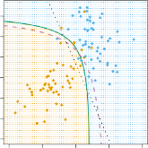

# _4.4.3 Quadratic Discriminant Analysis_ 

As we have discussed, LDA assumes that the observations within each class are drawn from a multivariate Gaussian distribution with a class-specific mean vector and a covariance matrix that is common to all $K$ classes. _Quadratic discriminant analysis_ (QDA) provides an alternative approach. quadratic Like LDA, the QDA classifier results from assuming that the observations from each class are drawn from a Gaussian distribution, and plugging esanalysis timates for the parameters into Bayes’ theorem in order to perform prediction. However, unlike LDA, QDA assumes that each class has its own covariance matrix. That is, it assumes that an observation from the $k$ th class is of the form _X ∼ N_ ( _µk,_ **Σ** $k$ ), where **Σ** $k$ is a covariance matrix for the $k$ th class. Under this assumption, the Bayes classifier assigns an observation $X$= _x_ to the class for which 

discriminant analysis 

is largest. So the QDA classifier involves plugging estimates for **Σ** $k$ , _µk_ , and _πk_ into (4.28), and then assigning an observation $X$= _x_ to the class for which this quantity is largest. Unlike in (4.24), the quantity _x_ appears as a _quadratic_ function in (4.28). This is where QDA gets its name. 

Why does it matter whether or not we assume that the $K$ classes share a common covariance matrix? In other words, why would one prefer LDA to 

4.4 Generative Models for Classification 157 

**FIGURE 4.9.** Left: _The Bayes (purple dashed), LDA (black dotted), and QDA (green solid) decision boundaries for a two-class problem with_ **Σ** 1 = **Σ** 2 _. The shading indicates the QDA decision rule. Since the Bayes decision boundary is linear, it is more accurately approximated by LDA than by QDA._ Right: _Details are as given in the left-hand panel, except that_ **Σ** 1 = **Σ** 2 _. Since the Bayes decision boundary is non-linear, it is more accurately approximated by QDA than by LDA._ 

QDA, or vice-versa? The answer lies in the bias-variance trade-off. When there are _p_ predictors, then estimating a covariance matrix requires estimating _p_ ( _p_ +1) _/_ 2 parameters. QDA estimates a separate covariance matrix for each class, for a total of _Kp_ ( _p_ +1) _/_ 2 parameters. With 50 predictors this is some multiple of 1,275, which is a lot of parameters. By instead assuming that the $K$ classes share a common covariance matrix, the LDA model becomes linear in _x_ , which means there are _Kp_ linear coefficients to estimate. Consequently, LDA is a much less flexible classifier than QDA, and so has substantially lower variance. This can potentially lead to improved prediction performance. But there is a trade-off: if LDA’s assumption that the $K$ classes share a common covariance matrix is badly off, then LDA can suffer from high bias. Roughly speaking, LDA tends to be a better bet than QDA if there are relatively few training observations and so reducing variance is crucial. In contrast, QDA is recommended if the training set is very large, so that the variance of the classifier is not a major concern, or if the assumption of a common covariance matrix for the $K$ classes is clearly untenable. 

Figure 4.9 illustrates the performances of LDA and QDA in two scenarios. In the left-hand panel, the two Gaussian classes have a common correlation of 0 _._ 7 between $X_1$ and $X_2$. As a result, the Bayes decision boundary is linear and is accurately approximated by the LDA decision boundary. The QDA decision boundary is inferior, because it suffers from higher variance without a corresponding decrease in bias. In contrast, the right-hand panel displays a situation in which the orange class has a correlation of 0 _._ 7 between the variables and the blue class has a correlation of _−_ 0 _._ 7. Now the Bayes decision boundary is quadratic, and so QDA more accurately approximates this boundary than does LDA. 

158 4. Classification 
