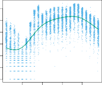

# _4.6.1 Linear Regression on the Bikeshare Data_ 

To begin, we consider predicting `bikers` using linear regression. The results are shown in Table 4.10. 

We see, for example, that a progression of weather from clear to cloudy results in, on average, 12 _._ 89 fewer bikers per hour; however, if the weather progresses further to rain or snow, then this further results in 53 _._ 60 fewer bikers per hour. Figure 4.13 displays the coefficients associated with `mnth` 

168 4. Classification 

**FIGURE 4.13.** _A least squares linear regression model was fit to predict_ `bikers` _in the_ `Bikeshare` _data set._ Left: _The coefficients associated with the month of the year. Bike usage is highest in the spring and fall, and lowest in the winter._ Right: _The coefficients associated with the hour of the day. Bike usage is highest during peak commute times, and lowest overnight._ 

and the coefficients associated with `hr` . We see that bike usage is highest in the spring and fall, and lowest during the winter months. Furthermore, bike usage is greatest around rush hour (9 AM and 6 PM), and lowest overnight. Thus, at first glance, fitting a linear regression model to the `Bikeshare` data set seems to provide reasonable and intuitive results. 

But upon more careful inspection, some issues become apparent. For example, 9.6% of the fitted values in the `Bikeshare` data set are negative: that is, the linear regression model predicts a _negative_ number of users during 9.6% of the hours in the data set. This calls into question our ability to perform meaningful predictions on the data, and it also raises concerns about the accuracy of the coefficient estimates, confidence intervals, and other outputs of the regression model. 

Furthermore, it is reasonable to suspect that when the expected value of `bikers` is small, the variance of `bikers` should be small as well. For instance, at 2 AM during a heavy December snow storm, we expect that extremely few people will use a bike, and moreover that there should be little variance associated with the number of users during those conditions. This is borne out in the data: between 1 AM and 4 AM, in December, January, and February, when it is raining, there are 5 _._ 05 users, on average, with a standard deviation of 3 _._ 73. By contrast, between 7 AM and 10 AM, in April, May, and June, when skies are clear, there are 243 _._ 59 users, on average, with a standard deviation of 131 _._ 7. The mean-variance relationship is displayed in the left-hand panel of Figure 4.14. This is a major violation of the assumptions of a linear model, which state that $Y=$[�] _[p] j_ =1 _[X][j][β][j]_[ +] _[ϵ]_[,] where _ϵ_ is a mean-zero error term with variance _σ_[2] that is _constant_ , and not a function of the covariates. Therefore, the heteroscedasticity of the data calls into question the suitability of a linear regression model. 

Finally, the response `bikers` is integer-valued. But under a linear model, $Y=$ _β_ 0 +[�] _[p] j_ =1 _[X][j][β][j]_[+] _[ ϵ]_[,][where] _[ϵ]_[is][a][continuous-valued][error][term.][This] means that in a linear model, the response $Y$is necessarily continuousvalued (quantitative). Thus, the integer nature of the response `bikers` suggests that a linear regression model is not entirely satisfactory for this data set. 

4.6 Generalized Linear Models 169 

**FIGURE 4.14.** Left: _On the_ `Bikeshare` _dataset, the number of bikers is displayed on the y-axis, and the hour of the day is displayed on the x-axis. Jitter was applied for ease of visualization. For the most part, as the mean number of bikers increases, so does the variance in the number of bikers. A smoothing spline fit is shown in green._ Right: _The log of the number of bikers is now displayed on the y-axis._ 

Some of the problems that arise when fitting a linear regression model to the `Bikeshare` data can be overcome by transforming the response; for instance, we can fit the model 

$$
\log(Y) = eta_0 + eta_1 X_1 + \dots + eta_p X_p + \epsilon
$$

Transforming the response avoids the possibility of negative predictions, and it overcomes much of the heteroscedasticity in the untransformed data, as is shown in the right-hand panel of Figure 4.14. However, it is not quite a satisfactory solution, since predictions and inference are made in terms of the log of the response, rather than the response. This leads to challenges in interpretation, e.g. _“a one-unit increase in Xj is associated with an increase in the mean of the log of Y by an amount βj”_ . Furthermore, a log transformation of the response cannot be applied in settings where the response can take on a value of 0. Thus, while fitting a linear model to a transformation of the response may be an adequate approach for some count-valued data sets, it often leaves something to be desired. We will see in the next section that a Poisson regression model provides a much more natural and elegant approach for this task. 
