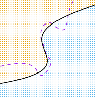

# _5.1.5 Cross-Validation on Problems Classification_ 

In this chapter so far, we have illustrated the use of cross-validation in the regression setting where the outcome _Y_ is quantitative, and so have used MSE to quantify test error. But cross-validation can also be a very useful approach in the classification setting when _Y_ is qualitative. In this setting, cross-validation works just as described earlier in this chapter, except that rather than using MSE to quantify test error, we instead use the number of misclassified observations. For instance, in the classification setting, the LOOCV error rate takes the form 

$$
\text{CV}_{(n)} = \frac{1}{n} \sum_{i=1}^n \text{Err}_i \quad (5.4)
$$

ˆ where Err _i_ = _I_ ( _yi_ = _yi_ ). The _k_ -fold CV error rate and validation set error rates are defined analogously. 

As an example, we fit various logistic regression models on the twodimensional classification data displayed in Figure 2.13. In the top-left panel of Figure 5.7, the black solid line shows the estimated decision boundary resulting from fitting a standard logistic regression model to this data set. Since this is simulated data, we can compute the _true_ test error rate, which takes a value of 0 _._ 201 and so is substantially larger than the Bayes 

5. Resampling Methods 

210 

**FIGURE 5.7.** _Logistic regression fits on the two-dimensional classification data displayed in Figure 2.13. The Bayes decision boundary is represented using a purple dashed line. Estimated decision boundaries from linear, quadratic, cubic and quartic (degrees 1–4) logistic regressions are displayed in black. The test error rates for the four logistic regression fits are respectively_ 0 _._ 201 _,_ 0 _._ 197 _,_ 0 _._ 160 _, and_ 0 _._ 162 _, while the Bayes error rate is_ 0 _._ 133 _._ 

error rate of 0 _._ 133. Clearly logistic regression does not have enough flexibility to model the Bayes decision boundary in this setting. We can easily extend logistic regression to obtain a non-linear decision boundary by using polynomial functions of the predictors, as we did in the regression setting in Section 3.3.2. For example, we can fit a _quadratic_ logistic regression model, given by 

$$
\log \left( \frac{p}{1-p} \right) = \beta_0 + \beta_1 X + \beta_2 X^2 \quad (5.5)
$$

The top-right panel of Figure 5.7 displays the resulting decision boundary, which is now curved. However, the test error rate has improved only slightly, to 0 _._ 197. A much larger improvement is apparent in the bottom-left panel 

5.1 Cross-Validation 211 

**FIGURE 5.8.** _Test error (brown), training error (blue), and_ 10 _-fold CV error (black) on the two-dimensional classification data displayed in Figure 5.7._ Left: _Logistic regression using polynomial functions of the predictors. The order of the polynomials used is displayed on the x-axis._ Right: _The KNN classifier with different values of K, the number of neighbors used in the KNN classifier._ 

of Figure 5.7, in which we have fit a logistic regression model involving cubic polynomials of the predictors. Now the test error rate has decreased to 0 _._ 160. Going to a quartic polynomial (bottom-right) slightly increases the test error. 

In practice, for real data, the Bayes decision boundary and the test error rates are unknown. So how might we decide between the four logistic regression models displayed in Figure 5.7? We can use cross-validation in order to make this decision. The left-hand panel of Figure 5.8 displays in black the 10-fold CV error rates that result from fitting ten logistic regression models to the data, using polynomial functions of the predictors up to tenth order. The true test errors are shown in brown, and the training errors are shown in blue. As we have seen previously, the training error tends to decrease as the flexibility of the fit increases. (The figure indicates that though the training error rate doesn’t quite decrease monotonically, it tends to decrease on the whole as the model complexity increases.) In contrast, the test error displays a characteristic U-shape. The 10-fold CV error rate provides a pretty good approximation to the test error rate. While it somewhat underestimates the error rate, it reaches a minimum when fourth-order polynomials are used, which is very close to the minimum of the test curve, which occurs when third-order polynomials are used. In fact, using fourth-order polynomials would likely lead to good test set performance, as the true test error rate is approximately the same for third, fourth, fifth, and sixth-order polynomials. 

The right-hand panel of Figure 5.8 displays the same three curves using the KNN approach for classification, as a function of the value of _K_ (which in this context indicates the number of neighbors used in the KNN classifier, rather than the number of CV folds used). Again the training error rate declines as the method becomes more flexible, and so we see that the training error rate cannot be used to select the optimal value for _K_ . Though the cross-validation error curve slightly underestimates the test error rate, it takes on a minimum very close to the best value for _K_ . 

212 5. Resampling Methods 
