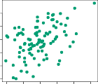

# 5.2 The Bootstrap
# 5.2 부트스트랩 (The Bootstrap): 데이터 연금술! 무에서 유를 창조하는 무한 복제술

The _bootstrap_ is a widely applicable and extremely powerful statistical tool that can be used to quantify the uncertainty associated with a given estimator or statistical learning method. As a simple example, the bootstrap can be used to estimate the standard errors of the coefficients from a linear regression fit. In the specific case of linear regression, this is not particularly useful, since we saw in Chapter 3 that standard statistical software such as `R` outputs such standard errors automatically. However, the power of the bootstrap lies in the fact that it can be easily applied to a wide range of statistical learning methods, including some for which a measure of variability is otherwise difficult to obtain and is not automatically output by statistical software. 
자! 통계학계의 연금술, 궁극의 치트키 **_부트스트랩(bootstrap)_** 을 소개합니다. 이 녀석은 여러분이 어떤 통계 모델을 짰을 때 그게 "얼마나 믿을만하게 널뛰는지(불확실성 uncertainty)" 를 기가 막히게 견적 뽑아주는 사기급 도구입니다. 쉽게 예를 들자면 옛날에 배웠던 선형 회귀 계수들의 오차(standard errors) 를 계산하는 일이죠. 근데 사실 선형 회귀 판에서는 이 치트키를 굳이 쓸 필요가 없어요. 왜? Chapter 3 에서 봤듯이 R 이나 파이썬 같은 코딩 툴들이 엔터 한 번 치면 이 오차 점수를 자동으로 뱉어주니까요(not particularly useful). 하.지.만! 부트스트랩의 진짜 공포스런 권력(power) 은 복잡한 고급 딥러닝이나 잡다한 커스텀 알고리즘을 굴릴 때 폭발합니다! 컴퓨터 소프트웨어가 알아서 에러율을 뱉어주지도 못하고 수학 공식을 짤 수도 없는(otherwise difficult to obtain) 극악의 난이도 미션에서조차, 이 부트스트랩은 범용성 만렙으로 아주 비열하고 손쉽게 에러 견적을 복제해서 뜯어내버리기 때문입니다!

In this section we illustrate the bootstrap on a toy example in which we wish to determine the best investment allocation under a simple model. In Section 5.3 we explore the use of the bootstrap to assess the variability associated with the regression coefficients in a linear model fit. 
이번 코너에선, 이 무시무시한 연금술이 어떻게 작동하는지 뇌를 식힐 겸 "주식 투자 자금 분배하기" 라는 미니 장난감 게임(toy example) 판에서 굴려보겠습니다. 이렇게 감을 잡고 나면, 뒤이어 나오는 Section 5.3 에서 진짜 로봇 학대 현장(선형 회귀선 오차 널뛰기 평가) 이 어떻게 치러지는지 구경 갈 겁니다.

Suppose that we wish to invest a fixed sum of money in two financial assets that yield returns of $X$ and $Y$, respectively, where $X$ and $Y$ are random quantities. We will invest a fraction $\alpha$ of our money in $X$, and will invest the remaining $1 - \alpha$ in $Y$. Since there is variability associated with the returns on these two assets, we wish to choose $\alpha$ to minimize the total risk, or variance, of our investment. In other words, we want to minimize $\text{Var}(\alpha X + (1 - \alpha) Y)$. One can show that the value that minimizes the risk is given by 
여러분의 통장에 당장 목돈이 있고, 이 전 재산을 주식 $X$ 랑 비트코인 $Y$ 란 두 바구니에 올인한다고 상상해 봅시다. 근데 $X$ 랑 $Y$ 의 수익률(returns) 은 워낙 롤러코스터라서 아무도 모르는 미친 랜덤(random quantities) 입니다. 우리는 이 현금을 안전하게 불리기 위해, 내 돈의 일정 비율($\alpha$ 의 파이) 은 주식 $X$ 에 붓고, 남은 잔돈($1-\alpha$) 은 코인 $Y$ 에 박아 넣으려 합니다. 목표는 오직 하나! 내 전 재산이 떡락할 분산의 위험성(총 리스크, variance)을 최소로 깎아주는 궁극의 비율 $\alpha$ 를 찾는 것! 통계 오타쿠 해커들이 밤새워 증명해 낸 떡락 방지 환상의 최솟값 투사 공식은 이렇습니다:

$$
\alpha = \frac{\sigma_Y^2 - \sigma_{XY}}{\sigma_X^2 + \sigma_Y^2 - 2 \sigma_{XY}} \quad (5.6)
$$

where $\sigma_X^2 = \text{Var}(X), \sigma_Y^2 = \text{Var}(Y)$, and $\sigma_{XY} = \text{Cov}(X, Y)$. In reality, the quantities $\sigma_X^2$, $\sigma_Y^2$, and $\sigma_{XY}$ are unknown. We can compute estimates for these quantities, $\hat{\sigma}_X^2$, $\hat{\sigma}_Y^2$, and $\hat{\sigma}_{XY}$, using a data set that contains past measurements for $X$ and $Y$. We can then estimate the value of $\alpha$ that minimizes the variance of our investment using 
여기서 $\sigma_X^2$, $\sigma_Y^2$ 는 각각 두 놈이 미쳐 날뛰는 정도(분산)고, $\sigma_{XY}$ 놈은 두 놈이 눈을 맞추고 동반자살하거나 함께 날아오르는 공명정도(공분산 Cov) 입니다. 자, 근데 뼈 때리는 진실구역(In reality)! 저 세 녀석의 진짜 신의 치수는 우리가 결코 알 길이 없어요(unknown). 그래서 우린 눈치를 까고, 과거 몇 년간 주식 차트에서 긁어모은 먼지 묻은 과거 기록(데이터 세트) 을 돌려서 저 파라미터들의 짝퉁 대역인 예상치 $\hat{\sigma}_X^2$, $\hat{\sigma}_Y^2$, 그리고 $\hat{\sigma}_{XY}$ 를 찍어냅니다(compute estimates). 그렇게 우리 손으로 날조해 낸 재료들을 저 공식에 때려 박아서, 우리의 피 같은 투자 분산 위험을 반갈죽할 $\alpha$ 의 유사 방어막 비율 $\hat{\alpha}$ 를 대신 뽑아내는 거죠. 

$$
\hat{\alpha} = \frac{\hat{\sigma}_Y^2 - \hat{\sigma}_{XY}}{\hat{\sigma}_X^2 + \hat{\sigma}_Y^2 - 2 \hat{\sigma}_{XY}} \quad (5.7)
$$

Figure 5.9 illustrates this approach for estimating $\alpha$ on a simulated data set. In each panel, we simulated $100$ pairs of returns for the investments $X$ and $Y$. We used these returns to estimate $\hat{\sigma}_X^2$, $\hat{\sigma}_Y^2$, and $\hat{\sigma}_{XY}$, which we then substituted into (5.7) in order to obtain estimates for $\alpha$. The value of $\hat{\alpha}$ resulting from each simulated data set ranges from $0.532$ to $0.657$. 
Figure 5.9가 이 처절한 짝퉁 예상치 $\hat{\alpha}$ 뽑기 작전을 가상 시뮬 우주에서 돌려본 현장 스케치입니다. 매 창문(패널) 안에서, 우린 $X$랑 $Y$의 투자 수익 환수 기록 100쌍씩을 신계에서 무작위로 찍어내 떨궜습니다. 그리고 그 떨어진 쓰레기 데이터들을 갈아서 허접한 가짜 예상 파라미터($\hat{\sigma}$) 부품 3종을 조립한 뒤, 5.7 공식 분쇄기에 갈아 넣어 최종 목적지 $\hat{\alpha}$ 치수를 뽑아냈죠. 그 짓거리를 돌릴 때마다 산출된 투자 지표 비율은 0.532 에서 최대 0.657 영역 사이를 고무줄처럼 이리 튀고 저리 튀고 놉니다.

It is natural to wish to quantify the accuracy of our estimate of $\alpha$. To estimate the standard deviation of $\hat{\alpha}$, we repeated the process of simulating 100 paired observations of $X$ and $Y$, and estimating $\alpha$ using (5.7), 1,000 times. We thereby obtained 1,000 estimates for $\alpha$, which we can call $\hat{\alpha}_1, \hat{\alpha}_2, \dots, \hat{\alpha}_{1000}$. The left-hand panel of Figure 5.10 displays a histogram of the resulting estimates. For these simulations the parameters were set to $\sigma_X^2 = 1, \sigma_Y^2 = 1.25$, and $\sigma_{XY} = 0.5$, and so we know that the true value of $\alpha$ is $0.6$. We indicated this value using a solid vertical line on the histogram. 
그렇다면 인간의 본능상(natural) 욕심이 생기죠! "야, 내가 이렇게 똥꼬쇼로 만든 이 예상 비율 $\hat{\alpha}$ 이놈이 진짜 정답이랑은 얼마나 맞짱 뜰 수준의 정확도(accuracy) 를 갖추고 있는 거야?" 이걸 정량적으로 포획하고 싶은 게 당연합니다. 우리가 찍어낸 $\hat{\alpha}$ 변수가 얼마나 형편없이 넓게 진동하는지(표준 편차 널뛰기) 견적을 확인하기 위해, 우리 깐깐한 해커들은 **우주 시뮬레이터를 1,000번 반복 뺑뺑이 조작** 해버렸습니다! 1번 돌릴 때마다 $X$ 랑 $Y$ 주식 100쌍 꺼내서 공식으로 비율 구하는 막노동을 천 번이나 조져서, 세상에 하나밖에 없는 우리의 투자 투사 지표 1천 쌍의 복제품들($\hat{\alpha}_1$ 부터 $\hat{\alpha}_{1000}$ 가닥까지) 을 탈탈 털어 축적(obtained) 한 거죠. 그 미친 1천 개 궤도의 히스토그램 탑을 쌓아 올린 영정사진이 Figure 5.10 의 첫방(왼쪽 창)입니다. 오타쿠처럼 미리 정답을 설계하고 게임을 팠기 때문에 이 판의 조작 변수는 $\sigma_X^2 = 1, \sigma_Y^2 = 1.25, 공명도 0.5$ 이며 따라서 이 세계의 진짜 조물주 급 정답 비율이 $\alpha=0.6$ 이란 사기급 정보망을 저흰 알고 있습니다(we know). 저 히스토그램 중간을 날카롭게 가르는 꼿꼿한 실선 기둥선이 바로 조물주 급 진짜 타점 구역(true value) 입니다!

**FIGURE 5.9.** _Each panel displays $100$ simulated returns for investments X and Y . From left to right and top to bottom, the resulting estimates for $\alpha$ are $0.576, 0.532, 0.657$, and $0.651$._ 
**FIGURE 5.9.** _각 창틀 속에는 시뮬레이터가 뱉어낸 투자 $X, Y$ 쌍방울 수익금 수입 지표들이 100건씩 난잡하게 도배됩니다. 상단 좌측부터 달팽이관처럼 시차를 두고 훑어볼 때, 그 각 조각조각 부품계상 예측치 $\alpha$ 도출 몫은 대강 0.576, 0.532, 0.657을 지나 최종방 0.651 수위에 마크합니다._

The mean over all $1,000$ estimates for $\alpha$ is 
천 개짜리 뽑기 $\alpha$ 예측물 궤도의 종합 타점을 평균 내버리면,

$$
\bar{\alpha} = \frac{1}{1000} \sum_{r=1}^{1000} \hat{\alpha}_r = 0.5996
$$

very close to $\alpha = 0.6$, and the standard deviation of the estimates is 
오 소름! 기막히게도 신계 정답 $\alpha=0.6$ 코밑까지 쫓아갔군요(very close to). 그럼 이 천 개의 똥볼 투척 궤도가 대체 얼마나 폭주하며 넓게 분산(standard deviation 오차율) 됐을까요?

$$
\sqrt{\frac{1}{1000 - 1} \sum_{r=1}^{1000} (\hat{\alpha}_r - \bar{\alpha})^2 } = 0.083
$$

This gives us a very good idea of the accuracy of $\hat{\alpha}$: $\text{SE}(\hat{\alpha}) \approx 0.083$. So roughly speaking, for a random sample from the population, we would expect $\hat{\alpha}$ to differ from $\alpha$ by approximately $0.08$, on average. 
빙고! 이 치수(0.083) 가 시사하는 포인트는 기가 막힙니다. 우리 $\hat{\alpha}$ 점수쟁이가 뿜어내는 오락가락 신뢰 한계망 오차(SE 편차율) 위력이 $0.083$ 주변 언저리를 돈다는 안심 조견표(good idea) 를 건진 겁니다. 쿨내 나게 요약하자면(roughly speaking), 거대한 인구 바다에서 낚시꾼마냥 우연히 데이터를 탁 집어 올리면 내가 조립한 예측값 $\hat{\alpha}$ 가 대략 신계 타점 $0.6$ 기준에서 위아래로 한 평균 0.08 갭 정도 어긋나는(differ from) 게 기본 국룰이겠거니 예상할 수 있다는 겁니다. 

In practice, however, the procedure for estimating $\text{SE}(\hat{\alpha})$ outlined above cannot be applied, because for real data we cannot generate new samples from the original population. However, the bootstrap approach allows us to use a computer to emulate the process of obtaining new sample sets, so that we can estimate the variability of $\hat{\alpha}$ without generating additional samples. Rather than repeatedly obtaining independent data sets from the population, we instead obtain distinct data sets by repeatedly sampling observations _from the original data set_ . 
하.지.만! 피도 눈물도 없는 진짜 실전 필드(In practice) 에서는, 방금 전 우릴 취하게 한 저 $\text{SE}$ 측정 천 번의 시뮬 뺑뺑이는 씨알도 안 먹히는 막장 짓거리(cannot be applied) 입니다. 왜냐고요? 현실에서 우리가 만지는 건 '유일한, 진짜배기 데이터' 한 모둠뿐이지, 내 1천 번의 튜닝 실험을 위해 전 인구의 거미줄 같은 무한 표본 풀을 창조자 공장처럼 펑펑 다시 생성(generate) 할 능력이 우주 어디에도 없기 때문이죠. 이 암울한 좌절 앞에서 동아줄처럼 하늘에서 영광스럽게 강림한 것이, 바로 **부트스트랩(bootstrap) 공법** 입니다! 이 미친 아이디어는 우리가 진짜 자연 인구수에서 반복적으로 낚시질할 수 없는 구린 현실을 인정하고, 그 대신 고성능 컴퓨터 복사기(emulate) 를 켜서 무한 샘플복원 모방 놀이를 시도합니다. 바깥세상 미지의 우주에서 헛고생하며 계속 뻔한 새 데이터를 외부에서 들여오는 짓을 포기하는 대신. 내 좁은 어항 호주머니 속, 즉 "최초 갓 확보했던 오리지널 원형 데이터 풀($original dataset$)" 안에서만 표적 추적 카메라를 고정합니다! 그리고 그 내무반 안에서만 요원 부대원들을 우골탑처럼 계~속 중복 뺑뺑이 재소집하며 뒤섞어(repeatedly sampling) 가짜 분신 데이터 클론 부대들을 천 번 만 번 찍어내는 극악의 편법 연금술을 탄생시킨 것입니다!

This approach is illustrated in Figure 5.11 on a simple data set, which we call $Z$, that contains only $n = 3$ observations. We randomly select $n$ observations from the data set in order to produce a bootstrap data set, $Z^{*1}$. The sampling is performed _with replacement_, which means that the same observation can occur more than once in the bootstrap data set. In this example, $Z^{*1}$ contains the third observation twice, the first observation once, and no instances of the second observation. Note that if an observation is contained in $Z^{*1}$, then both its $X$ and $Y$ values are included. We can use $Z^{*1}$ to produce a new bootstrap estimate for $\alpha$, which we call $\hat{\alpha}^{*1}$. This procedure is repeated $B$ times for some large value of $B$, in order to produce $B$ different bootstrap data sets, $Z^{*1}, Z^{*2}, \dots, Z^{*B}$, and $B$ corresponding $\alpha$ estimates, $\hat{\alpha}^{*1}, \hat{\alpha}^{*2}, \dots, \hat{\alpha}^{*B}$. We can compute the standard error of these bootstrap estimates using the formula 
어휴 말로 하니까 길죠? 그냥 Figure 5.11 에 걸린 장난감 미니 어항을 보세요! 여기 전체 주민 요원이 고작 $n = 3$ 세션밖에 안되는 초핵소심 풀, 가칭 데이터 '$Z$' 군단이 살고 있습니다. 우린 여기서 부트스트랩 인조 호문쿨루스 클론 부대 $Z^{*1}$ 을 빚어내기 위해 저 작은 풀통에서 주민 3명($n$개) 을 안대 끼고 제비뽑기로 뽑아냅니다. 여기서 제일 쇼킹한 사기 스킬! 이건 뽑은 놈 또 복귀시켜서 또 뽑을 무장 권리가 있는 **'복원 추출(with replacement)'** 시스템입니다! 즉 내가 1번 뽑았다고 죽이는 게 아니라 부활시켜 병 속에 또 집어넣기 때문에, 이 요원 놈이 클론 부대 명단 구성표에 재차 출몰해서 두 번 세 번 무한 중복 당선(occur) 타격을 때릴 기회가 항시 열려있는 거죠! 도식을 보세요, 마수걸이에 걸린 인조 명단 $Z^{*1}$ 엔 3번 아저씨가 눈치 없이 2연속 중복 선발돼서 지분을 꿰찼고 그 옆엔 운 좋게 1번 청년이 하나 끼여 있는 반면 2번 놈은 아예 명단 누락(no instances) 멸종 테크 타임을 탑니다. 주의할 점 한 숟갈: 어떤 피험자 개체가 한 번 명단에 걸려 탑승 구조대에 당선되면, 녀석의 전 재산인 $X$, $Y$ 투자금 딱지 세트도 토시 안 빼고 모조리 짬뽕 흡수(included) 되어 딸려 들어갑니다. 자 이케서 만든 우리들의 예쁜 허구 인조명단 $Z^{*1}$ 을 앞의 믹스기 공식 라인에 부어 넣고선 '부트스트랩의 첫째 예언치 $\hat{\alpha}^{*1}$' 수치를 토해내게 사역합니다. 그담요? 컴퓨터 과로사시킬 일만 남았습니다! 이 복붙 호문쿨루스 뺑뺑이 장난질을 $B$ (Billion이든 뭐든 엄청난 만 단위 수식 숫자) 번씩 끔찍하게 매크로 터보가동 루프시켜버리면(repeated), 모래알보다도 많은 개별 고유성 분신 클론 부대 군집 $Z^{*1}$ 부터 무려 최후의 조직 강령 $Z^{*B}$ 부대까지 조성을 일궈냅니다! 그리고 군단의 대응 짝(corresponding 알파 예측 파편 시리즈인 $\hat{\alpha}^{*1}$ 에서 스코어$\hat{\alpha}^{*B}$ 타임의 군집체까지 수확 탈곡 포흭합니다. 이렇게 털어낸 인조 오답 부대의 영수증 파편을 죄다 장바구니에 쓸어담아, 마침내 그들의 널뛸 오차율 한계선 표준 방망이 곡선을 척결해 뽑는 통쾌한 편차 지표 결착 수식(compute formula) 을 갈기면 미션종결입니다:

$$
\text{SE}_B(\hat{\alpha}) = \sqrt{\frac{1}{B - 1} \sum_{r=1}^B \left( \hat{\alpha}^{*r} - \frac{1}{B} \sum_{r'=1}^B \hat{\alpha}^{*r'} \right)^2} \quad (5.8)
$$

This serves as an estimate of the standard error of $\hat{\alpha}$ estimated from the original data set. 
이로써 이것이, 오로지 고이고 고인 구시대 기초 초기 원본 데이터 덩어리 하나에 알량하게 의탁해서 쏘아 올렸던 그 가엾은 타겟 $\hat{\alpha}$ 마크의 유격 롤링 폭등 방어율 척도, **표준 오차 예언치** 역할을 거뜬하게 대신 수행 교체해냅니다! (serves).

The bootstrap approach is illustrated in the center panel of Figure 5.10, which displays a histogram of $1,000$ bootstrap estimates of $\alpha$, each computed using a distinct bootstrap data set. This panel was constructed on the basis of a single data set, and hence could be created using real data. Note that the histogram looks very similar to the left-hand panel, which displays the idealized histogram of the estimates of $\alpha$ obtained by generating $1,000$ simulated data sets from the true population. In particular the bootstrap estimate $\text{SE}(\hat{\alpha})$ from (5.8) is $0.087$, very close to the estimate of $0.083$ obtained using $1,000$ simulated data sets. The right-hand panel displays the information in the center and left panels in a different way, via boxplots of the estimates for $\alpha$ obtained by generating $1,000$ simulated data sets from the true population and using the bootstrap approach. Again, the boxplots have similar spreads, indicating that the bootstrap approach can be used to effectively estimate the variability associated with $\hat{\alpha}$. 
사기급 치트연금술, 부트스트랩 파동의 결과물이 바로 Figure 5.10 중앙 패널 방에 전리품처럼 걸렸습니다! 이 가운데 병풍의 탑은, 앞서 컴퓨터 혹사 복원질로 긁어모았던 1,000개의 호문쿨루스 부대 $\alpha$ 클론 예측기 궤도 성적표가 발라진 성루입니다. 기억하시죠? 이 가운데 병풍이 이룩된 근원 발판은 그저 **단 1개짜리 오리지널 현실 데이터 초보 세트(single data set)** 뿐이었습니다! 즉, 신이 되어서 전 우주를 천 번 다시 창조하는 시뮬레이션 사기 행각을 벌이지 않고도, 진짜 필드 현실 데이터셋 단 1건 조건하에서도 충분히 이런 기적의 성과물을 복붙 창조 조작(created) 해낼 여력이 있다는 뜻입니다. 소오름 돋는 충격 포인트 발견! 중앙 병풍(인조 부트랩 클론 히스토 그림자) 모양새가 1번 좌측 방 병풍(신의 영역 우주에서 레알 1000방 허구로 퍼다 나른 최고 이상 상태 idealized 타점 산도율 그림) 이랑 무서울 정도로 복사 붙여넣기 한 쌍둥이처럼 싱크로율이 터집니다(looks very similar)! 특종 보도로 짚어드리자면, 방금 만든 사기급 클론 부대의 $\text{SE}(\hat{\alpha})$ 수치 예측계 스코어 타율이 0.087에 도달했는데, 이는 아까 레알 신 우주를 1,000개나 동원해서 힘들게 짜냈던 진짜 성스런 측정 결과인 0.083 오차율 근접 부근에 그야말로 귀신같이 소름 돋게 인접하여 빨아들이며 흡착(very close to) 되어버립니다! 자 우측 마지막 병풍은 굳이 설명할 것 없이 방금 두 미친 실험 결과의 폭 배율을 럭셔리한 대안 툴 박스 스캐치 기법(상자 그림 boxplots) 에 던져서 분포 배율 덩어리를 포착시킨 판도입니다. 굳이 두말하면(again) 입만 아프죠! 나란히 붙은 두 박스의 허리통 사이즈와 전개 가동 폭렬 길이(spreads) 는 그야말로 너무도 흡사하게 일체함을 나눠 갖는 걸 입증합니다. 이건 뭘 시사 폭격하느냐(indicating)? 우리가 조작해 낸 저 옹졸한 클론 복구 부트스트랩이라는 환상적인 속임수 단일 무기 하나만 들고서라도! 뼈 빠지게 $\hat{\alpha}$ 예측물의 진동 불안도(variability) 척도를 진짜 효과적으로 씹어먹으면서(effectively estimate) 견적서를 토출해낼 수 있다는 걸 뼛속 깊게 선언하는 것입니다.

**FIGURE 5.11.** _A graphical illustration of the bootstrap approach on a small sample containing n_ = 3 _observations. Each bootstrap data set contains n observations, sampled with replacement from the original data set. Each bootstrap data set is used to obtain an estimate of $\alpha$._ 
**FIGURE 5.11.** _고작 3마리($n=3$) 의 왜소한 관측 쪼무래기가 사는 미니 어항 위에서 거대 복제 호문쿨루스를 빚어내는 무적의 부트스트랩 궤적 시퀀스 삽화! 매 텀마다 파생되어 구축된 클론 데이터 군집 세트 수용량은 여지없이 처음과 똑같은 파이 $n$ 마리를 꽉꽉 채워 쑤셔 넣습니다. 이 멤버 조달책의 근원은 언제나 단일 원본 초기 오리지널 어항에 대고서 넣고-빼고(복원 추출 sampled with replacement) 라는 사기급 확률 주사위 돌리기 장난질을 통해 펌핑 조달됩니다. 그 파생 펌핑된 군집 타임 하나마다 죄다 공통 조립기 안으로 박혀 들어가 우리가 혈안이 된 $\alpha$ 오차 지표 스코어의 투영 산물을 토해냅니다!_
