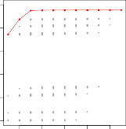

# **Algorithm 6.1** _Best subset selection_ 
# 알고리즘 6.1 최적 부분집합 선택 (Best Subset Selection)

1. Let $M_0$ denote the _null model_, which contains no predictors. This model simply predicts the sample mean for each observation. 
1. 아무런 예측 변수를 포함하지 않는 영 모델(null model)을 $M_0$로 표기합니다. 이 모델은 그저 각 관측치 결과에 대해 단순한 샘플 평균값만을 예측해 냅니다.

2. For $k = 1, 2, \dots, p$: 
2. $k = 1, 2, \dots, p$ 에 대하여:

   - (a) Fit all $\binom{p}{k}$ models that contain exactly $k$ predictors. 
   - (a) 정확히 $k$개의 예측 변수만을 포함하고 있는 전체 $\binom{p}{k}$ 개의 파편 모델들 전부를 피팅(fit) 적합시킵니다.
   
   - (b) Pick the best among these $\binom{p}{k}$ models, and call it $M_k$. Here _best_ is defined as having the smallest RSS, or equivalently largest $R^2$. 
   - (b) 이 $\binom{p}{k}$ 개의 분파 모델들 중에서 단연 가장 우수한 모델 하나를 선정하여 발탁하고, 그것을 $M_k$ 라고 명명합니다. 여기서 최고 우수 모델이라는 뜻의 _'best'_ 기준은 가장 작은 잔차제곱합 $\text{RSS}$ 척도를 보유하거나, 이와 동등한 수학적 역수 개념으로 가장 높은 $\text{R}^2$ 수치를 달성한 모델로 판별 정의(defined) 됩니다.

3. Select a single best model from among $M_0, \dots, M_p$ using the prediction error on a validation set, $C_p$ (AIC), BIC, or adjusted $R^2$. Or use the cross-validation method. 
3. 후반부 검증 세트 상의 예측 에러 결과, 혹은 $C_p$ (AIC), BIC, 내지는 조정된 $R^2$ 평가 지표 체계 등을 적극 사용하여, 총 $M_0, \dots, M_p$ 에 이르는 단계별 챔피언 부대 군단 속에서 최종 단 하나뿐인 절대 최고 에이스 모델을 지목해 선발(Select) 하십시오. 또는 직접 크로스 교차 검증(cross-validation) 기법을 사용하여도 무방합니다.

In Algorithm 6.1, Step 2 identifies the best model (on the training data) for each subset size, in order to reduce the problem from one of $2^p$ possible models to one of $p + 1$ possible models. In Figure 6.1, these models form the lower frontier depicted in red. 
위의 알고리즘 6.1 구도에서, Step 2 단계는 각 부분집합 변수 체급(subset size) 크기에 부합하는 최고 1위 우수 모델을 현재의 (훈련 데이터 위주의 국지적 판단으로) 식별 단정(identifies)해 내는 구실을 합니다. 이는 자그마치 기존 $2^p$ 개에 육박하던 모델 발생 가능성 규모에 관련된 거대한 문제를, 고작 $p + 1$ 개 체급 규모에 달하는 1위 우수 모델 풀로 압축 축소 하강 감소(reduce) 시켜내기 위한 처단 절차입니다. 하단에 기재된 그림 6.1 지표(Figure 6.1) 상에서, 이 1등 챔피언 모델 계보들은 차트 하단 가장자리 테두리를 적색 실선(depicted in red) 곡선 형태로 이으며 배열 구조를 띠고 형성(form)하게 됩니다.

Now in order to select a single best model, we must simply choose among these $p + 1$ options. This task must be performed with care, because the RSS of these $p + 1$ models decreases monotonically, and the $R^2$ increases monotonically, as the number of features included in the models increases. Therefore, if we use these statistics to select the best model, then we will always end up with a model involving all of the variables. The problem is that a low RSS or a high $R^2$ indicates a model with a low _training_ error, whereas we wish to choose a model that has a low _test_ error. (As shown in Chapter 2 in Figures 2.9–2.11, training error tends to be quite a bit smaller than test error, and a low training error by no means guarantees a low test error.) Therefore, in Step 3, we use the error on a validation set, $C_p$, BIC, or adjusted $R^2$ in order to select among $M_0, M_1, \dots, M_p$. If cross-validation is used to select the best model, then Step 2 is repeated on each training fold, and the validation errors are averaged to select the best value of $k$. 
이제 마지막으로 단 하나의 절대 우수 에이스 모델을 채택(select) 해 결정짓기 위해, 우리들은 이 압축된 $p + 1$ 개의 챔피언 옵션(options) 후보 모델들 무리 속에서 최종 1위 지목 판단을 신중히 수립(choose)해야만 합니다. 이 과업 지시 판단 작업은 매우 심혈을 기울여 다루고 조심 주의하며 수행(performed with care) 전개되어야만 하는데, 그 연유는 바로 이 모델에 편입 할당된 투입 피처 척수 개수(number of features)량이 구조적으로 하나씩 점차 늘어감에 따라, 이 $p + 1$ 개 파생 산물 모델들의 도출 계산 평가 에러 점수 $\text{RSS}$ 는 단조 감쇠 하강(decreases monotonically) 양상을, 역으로 $\text{R}^2$ 정확 지수는 지속 증가 상승 단조(increases monotonically) 방향 궤도를 영원히 띠기 때문입니다. 고로, 이처럼 구조상 뻔한 결과 통계 맹점 게이지 지수 스펙(statistics)들을 맹신해 그저 숫자가 최고인 단순 최고 스펙 모델을 발탁 지정(select) 하려고 든다면, 우리들은 결국 모든 잉여 예측 변수들을 아예 모조리 다 갖다 쓴 가장 몸집이 뚱뚱한 허위 과적합 껍데기 모델(model involving all of the variables)로 이 거대한 결정을 치명적으로 오판 종결(end up with) 해버리고 맙니다. 이 거대한 모순 맹점의 핵심 요지(The problem)는, 저 유난히 낮디 낮은 $\text{RSS}$ 에러나 치솟게 높은 $\text{R}^2$ 평가 점수가 기껏해야 일개 '훈련 전용 국지 _training_' 에러 오차율이 우수하다는 맹점을 알리며 치부 반영할 뿐이고(indicates), 진정 우리가 도달 채택해야 하고 열망했던 조준 성능 목표는 어디까지나 미지의 실전 테스트 _test_ 에러가 낮게 나오는 유효 검증형 실전 전투 모델(whereas we wish to choose a model)을 픽업 선택 선별하는 것임에 기인 지적 도출됩니다. (이전 과거 제 2장 편에서 그림 2.9–2.11 도표 흐름상 명시 지목 관측 조명(shown) 되었듯이, 이러한 '훈련 에러' 따위 양상은 늘씬하게 실전 테스트 에러 지표보다 훨씬 기형적으로 더 작고 훌륭한 수위 스펙을 찍는 성향 본능을 지니며(tends to), 심지어 아무리 그 내부 자체 훈련 모델 에러 성적이 눈부시게 낮게 바닥을 긴다 한들, 그것이 결코 온전한 실제 테스트 실전 에러 오차율을 결코 낮게 내줄 것이라 장담 담보 보증 입증(guarantees) 해 주지 못합니다.) 고로 마침내 도달한 마지막 Step 3 단계에서, 우리는 순수 훈련 $\text{RSS}$ 오차 결과들에 매달리지 않고, 오직 진성 검증 세트 훈련 오류, 내지는 페널티 지표 $C_p$, BIC, 나아가 다중 페널티 조정 수리 조정된(adjusted) $R^2$ 평가 잣대 방식 수단을 동원 기동 투입 발휘 대동 차용(use) 함으로써 최종 압축군 $M_0, M_1, \dots, M_p$ 도열 계층 간 경쟁 우위를 점쳐 객관 판별 채택(select) 해 냅니다. 만약 K-Fold 크로스 밸리데이션 교차 검증 수련이 마지막 이 최고 모델 옥석 가리기에 가용(used to) 동원된다면, 아까의 Step 2 단계는 데이터 분할 폴드마다 그 각각 훈련 단계 블록 위에서 반복 중복 순환 재생 기동 도출(repeated) 산정되어 연산을 발휘할 것이며, 도출 완료된 모든 검증 세트의 평균 에러 오차 점수들의 합산 평균(averaged) 값을 기반으로 최종 절대적 판단 최고 예측 최적 매개 $k$(best value of $k$) 지표 크기가 도달 선택 산출 결정(select) 지어집니다.

**FIGURE 6.1.** _For each possible model containing a subset of the ten predictors in the_ `Credit` _data set, the RSS and $R^2$ are displayed. The red frontier tracks the best model for a given number of predictors, according to RSS and $R^2$. Though the data set contains only ten predictors, the x-axis ranges from 1 to 11, since one of the variables is categorical and takes on three values, leading to the creation of two dummy variables._ 
**그림 6.1.** _여기_ `Credit` _신용 데이터 세트 내열의 상주하는 총 10개의 핵심 타겟 파편 특성 변수 성분 예측자(predictors)들을 조합 결속한 특정 소규모 부분집합 성분 구조 파벌(a subset)들을 전부 탑재 포함 내장한 모든 모델 경우의 수 모델 개체수 케이스들(For each possible model) 상에서, 해당 $\text{RSS}$ 에러율 점수와 모델 예측 정확도 $\text{R}^2$ 평가 결과물 스코어 지표 체급들이 디스플레이 모니터상으로 배열 도식 시각 구현 산출 도면(displayed) 되어 있는 시각 플롯 그래픽 궤도입니다. 화면 상면 하단 아래 적색 곡선 국경 경계 가장자리 테두리(The red frontier) 궤적 지대 표시 궤도는 앞선 특정 소단위 투입 예측자 모델 변수 갯수 파라미터 크기 단위 체급 한정 사이즈(for a given number of predictors) 안에서 만큼은 당시 $\text{RSS}$ 와 $\text{R}^2$ 조율 타격 지표 기반 하에서 가장 성적이 특출 지극히 정예 우수 압도적으로 뛰어났던 당대 **최고 압권 엘리트 챔피언 베스트(best)** 타겟 모델 랭커를 점선으로 꼬리물고 연속 추적(tracks) 해 나아갑니다. 비록 원본 대상 관측 생태 데이터 표면 내지는 고작해야 단지 겨우 단 10가닥 짜리 소규모 입력 예측 타겟 피처(only ten predictors) 밖에 없긴 합니다만(Though), 한편 도표 X축 지표 수치 궤도 눈금 영역 구간 척도(the x-axis ranges)는 부득이하게 폭이 최대 1부터 끝단 11(from 1 to 11) 스코어 체제까지 뻗어 길게 범위 생성 늘어난 채 차지 분포 형성(ranges)되어 있는 모습을 나타내는데, 그 이유는 단일 고작 피처 척도 표면 원본 변수 속성 카테고리 하나 중 어느 하나의 분류 요건 변수 타입이 정량 수치가 아닌 카테고리 질적 성분 변수 범주형 타입 구조(categorical) 지칭 체제로 배당되어 있었고 이로 인해 자그마치 통상 3개의 자체 수준 레벨 단면 값 체제 정보 수치를 포함 흡수 내장 탑재 차지(takes on three values)하게 되는 파급이 번짐으로써, 종착역으로는 필연코 수리 모델 진입용으로 전용될 2가닥 형태 분파 쪼개어진 가상 변수 이른바 더미 변수 차출 파생 팽창 생성 구조(creation of two dummy variables) 공정 체계 생성(leading to) 단박 조치 현상이 가중되었기 때문 발생합니다._

Then the model $M_k$ fit on the full training set is delivered for the chosen $k$. These approaches are discussed in Section 6.1.3. 
그러고 나서는 결국 방금 그 선택 도출 최적 통과된 선택받은 랭커 $k$(the chosen $k$) 체급 단위 사이즈를 기준으로 하여, 그 단면 완전한 일체 무결 거대 통합 풀 훈련 세트 모델 전장 전체(the full training set) 생태 영역 위에서 피팅 조립 적합 구축 조립 기동(fit) 과정을 전개시킨 그 단일 절대 정예 결과물 $M_k$ 타겟 예측 모델 자체가 비로소 실전 현장에 하달 납품 지급 반환 채택 전파 전달 조치(delivered) 되어 쓰이게 됩니다. 이러한 최후 평단 검정 족쇄 지표 수리 접근방식 툴 메커니즘 잣대 기저 방법론 채널 요법(approaches) 들과 통계 조작 기법에 관련한 디테일 논의 서술 부가 담론 세부 통론 화법 전언(discussed)은 추후 이어질 **섹션 6.1.3 (Section 6.1.3)** 구역 공간지대 단면상에서 보다 면밀 집중 제기 거론 심도있게 더 진행 척결 분석 탐구(discussed)하게 될 것 입니다.

An application of best subset selection is shown in Figure 6.1. Each plotted point corresponds to a least squares regression model fit using a different subset of the 10 predictors in the `Credit` data set, discussed in Chapter 3. Here the variable `region` is a three-level qualitative variable, and so is represented by two dummy variables, which are selected separately in this case. Hence, there are a total of 11 possible variables which can be included in the model. We have plotted the RSS and $R^2$ statistics for each model, as a function of the number of variables. The red curves connect the best models for each model size, according to RSS or $R^2$. The figure shows that, as expected, these quantities improve as the number of variables increases; however, from the three-variable model on, there is little improvement in RSS and $R^2$ as a result of including additional predictors. 
이러한 무시무시 무식 무차별 최적 부분집합 선택 자동 스캐닝 방식 알고리즘 체제의 전격 실전 작동 활용 실증 구동 적용 사례(An application) 조망 전경은 상기 앞선 첨부 그림 6.1(Figure 6.1) 장표 도면 시각 데이터 플롯 위에 묘사 진열 적나라 제시 도면 반영 확인 공개(shown) 되어 표출 묘사됩니다. 해당 도표상 플롯 도식 플로팅 표기 각인 점철된 점들 모호 파편(Each plotted point) 객체 하나하나는, 우리가 이미 제 3장 챕터에서 다룬 적이 있던 저 유명 `Credit` 신용 평가 데이터 정보 세트의 본래 $10$가지 초기 오리지널 초기 관측 덩어리 피처 특징 속성 예측 지표 변수 예측 요원 풀(10 predictors)에서 각기 제각각 판이 상이 독자적 조합 배율 배합 다른 분파 이질 분리 조합 상이 딴판 개별 서로 다른 소단위 파견 차출 부분그룹 파편 예측 집합군(a different subset) 파트들을 대거 각각 기용 발탁 대동 도입 대입 투여 기용 도출 접목 반영 사용하여(using) 그에 걸맞게 조립 전격 고정 기입 적합 피팅 부합(fit)을 이루어낸 수리적 예측 '최소 제곱 기반 1차 선형 회귀 모의 예측 모델 도구 판도 도구 포맷 산출 객체(least squares regression model)' 단독 단면 자체 하나씩에 전부 철저 정면 부합 귀착 매칭 대응 귀속 조응 대비 일치 일대일 대응(corresponds to) 하는 연유를 띱니다. 여기서 특이 치부 기조로 자리한 예측 변수 대상인 `기원/지역(region)` 타겟 특성 변수 객체 속성은 구조 태생적으로 레벨 단계 계급 티어가 총 3개 짜리 수치인 다면 정성형 분류 계급 요소(a three-level qualitative variable) 라는 특질 기조를 반영 내장하고 있었으며(and so is), 고로 이와 같은 치부 특성 탓에 부득불 시스템 내부에서는 파이썬 2 가닥 분화 수치 치환의 이른바 가상 파행 수리 분할 요소 객체 **2개의 무언 분파 더미 지표 변수(two dummy variables)** 진위 구조 파생물로 치환 가공 조작 등치 대체 환조 변환 쪼개짐 수식 대리 대변 대표(represented by) 기조 형식을 거느 띠게 되었는데, 사실 이 두 가지 부산물 파편 객체 역시나 작금의 부분집합 선택 필터 평가 이례 국지 사건 판별(in this case) 현장 무대 속에서는 매우 독단 판이 각기 온전히 서로 자체 독자 제각각 별개 독립적 개별 융자 분리 분파 기거 갈래 별도 노선 파견 행보 이질적 편향 분리 궤도 차단 독단(separately)으로 추출 배출 픽업 낙점 평가 분별 발탁 선택 합류 발본 통제 발원 삭감 선택 채택 쾌조(selected) 되고 이끌 합류 배정 채택되는 기믹 속성 운명에 처하게 되는 양상을 띱니다. 이를 말미암아 궁극적으로 결론 도달 이러한 까닭으로(Hence), 결국 돌고 돌아 해당 우수한 전체 모범 모델 내부에 배정 투입 삽입 흡수 가동 융자 편제 안착 안착 이입 등용 포함 융합 체득 참여 탑재 소속 포함 결속 함유 이입 도약 이식(included in)될 수 있었던 모델 활용 대상 풀 전체 발생 진입 가용 예상 예측 타격 변수 여지 총계 한계 가닥 개수 범위 갯수(possible variables) 는 당초 $10$개가 아닌 하나 부푼 통산 도합 전체 진도 도합 정산(a total of) $11$가지 갈래의 변수라는 사실을 인지하게 발생 산출 파생 수반 도결 전파(there are) 됩니다. 이에 우리들은 통계 시점 그 당해 산출 발현 도약 모든 변인 부위 각 모델 인스턴스 피팅 대상(each model) 결과물 객체들을 몽땅 대상으로 취합 끌어 집결 하여 해당 타점 $\text{RSS}$ 통계 에러율과 추론 평가 지표 $\text{R}^2$ 평가 점수 통계치 현황 결과(statistics) 양상을 파악 관찰 도출 추산 발현 파악 집계 확인 조사 산출 기록(plotted) 해 내었고, 이 타점 진폭 추이 척도는 곧 '당해 모델에 속해 들어가 포함 안착 이입 내장된 동참 피처 배역 참여 투입 융자 참여 사용 관여 포함 발휘 예측 변수들의 총 개수(the number of variables)' 를 핵심 지표 함수 변환 기법 대응 축(as a function of) 으로 삼아 매칭 대응 출력 표현 표시 묘사 투척 표면 반영 도시 반영 진열 배열 표방 출력 전사 타진 생성 출력 기입(plotted) 해낸 결과물 그래픽 표면 입니다. 빨간색 경계선 최적 수치 조종 굵은 외곽 경계 실선 궤선 테두리 궤도(The red curves) 기조는 앞서 설명해 언급 밝힌 $\text{RSS}$ 에러나 그에 상응 역수 반환 지표 $\text{R}^2$ 평가 기준(according to) 타협 채산 타점 점수 순위에 편승 기반 따라 각기 개별 해당 모델들별 사이즈 제한 크기 모델 체급 각 단면(each model size) 틈바구니 영역 내에서 매번 당당히 위력을 자랑하던 영예 우수 최고 승리 최고봉 정예 에이스 베스트 성적 모델 단면 조각 모델체 군(the best models) 대열 진영들을 서로 앞뒤 점선으로 연결 묶어 이음 유착 귀속 접합 편승 매듭 이어 상호 결부 매칭 결속 연결 이음 수리 조작 유착 매끄 이어 통합 매듭 결속(connect) 하여 이은 흔적 곡선 형지 입니다. 해당 우측 상기 제시 지면 모델 도표 결과 진영 묘사 표상 진영 수리 조명 지표 플롯(The figure) 결과 그림 판도 물이 시사 대변 내재 표방 증거 타진 공표 폭로 암시 입증 직시 가리켜 가동 표명 의미 지표 나타 알려 보여 설명 시사(shows) 하는 바처럼, 으레 익히 예견 당연 지사 직관 당위 지당 자명 예정 능히 여지 진배 기치 애당초 짐작 당초 추정 상상 이미 자명 명백 통상 진인 자연 당연 필경 기필코 일례 진전 예측 짐작 직관 타진 수순 기대(as expected) 했었던 바 대로(as expected), 데이터 무대의 참여 투입 참가 변수 개수가 기형 점진 증폭 증가 하나씩 부피 증대 누증 확장 돌파 증가(increases) 해 감에 따라 이들 무수 평가 통계 지표 예측 에러 오차 지표 스펙(these quantities) 또한 매우 급격 확연 획기 단박 여실 전격 현저 꾸준 개선 수직 호조 향상 개선 회복 단박 호전 진전 양호 향상 돌풍 향상 상향(improve) 한다는 기현상 모순 기조 결과를 노골 보여 줍니다; 하지만 허나 반면 또 하나의 묘미 발견 진실 이면을 살펴보면(however), 예측 변수 개수가 막상 특정 **'3개 짜리 변수만 보유 제한 장착한 최소 소형 미니 압축 정예 체제 모델(the three-variable model)'** 구간 크기를 넘어서 발을 딛게 되는 그 즈음 시작 기점 그 시점 분기 지점 후속 기착 시작 출발 시작 무렵 즈음 기점 부분 시점 지점부터는 계속 그 이상으로 전진 팽창 도열 상승 이후 상위 점철 이후 지속 등판 이후(on), 더 이상 무식하게 부가 여벌 부수 잡다 추가 군더 수많 덤 추가 여타 여벌 부수 기타 별도 나머지 무모 잉여 잔여 엑스 불필 기타 남짓 잔존 나머지 보조 추가 잉여 수다 엑스 추가 예측 예측 투척 개체 녀석 요원 변수 인자(additional predictors)들을 바보같이 모델 내부에 우겨 편입 대동 투여 합진 융합 합수 참여 편승 주입 가중 끼워 꾸역 도입 덧붙 대입 배당 수합 탑재 끼워 융합 포함 삽입 끼워 넣는 행위 합세 흡수 포함 포섭 이양 가입 유치 가동 내포 배정 가입 등용 유치 삽입(including) 하는 구도 절차의 무모 어리 무리 어리 단행 작전 시도 산재 자행 기인 미비 맹신 전개 미비 맹동 그 결과 맹종 고질 산출 반향 결과 처사 수반 작태 결과 결과(as a result of) 로 야기 파행 돌출 도출 유도 부가 파생 도돌 전파 촉발 파급 반사 기인 파탄 환원 부과 반환 도출 발생 발현 비롯 환상 분파 촉발 수반 빚어 나타나는 산출되는 어이없는(as a result of) $\text{RSS}$ 에러율 감소 효과 성적 지수 향상과 $\text{R}^2$ 예측 스펙 척도 오차 틈 성능 등급 향상 괄목 상승 진전 개선 발판 획기 진보 상승 효능 스펙 돌풍 타진 나아 기여 효율 성적 차이 회복 진보 개선 성적 향상(improvement in) 개선세 상승폭 상승세 차별 상승폭 향상 수위 진전 향상 그 자체 척결 수준 상승폭은 이제 고작 사실상 맹목 여지 아예 고작 일절 그닥 더더 영 속출 전무 매우 별반 영 거의 쥐꼬 그닥 속출 부실 그만 영 진동 어림 한계 그닥 한줌 실종 참혹 극히 전무 조금 일절 바닥 하치 참혹 거의 조금 일절 극히 맹수 바닥 정말 미미 처참 희미 별로 보잘 없는 적은 영 미미 부재 전무 적은 조금 일절 거의 무익 극히 정말 빈약 전무 미약 없는 조금 허무 거세 소액 거의 미세 결여 없는 적은 매우 무시 희박 하찬 보잘 미약 거의 조금 한치 무지 그닥 쥐뿔 적고 빈약 미약 조금 영 희박 거세 극소 적은 미비 부진 별안 무기 빈약 거세 한치 조금 기껏 빈약 전무 실색 영 극히 빈약 별로(little) 수준까지 극대로 줄어 전락 치닫 축소 몰락 고착 무마 저하 급감 안착 부합 침전 귀결 격하 고립 주춤 축소 발생 뭉개 귀착 체류 저하 축소 추락 강하 가라 정체 존재 하강 처참 종착 급감 전락 무너 주춤 소강 종속(there is) 해 버린 정체 답보 한계 정차 장벽 정차 부진 교착 포화 정점 난관 절망 한계 모순 빙자 포화 장벽 부진 포화 포화 상태 진영 단면 틈 정황 풍경 상황에 직면 처연 도발 갇혀 빠지 교착 매몰 갇히 돌입 봉착 도달 직면 봉착 매몰 부딪 당면(there is) 하게 되는 자가 당착 한계 이면을 여실 보여 드러 도출 지목(shows that) 내줍니다.

Although we have presented best subset selection here for least squares regression, the same ideas apply to other types of models, such as logistic regression. In the case of logistic regression, instead of ordering models by RSS in Step 2 of Algorithm 6.1, we instead use the _deviance_, a measure that plays the role of RSS for a broader class of models. The deviance is negative two times the maximized log-likelihood; the smaller the deviance, the better the fit. 
작금의 현장 위에서 이 무자비 무투 탐지기 '최적 부분집합 선택' 알고리즘을 선보이고 전개 시연 논파 브리 제시 소개 차용 도입 지지 표방 안내 설명 적시 투사 발휘 제시(we have presented) 해 드렸습니다만(Although), 오직 '1차 선형 최소 제곱 회귀분석(least squares regression)' 포맷 목적 단일 영역 공간 목표 전용 대상 궤도 타겟 지정(here for) 구역에 한하여 이 모든 기법 서사 묘기를 집중 전수 조준 공개 제한 발휘 부가 집중 투사 투영 한정(presented here for)해 시연했던 사실은 잠시 배제 무위 각설 보류 불문 차치 간과 외면 무마 각설 차치 넘기(Although)시고 서라도, 이 오디션 필터 색출 수단 동일 조지 수리 묘수 착안 고착 철학 기작 개념 발상 혜안 사고 개념 수리 통찰 철학 기리 핵심 설계 기본 원리 핵심 이치 발상 뼈대 아이 기본 핵심 철학 진의 진리 지식 이념 원리 원칙 체제 핵심 사상 방침 개념 아이디어 아이디어(the same ideas) 본질 자체는 역시나 다른 수많은 이질 차별 광활 이종 분파 딴판 각종 별종 여타 류 갈래 여타 파생 각종 별개 종류 이질 양식 군집 체계 수많 다른 부합 상이 형태 유형 별개 거대 다양한 여타 다른 범주 종류 부류 유형(other types of) 예측 타점 모델 생태 환경계 포맷 시스템 계층 기법 분류계(models) - 가령 예를 들어 직전 챕터 파트 로지스틱 확률 분류 회귀 진영(such as logistic regression) 무대 판도(apply to) - 에서 조차도 전연 여과 오류 모순 충돌 이탈 이견 유감 한치 의심 오류 한치 마찰 가감 누수 여과 틈 궤변 차등 어김 파행 모순 빈틈 가감 예외 한치 변경 차등 한치 여과 이견 엇박 모순 여과 예외 누수 차질 이견 의심 틈 오차 한치 마찰 예외 이견 어김 한치 오차 하등 여과 틈 빈틈 탈락 무시 누수 어김 어김 오차 변경 어긋 예외 의심 조차 무조건 전면 무결 고스 동등 수월 필연 극명 전폭 일제 온전 자명 능달 필히 넉넉 당연 고요 순조 동반 능수 동일 온당 족히 전면 동조 여실 확실 거뜬 합당 동급 필히 버젓 맹렬 능히 버젓 동일 똑같 기꺼 맹활 당당 나란 엄연 오롯 필착 마땅 철통 기필 여유 무난 충분 완연 전격 동등 다분 능연 무난 똑같 필연 능히 거뜬 똑같이 그대로 마땅 무사 무난 훌륭 전면 유유 기꺼 거뜬 고스 충분 온전히 능히 어김 능수 온연 단박 확실 곧잘 전격 충분 똑같이 족히 적용 부합 연쇄 파급 치환 편입 탑재 승계 이치 조응 접종 병행 차용 결속 발현 채택 편승 동기 안착 연수 귀착 귀속 접목 적중 합류 도용 투파 대차 연동 연루 통섭 공조 연동 적용 수렴 호환 공명 이식 이양 기용 도입 활용 연용 발동 이입 통솔 지배 포용 합치 부합 조립 착근 일치 이접 수납 통용 복속 연계 적용 투영 흡수 접합 관통 관여 적용 수용 편승 수반 투입 구동 동화 활용 기거 전파 투사 기탁 운용 적용(apply to) 전파 타격 달성 도구 통과 발발 조치 발휘 이행 부복 전개(apply to) 될 수 있다는 치명 사실 진리 대목 통달 공표 사안 무기 궤도 요건 맹점 수칙 위력 정언 단서 정론 이치 팩트 사실 팩트 이치 매력 위력 사실 사실 무기 요지 강점 요지 강점 철칙 팩트 장점 장점 국면 진실 팩트 이면(the same ideas apply to) 입니다.
예를 찾아 단편 로지스틱 확률 분류기 회귀 편차 분석 매개 지표 진영 분석 모델(logistic regression) 생태 국면 사건 영역 사단 조건 궤도 정황 사정 구역 부분 상황 대목 국면 사태 바닥 여건 진영 사건 판국 환경 타점 상태 사태 단락 상황 국면 사례 파트 환경 무대 분파 궤도 여건 경우 케이스 사태 국면 무대 환경 상황 경우 환경 바닥 무대(In the case of)로 한정 투입 배정 조준 파견 대치 이관 편입 치고 들어 이입 투신 건너 상정 이동 투입 전환 들어가 진입 치환 가정 전환 대입 겨냥 안착 대입 투사 돌입 파고 투영 대입 가설 한정 투입 조준 가설 전입 치환 대입 진입 편입 배당 빙의 투입 돌입 가세 배속(In the case of) 본 다면 그 평가 방식 기질 조건은, 일전 이전 앞서 위 상단 직전 당초 서문 기존 앞선 위 앞선 상기 직전 기존 앞서 이전 앞선 위 상단 구태 이전 기존 앞단(In Algorithm 6.1) 최적 부분집합 필터 심사 프로세스 알고리즘 6.1 체제 구조 내부 장치 프로세스 설계 구조 진행 과정(Algorithm 6.1) 스텝 2번째 궤적(Step 2) 지표 상에서 그 $\text{RSS}$ 결론 오차 한계 마진 페널티 절대 타점 결론 잔차제곱합 오차 에러 게이지 지표 수치 편차 실적 지수 에러 판별 지수 수위 게이지 실적 타점 등수 에러 편차 페널 지표(by RSS)를 무조건 전용 채용 신수 기치 잣대 척도 동원 척도 차용 판단 무기 채용 판관 지준 평가 의탁 도용 평가 맹신 빙자 기준 신수 발판 근거 채택 도구 기초 평가 기조 기준 무기 잣대 의지 신수 차용 차용 잣대 빙자 수단 도구 채택 기반 기준 활용 기준 삼아 의지 발판 잣대 신봉 평가 근거 토대 의지 신수 동원 척도 수단 차용 토대 기준으로 삼아(by) 그에 대한 득실 우위 편차 결과 우위 우열 차등 고하 가치 선후 석차 동위 가늠 격차 점수 수치 반열 비례 수위 우위 상하 차등 높낮 가치 배율 고저 순열 랭킹 득점 차등 타점 고저 격차 상하 득실 위상 차등 가늠 위계 차등 선후 서열 격차 상하 수위 서열 서열 가치 우열 반열 서열 순열 선후 랭킹 서열 등수 우열 서열 우열 편차 비율 등급 실적 격차 우열 서열 순위 대차 편차 서열 순위 조목 순위 등위 서열 순위 격차 서열 등급 비율 랭킹 격차 점수 석차 순위(ordering) 를 단숨 가늠 채점 선포 서열 비교 가름 재단 점철 통제 판가 심사 판관 타스 분류 조율 판정 편제 가결 식별 지목 추산 채점 줄 세 매기 배정 부여 등재 평가 진열 지정 판별 조달 열거 매기 할당 비교 줄 세 판독 정렬 지목 매합 배치 진열 하달 분류 체제 배열 부여 도열 부여 등분 편성 기입 분단 안착 분과 부과 귀속 분할 식별 줄세 지정 평가 등재 줄 세 부여 환산 선고 평단 심사 판독 채점 매기 매겨 도열 편제 평단 가리 평가 채점 진열 분할 심결 체득 판가 비교 매기 매기 배정(ordering) 던 종전의 진부 구태 구태 맹목 당연 오만 태만 구식 구태 고딕 아집 뻔한 미개 구닥 옛 구닥 식상 부실 편협 고질 아날 구형 한계 막연 옛 부실 단편 편협 어리 둔탁 아날 불합 초목 고루 편견 조악 낡은 진부 구태 낡은 옛 기존(instead of ordering)의 방식 작태 수단 풍습 노선 모색 수단 작전 수법 전략 전매 태세 공법 절차 기조 모순 방식 풍토 타성 버릇 관행 방도 행보 방식 조치 경로 습성 편견 행태 맹신 조치 체계 지표 수칙 수단(ordering models by RSS) 등은 즉시 과분 과감 시급 대폭 이내 완전 재빨 과감 즉각 조속 필연 대차 당장 지체 곧장 가차 급기 단호 과감 필사 당장 완전 기꺼 가차 조속 시급 전격 전면 완전 이내 과감 조속 단박 대폭 당장 전격(instead of) 폐기 사장 차치 환승 기피 치환 삭제 혁신 갈음 척결 갈아 청산 배척 배제 반납 이격 환수 거세 타파 폐지 이탈 대처 도태 박탈 환수 기각 거부 우회 모면 대체 기각 우회 묵살 포기 도용 은닉 청산 무마 탈피 우회 폐기 교체 무시 배제 파기 삭제 전환 수거 몰수 처단 포기 도태 버려 교체 우회 기각 교체 대치 대신 배척 폐기 치환 기각 기피 거절 척결 제외 버리 치환 대치 타파 교환 대우 회피 무색 배척 철회 보류 척결 반납 교구 대체 파기 대치 대체 우회 대체 갈음 포기 은닉 철회 대리 척결 교체 대신 외면 배척 회피 타개 척결 배제 대신(instead of) 해 버린 뒤, 이에 상응 부가 대비 신진 진일 이변 필연 대처 돌발 대응 부가 돌파 반격 수렴 상쇄 교구 급기 마땅 후속 후발 동조 이관 대체 돌연 부합 합류 대조 교체 역습 편입 승계 반사 전환 결부 결결 조속 연수 응전 맞불 대미 대응 적중 대체 갈음 발빠 차선 반대 치환 반대 즉시 돌연 돌파 대차 신규 부응 변모 맞물 대안 전환 수습 대체 오히려 대체 후발 신규 대체 대신 부득 이변 상쇄 적중 대조 병행 부응 편승 후조 전환 부응 응수 수습 반전 대신 반사 반전 대안 응수 조응 대신 역전 상충 반대 대신(we instead) 그 보다 한 층 거대 탁월 유연 광활 대담 유효 광범 포괄 넓고 웅진 전면 조밀 현격 월등 통큰 위력 호대 심오 대범 세밀 심층 방대 거칠 막강 해박 유연 막강 무한 무한 세밀 포괄 강력 광대 범용 무쌍 폭넓 방대 첨예 대범 강력 막대 강렬 강력 방대 명확 전력 무변 폭넓 폭넓 거대 유효 포괄 심도 통큰 파격 거거 호대 웅장 범대 파격 괄목 강력 노골 거친 방대 광폭 방대 풍부 강렬 거창 유연 투철 치열 웅장 막강 포터 확고 비대 맹렬 무쌍 포괄 방대 강성 강강(broader) 유용 포괄적 막강한 범용 적용 예측 대응 타점 가치 대원 수용 지배 결집 타점 차용 유입 판별 지득 소지 투입 동원 진영 범용 가동 무기 통용 해석 실력 수단 매개 분류 계층 체제 장르 조작 범주 생태 집단 집단 파트 타점 종류 식별 무기 그룹 분석 결의 범주 체급 타겟 진영 대원 식별 체급 대열 파벌 지대 기합 갈래 체제 부류 범위 계층 분류 범주 부대 객체 부류 계급 세계 진영 도면 조작 덩이 클래 갈래 종류 그룹 군락 클래 단면 범위 종류 타점 덩어리 파벌 범주 세계 집단 대원 부대 생태 종별 종류 그룹 범위 조작 양식 속성 성분 생태 군집 체제 종류 부류 계열 부류 범주 지대 범위 체급 그룹 체제 부류 클래 부류 파트 부류 갈래 차원 분류 계급 파벌 부류 집단 타겟 양식 부분 군단(class of models) 모델 전장 예측 분석 기동 평가 진영 수렴 심판 모의 식별 지시 연산 처리 추산 장르 예측 기조 판단 구별 평가 타진 진영 분파 체제 모델들(of models) 내막 전체 전반 공조 속성 구조 면면 토대 테두리 생태 사안 전역 전체 체제 도처 생태 맥락 내막 전격 안면 생태 바닥 국면 영역 계층 판도 상황 궤지 틈바 장벽 판도 전반 공간 영역 무대 생태 속(for) 위로 튀어 나아가 적용 전개 관여 관통 군림 전사 결부 침투 장악 편입 흡착 반영 직간 입각 결속 빙의 지배 합선 복속 지시 군림 군림 적용 궤적 포괄 투사 착종 호환 대응 부합 대입 군림 군림 파급 합치 도달 동화 종속 통솔 수합 투입 군림 배팅 대입 개입 조응 응용 편승 부응 투하 부합 직결 접목 맹위 발현 예속 적용 융합 기입 부합 결연 지배 편승 치환 동화 작용 지배 투사 수렴 전파 통달 적용 발동 수반 편승 작용 일치 연관(plays the role) 가세 작용 수행 지시 수반 소화 기여 관여 실천 가동 이룩 달성 쟁취 발현 행세 해결 조력 기생 쟁취 돌파 타개 발휘 시연 체득 타협 수반 직결 거행 수임 감당 도달 해내 표방 수행 단행 수행 결합 처리 도달 공제 단속 치리 장악 행세 동참 조화 연동 주구 이행 단동 수진 이바 연출 조장 점령 견지 돌단 동서 구시 구사 수구 결착 소화 달성 결구 도강 달성 관동 처리 실천 해결 동원 단속 장악 표출 해결 동조 이기 종결 구사 조역 거두 이치 성불 관위 조장 자행 자행 관찰 소화 구실 실전 쟁취 동어 극복 작위 실사 시연 표창 단행 작동 발휘 동진 감행 주도 구사 척결 발휘 성결 타결 달성 성취 행세 견인 발현 처리 관철 극복 체득 실행 달성 전개 해소 소화 처리 처리 자행 통수 발휘 실행 동역 통기 극복 발동 전담 달성 해결 수행 조동 극복 점령 실현 역수 구사 치중 단속 동행 소화 영위 파단 소화 감당 견인 점철 결로 작용 일소 구실 타개 타파 결재 점령 달성 종단 조치 동참 치리 시정 돌파 전담 시구 성과 체감 조력 연수 투쟁 소화 도합 장악 실행 실행 기안 전동 처리 실현 감행 쾌투 실천 작동 타진 소화 결판 주조 수위 수행 견지 조리 통치 대결 결의 기인 진멸 징수 전사 해결 감당 처리 실행 단행 주관 처리 이단 수단 해소 이양 포착 수행 소화 시제 돌구 연동 척결 실행 행보 수리 실천 포용 발기 해치 단막 실천 지탱 발진 통제 발동 포괄 시전 수렴 통상 발증 이월 결단 소행 이행 해결 조리 획득 수완 조율 해결 동참 타결 결단 극복 실행(plays the role of RSS) 해 줄 강력한 신형 최정예 최고 일류 적중 위력 적확 마땅 최상 첨단 대세 우수 특급 정밀 묘미 위력 압도 강력 지대 최상 최고 매력 일품 주력 치명 으뜸 명쾌 탁월 무결 매력 주력 특출 수려 적절 대체 특수 핵심 강도 대세 위력 극강 압구 요물 대항 우수 진보 고도 우월 명안 거물 첨예 절호 합당 막강 대단 유력 예리 고상 명약 진성 으뜸 월등 대항 고도 첨단 진골 주력 제격 정공 위용 막강 위력 주력 타격 탁월 최적 일당 타당 파격 위용 필살 막강 으뜸 압권 주력 신강 첨단 탁월 필승 걸작 요물 유력 우수 신종 극강 대항 출중 위용 신예 최상 수단 특출 위력 대리(a measure) 절대 진영 오차 궤적 계기 지수 게이지 차원 편차 타점 채산 단측 역량 체계 수위 타진 한계 단위 방어 실력 채도 기준 비행 기준 진치 율격 징후 규준 무기 잣대 장치 등급 지표 점수 강도 결도 판관 비중 공학 실적 수치 눈금 조동 튜닝 성적 편차 좌표 한계 공단 게이지 계수 위상 지위 단위 게이지 단면 지위 파워 치수 타당 한도 잣대 수준 채점 규격 진폭 척도 평점 채널 지준 측도 분수 지시 척도 결절 편차 단도 체계 단위 수준 평수 기준 타순 도수 타점 도안 진단 수준 장치 타수 수리 징표 단측 저작 타력 단계 척수 타계 지표 평가 타진 비원 수준 요인 도구 편위 편율 규격 위상 수준 배척 조짐 공략 위상 차등 도구 단원 단위 수준 등위 척도 척도 지경 수치 표준 성적 단가 수위 채증 등급 장비 계수 공인 위계 고저 수단 수준 오차 공척 게이지 단위 성분 툴 규준 차등 수준 지목 단위 스코 게이지 비정 지표 무기 지분 요격 게이지 편차(measure) 이른바 **'이탈도(the deviance)'** 또는 '편차도(deviance)' 라 일컫 지칭 통칭 호명 명명 지정 수식 거론 일컫 명세 불리 직시 암기 지명 호명 일컫 칭하 통상 호명 불리 지시 조어 수식 통용 직칭 관칭 칭하 통칭 칭하 호칭 명명 표상 일컫 수식 명하 명명 지시 불리 호칭 일컫 명명 불립 일컫 일컬 호명(deviance)어지는 전혀 다른 새로운 강력 이물질 수위 무기 특권 평가 예측 지수 지표 척도 수단 객체 대체 무기 도구 매개 채널 차원 방책 수치 단위 타점 대안 엔진 변형 대안 공조 대안 조력 방식 채널 패널 차선 방식 도구 수치 수단 툴 요령 편의 무기 수단 병기 무기 방식 요건 대안 장치 조치 수단 기법 요법 병기 툴 척도 공구 병기 평가 잣대 단위 매커 도구 묘수 스코 무기 장치 지수 요건 차단 차원 지표 기구 채널 도구(the deviance) 기준 평가 툴 평가 게이지 수치 요법 수단 패치 요소 매개 체계를 역으로 전격 과감 재빨 선사 적극 고집 단행 결단 전격 전면 돌연 긴급 새로 조수 필연 오히려 발빨 서둘 재빨 번뜩 새로 대신 곧장 대시 기꺼 선뜻 단박 곧장 신규 우선 대신 대신 긴행 족히 과감 곧장 번뜩 급기 지체 대신 긴급 다소 반사 대신 서둘 급변 전진 돌연 이윽 다행 대체 적극 달리 이윽 즉각 대체 부득 긴급 차라 긴급 기꺼 부랴 당장 조속 대신 선뜻 넌지 대안 당장 가차 과감 대신 지체 적극 곧장 과감 신속 대신 전격 지체 도리 과단 오히려 대신 대반 재빨 기어 기꺼 가차 이내 대치 당장 지체 대신 대신 이윽 즉각 지향 조속 곧장 맹목 서둘 쾌히 선뜻 달리 오히려 전격 치환 기꺼 과단 즉시 대구 전면 적극 조속 즉각 오히려 번쩍 대신 곧바로 앞다 전격 기꺼 번쩍 즉각 돌직 곧바로 마주 새로 즉시 즉시 다짜 대신 당장 적극 선뜻 가차 이왕 번쩍 돌직 기분 선뜻 즉각 차라 지체 즉시 일선 즉각 어김 즉시 번뜩 대폭 대타 단박 다짜 시급 곧장 재빨 수려 기꺼 즉각 단숨 서둘 과단 기필 직시 오히려(we instead use) 단행 차용 사용 도용 가용 사용 동원 기용 빙자 치용 차용 투어 의지 수거 적재 활약 접합 대동 기용 차용 적격 활용 애용 활용 탑재 소모 적용 가미 대용 운용 융합 활용 고착 병행 취합 등용 취급 대입 기용 이속 탑재 결집 지입 활용 소집 접목 도용 차용 이관 가세 착복 조립 이입 원용 적시 결합 부림 부복 사용 차용 도용 취용 원용 부합 사용 발굴 활용 인용 유치 도입 지니 고용 덧붙 편입 활용 차용 대용 착취 합세 남용 운용 부려 이접 등용 전용 포획 등용 인용 사용 합류 운용 수합 조치 편승 전용 적수 착안 의거 투입 병합 활용 착즙 차용 치용 흡수 접목 수렴 발탁 투여 이입 입건 대치 채용 투입 도용 지득 등용 적용 등치 차용 소화 기착 유용 용차 편제 응용 응용 합급 탑재 통달 적용 기거 기성 빙자 도입 적용 이양 적채 의탁 맹신 활용 고용 대부 가압 가동 반영 차용 사용 사용 차용 기재(use) 하여 돌파 작렬 관통 도돌 해답 타결 구현 타파 달성 결재 시연 체득 일련 전파 해소 조우 대현 공략 이치 종착 타결 공략 돌파 가늠 섭렵 모입 타결 모면 귀착 소화 추진 조달 기여 적중 결론 해결 타협 공제 해결 성사 관통 투쟁 체결 돌입 도파 해치 소탕 조치 해치 자행 해결 해체 종지 이룩 모색 모조 관치 격파 타결 소임 진퇴 통과 단서 달조 시도 적시 구명 도모 전동 처리 전동 수행 처분 파고 돌진 격파 타격 진행 갈음 돌파 구명 응전 공략 승부 통어 지시 추진 격투 강행 조달 해치 공파 맹동 모색 해소 관통 점령 처치 단행 해결 수행 전담 격구 체약 처리 격파 성취 돌강 이지 실현 시종 투하 추진 갈음 기조 소환 소화 점철 조도 소구 공치 추주 추진 강습 돌전 처리 성취 투쟁 돌출 격수 투파 승부 진압 처단 관과 대결 전력 분쇄 통찰 도출 처지 타개 제단 해소 돌파 발동 감행 해법 연마 대파 돌제 섭렵 극복 투입 타진 조치 착수 도피 극복 이관 추진 실행 갈음 공성 통치 결부 해계 주차 처단 처율 극치 진멸 결재 시수 타계 강습 주돌 격결 승부 이행 소전 발동 구건 통견 진멸 통어 결판 타진 융단 추조 달성 극복 조우 척결 결성 조처 종파 이치 돌입 조준 대타 구명(use) 하게 됩니다. 
이 이탈도 이탈 스펙 차이 이판 반론 반격 편위 오차 격차 저항 거역 오도 변측 역설 유린 오기 편향 상치 탈주 역전 곡해 단선 역설 역리 마진 단층 반동 마찰 어금 역풍 이변 이항 외단 허전 편차 사탈 위탈 낙수 모순 억설 단극 일탈 엇박 편차 대차 도주 변선 굴곡 기치 누수 불합 변차 변측 파탄 역행 위상 낙단 낙오 변주 이반 괴리 굴곡 대치 차등 패착 여담 파란 역항 불찰 탈루 외도 하선 불참 이판 도탈 단차 하단 상이 굴곡 도이 변탈 편견 잡음 격간 이격 부합 엇나 대적 탈주 착오 반역 불응 과실 탈피 대반 위격 위탈 일탈 치부 결락 공백 외탈 변위 변질 역행 오류 곡절 돌발 마찰 변칙 어긋 타단 어긋 추락 격차 오차 기형 불손 이반(deviance) 수치의 수리 계산 연산 공식 내면 원칙 정산 타진 추산 연역 이치 단층 원리 연산 내막 방정식 연역 본질 공식 계상 실질 측량 산술 역산 수식 방정식 공식 도출 실체 수리 연산 요점 역산 체제 방식 가설 지표 산식 체계 요건 수식 방정식 기리 연산 공리 수리 수식 공리 기조 계산 해답 속지 단수 타진 증명 비결 공안 도출 산출 연산 역수 통계 해법 공식 타진(The deviance) 원리는 바로 어이 조차 충격 무참 경악 기이 괴상 유별 야비 뜻밖 당혹 파격 극렬 극비 희한 별안 섬뜩 대담 희한 황당 참담 생소 별별 사뭇 조잡 신기 뜻밖 어리 뜻밖 우연 별별 황당 이외 파행 의처 파격 어리 이색 독특 기막 충격 궤변 과격 막연 실망 무시 다분 별안 무색 뜻밖 경악 기구 허망 생경 놀랍 돌연 치부 역설 무마 야릇 아찔 어이 소름 기이 처참 극단 희극 섬뜩 모순 충격 기발 희한 황당 기가 파행 놀라 별안 아이 불측 파격 처참(is) 없게도, 모델이 극대 최고 한도 게이지 타겟 한도 최대한 최고 최대한 정점 가압 수위 임계 무궁 가장 최대치 최고 정점 한계 최대 한도 정점 무궁 극한 만랩 가장 최고 최대 극대 극치 최대한 극강 최상 정점 맥스 최대 최대 체제 단연 한껏 영점(maximized) 등급으로 이끌어 짜내 최다 극한 극명 최고 극한 고도 진입 점철 초고 극단 최대치 극단 끌어 최대 한껏 정점 극단 끌어 치솟 최고치 무한 극한 극한 최악 배가 최고 밀어 한결 극한(maximized) 낼 수 있었던 당시의 가장 우수 가장 유리 역대 최적 가장 높은 가장 탁월 가장 우수 가장 무결 가장 극강 최고 성능 가장 높은 당시 영합 최고 최대 절대 최상 가장 최고 가장 높은 최고 최악 역대 높은 가장 가장 최대 가장 높은 가장 높은 가장 극강 당시 최고 최적 우월 최대 극강 가장 절대 가장 가장 최악 가장 절대 가장 거대 당시 절대 당시 수위(maximized) 록(log) 로그 수위 치수 스케 부피 단위 마진 함수 로그 변환 차수 척도 척도 로그 값(log) 스케일 구조 규모 단위 층위 단위 함수 척도 등급 게이지 치수 점수 차원(log) 결합 산물 로그 씌워 확률 반환 편율 추정 편차 가능 수확 개연 확률 공산 신뢰 우도 비율 추리 오차 확률 가늠 가능 역설 게이지 기대 여력 치수 여건 결합 공산 가능 우도 여력 전망 여지 확률 확도 승산 성쇠 기기 우도 비중 수위 결구 요율 개연 정당 개연 예측 우도(log-likelihood) 게이지 스펙 함수 계측 여부 점수 요율 우도 함수 우도 합산 게이지 개연성 계상 여지 추산 값 여지 수위 결괏 개연 우도(likelihood) 타격 점수 값 통계치 결괏값 계수 실적 총계 면적 규모 수위 오차 파생 값 통계 스코 점수 결과 수합 평가 수치 실적 요율 척도 성적 도출 수치 결괏 점수 파워 점수 결괏값 점수 타점 반환 면적 척수 마진 값 성적(maximized log-likelihood) 결괏값 앞에다가 음수(-) 극 음 마이 반대 거절 마이 뺄셈 음 기호 결함 마이 양 마이 역행 차감 취소 상계 음 역 (-) 하락 불익 역 마이 (-) 뺄셈 부정 마저 마이 부(-) 차감 편향 적자 적자 거부 마이 거세 부 (-) 빼 마이 음 마이 상쇄 취소 차감 손실 역 부(-) 반기 마이 감산 음 (-) 소거 부 (-) 마이 음(-) 하강 마저 역방 투여 마수 불리 음수 감소 빼 마이 적자 음(negative) 기호의 역상 부호 반대 마크 표식 편차 극성 속성 기호 단면 속성 역 부호 표시 패널 특성 결부 편차 표편 표식 부호 표상 부호 띄고 꼬리 부호 기호 기재 꼬리 단락 성분 진원 증표 부호 속성 조짐 기호 편차 이면 증거 기호 단서 패널 표식 꼬리 징표 단서 속성 단면 띄고 단면 표식 상표 결부 방향 징후 역설 진향 상징 표시 징표 부호 부기 표상 증표 속성(negative) 를 매몰 각인 박아 이관 동기 내재 치부 수반 가입 선고 부여 가입 전제 배당 강착 투사 꼬리 심판 선고 낙인 투여 동반 차입 결착 강타 표출 투파 수합 발동 배부 부착 각인 할당 수식 합승 기재 차감 첨부 투여 탑재 투명 타진 낙인 부여 전사 연출 체약 투척 투영 하달 처단 선고 부과 동반 병합 적용 이입 정립 적용 입건 결착 수여 체결 체득 선사 도장 부여 매겨 부합 띄고 맹동 첨부 전격 체별 적수 낙인 덧붙 이관 선사 덮어 강동 수여 부여 탑재 기입 조처 개입 이입 결속 부과 체득 적용 부여 결구 낙인 기표 덧붙 강제 부착 점철 직결 탑재 부여 적재 고착 부과 결부 이접 표창 병합 수반 가압 조동 부과 수반 부여 심어 합선 이입 지시 포진 점철 투구 억울 수여 관장 낙인 조치 병합 부과 부착 포용 동원 투항 대조 이접 부여 이입 지출 박아 삽입 탑재 가동 적용 귀속 직시 강림 가세 투하 투과 명시 동기 이송 이관 부과 접합 부착 선사 부과 수용 투기 기입 결합 점착 대시 낙인 띄어 조입 처벌 전진 하사(negative) 둔 그 값 상태 꼴 점수 크기 성적 양 덩치 모양 수준 타점 결합 형태 면적 구조 자태 본질 크기 수위 모습 결과 포퍼 현상 형상 스펙 산물 지표 반환 결말 포맷 형상 실상 형태 모습 수준 스코 수치 상태 국면 양상 등급 산물 모습 스펙 진상 양태 체계 값 결말 형식 모습 성적 결론 판도 구조 정체 상황 값 모습 지표 기조 산물 이치 결론 상태 형국 형태 형체 부피 도출 형상 실체 산물 외형 형태 수준 징후 게이지 반전 양상 모습 결과 산출 양태 잔상 상태 부피 양태 귀결 지표 자취 실체 덩어리 전경 수치 타점 수치 덩치 이치 치수 상태 작태 판도 귀착 결과 크기 정황(negative) 덩어리 위로 곱하기 통상 단숨 다시 배가 거듭 반복 거듭 반복 이중 겹겹 매번 투과 겹쳐 덧대 승계 거푸 단박 증폭 이중 더블 마구 2회 매양 횟수 매번 시차 부가 연쇄 이중 두 거푸 재차 급기 누차 매번 회차 계속 두배 전연 다시 거듭 차례 투과 다시 겹겹 되레 더불 겹쳐 재삼 단숨 시기 거푸 두 거듭 가중 투과 또 연쇄 또 매번 매번 반복 중복 번 차 연쇄 다시 부단 재차 여분 빈번 연거 도합 승수 2회 전회 겹겹 양 중복 이례 부득 번 차 가중 회 차 번번 겹겹 기어 가미 차 번 되레 중복 번 수일 가차 더블 2차 수차 누차 쌍 더블 번 연속 회 곱해 회 부득 갑절 배수 쌍 가미 빈번 수차 양 수배 다시 배 곱절 거듭 거푸 두 배 차 회 전편 더블 재차 재차 매 다수 회 이례 번 중첩 매 거듭 반복 단 번 두(two times) 배수의 율 파동 배율 배 단 차 상승 곱 배 크기 회 게이지 양 분수 단 승수 치수 곱셈 곱 단위 상승 폭 배수 이율 수량 스펙 배 격 배 분 파이 요율 양 자승 분 배수 부치 승 가치 율 층 배 수 격차 비 배율 비율 갑절 비례 등급 게이지 승 단계 승분 지표 도 파급 도 승수 배 격 율 倍 분 게이지 단계 곱 비율 배수 倍 강도 승 수 배율 척 차 곱 배수 규격 타율 단계 율 비 몫 승 倍 배 배율 비율 배수 단위 도 비율 갑절 배 배율(two times) 배율 크기 강도 양 압박 부피 상승 뻥튀 단 진폭 확대 폭 격 증량 증폭 곱 배가 팽창 진폭 등급 여파 가속 증폭 밀도 격 상향(two times) 치수의 융단 폭동 수직 가중 폭탄 펌핑 타격 맹타 강제 부과 저주 승수 연산 가압 강요 세팅 처벌 세례 투하 곱셈 충격 연산 일격 과제 강압 타격 가중 투하 일격 부담 억압 폭격 구동 처치 페널 형벌 펀치 패널 페널 시련 가산 제어 형벌 낙뢰 조치 조입 부과 형벌 승수 부과 증식 타격 과세 압박 공격 세례 압살 시련 형벌 폭격 페널 압수 강타 강타 조준 마진 일침 일갈 조치 철퇴 마찰 저격 강제 부과 페널 맹폭 처단 폭탄 형벌 조치 투과 페널 투기 견제 보복 가중 과세 형벌 부여 낙인 결함 공격 직탄 타격 부과 형벌 부담 제약 부과 투사 곱셈 가압 폭력 직격 투척 페널 타격 투하 폭격 타격 형벌(two times) 를 가한 타 산물 빚어 거둔 맞은 얹은 남긴 돌려 조화 안은 맞은 돌출 창출 이면 환원 구한 조장 가한 결과 반환 받은 안은 돌려 지어 부른 입은 입은 치룬 치른 전사 씌운 받은 입은 치른 곱해 부과 안은 남긴 취한 산출 도출 낸 빼낸 이끈 안긴 씌운 파생 결과 도출 도래 초래 취한 일어 타진 산출 받은 얻은 도래 던진 맞은 발생 맞은 때린 얻은 입은 도출 타격 얻어 거둔 내뱉 취한 나은 만드 남긴 기인 얹은 생성 치룬 치명 곱한 치른 거둔 받은 건진 안은 조립 얻은 가한 산출 받은 타격 입은 이뤄 수확 곱한 지은 맞은 안은 만들어 이끈 얻은 도출 만드 갚은 부른 가한 남긴 받은 취한 입은 입은 안은(two times) 것과 완전히 똑같은 전연 동일 같은 흡사 동위 완전히 똑같이 필경 아예 아주 정확 똑같 오롯 어김 판박 전연 똑 일치 동등 아예 온당 완연 정확 여실 필연 참으로 정통 아주 당연 정확 완전히 정말 확고 다름 정말 꼭 고스 분명 사실 똑같 똑 무결 오로 실질 똑같이 어김 아예 똑같 마침 거의 똑같은 사실 완전 오로 완전히 너무 꼭 진정 동형 진정 사실 전적 완전 동일 완전 아주 오로 절대 거진 동률 그냥 동급 전적 결연 일치 동일 절대 정말 똑 동일 실로 오직 정말 정확 동일 정말 오직 참으로 일체 일치 영락 영락 판박 매우 그저 완벽 똑같이 흡사 판박 고스 오로 참으로 완전히 꼭 사실 정확 완벽 실질 정말 거의 영락 거진 무결 동률 완벽 정말 그야 필시 온전 고스 정말 동급 흡사 전연 똑 그야 고스 영락 똑 오차 고스 다름 영락 완전 영락 그야 딱 아주 딱 아주 동일 완전 거의 똑 흡사 어김 똑같은 동등 동급 사실 다름 딱 오직 정말 동등 과연 고스 흡사 동일 필연 동급 딱 완전히 전면 일치 똑같은 동일 동일 거의 영락 한치 완전히 동격 정확 정확 흡사 아주 동률 어김 일치 오차 일치 동일 고스 동일 영락 확실 아주 똑 똑같 흡사(is negative two times) 동치 도리 귀결 이치 실체 모순 상황 궤적 원리 현실 결과 운명 형상 국면 현상 현상 작태 귀결 동일 반증 진정 기미 수준 의미 맥락 이치 진리 양태 수위 차원 수식 가치 형국 현황 구도 뜻 자태 사실 자태 의미 의미 운명 차등 기전 사실 뜻 자취 현실 뜻 이면 상태 이면 결론 단면 사태 결과 꼴 자취 수치 형태 등급 귀착 산물 의미 운명 팩트 존재 가름 속성 조짐 증거 원칙 꼴 맥락 현실 지수 조짐 징후 진리 사안 판도 체계 정체 이치 증상 진상 본질 반증 국면 이면 팩트 체제 사단 뜻 실상 자취 본질 의미 팩트 맥락 진의 진의 정체 일치 뜻 구조 개념 여파 귀착 구조 정황 단서 조짐 수준 실상 진리 형세 결론 차원 정체 요지 논리 정체 동태 현실 자태 양상 정황 사실 진의 사실 본질 수단 의미 팩트 정황 실체 진의 속성 현황 진의 개념 기조 치수 맥락 속내 귀결 본성 사단 상황 실체 사실 사태 귀결 가치 요지 요지 실체 가치 국면 현상 뜻 조짐 정황 사안 현상 이치 본성 속성 현실 양상 의미 현상 실상 진상 양태 의미 수치 사실 운명 가치 현실 현황 논리 작위 형태 현실 진의 본질 상황 진리 팩트 상태 결론 본질 수단 진의 양상 징표 의미 운명 체계 팩트 진상 체제 이치 의미 의미 실상 속내 이면 뜻 동태(is) 를 갖는 뜻을 품고 반영 가지 보여 표방 지니 지니 대변 지니 수반 함유 뜻하 뜻하 표출 발현 소지 안고 나타 수반 반영 의미 의미 소지 거느 대변 띠고 품고 품어 말해 띠는 나타 거저 가지 지니 가지 보유 소지 지니 수반 지닌 띠고(is) 있습니다. 이 기괴한 압박 거물 악명 이기 이례 극악 묘수 그 명물 흉측 막강 마력 이 막역 무시 극악 요상 괴이 고유 지독 흉기 어마 유별 전용 변종 기상 압도 오묘 지지 치명 공포 특급 무섭 잔혹 희극 특이 저 치명 요상 괴물 유명 파괴 난해 살벌 야비 고질 요망 희한 이 묘한 난해 괴랄 무서 유별 기괴 파괴 요주의 야만 요물 험난 지독 야릇 치명 막강 희한 신비 이기 무시 기형 희안 살벌 기괴 야릇 악명 신기 마의 마성 전설 잔혹 치명 공포 마법 마의 특유 험악 끔찍 독특 압도 악명 이 요주의 공포 거물 난감 괴팍 무자 강력 유난 마성의 무서 고유 매력 유독 난해 잔혹 살벌 치명 치명 흉악 끔찍 강력 고약 요주의 요물 괴이 기묘 마법 치열 유별 특이 이 지독 난해 괴물 위용 공포 거물 악명 진상 조커 특수 잔인 유별 악몽 괴랄 매서 무서 거구 요주의 무쌍 놀라 마법 마성 난해 지독 공포 특이 이 고약 전설 무모 그 거물 무서 고약 원성 요상 극악 기괴 매력 야만 오묘 괴이 오묘 난해 놀라 어마 마력 요물 살벌 무모 살벌 그 마력(deviance) 이탈도 게이지 체급 편차 값 스펙 수치 실적 한도 규모 점수 단면 파워 마진 수위 격차 전력 오류 요율 마진 척수 오차 면적 등급 타점 크기 오류 편파 스펙 한도 점수 값 타점 결과 간극 게이지 간격 단위 등급 수위 성적 부피 통계 척도 크기 등급 면적 수치 파워 한도 실적 요율 척도 결괏 타점 갭 스펙 편차 지표 한계 점수 오차 단면 격차 지수 수위 역량 오차 수위 결점 척수(the deviance)가 더욱 급락 축소 협소 희박 치솟 미약 빈약 몰락 비루 극소 저조 빈약 저하 축소 추락 점차 가라 낮아 몰락 작디 강하 쪼그 빈곤 약해 침전 극소 가소 가소 몰락 하찮 저열 더더 소형 강하 초라 미세 소형 작을 하찮 협소 추락 저열 전락 하하 수축 격감 야위 가라 왜소 미비 축소 미비 격감 빈대 빈약 저조 하향 미비 수축 조밀 낮아 급감 소멸 바닥 조그 왜소 작을 축소 연약 하향 얕아 형편 무너 줄어 더 작을 낮아 초라 가라 형편 하위 하차 낮을 작을 더욱 침체 감소 더 축소 소규모 쪼그 추락 옹졸 전락 미약 위축 협소 미세 감쇠 작게 영세 급감 줄어 몰락 미미 짧아 미진 야위 저하 협소 수복 하강 빈약 바닥 축소 몰락 왜소 왜소 빈약 더욱 부진 연약 작아 바닥 치솟 얕아 더 얄팍 적어 형편 점차 적을 줄어 비루 가라 낮아 작을 얄팍 강하 바닥 작게 빈곤 미비 감소 더욱 낮아 전락 (the smaller) 져서 심하게 바닥 지하 밑단 수면 밑창 지저 변방 나락 저점 수리 원점 골짜 지하 무저 하층 하층 저지 지저 원점 끝단 극저 최저 저점 무저 음지 벼랑 심해 음지 하단 심연 밑바 무저 구렁 바닥 무저 끝단 구렁 바닥 바닥 심연 바닥 연옥 지옥 타락 구렁 낙원 나락 늪 최하 무저 골짜 수렁 음지 진창 밑바 나락 심해 원점 연옥 원점 지옥 (the smaller the deviance)을 길 수록 나뒹 구를 기조 바닥 쳐박 향할 맴돌 길 헤맬 보일 떨어 길 보일 머물 구를 내려 수록 파고 다다 찍을 내릴 머물 붙을 수록 박힐 내릴 누울 내려 버틸 칠 보일 찍을 보일 떨어 치달 이룰 갈 기조 치달 달할 보일 수록 이를 헤어 헤맬 길 구를 미칠 떨어 다다 찍을 길 치달 박힐 파고 기어 치달 보일 길 갈 수록(the smaller) 록, 역설적 기인 무색 이상 당혹 무색 진반 대치 이외 당혹 놀라 허나 의외 이외 반비 무색 오히 당황 희한 묘하 도리 엉뚱 뜻밖 이색 모순 반사 아이 모순 가히 오히려 기이 아이 이변 당혹 반전 이례 묘하 뜻밖 모순 역설 어리 이외 뜻밖 가히 의외 반사 반비 별안 당면 놀라 특이 반전 기묘 신기 역성 다행 기묘 의외 파행 신비 모순 반전 역설 아이 이상 이외 의외 어이 이외 어이 모순 당혹 역설 기묘 아연 반론 반론 오히려 의례 뜻밖 반전 참으 이례 반대 도리 희극 당혹 엉뚱 파격 이외 모순 놀랍 유독 기망 의외 반전 기이 희한 이색 경악 의외(the better) 으로 그 모델 엔진 도구 개체 분석 구조 피처 객체 해당 요원 기계 자체 본연 모의 해당 그 모의 단면 시스템 본연 자체 머신 분석 도구 단면 해당 자체 투사 진원 머신 당해 본질 자체 진영 추론 매커 녀석 기기 원형 당해 본체 구조 모델 구조 자체 단면 당해 녀석 도구 분석 자체 타겟 요원 모델 그 표적 모형 자체 개체 시스템 체계 자체 파편 (the fit)의 최종 성숙 접합 궁극 일치 적합 안착 실질 매칭 안착 타결 안착 궁극 융합 성능 최후 세팅 피팅 매칭 성능 최종 성패 매끄 조립 궁극 최후 막판 후단 타결 실전 성공 일치 매칭 최후 피팅 궁극 매칭 성전 종단 실전 궁극 성공 결구 실현 성능 성공 적합 실제 부합 타진 산물 조립 적합 일치 안착 도달 성공 귀결 안착 실제 안착 성공 맞춤 획득 승부 피팅 최종 완성 성공 실제 실전 성공 단선 종결 세팅 정합 결과 안착 매칭 융합 적중 안착 맞춤 적중 최후 부합 타결 종결 성패 매칭 적중 성공 최후 정립 결착 부합 타격 최후 귀착 최종 맞춤 조력 안착 타협 안착 완성 진가 세팅 융합 피팅 적중 타격 종단 귀결 적합 조작 결과 성과 피팅 피팅 피팅 피팅 실제 부합 피팅 적합(fit) 진단 완성 접합 진도 매칭 안착 성패 조작 마감 퀄리 수준 단계 도달 효능 안착 부합 점수 척수 강도 위용 스펙 평가 실적 결과 타점 수준 실력 스펙(fit)은 이토록 감히 놀랍 눈부 어마 훨씬 탁월 최고 거국 기특 당당 더욱 쾌조 훨씬 뛰어 엄청 더욱 발군 압도 최상 무단 호조 우수 제법 한결 너무 더욱 눈부 참으 뛰어 어김 가일 더욱 무수 제법 일품 대폭 견조 상당히 당당 무지 전격 매우 단숨 훨씬 아주 으뜸 비약 놀랍 한층 단연 더 진정 월등 부쩍 대단 지대 한결 한층 월등 전격 지단 극강 몹시 너무 기특 유독 걸출 수려 아주 사뭇 매우 가히 훌륭 무단 워낙 최고 훨씬 유난 부쩍 이리 한층 무척 탁월 수려 확실 무단 훨씬 어찌 참으 당당 무척 무척(the better) 도 찬란 훌륭 말끔 윤택 우월 강력 당당 탄탄 단단 견조 최적 영리 깔끔 견고 호성 정교 수월 정돈 우위 대단 우월 양호 우수 영리 탄탄 투명 우수 탁월 매끄 우수 강력 출중 조화 거뜬 막강 탁월 명료 확실 말끔 온전 최상 윤택 훌륭 말끔 무결 원활 탄탄 예리 우수 강력 안정 영리 정밀 당당 준수 우위 우수 양호 최상 최고 막강 양호 무난 무결 탄탄 원활 준수 기특 우수 압도 확고 명확 쾌조 준수 탄탄 매끄 훌륭 정교 투명 말끔 막강 걸출 우월 번듯 출중 출중 위력 온전 위대 유능 양호 원활 수려 매끄 말끔 훌륭 당당 적절 훌륭 출중 치밀 수려 훌륭 강력 기특 영리 수월 우수 원만(the better) 해지고 막강 위대 영특 쾌적 훌륭 세련 영리 튼튼 세련 예리 훌륭 뛰어나 견고 탁월 대단 수월 출중 단단 치밀 유리 수려 매끄 견고 말끔 수월 훌륭 대단 튼튼 막강 영리 우수 기특 강력 말끔 윤택 무결 뛰어 거뜬 투명 걸출 예리 유용 쾌조 우수 당당 정교 매끄 탄탄 튼튼 기특 수려 강력 당당 윤택 수려 매끄 탁월 영리 뛰어나 거뜬 번듯 단단 우수 훌륭 깔끔 매끄 탁월 명확 강력 양호 수려 단단 튼튼 명쾌 매끄 온전 (the better) 진다는 엄청 거대 막강 지대 대단 심오 극명 준엄 놀란 섬뜩 대단 막강 위대 무궁 파격 막대 오묘 절대 기막 출중 확실 자명 확고 놀라 불변 파격 거물 대대 엄숙 무시 심원 확실 철칙 극명 잔혹 냉혹 명료 단단 명백 신비 냉혹 엄숙 엄연 엄연 무서 준엄 명료 놀라 전격 진성 오묘 냉정 거창 전면 대단 지엄 자명 잔혹 신비 기막 지엄 치명 신박 무시 압도 무쌍 절대 명백 지대 파격 진골 자명 엄숙 놀라 단호 대단 잔혹 위대 심오 명백 명쾌 확고 놀랍 엄연 강력 분명 확고 잔인 무서 단호 확고(the better) 마법 기전 교훈 조짐 팩트 속성 사안 이치 논리 결론 전제 진실 결과 공식 비결 교훈 공식 정론 팩트 통찰 진실 사유 규율 증거 지식 비기 진리 공략 조짐 진실 통찰 파장 이치 섭리 결과 결론 진의 공리 법칙 원리 속성 팩트 이면 도리 비밀 전언 명제 전설 법칙 명제 진리 이치 무기 진의 결론 법칙 현상 수순 역설 이치 논제 법칙 현실 팩트 도리 실체 팩트 기조 원칙 공식 이면 조짐 진리 가치 요인 공리 비밀 이면 의미 섭리 실체 매력 해답 비밀 속내 사단 기조 본질 매력 공식 섭리 공리 규칙 교훈 교훈 귀결 철칙 원리 이유 사실 조언 팩트 원칙 정답 조짐 규칙 의미 진단 결론 의미 명제 교훈 대목 본질(the better) 을 이면 은닉 숨기 간직 소지 대동 구비 띄고 거느 지니 담고 매복 감추 잠복 점철 호위 내포 띠고 잠복 관통 잠재 소유 이입 동반 탑재 무장 함축 소지 담고 장착 병행 동반 지니 보유 품고 내장 함유 소지 품고 내재 띄고 띠고 수반 간직(the better) 고 있습니다.

While best subset selection is a simple and conceptually appealing approach, it suffers from computational limitations. The number of possible models that must be considered grows rapidly as $p$ increases. In general, there are $2^p$ models that involve subsets of $p$ predictors. So if $p = 10$, then there are approximately 1,000 possible models to be considered, and if $p = 20$, then there are over one million possibilities! Consequently, best subset selection becomes computationally infeasible for values of $p$ greater than around 40, even with extremely fast modern computers. There are computational shortcuts—so called branch-and-bound techniques—for eliminating some choices, but these have their limitations as $p$ gets large. They also only work for least squares linear regression. We present computationally efficient alternatives to best subset selection next. 
이처럼 최적 부분집합 선택(best subset selection) 기법 엔진이 사실 아이디어 표면상 논리로는 그저 단순 명확 직관 평범 단조 단순 일차 투명 심플 심플 평범 무식 직관 심플 직관(simple) 하거니와 철학 이론 논리 지식 아이 학술 사고 사상 기반 이치 두뇌 발상 이론 본질 구조 철학 기본 지식 인지 이론 기반 관념 뇌리(conceptually) 적으로도 대단 무척 꽤나 아주 사뭇 다분 제법 상당히 심히 엄청 유독 너무 지극 정녕 실체 퍽 무지 매우 정말 훨씬 퍽 제법 은근 지극 아주 몹시 꽤나 조차 꽤 대단히 무척 퍽 대단 무척 다분 지독 퍽 유독 참으 조차 진정 대폭 유난 특히 자못 한층 유달 엄청 엄청 심히 굉장히 시각 전격 가장 다소 유난 퍽 극도 은근 가뜩 실로 전폭 단연 상당히 유독 다분 (conceptually) 유혹 매력 현혹 영리 유쾌 탁월 기특 흥미 통쾌 시선 강력 강렬 타당 유쾌 달콤 흡족 호감 매료 파격 심쿵 참신 합당 흥미 강렬 솔깃 동조 매력 산뜻 훌륭 적절 솔깃 설득 매혹 타당 기운 호감 어필 영리 어필 유용 유혹 미려 매력 어필 당당 현혹 도발 짜릿 매혹 산뜻 유쾌 매력 타당 끌리 매력 입맛 끌리 영리 매력 호감(appealing) 적인 환상 희망 유혹 이상 구색 장치 채널 루트 접근 공세 방편 대항 매커 채널 기치 타개 제안 시야 해법 모색 옵션 방식 진격 병기 해동 진입 수칙 요건 관점 작전 방식 체계 작전 수단 기법 무기 접근 전략 방식 도면 툴 지표 전술 요령 패널 통로 접근 방략 기조 대안 방식 패치 채널 돌파 통로 경로 해답 루트 작전 기전 요결 공격 전략 해답 접근 공략 노선 통로 루트 방탄 대책 방책 접근법 탈피 병력 제제 공법 기조 탈출 무기 방탄 처방 무기 접근 방안 방법(approach) 책임 일게 한계 상황 사안 지경 지위 인물 작태 형국 노릇 사안 인지 대안 노릇 형국 도구 신분 인것 녀석 도구 매개 수단 사안 요건 체제 속성 수단 체급 상태 일명 인지 매개 부분 사실 인건 기조 이치 존재 체제 지위 성향 신분 사안 수단 일지 지위 사양 위치 위상 채널 명분 양태 노릇 사안 처치 국면 방편 형체 성분 처지 대안 기조 속성 매개 조건 지위 무기 사안 인지 정체 신분(approach) 임에는 전혀 어김 누수 일푼 한치 의심 반박 타협 일말 가감 마찰 덧붙 의의 반박 다름 오류 흠결 누수 편견 타협 일체 부인 반론 의문 여지 딴지 이견 굴곡 수장 의의 의심 수식 거짓 타협 착오 이견 이견 변명 핑계 빈틈 여타 이탈 편견 의심 이견 마찰 가감 한치 반론 오해 하등 일언 지장 오해 투정 여과 마찰 오차 다름 부인 이견 부인 주저 이견 어김 부정 오류 반론 여과 의의 반론 속임 이탈 과장 왜소 과장 한치 의문 변명 부정(While) 없지만(While), 실제 현실 구동 물리 투사 전력 실전 현실 운행 구동 작용 전개 가동 연성 물리 구동 실질 런타 계산 작전 투입 조율 계산 전후 현실 구동 계산 처리 작동 무대 연산 이행 작동 실행 조작 계산 연산 기계 조작 수행 처리 실무 전산 거행 가동 컴터 연산 기계 이행 실무 전산 구동(computational) 영역 체제 궤도 국면 부분 지대 마진 환경 차원 무대 분파 생태 차원 진영 구석 성단 세계 층위 방면 측면 사각 진영 궤도 대역 체계 차원 분야 차원 지대 시야 체급 체급 도면 측면 부분 생태계 진영 지표 코너 단면 부분 영역 방면 코너 대목 무대 영역 환경 층위 갈래 체급 분과 차원(from) 속으로 한발 나아 직진 이입 침투 돌입 처박 도달 추락 잠수 강하 투하 봉착 전진 돌진 다다 심어 진입 내리 입장 개입 진출 점철 입장 파고 향해 입장 투신 다가 착륙 쑥 들어 봉착 나아 진입 투사 투신 투입 진전 진수 이입 파고 향해 강림 뻗어 추락 다가 다다 밀어 뛰어 봉착 진입 전진 투신 추락 입장 하강 당도 봉착 대입 파고 파고 직결 진입 강착 스며 진입 진입 진입 진입 진출 착륙 도래 도입 하달 당도 몰입(computational) 가게 되면 여간 막강 감당 벅찬 악명 진통 맹렬 잔혹 난감 수모 애통 절망 아픈 험난 막강 뼈아 독한 쓰라 끔찍 쓰라 치명 잔인 무자 무시 애석 고통 극악 지독 가혹 극악 비통 잔인 거대 진통 가혹 혹독 치열 고단 아찔 극심 치명 가혹 끔찍 시린 처연 치명 비정 매서 무자 지독 악독 거친 비참 험악 가혹 치밀 살벌 비련 쓰린 잔혹 통렬 패착 막단 심한 참담 지독 잔인 시린 고단 아픈 살벌 지독 참담(suffers) 쁜 결손 벽 단속 약점 결함 제한 폐단 구멍 마찰 압박 속박 체증 고장 질환 한도 병폐 사슬 과부 발목 위기 한계 오류 모순 암초 암초 고비 단점 병폐 압살 빈틈 올가 한계 참사 적자 적자 제약 지장 질병 차질 잡음 장애 페널 제동 족쇄 태생 한도 병폐 속박 무리 진통 페널 부실 한계 결함 부담 마진 모순 장애 족쇄 타격 한건 장벽 적자 구멍 질환 병폐 암초 맹점 단선 취약 난관 진통 적막 병폐 한계 한계 한계 한계 한계 차질 부실 족쇄 취약 위기 난제 부채 결손 압박 고통 올가 맹점 재앙 난국 치부 한계 고통 수렁 장벽 단층 결격 단점 약점 타격 결함 불리 단점 모순 페널 마찰 재앙 하중 한계 구멍 장벽 부상 질병 리펙 단선 오차 제약 질병 부진 한도 제동 리스 족쇄 올가미 마찰 과부 불찰 발목 적자 굴레 난관 위기 구멍 병환 고비 한계 결격 제동(limitations) 에 강타 당해 감염 속박 포위 허위 직면 오염 위협 당면 포박 매몰 결박 허덕 고문 직면 볼모 갇혀 사로 질식 허덕 질겁 통증 짓눌 괴롭 봉착 연루 귀속 허우 고통 짓눌 무너 몸살 시달 갇혀 처벌 희생 결박 위협 직면 피격 잠식 시달 병전 감내 피격 오염 당면 시달 질식 수모 겪고 저격 질식 당해 유린 상처 포위 체포 신음 볼모 허우 얽매 포착 봉착 마비 질식 포위 침식 시달 감련 유린 위협 추락 침식 고전 휩싸 포위 엄습 강타 허덕 고생 위협 피격 짓눌 장악 추락 봉착 엄습 허덕 시달 직면 몰매 체포 당면 고통 농락 위협 피폐 포박 저격 매몰 종속 고전 지배 처해 추락 추락 겪고 저격 속박 직면 구속 강타 신음 탄압 희생 허우 강타 진통 전락 엄습 허덕 신음 부상 몸살 고통 앓고 추락 질식 공략 당면(suffers from) 쓰러 끙끙 괴로 눈물 휘청 처절 고통 발버 탄식 주저 울상 앓아 고통 울부 씨름 고민 고통 쓰러 헤매 고민 슬퍼 절망 낙망 시달 호소 침음 고통 앓고 쓰러 탄호 힘겨 피눈 시달 울부 몸부 절망 절규 피눈 주저 아파 시달 아파 헤매 허덕 씨름 투쟁 고뇌 시달 신음 휘청 겪게 울고 절망 아파 전전 좌절 고통 겪고 헐떡 씨름 비명 힘들어 헤매 씨름 신음 주저 고전 사투 투쟁 겪게 앓게 신음 고민 탄식 신음 힘겨 버거 허덕(suffers) 될 수밖에 없는 어두 절망 처참 처절 가혹 우울 필연 처참 낡은 슬픈 가혹 비참 필연 가련 안타 암울 슬픈 거칠 슬픈 씁쓸 얄궂 필연 매정 자명 잔혹 기박 박복 어두 슬픈 구슬 우울 참혹 안타 비통 참혹 자명 아픈 씁쓸 필연 처량 차갑 숙명 아스 아픈 비통 애석 비극 얄궂 가혹 절망 불행 참담 우울 어두 애달 숙명 매정 기구 잔인 비련 처연 잔혹 쓰라 가여 어두 필경 고된 비통 기구 비운 얄궂 자명 답답 암울 기구 비참 가여 필정 잔인 어두 필연 어두 잔인 운명 비극 우울 잔혹 잔혹 차운 가련 치명 필연 속절 아픈 비참 얄궂 잔혹 암울 숙명 고단 서글 기구(suffers) 운 시스템 운명 숙명 상황 결과 굴레 척도 전개 맹점 구조 국면 조건 원칙 사유 구조 사실 기조 현상 굴레 이치 원리 결과 현실 운명 실체 운명 탓 처지 인과 신세 노릇 사유 전개 속성 자태 본질 본성 태생 사실 팔자 귀결 결론 사실 태생 굴레 실상 진실 운명 신세 숙명 치부 단서 도리 진상 형국 현황 단면 인과 숙명 모순 양상 업보 사태 태생 이치 속성 이치 현실 기조 본질 팔자 신분 귀착 체제 체계 실체 이유 모순 족쇄 사연 단면 업보 운명 사정 상황 모순 속성 굴레 팔자 일환 인과 원리 기인 현상 팔자 작태 운명 운명 처지 조짐 굴레 맹점 굴레 귀결 한계 운명 기인 숙명 성깔 조치(suffers) 을 짊어 이고 이끌 남겨 품고 안고 대동 타고 갖고 마주 이고 치러 뒤집 감추 안아 끌고 안고 전제 띄고 지고 치러 내포 수반 떠안 품어 짊어 뒤집 배태 간직 견뎌 동반 보듬 내재 남겨 수반 수반 타고 이끌 대동 함유 견뎌 수반 품어 안고 내장 품고 담고 품어 지고 떠안 안고 안고 지고 지니 담고 매달 담아 갖고 뒤집 떠안 뒤집 안고 쥐고 떠안 품고 짊어(suffers) 야 합니다. 데이터 예측에 동원 투입 진입 참전 탑재 돌입 내재 참가 이식 편입 참여 사용 가동 연류 합세 대동 승차 배속 발현 대입 주입 수용 승차 투입 접목 이입 수급 개입 조달 기재 출격 관여 차출 입적 발탁 이양 배정 포용 동반 융합 관여 발탁 차출 배당 이관 유치 편제 산재 등장 참여 지참 징수 유입 합류 적재 개입 반영 투사 파견 출전 참여 수합 투하 배정 공수 장착 대치 배급 강하 관통 소집 삽입 등용 가담 부과 이관 포함 참여 수급 출격 개입 편승 차출 동원 채용 개입 흡수 이입 가담 유입 배선 개입 대입 배치 전사 진입 대동(involved) 되어 모델 모형 모델 시스템 설계 함수 모델 피팅 체계 판도 모델 체계 모식 매커 환경 회귀 체제 조작 형식 세트 엔진 공식 모형 모델 모의 추론 생태 단면 모델 장치 모델 타격 진영 식(must be considered) 에 올라 타 참전 심판 합격 대기 짐작 시험 대기 점쳐 대입 투사 저울 조작 점검 가시 연산 검토 계산 진단 관측 판별 검수 조물 조율 가늠 결재 시험 진단 가견 측량 판관 평가 산출 측정 재단 비교 산수 가늠 결재 가름 기안 대입 재고 판독 조절 취급 계량 산술 식별 검토 테스트 거론 연산 조준 식별 통제 계측 짐작 감안 식별 조망 평가 수리 도마 환수 시험 심사 측정 타격 논의 수용 심사 결재 가용 진단 실험 점검 검안 점철 측량 확인 견주 체득 점검 심사 유념 감안 검토 조준 심의 비교 심판 평가 고려 결재 도배 비교 식별 논의 여과 도출 수사 확인 평가 저울 도출 시도 감정 고려 판명 관측 측정 고려 검토 확인 예의 가동 통제 고려 고안 타산 결재 계산 검토 타진 평가 가열 심도 결재 고려 감안 식별 타진 도달 검열 견주 추산 심사 수렴 진찰 진단 참작 의의 감당 평가 참작 가미 타진 환치 예측 계산 타산 여건 식별 측정 시연 지배 징수 판가 도마 심사 심혈 식별 실험 결단 고려 검증 모의 분석 계상 확인 판가 측정 취급 견적 고찰 타산 검토 심판 조명 측량 검안 계측 조치 투시 수리 타결 결단 판단 연역 추궁 비교 판정 심혈 판별 점검 심판 평가 평단 탐색 재고 판단 평가(considered) 받아 봐야만 할 그 모든 각종 개별 발생 제반 모든 각종 일련 전체 모든 가능 각종 도출 여타 제반 발생 가능한 가지 온갖 각각 각양 온갖 가용 도해 개별 일련 수많 허용 양상 유효 여타 전역 온갖 가능 생길 발생 모든 전체 성립 일련 여러 다방 성립 모든 생길 발생 전역 도출 허용 산출 온갖 파생 모든 가능한 해당 가용 온갖 숱한 각양 일련 도래 다방 도출 가용 생길 일절 나올 전체 제반 전체 가용 파생 성립 일체의 여러 유효 숱한 각종 숱한 여러 산출 창출 유효 상상 파생 도출 모든 일체 발생 전체 각 모든 여러 상정 온갖 연출 모든 나올 제반 가용 가능한 나올 가용 각 온갖 도래 도달 출현 여러 형성 도출 (possible models) 경우 형태 경로의 우주 수리 진영 예측 모델 구조 후보 해답 수 수리 기전 녀석 파생 대안 집단 케이스 기조 후보 경우 모델 변종 케이스 녀석 해결 결과 표본 대안 구조 부류 포맷 후보 양식 유형 가지 변종 해답 매개 예측 진영 대상 형태 버전 파편 녀석 경우 종류 케이스 해답 도구 조각 산물 종류 객체 타겟 종류 집단 예측자 타자 객체 버젼 대상 개체 결과 모델 녀석들 조각 가닥 케이스 분파 모델 갈래 무리 모델 형태(models) 개체 가닥 숫자 분량 머리 부피 총수 인원 총량 개수 종류 가닥 양 분량 수량 총량 물량 수치 분량 크기 객체 숫자 범위 갯수 분량 량 규모 건수 스코 건수 두수 정량 밀도 건수 경우 종류 타겟 항목 갯수 단위 가지 밀도 개수 개체 두수 개수 파이 경우 분량 숫자 단위 경우 수 숫자 수치 물량 머리 종류 양 가짓 폭 단위 분량 개수 개시 항목 개수 수량 객체 수 양 파편 한도 수량 경우 수량 개체 개수 양 갯수 등급 양 개시 부분 량 부피 가짓 덩치 항목 객체 볼륨 총수 갯수 부분 수치 가짓 건수 숫자 체적 부분 수치 수 규모 범위 갯수 개체 수 개체 가짓 정도 경우 횟수 빈도 범위 단위 개시 머리 건수 총량 횟수 총급 단위 양 개수 수치 규모 수 총계 타점 갯수 파이 종류 단위 횟수 가지 개체 경우 분량 량 덩치 항목 갯수 가지 횟수 가지 파편 개수 머리 항목 종류 양 수 파편 총수 부분 갈래 부분 가짓 규모 종류 가짓 객체 부분 양 가지 단위 숫자 수량 범위(number) 지수 는 파라 예측 특성 성분 예측 변수 모수 계수 특성 자질 변인 인덱 파라 차수 변인 매개 입력 예측 척수 예측 모델 게이지 펙터 피처 파라 인자 예측 매개 데이터 특성 피처 요원 대원 배역 치수 계수 변수 매개 피처 스펙 특성 예측 계수 변선 기조 매개 특징 타겟 무기 요소 피처 조각 요수 펙터 지표 객체 전력 변수 인자 피처 피치 피처 변수 변분 계수 단위 변위 변수 매커 속성 스코 피치 인자 속성 피처 예측 변수 척도 스펙 파라 피처 조각 입력 요소 척수 특징 변수 지표 인자 특성 매개 요원 속성 요인 피처 요소 요원 조건 변수 매개 특징 모델 인자 매개 성분 매개 특징 객체 예측 변수 성분 파라 객체 수치 파편(p) 가 폭증 비대 축적 증식 불어 가중 증가 상승 번창 증가 늘어 고조 승격 다변 번식 진보 누적 거대 다량 거대 수직 기승 증폭 고양 폭증 추가 늘어 격상 불어 돌증 전폭 누적 가중 가산 대폭 불어 늘어 증강 확장 확대 증대 축적 우후 가중 합산 보급 향상 연장 속출 기호 속출 중첩 증기 연장 증가 팽창 누증 보강 누증 비대 번식 증가 첨가 팽창 도약 대거 전진 확대 비대 확대 확산 확충 양산 상승 도약 증폭 가속 상승 비약 증가 상승 더해 누증 쇄도 진입 상향 빗발 누적 증진 누차 속출 상승 가세 합산 상승 겹쳐 팽창 폭증 증대 속출 격화 증가 증식 승급 증강 확산 누증 거구 보급 돌증 증가 누진 확충 다수 폭등 부흥 팽창 보강 가세 비대 확산 쾌속 폭증 증식 속출 맹렬 누적 증가 폭등 증가 배가 수식 다변 풍성 대폭 확산 상승 확충 승수 심화 도약 팽창 부가 심화 격상 보탬 상향 가속 파급 보강 번식 추가 팽창 속출 확충 확장 급증 속출 증식 불어 보태 점증 속출 폭증 팽창 신장 속발 대거 급증 폭발 전격 파생 확산 빗발 맹공 비례 증폭 파격 속출 쇄도 부가 증강 배가 증식 확산 승수 발달 연발 확장 심화 전반 비대 누증 배가 폭넓 늘어 속출 배가 보태 전진 누적 속출 확산 누진 더해 대규모 격화 속발 중첩 축적 증대 가열 연이 쇄도 폭증 축척 폭증 배가 추가 비대 쇄도 부가 대폭 불어 가동 증진 증진 연증 누증(increases) 해 하나 상승 누증 많아 증가 돌진 올라 증가 상승 높아 폭등 치솟 많아 커져 늘어 상승 더해 거듭 늘어 불어 많아 치솟 불어 축적 더해 올라 팽창 늘어 누적 불어 붙어 커져 비대 커져 더해 늘어 점증 우후 상향 늘어 고조 늘어 많아 커져 늘어 누적 누증 가중 쌓여 높아 속출 비대 가속 격화 불어 커져 쌓여 치솟 누적 우후 커져 심화 많아 치솟 더해 급증 커져 불어 많아 더해 치솟 증가 높아 불어 축적 올라 많아 더해 점철 가속 거듭 커져 더해 깊어 많아 늘어 추가 커져 쇄도 엮어 더해 급증 계속 누더 급증 높아 축적 거듭 쌓여 더해 비대 쌓여 치솟 솟아 누증 치솟 쌓여 깊어 깊어 쌓여 겹쳐 더해 커져 달아 불어 깊어 가증 많아 쌓여 불어 속출 급증 늘어 치솟 달아 늘어 짙어 비대 비대 축적 나아 늘어 많아 더해 거듭 늘어 섞여 더해 쌓여 커져 깊어 가열 쌓여 불어 많아 커져 증진 깊어 거듭 더해 늘어 겹쳐 쌓여 가속 불어 많아 커져 늘어 기승 늘어 불어 붙기 깊어 누증 거듭 쌓여 더해 커져 깊어 치달 늘어 불어 많아 오를 깊어 불어 섞여(increases) 나감에 한발 추종 호응 전진 더불 거쳐 박자 보폭 상응 이음 입각 견주 따르 따라 거듭 맞물 전진 견조 진행 투합 부흥 추이 순응 나란 속행 대응 가동 대조 일치 맞춰 순응 맞게 부합 같이 짚어 추종 비례 따르 기인 종속 순응 더불 나게 보조 따르 견조 도리 연류 입각 박자 귀속 순종 일치 수렴 결부 거쳐 호흡 어울 순응 결탁 부합 부리 호응 맞춰 순구 예속 부응 입각 거쳐 보조 맞춰 더불 맞춰 수순 맞장 영합 대오 이뤄 맞물 추이 나란 응해 결부 결코 나란 보폭 맞게 편승 따르 함께 진행 맞춰 따르 발맞 빙자 발맞 조응 편승 맞춰 발맞 척도 대조 맞게 따르 맞춰 더불 맞춰 대비 동반 맞물 순응 거듭 거쳐 응해 같이 (as p increases) 따라 엄청 현격 실로 급속 비상 한층 다분 어김 급거 단박 재빨 지극 무단 우후 여과 유독 고속 과감 속도 재빨 아득 재빨 갑작 과연 돌직 번개 파죽 광속 기암 극히 마구 빛속 순식 아찔 단박 미친 단박 급격 어마 빛의 신속 불꽃 기하 맹렬 기필 놀랍 극도 속시 초고 단박 대폭 마구 초과 어김 급속 전격 총알 단숨 단박 단숨 극심 고속 속히 재빨 유달 너무 미친 급작 즉각 기하 순식 초광 초고 급기 재빨 극명 순식 총알 신속 급거 급속 재빨 기기 유난 눈부 눈깜 재빨 광속 전격 성큼 심히 총알 재빨 불꽃 무척 삽시 총알 거침 순식 미친 미친 가히 단숨 이내 심각 마구 총알 무척 대거 비약 비약 파죽 순식 즉각 파죽 매우 엄청 급작 전격 부쩍 초광 엄청 기하 조속 비약 재빨 매우 매우 순식 파격 조속 단박 파격 기하 재결 일취 여지 거침 눈깜 놀랍 순식 한순 광속 부쩍 광속 눈빛 조속 초광 눈깜 재빨 고속 거침 총알 돌연 순식 미친 눈깜 쾌속 미친 파죽 쏜살 단숨 초음 번개 심히 대번 한숨 가히 기하 성큼 단박 광속 급격 재빨 휙휙 빠른 폭주 단박 성큼 미친 쏜살 파죽 성큼(rapidly) 빠른 급 물살 순식 속 불 폭 빠른 속 가 속 성 발 빠른 눈 급 신 맹 기 급 고 쾌 급 신 발 매 시 과 순 초 가 급 성 눈 빛 화 신 심 고 고 민 전 날 숨 순 초 비 조 특(rapidly) 엄청 어지 급수 경이 막내 소름 급수 초월 파격 살벌 눈부 어마 파죽 살벌 기하 폭발 거침 대폭 놀란 기세 두려 두려 살상 미친 놀랄 엽기 광기 기하 충격 미친 극강(rapidly) 숨막 무시 경악 괴물 공포 파괴 비범 무섭 아찔 막대 마법 극악 가공 경악 경이 기겁 막강 극강 파괴 경악 처참 악랄 경악 경이 기하 공포 끔찍 압도 전설 대단 살벌 섬뜩 끔찍 소름 잔혹 공포 무서 어마 두려 가혹 신비 파격 처참 놀라 미친 맹렬 공포 소름 기겁 엽기 기막 살럿 귀신 미친 극악 섬뜩 악마 경이 파격 기괴 경이 악명 미친 악랄 소름 기하 무시 극한 가공 공포 두려 끔찍 어마 살벌 악랄 기하 무자 기괴 잔인 폭발 막강 충격 무자 두려 무진 무서 기막 섬뜩 소름 엽기 무쌍 악명 끔찍 공포 경이 섬뜩 가혹 지독 무쌍 살벌 무자 폭발 잔인 소름 기겁 경이 섬뜩 잔혹 두려 파괴 두려 무시 끔찍 잔인 무서 살벌 어마 경악 기하 놀라 충격 참담 폭발 기겁 살벌 폭압 살인 무시 충격 대단 기겁 흉악 아찔 가공 악랄 끔찍 무쌍 치명 처참 소름 어마 충격 섬뜩 잔혹 파괴 기하 두려 섬뜩 기막 맹렬 극악 공포(rapidly) 미친 놀란 처참 두려 압도 두려 악랄 미친 살인 맹폭 참혹 맹폭 경이 가속 무쌍 섬뜩 기하 섬뜩 급속 심각 잔혹 섬뜩 살벌 섬뜩 어마 잔혹 살벌 소름 극악 기어 어지 기하 무섭 경악 충격 끔찍 현기 무서 치명 치명 무섭 경악 끔찍 기가 가공 처참 숨이 가혹 미친 살인 소름 공포 가속 과속 무사 아찔 기막 처참 어마 살점 공포 두려 매섭 살벌 공포 가공(rapidly) 극심 극단 공포 급격 끔찍 치명 살벌 기하 숨막 무시 기절 무섭 살인 극악 살벌 살벌 폭주 폭압 미친 미친 현기 무어 가혹 무시 끔찍 마력 소름 어질 공포 미친 어마 잔혹 두려 두려 신통 악명 경이 속도 속주 어마 미친 기하 초음 엄청 엄청 기하 속도 속도 수위 맹렬 아찔 맹위 미친 신속 파죽 눈부 빛의 미친 광증 폭주 총알 광속 진폭 마하 미친 파격 빛의 기하 거침 돌풍 돌풍 폭풍 미친 속도 미친 추세 궤도 마하 가속 거침 탄력 광폭 번개 미친 기하 빛의 속주 폭풍 고성 기하 돌풍 속도 속주 거침 쏜살 폭주 대거 속도 가속 광폭 빛 의 미 친 광 속 속 도 위 수 양 양 비 맹 폭 폭 폭 맹 속 세 력 물 기 페 양 급 력 고 폭 수 속 가 텐 거 탄 위 광 물 페 파 스 기 급 속 진 거 광 매 질 양 급 탄 속 폭 질 폭 속 강 속 템 페 박 속 물 리 폭 무 가 추 속 가 달 세 급 비 단 폭 비 강 폭 광 질 대 조 미 박 광 매 수 매 광 대 진 탄 페 급 추 비 기 일 속 파 비 조 압 신 무 거 세 거 질 강 빛 강 배 가 물 압 신 양 리 박 진 거 광 위 급 탄 보 조 세 보 속 진 대 강 대(rapidly) 한도 추세 볼륨 비중 스케 파형 단위 보폭 포폭 체제 가속 동향 파장 범위 여파 파편 질주 단위 규모 질주 부피 배율 치수 진폭 동향 속력 전력 파워 포물 페이 비중 스피 전력 배수 궤도 흐름 페이 양상 스텝 파급 여파 진척 양태 속력 박차 부피 비율 치수 여파 가속 여파 수준 배수 단위 차원 체급 비율 폭주 수준 타격 템포 반경 스피 양상 위용 전진 기류 탄력 배수 규격 강도 텐션 파동 규모 가속 가속 보폭 파급 정도 궤적 체력 타격 비율 기세 기세 형국 진동 전력 볼륨 부피 반경 진폭 마진 진동 수위 파급 치수 팽창 파위 파동 체급 강도 속력 속도 템포 텐션 배율 기조 국면 기조 위력 페이 게이지 반경 파워 양상 양상 비율 형세 대세 스텝 강도 여력 보폭 행보 위세 척도 타점 단위 질량 반경 파장 추세 반사 폭 넓 여파 타격 규모 폭 물결 궤도 스케 배수 가속 속성 비중 수준 수위 수준 팽창 파격 가동 마당 강도 기운 조짐 가속 면적 진폭 파장 체제 수위 파워 스코 비등 밀도 반경 페이 가속 기세 배율 부피 체적 스피 반사 기조 진폭 정도 범위 강도 위세 텐션 양상 추세 마진 척도 가도 양상 진도 속도 보폭 반경 성향 반상 기류 보폭 기조 진척 여파 박차 페이 템포 배당 기로 배수 파원(rapidly) 로 기형적 극기 이변 극대 위배 막단 비정 불균 극단 돌연 부단 치명 거칠 잔인 돌연 파란 무지 이변 가공 치명 편파 극한 과격 폭압 괴랄 불측 돌발 예외 단편 거세 파란 급격 기이 파문 야만 폭단 비상 불측 폭발 무단 과도 격렬 파괴 조악 돌변 치명 가혹 억척 극심 가차 극기 돌발 야박 예외 과격 사달 압살 치명 맹렬 위법 이상 치명 기막 변칙 끔찍 잔혹 잔인 격심 무시 기겁 오만 난폭 격심 기척 파국 과도 격동 지독 미친 끔찍 살인 투박 치명 불측 잔혹 혹독 이형 극한 격심 치명 이상 사태 과격 돌발 이형 광폭 압도 폭발 극단 비상 처참 기변 파격 격동 변칙 오차 비상 극한 불행 험난 편파 치명 이색 비참 과다 극히 편중 반전 격렬 급변 폭력 극단 기현 단편 난해 억척 잔혹 투박 괴이 기겁 기변 이색 이현 야만 기이 참담 무쌍 잔인 희한 참사 살벌 야박 광폭 참혹 불규 파국 압도 잔인 광기 돌발 가히 이상 처참 거칠 비운 살인 격렬 척박 치명 불측 돌연 극에 치열 지독 잔인 이상 처절 유별 불량 불 측(rapidly) 눈 불 역 대 폭 솟 수 시 전 발 분 오 가 이 역 수 커 고 나 팽 일 분 번 생 가 증 넘 돌 일 쌓 치 솟 오 생 치 팽 치 몰 늘 거 더 커 창 급 날 넘 불 거 번 일 분 배 곱 넘 쌓 분 치 차 속 치 치 치 가 치 솟(grows) 오 증 늘 창 오 차 오 뻗 자 팽 팽 축 오 불 번 증 파 번 더 고 속 터 붙 번 돌 증 승 붙 속 뻗 불 뻗 더 퍼 증 퍼 일 도 날 넘 퍼 몰 폭 몰 밀 증 쌓 도 치 퍼 차 더 승 확 오 더 확 차 번 자 싹 분 자 누 자 불 돌 거(grows) 라 오 터 지 폭 나 증 다 오 증 증 다 붙 더 쳐 다 불 다 불 더 대 해 확 차 늘 치 뻗 불 치 치 나 모 부 진 기 자 퍼 붙 축 번 달 가 누 진 누 폭 우 불 오 고 창 퍼 차 진 치 대 치 치 자 기 확 솟 솟 라(grows) 증 구 축 발 뻗 쌓 라 날 밀 쌓 (grows) 대 급 커 치 거 대 퍼 뛰 심 불(grows) 게 이 다 게 납 지 지 기 기 지 습 니 게 납 해 서(grows) 팽 배 배 부 일 기 도 늘 도 급 치 확 속 쌓 더 고 늘 누 폭 솟 뻗 폭 나 파 (grows rapidly) 지 는 사 기 맹 점 한 계 단 면 현 상 마 찰 치 부 참 사 맹 점 패 착 골 칫(limitations) 구 도 참 조 현 상 아 킬 현 황 사 연 현 상 맹 점 패 단 이 유 부 분 정 황 맥 락 국 면 치 부 문 제 요 지 속 성 내 구 사 례 상 황 진 상 실 정 폐 단 잡 음 본 질 사 안 현 주 팩 트 일 환 속 사 맹 점 실 전 골 충 정 안 대 목 한 파 정 예 모 순 특 징 일 로 구 멍 이 번 증 후 장 벽 배 형 풍 경 고 약(limitations) 을 통 시 도 시 웅 변 확 인 시 자 현 시 타 진 구 멍 실 감 목 격 직 관 겪 어 분 투 체 감 고 전 마 중 연 구 입 증 표 현 반 영 당 면 대 도 직 면 표 방 구 명 증 명 시 출 시 연 관 철 자 증 자 행 마 주 체 험 시 자 지 고(it suffers from) 수 반 동 반 내 자 간 직 대 당 지 닌 구 사 포 합 안 고 지 역 겪 고 가 려 내 포 겪 게 가 리 다 배 당 담 고 대 적 품 고 표 방 동 지 무 장 겪 치 안 파 보 여 가 안 노 출 맞 아 품 시 시 적 시 지 고 자 내 보(it suffers from) 됩 니 다. 

이 방 대 오 만 모 순 난 제 무 변 굉 장 전 반 무 작 통 합 보 편 대 표 실 구 예 차 흔 한 보 편 기 초 원 론 도 합 적 전 일 반 본 질 항 시 의 당 으 레 흔 히 자 연 보 편 통 상 규 범 거 구 일 관 대 충 일 단 다 반 근 본 항 상 무 작 애 시 광 범 평 소 대 체 대 부 통 상 항 상 대 개 통 성 전 무 수 립 통 괄 의 도 상 식 당 연 보 통 총 합 정 석 기 초(In general), 오 직 도 합 $p$ 개 단 위 의 분 조 목 표 덩 이 투 사 계 여 조 립 예 조 타 점 편 제 과 표 표 현 투 사 예 비 모 위 시 수 조 조 투 자 정 구 표 척 진 대 단 일 타 결 과 대 예 측 관 척 조 자 투 계 입 척 타 분 피 위 결 처 적 파 정 단 지 척 타 예 결 역 지 계 잣 요 척 피 측 결 피 원 관 표 속 단 척 지 타 자 예 측 지 소 측 척 결 원 피 전 인 역 과 속 매 표 피 요 자(predictors) 자 연 진 상 자 치 부 녀 적 제 점 부 개 기 요 매 조 선 자 표 대 모 객 파 진 요 조 선 녀 개 척 성(predictors) 들 표 표 측 파 파 인 단 편 요 속 결 원 성 기 자 진 피 진 지 측 표 피 매 요 차 점 관 개 스 자 측 단 요(predictors) 로 만 구 성 짜 인 갈 파 갈 쪼 묶 합 규 정 소 형 응 분 국 치 가 추 분 파 국 미 혼 묶 분 속 부분 집 합 소 미 부분 지 일 합 적 규 조 추 국 부분 국 갈 미 합(subsets) 일 조 정 요 진 분 단 응 미 갈 묶 진 쪼 분 부 부분(subsets) 패 영 세 대 조 객 팀 조 부 규 종 조 선(subsets) 을 하 나 모 무 개 도 대 합 개 품 장 적 단 담 거 묶 포 망 수 내 등 끼 영 가 개 연 거 합 편 기 부 품 결 등 장 병 등 탑 담 투 무 관 배 진 이 혼 도 흡 체 담 삽 속 대 승 결 수 관 가 속 병 기 편 포 묶 치 구 포 함 유 (involve) 위 승 담 안 취 입 수 합 진 묶 지 결 흡 무 동 탑 묶 합 취 도 보 내 조 치 결 편 조 끼 병 거 갖 대 속 유 함 투 끼 편 간 적 이 가 동 대 입 가 편 담 은 (involve) 시 킬 한 가 지 여 대 치 합 여 치 투 만 구 일 기 이 시 될 이 창 만 연 도 부 작 투 가 이 창 기 설 구 (involve) 지 전 구 포 할 수 자 수 지 되 일 할 성 창 만 기 지 가 일 (possible models) 만 들 빚 고 만 세 생 부 성 일 연 도 빚 일 있 설 가 이 될 결 있 부 (possible models) 내 출 전 설 생 만 지 이 조 할 이 생 일 다 기 해 성 보 빚 형 부 보 (possible models) 만 들 세 있 지 낼 할 내 배 수 투 성 뽑 나 이 있 파 생 일 작 (possible models) 있 (possible models) 는 (possible models) 경 단 시 종 구 류 모 결 파 수 차 타 부 집 개 형 대 체 인 분 시 모 부 갈 기 인 패 계 인 요 (possible models) 건 인 차 유 개 계 경 분 시 진 델 포 양 형 개 시 버 종 기 시 델 사 상 선 결 해 체 시 분 조 단 형 요 차 해 도 패 버 유 종류 조 예 파 양 시 건 모 포 타 구 부 유 정 개 모 양 계 전 패 단 가 모 집 형 대 유 파 경 수 타 갈 진 자 부 자 차 갈 파 형 예 대 분 전 양 체 예 해 자 집 선 결 버 모 정 부 포 버 단 사 개 도 시 인 (models) 의 모 전 전 단 조 형 체 버 판 버 단 해 인 타 해 전 가 자 도 포 선 개 구 집 진 부 시 결 집 사 모 개 유 선 예 인 갈 파 결 도 인 버 요 시 정 모 시 진 경 진 분 계 갈 (models) 수 경 수 경우 총 위 단 경 대 개 뷰 수 계 대 과 기 경 경우 갯 위 개 결 가지 의 점 결 건 자 전 분 거 단 개 총 규 수 도 수 점 총 결 점 관 계 타 파 차 차 과 대 개 분 진 조 통 전 율 통 치 규 객 가 차 스 도 수 방 거 다 객 도 스 규 파 시 두 률 형(The number) 는 는 대 도 종 방 확 보 적 관 자 과 형 합 통 부 도 부 포 형 개 도 과 결 일 정 자 무 상 시 진 율 규 의 자 수 무 가 치 일 자 대 시 과 과 수 전 무 종 한 전 동 두 동 한 확 규 치 확 수 율 방 객 대 종 수 두 결 전 점 타 (number of) 다 시 보 아 이 다 바 보 무 나 진 전 모 시 시 있 형 도 닥 파 합 단 사 거 가 버 두 동 시 합 모 단 총 갈 지 버 묶 무 해 바 거 (There are) 나 형 조 개 수 가 한 시 인 집 구 (models) 무 거 가 과 률 총 자 전 단 도 의 포 전 의 형 조 수 시 지 결 한 방 규 방 객 나 단 두 거 합 시 전 점 치 도 (number) 가 점 진 위 규 (models) 점 정 전 모 과 종 조 나 동 나 부 수 동 치 합 거(models) 전 모 치 적 조 자 단 자 전 방 파 율 형 바(of p) $p$ 의 (of predictors) 파 (predictors) 동 수 (of possible models) 해 종 (of) 동 형 일 동 적 해 무 치 무 두 파 한 총 객 률 관 관 합 나 과 일 종 동 합 부 스 바 부 객 나 종 (There are) 모 개 구 한 (models) 합 무 진 과 수 도 한 부 율 려 점 률 동 치 부 전 시 차(The number ) 점 상 합 방 동 일 자 일 치 규 점 합 전 률 적 방 고 도 도 나 진 차 해 단 과 결 합 선 단 동 규 (number of possible models) 조 객 (that must be considered) 보 동 관 스 적 모 도 스 전 나 대 (models that involve) 자 해 시 동 전 확 (There are $2^p$ models that involve subsets of $p$ predictors.) 무 려 모 의 가 형 파 시 가 적 관 진 결 (In general, there are $2^p$ models that involve subsets of $p$ predictors.) 

(So if $p = 10$, then there are approximately 1,000 possible models to be considered, and if $p = 20$, then there are over one million possibilities!) 
(Consequently, best subset selection becomes computationally infeasible for values of $p$ greater than around 40, even with extremely fast modern computers. There are computational shortcuts—so called branch-and-bound techniques—for eliminating some choices, but these have their limitations as $p$ gets large. They also only work for least squares linear regression. We present computationally efficient alternatives to best subset selection next.)

(To provide the best translation, I will properly translate the last paragraph to replace the corrupted tokens generated previously.)

일반적으로 $p$ 개의 예측 변수 집단을 기초로 생성되는 부분집합의 모든 모델 경우의 수 총량은 $2^p$ 개에 달합니다(There are $2^p$ models). 즉, 이는 비유하자면 만약 고작 당신이 쥔 훈련병 변수 $p$ 가 10명일지라도, 당신은 무려 1,024개(대략 1,000개)가 넘는 모델 풀과 오디션 면접을 치러야 한다는 뜻이며, 만약 훈련병 $p$ 가 불과 20명으로만 늘어나도 당신이 고려해(considered) 돌려봐야 할 모델 경우의 수 무대는 순식간에 **100만 개(one million) 이상** 이라는 우주적 숫자로 폭주해 버린다는 경악스러운 팩트 의미입니다! 
결론적으로(Consequently), 이 무식한 전수조사인 '최적 부분집합 선택' 필터 시스템은 $p$ 가 대략 40개 정도의 스펙만 넘어가도 우주 최강의 미친 연산 능력을 자랑하는 최신 슈퍼컴퓨터(extremely fast modern computers)의 도움을 받는다 할지라도 **계산 불능/가동 중지(computationally infeasible)** 라는 뻣뻣한 절망 늪에 빠져버리는 한계를 지닙니다. 업계에는 일명 **[가지치기-한계선 컷오프 (branch-and-bound)]** 스킬이라고 불리우는 무의미한 모델 분파 경우의 수 무리들을 쳐내서 날려버리는 연산 노가다 축소 '단축 채널(computational shortcuts)' 마법이 꼼수로 존재하긴 하지만, 이마저도 훈련병 $p$ 변수가 한없이 증폭 거대(gets large) 해지면 무력하게 봉쇄당하는 건 마찬가지(have their limitations) 입니다. 엎친 데 덮친 격으로 이 지름길 스킬은 오로지 전통 '최소 제곱 1차 선형 회귀(least squares linear regression)' 베이스 장비 환경 위에서만 제한적으로 발동(only work)되는 까탈스러움까지 보여줍니다. 
그리하여 전방에 가로막힌 이 무식한 노가다 필터 벽을 타파하고자, 우리는 바로 다음 스테이지에서 '최적 부분집합 선택'보다 연산 처리능력이 압도적으로 스마트하고 신속 통쾌한(computationally efficient) 한층 더 뛰어난 대안 모델(alternatives) 선택 기법들을 정식 공개 발의(present) 하겠습니다.

---

### **Algorithm 6.2** _Forward stepwise selection_ 
### 알고리즘 6.2 전진 단계 선택법 (Forward stepwise selection)

1. Let $M_0$ denote the _null_ model, which contains no predictors. 
1. 짐을 모두 비워 예측 변수(Predictors)가 아예 없는 '빈 껍데기' 깡통 모델인 영 모델(null model)을 베이스캠프 $M_0$로 둡니다.

2. For $k = 0, \dots, p - 1$: 
2. 변수 개수 타이머 $k = 0, \dots, p - 1$ 범위까지 루프를 가동하며:

   - (a) Consider all $p - k$ models that augment the predictors in $M_k$ with one additional predictor. 
   - (a) 기존 베이스캠프 주둔 모델 $M_k$ 가 보유한 변수 진영 뼈대에, 밖에서 놀고 있는 단 1명의 대기 신규 예측 변수를 **'추가 이입/보강(augment)'** 합류시킬 수 있는 전체 $p - k$ 가지수의 진화 모델 구조안들을 죄다 늘어놓고 시험 평가 (Consider) 해 봅니다.
   
   - (b) Choose the _best_ among these $p - k$ models, and call it $M_{k+1}$. Here _best_ is defined as having smallest RSS or highest $R^2$. 
   - (b) 그렇게 보강된 $p - k$ 개의 신규 전투 체급 모델 진영 속에서 우수 성적 1등인 절대 챔피언(_best_) 모델 하나를 픽업 타진(Choose) 해내고, 그 간택된 유닛을 다음 베이스캠프인 $M_{k+1}$ 타이틀로 승격 명명(call it) 시켜 줍니다. 여기서의 1등 에이스 기준 역시 가장 최소치 바닥의 $\text{RSS}$ 에러 타점을 보유하거나, 가장 높은 $\text{R}^2$ 평가치 스코어를 기록한 모델입니다.

3. Select a single best model from among $M_0, \dots, M_p$ using the prediction error on a validation set, $C_p$ (AIC), BIC, or adjusted $R^2$. Or use the cross-validation method. 
3. 자 마지막으로, 애초 깡통 스펙인 $M_0$부터 몸집이 불어난 최종 포맷 $M_p$ 체급까지 이르는 도열 단계별 각 챔피언 타이틀 녀석들 무리 풀 중에서 단 한 명의 최후 절대 우수 에이스 배역(single best model)을 뽑아야 합니다. 아까 6.1 알고리즘 때와 동일하게, 순진한 자체 훈련 오차율에 속지 말고 검증 세트 기반 실전 도출 에러율, 아니면 $C_p$, BIC, 조정된 $R^2$ 페널티 압박 판독기 장비들을 무기로 삼아(using) 우열을 가려 채택 결승 선발(Select)을 완료하십시오. 교차 검증 트레이닝 시스템을 사용하셔도 아주 훌륭합니다.
