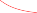

# A Simple Special Case for Ridge Regression and the Lasso 

In order to obtain a better intuition about the behavior of ridge regression and the lasso, consider a simple special case with _n_ = _p_ , and **X** a diagonal matrix with 1’s on the diagonal and 0’s in all off-diagonal elements. To simplify the problem further, assume also that we are performing regression without an intercept. With these assumptions, the usual least squares problem simplifies to finding _β_ 1 _, . . . , βp_ that minimize 

$$
\sum_{j=1}^p (y_j - \beta_j)^2 \quad (6.11)
$$

In this case, the least squares solution is given by 

$$
\hat{\beta}_j = y_j
$$

And in this setting, ridge regression amounts to finding _β_ 1 _, . . . , βp_ such that 

$$
\sum_{j=1}^p (y_j - \beta_j)^2 + \lambda \sum_{j=1}^p \beta_j^2 \quad (6.12)
$$

is minimized, and the lasso amounts to finding the coefficients such that 

$$
\sum_{j=1}^p (y_j - \beta_j)^2 + \lambda \sum_{j=1}^p |\beta_j| \quad (6.13)
$$

250 6. Linear Model Selection and Regularization 

**FIGURE 6.10.** _The ridge regression and lasso coefficient estimates for a simple setting with n_ = _p and_ **X** _a diagonal matrix with_ 1 _’s on the diagonal._ Left: _The ridge regression coefficient estimates are shrunken proportionally towards zero, relative to the least squares estimates._ Right: _The lasso coefficient estimates are soft-thresholded towards zero._ 

is minimized. One can show that in this setting, the ridge regression estimates take the form 

$$
\hat{\beta}_j^R = \frac{y_j}{1 + \lambda} \quad (6.14)
$$

and the lasso estimates take the form 

$$
\hat{\beta}_j^L = \begin{cases} 
y_j - \lambda/2 & \text{if } y_j > \lambda/2; \\
y_j + \lambda/2 & \text{if } y_j < -\lambda/2; \\
0 & \text{if } |y_j| \le \lambda/2.
\end{cases} \quad (6.15)
$$

Figure 6.10 displays the situation. We can see that ridge regression and the lasso perform two very different types of shrinkage. In ridge regression, each least squares coefficient estimate is shrunken by the same proportion. In contrast, the lasso shrinks each least squares coefficient towards zero by a constant amount, _λ/_ 2; the least squares coefficients that are less than _λ/_ 2 in absolute value are shrunken entirely to zero. The type of shrinkage performed by the lasso in this simple setting (6.15) is known as _softthresholding_ . The fact that some lasso coefficients are shrunken entirely to softzero explains why the lasso performs feature selection. 

thresholding 

In the case of a more general data matrix **X** , the story is a little more complicated than what is depicted in Figure 6.10, but the main ideas still hold approximately: ridge regression more or less shrinks every dimension of the data by the same proportion, whereas the lasso more or less shrinks all coefficients toward zero by a similar amount, and sufficiently small coefficients are shrunken all the way to zero. 

Bayesian Interpretation of Ridge Regression and the Lasso 

We now show that one can view ridge regression and the lasso through a Bayesian lens. A Bayesian viewpoint for regression assumes that the coefficient vector _β_ has some _prior_ distribution, say _p_ ( _β_ ), where _β_ = ( _β_ 0 _, β_ 1 _, . . . , βp_ ) _[T]_ . The likelihood of the data can be written as _f_ ( _Y |X, β_ ), 

6.2 Shrinkage Methods 251 

**FIGURE 6.11.** Left: _Ridge regression is the posterior mode for β under a Gaussian prior._ Right: _The lasso is the posterior mode for β under a double-exponential prior._ 

where _X_ = ( _X_ 1 _, . . . , Xp_ ). Multiplying the prior distribution by the likelihood gives us (up to a proportionality constant) the _posterior distribution_ , which takes the form 

$$
p(\beta \mid X, Y) \propto f(Y \mid X, \beta) p(\beta \mid X)
$$

where the proportionality above follows from Bayes’ theorem, and the equality above follows from the assumption that _X_ is fixed. We assume the usual linear model, 

$$
Y = \beta_0 + \beta_1 X_1 + \dots + \beta_p X_p + \epsilon
$$

and suppose that the errors are independent and drawn from a normal distribution. Furthermore, assume that _p_ ( _β_ ) =[�] _[p] j_ =1 _[g]_[(] _[β][j]_[)][,][for][some][density] function _g_ . It turns out that ridge regression and the lasso follow naturally from two special cases of _g_ : 

- If _g_ is a Gaussian distribution with mean zero and standard deviation a function of _λ_ , then it follows that the _posterior mode_ for _β_ —that posterior 

- is, the most likely value for _β_ , given the data—is given by the ridge mode regression solution. (In fact, the ridge regression solution is also the posterior mean.) 

- If _g_ is a double-exponential (Laplace) distribution with mean zero and scale parameter a function of _λ_ , then it follows that the posterior mode for _β_ is the lasso solution. (However, the lasso solution is _not_ the posterior mean, and in fact, the posterior mean does not yield a sparse coefficient vector.) 

The Gaussian and double-exponential priors are displayed in Figure 6.11. Therefore, from a Bayesian viewpoint, ridge regression and the lasso follow directly from assuming the usual linear model with normal errors, together with a simple prior distribution for _β_ . Notice that the lasso prior is steeply peaked at zero, while the Gaussian is flatter and fatter at zero. Hence, the lasso expects a priori that many of the coefficients are (exactly) zero, while ridge assumes the coefficients are randomly distributed about zero. 

252 6. Linear Model Selection and Regularization 

**FIGURE 6.12.** Left: _Cross-validation errors that result from applying ridge regression to the_ `Credit` _data set with various values of λ._ Right: _The coefficient estimates as a function of λ. The vertical dashed lines indicate the value of λ selected by cross-validation._ 
