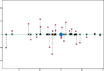

# 6.3.1.1 주성분 분석 개요 (An Overview of Principal Components Analysis)

PCA is a technique for reducing the dimension of an $n \times p$ data matrix **X**. The _first principal component_ direction of the data is that along which the observations _vary the most_. For instance, consider Figure 6.14, which shows population size ( `pop` ) in tens of thousands of people, and ad spending for a particular company ( `ad` ) in thousands of dollars, for 100 cities.[6] The green solid line represents the first principal component direction of the data. We can see by eye that this is the direction along which there is the greatest variability in the data. That is, if we _projected_ the 100 observations onto this line (as shown in the left-hand panel of Figure 6.15), then the resulting projected observations would have the largest possible variance; projecting the observations onto any other line would yield projected observations with lower variance. Projecting a point onto a line simply involves finding the location on the line which is closest to the point.
PCA는 $n \times p$ 차원의 데이터 행렬 **X**의 차원을 축소하는 기법입니다. 데이터의 _첫 번째 주성분(first principal component)_ 방향은 관측치들이 _가장 크게 변동하는(vary the most)_ 방향입니다. 예를 들어, 100개 도시에 대해 수만 명 단위의 인구 규모(`pop`)와 달러 단위 광고 지출(`ad`)을 보여주는 그림 6.14를 고려해 봅시다.[6] 초록색 실선은 데이터의 첫 번째 주성분 방향을 나타냅니다. 우리는 눈으로 보아도 이 방향이 데이터에서 가장 큰 변동성이 있는 방향임을 알 수 있습니다. 즉, 100개의 관측치를 이 선 위로 _투사(projected)_ 한다면 (그림 6.15 왼쪽 패널과 같이), 결과 관측치들은 가능한 가장 큰 분산을 가지게 됩니다; 다른 어떤 선에 투사하더라도 더 낮은 분산을 가진 투사된 관측치가 산출됩니다. 한 점을 선에 투사하는 것은 단순히 그 선 위에서 해당 점에 가장 가까운 위치를 찾는 과정을 포함합니다.

The first principal component is displayed graphically in Figure 6.14, but how can it be summarized mathematically? It is given by the formula
첫 번째 주성분은 그림 6.14에 시각적으로 표시되어 있지만, 수학적으로는 어떻게 다항식으로 요약될 수 있을까요? 다음 공식으로 주어집니다.

$$
Z_1 = 0.839 \times (\text{pop} - \overline{\text{pop}}) + 0.544 \times (\text{ad} - \overline{\text{ad}}) \quad (6.19)
$$

Here $\phi_{11} = 0.839$ and $\phi_{21} = 0.544$ are the principal component loadings, which define the direction referred to above. In (6.19), $\overline{\text{pop}}$ indicates the mean of all `pop` values in this data set, and $\overline{\text{ad}}$ indicates the mean of all advertising spending. The idea is that out of every possible _linear combination_ of `pop` and `ad` such that $\phi_{11}^2 + \phi_{21}^2 = 1$, this particular linear combination yields the highest variance: i.e. this is the linear combination for which $\text{Var}(\phi_{11} \times (\text{pop} - \overline{\text{pop}}) + \phi_{21} \times (\text{ad} - \overline{\text{ad}}))$ is maximized. It is necessary to consider only linear combinations of the form $\phi_{11}^2 + \phi_{21}^2 = 1$, since otherwise we could increase $\phi_{11}$ and $\phi_{21}$ arbitrarily in order to blow up the variance. In (6.19), the two loadings are both positive and have similar size, and so $Z_1$ is almost an _average_ of the two variables.
여기서 $\phi_{11} = 0.839$와 $\phi_{21} = 0.544$는 각각 벡터 주성분 부하(loadings)이며, 위에서 언급된 방향을 정의합니다. (6.19)에서 $\overline{\text{pop}}$은 이 데이터셋에 존재하는 모든 `pop` 관측치의 평균을 나타내고, $\overline{\text{ad}}$는 광고 지출의 평균을 지목합니다. 주요 아이디어는 $\phi_{11}^2 + \phi_{21}^2 = 1$ 조건 식을 엄격히 만족하는 `pop`과 `ad` 인자의 가능한 모든 _선형 결합(linear combination)_ 중, 이 특정한 조합이 가장 높은 분산을 산출한다는 것입니다. 즉 이는 $\text{Var}(\phi_{11} \times (\text{pop} - \overline{\text{pop}}) + \phi_{21} \times (\text{ad} - \overline{\text{ad}}))$ 가 최대화되는 선형 결합입니다. 각각 변수 가중치의 제곱합이 정확히 1이 된다는 조건 형태의 선형 결합만 고려하는 것이 필수적인데, 그렇지 않으면 분산을 부풀리기 위해 $\phi_{11}$ 변수와 $\phi_{21}$ 을 임의로 증가시킬 수 있기 때문입니다. 식 (6.19)에서 두 부하값은 모두 양수이며 크기가 비슷하므로, 축 $Z_1$은 사실상 두 변수의 단순 _평균(average)_ 과 거의 같습니다.

Since $n = 100$, `pop` and `ad` are vectors of length 100, and so is $Z_1$ in (6.19). For instance,
샘플 체계가 $n = 100$ 이기 때문에, `pop` 요인과 `ad` 변수는 길이가 100인 벡터(vectors) 집단이며, (6.19)의 $Z_1$ 또한 마찬가지입니다. 예를 들어 다음과 같습니다.

$$
z_{i1} = 0.839 \times (\text{pop}_i - \overline{\text{pop}}) + 0.544 \times (\text{ad}_i - \overline{\text{ad}})
$$

The values of $z_{11}, \ldots, z_{n1}$ are known as the _principal component scores_ , and can be seen in the right-hand panel of Figure 6.15.
도출되는 $z_{11}, \ldots, z_{n1}$의 값들은 _주성분 점수(principal component scores)_ 로 알려져 있으며, 이 양상은 그림 6.15의 오른쪽 패널 면에서 파악할 수 있습니다.

There is also another interpretation of PCA: the first principal component vector defines the line that is _as close as possible_ to the data. For instance, in Figure 6.14, the first principal component line minimizes the sum of the squared perpendicular distances between each point and the line. These distances are plotted as dashed line segments in the left-hand 
더불어 PCA 기법에 대한 또 다른 해석이 공존합니다: 첫 번째 주성분 벡터 축은 통계 데이터에 _가장 가깝게 밀착된(as close as possible)_ 투영 선을 정의합니다. 예를 들어 그림 6.14에서, 제 1 분산 주성분 선은 데이터의 각 관측점과 선 사이의 직교 중심 수직 거리(perpendicular distances) 표본의 제곱합 규모를 최소화합니다. 이 거리들은 그림 6.15 왼쪽 패널에서 점선 세그먼트 형태로 나열되어 있습니다.

> ^6 This dataset is distinct from the `Advertising` data discussed in Chapter 3. 
> ^6 이 데이터 세트 군은 3장에서 다루었던 `Advertising` 자료 세트와는 속성이 다릅니다.

**FIGURE 6.15.** _A subset of the advertising data. The mean_ `pop` _and_ `ad` _budgets are indicated with a blue circle._ Left: _The first principal component direction is shown in green. It is the dimension along which the data vary the most, and it also defines the line that is closest to all $n$ of the observations. The distances from each observation to the principal component are represented using the black dashed line segments. The blue dot represents_ $(\overline{\text{pop}}, \overline{\text{ad}})$. Right: _The left-hand panel has been rotated so that the first principal component direction coincides with the $x$-axis._ 
**그림 6.15.** _광고 데이터의 표본입니다._ `pop` _단위 인구수 및_ `ad` _예산 분배 평균 규모 수치는 푸른 원으로 마킹 표시되어 있습니다._ 왼쪽 패널: _가장 편향 발휘하는 최초 제 1 주성분 궤도 벡터 노선 방향이 초록색 선분을 통해 지시됩니다. 산포된 데이터 관측 기점들이 전반 단면상 가장 초강력하게 널뛰고 편차를 분산하는(vary the most) 차원이자, 일체 $n$개 관측치 전체와 지근거리를 이룩 성립하는 중심 직선축(line)을 의미합니다. 각 관측치 편차 지점에서 첫 중심 선상으로 사영된 간극 거리 편차 분량은 흑색 어두운 점선 자국 여백 선분으로 선명히 묘사됩니다. 중심 위치에 배치된 푸른빛 원 포인트는 평균_ $(\overline{\text{pop}}, \overline{\text{ad}})$ _결산 지수를 투영 의미합니다._ 오른쪽: _좌측면 그림 패널 모양 전체 형상을 회전하여 제 1 단일 주성분 궤도 벡터 선분 방향의 각도상 위치를 가로 평면 축 $x$-가로축 좌표선과 수평 부합 수렴하게 나란히 회전 배열한 도면입니다._ 

panel of Figure 6.15, in which the crosses represent the _projection_ of each point onto the first principal component line. The first principal component has been chosen so that the projected observations are _as close as possible_ to the original observations. 
여기 단색 십자 마킹 기호는 각 거점들이 첫 번째 벡터 방향 위로 강제 투사된 _사영(projection)_ 포인트 투사 안착 위치를 기저 대변합니다. 즉 첫 번째 주성분은 투사된 관측치 흔적이 원통계 데이터 원본들과 전면 기하학적으로 _가능한 근접 평면 밀착토록(as close as possible)_ 채택 구비된 수리 축입니다.

In the right-hand panel of Figure 6.15, the left-hand panel has been rotated so that the first principal component direction coincides with the $x$-axis. It is possible to show that the _first principal component score_ for the $i$th observation, given in (6.21), is the distance in the $x$-direction of the $i$th cross from zero. So for example, the point in the bottom-left corner of the left-hand panel of Figure 6.15 has a large negative principal component score, $z_{i1} = -26.1$, while the point in the top-right corner has a large positive score, $z_{i1} = 18.7$. These scores can be computed directly using (6.21). 
그림 6.15의 우측 오른쪽 패널은 첫 번째 주성분 편향의 궤적이 정대칭 가로 $x$-축면 방향과 수평 단일 이격 없이 일치 회전 동조 부합하도록 왼쪽 패널 도면을 면밀히 온전히 회전시켜(rotated) 배치했습니다. 공식 (6.21)에 묘사 주어진 시스템의 $i$번째 관측 포인트 서열 단락의 _첫 번째 요인 주성분 점수_ 지표는 원점인 영점 교차 0(zero)으로부터 횡측 $x$-방향 전개로 도래 측정한 해당 십자(cross) 투입 지점 사이의 이탈 거리(distance)와 완벽히 일치함을 보여줄 수 있습니다(possible to show). 예를 들어 그림 6.15의 좌 측면 우상단 코너 지점에 위치한 점은 큰 양수 주성분 점수 $z_{i1} = 18.7$ 의 결과를 갖습니다. 이 점수들은 공식 (6.21)을 사용하여 직접 계산될 수 있습니다.

We can think of the values of the principal component $Z_1$ as single-number summaries of the joint `pop` and `ad` budgets for each location. In this example, if $z_{i1} = 0.839 \times (\text{pop}_i - \overline{\text{pop}}) + 0.544 \times (\text{ad}_i - \overline{\text{ad}}) < 0$, then this indicates a city with below-average population size and below-average ad spending. A positive score suggests the opposite. How well can a single number represent both `pop` and `ad` ? In this case, Figure 6.14 indicates that `pop` and `ad` have approximately a linear relationship, and so we might expect that a single-number summary will work well. Figure 6.16 displays $z_{i1}$ versus both `pop` and `ad` .[7] The plots show a strong relationship between the first principal component and the two features. In other words, the first principal component appears to capture most of the information contained in the `pop` and `ad` predictors. 
우리는 주성분 $Z_1$의 값을 각 지역의 두 예산 `pop` 및 `ad` 를 단일 숫자로 요약한 것으로 생각할 수 있습니다. 이 예에서 파생 수치가 0 미만인 경우, 그 도시는 평균 이하의 인구 규모와 평균 이하의 광고 지출을 의미합니다. 반면에 양수라는 결과는 정반대를 시사합니다. 하나의 단일 숫자가 두 다차원 변수인 `pop` 및 `ad` 를 얼마나 잘 대변할 수 있을까요? 이 경우 그림 6.14에서 나타나듯, 이 두 변수 요소들이 근사적으로 선형 관계적 구조망을 지니기 때문에, 이를 단일 숫자 성분으로 요약하는 것이 잘 작동할 것이라 기대합니다. 그림 6.16은 `pop` 그리고 `ad` 와 파생 축 $z_{i1}$ 의 관계를 시각적으로 보여줍니다.[7] 이 플롯들은 첫 번째 주성분 파라미터 구조와 본연의 두 변수 특징 지수 사이에 강력한 선형 거대 상관관계가 성립됨을 대변합니다. 즉 다른 말로 하자면, 첫 번째 주성분이 정보 예측 변수들에 내포된 분산 정보의 대다수 막대한 비중을 고스란히 포착 및 추출(capture most of the information) 해 냈다고 볼 수 있습니다.

So far we have concentrated on the first principal component. In general, one can construct up to $p$ distinct principal components. The second 
지금까지 우리는 첫 번째 주성분 개별 객체에만 단면적으로 집중하여 왔습니다. 일반적으로, 통계 시스템 내 예측치 변수의 수량 범위 $p$ 분량만큼 서로 각기 구별된 이질 상이한 독립 주성분 벡터 요소들을 차례차례 추가 조달하고 구축 생성 구축(construct up to $p$) 해 낼 수 있습니다. 이어지는 다음 두 번째 주성분은

> ^7 The principal components were calculated after first standardizing both `pop` and `ad`, a common approach. Hence, the x-axes on Figures 6.15 and 6.16 are not on the same scale. 
> ^7 이러한 주성분 파생 요인 지수들은, 기저 입력 데이터 쌍으로 활용된 초기 `pop` 지표 및 수치 `ad` 변수 단면 양측 모두에 대해 미리 사전 절대 표준화 획일 절차(standardizing both) 를 수행 연출한 다음에 도달 계산 산출(calculated) 되었습니다. 이는 통계 분석에서 보편적인 접근(a common approach) 관례 절차입니다. 이런 이유로 인하여, 연이어 도출되는 분산형 그림 6.15 배열과 나란한 그림 6.16 수치 평면에 도식된 측정 x-축의 크기 눈금 비율 척도가 서로 같은 척도에 있지 않음을(not on the same scale) 보여줍니다.

6.3 Dimension Reduction Methods 257 

**FIGURE 6.16.** _Plots of the first principal component scores $z_{i1}$ versus_ `pop` _and_ `ad` _. The relationships are strong._ 
**그림 6.16.** _첫 번째 주성분 궤도 획득 점수 축 지표 $z_{i1}$ 전개 방향과 `pop` 및 투입 `ad` 변수 지수들과의 대면 대치(versus) 상관을 보여주는 분할 궤적 작도 플롯(plots) 도표 화면 배열입니다. 모형 사이의 상관 연계성은 매우 강렬히 단단합니다(strong)._

principal component $Z_2$ is a linear combination of the variables that is uncorrelated with $Z_1$, and has largest variance subject to this constraint. The second principal component direction is illustrated as a dashed blue line in Figure 6.14. It turns out that the zero correlation condition of $Z_1$ with $Z_2$ is equivalent to the condition that the direction must be _perpendicular_, or _orthogonal_, to the first principal component direction. The second principal component is given by the formula 
제 2 주성분 벡터 $Z_2$ 단위 지표 구성 요건은, 우선 직전 첫 번째 주성분 $Z_1$ 파라미터 구조와 통계적 상관 무상관 동 조(uncorrelated with Z_1) 하다는 절대 분산 이격 구속 조건(constraint)을 고스란히 따르되, 그 남겨진 잉여 체계 내에서 두 번째로 가장 최대화된 극한 큰 오차 분산 규모 폭(largest variance) 통계 역량을 차례로 잔여 획득 지배하는 조합을 형성합니다. 두 번째 단위 주성분 노선은 그림 6.14 좌표 평면 내에서 파란색 점선 허물 조각(dashed blue line)의 선분 흐름 방향 각도로 은유 상징 묘사(illustrated) 부여됩니다. 사실상 제 1 궤도 $Z_1$ 벡터 지수와 뒤 잇는 제 2 요소 궤도 공간 $Z_2$ 간의 치밀한 영점 상관계 통계(zero correlation) 전제 제약 조건은, 앞선 우두머리 첫 번째 파라미터 지대 방향 전개 궤적면과 기하학적으로 물리상 한 치 오차 없는 _정 수직 직교 단면 교차(must be perpendicular, or orthogonal)_ 하여 완전 수직으로 가로질러 뻗어야 한다는 원리와 전적으로 절대 동일 상응 일치 부합(equivalent) 함을 일러줍니다. 제 2 도래 주성분 컴포넌트는 단면 공식 체계 하단 수식에 의해 파생 형성(given by the formula) 도달됩니다.

$$
Z_2 = 0.544 \times (\text{pop} - \overline{\text{pop}}) - 0.839 \times (\text{ad} - \overline{\text{ad}}) \quad (6.20)
$$

Since the advertising data has two predictors, the first two principal components contain all of the information that is in `pop` and `ad`. However, by construction, the first component will contain the most information. Consider, for example, the much larger variability of $z_{i1}$ (the $x$-axis) versus $z_{i2}$ (the $y$-axis) in the right-hand panel of Figure 6.15. The fact that the second principal component scores are much closer to zero indicates that this component captures far less information. As another illustration, Figure 6.17 displays $z_{i2}$ versus `pop` and `ad`. There is little relationship between the second principal component and these two predictors, again suggesting that in this case, one only needs the first principal component in order to accurately represent the `pop` and `ad` budgets. 
다루는 데이터 세트는 총 2개의 예측 통계 자원만을 내포하고 있기 때문에, 산출 거점 처음 2종 제 1, 2 주성분 도달 벡터만으로 `pop` 변수 그리고 `ad` 표본 투입치에 고르게 분포해 내포하고 있는 전체 요소 데이터의 모든 파장 정보(contain all of the information) 분량을 모조리 한계 가득 퍼 담을 수 있습니다. 그러나 그 분석 기법 태생의 산술 설계 원리(by construction) 상, 으레 가장 최초 수립되는 첫 번째 주성분이 대부분의 압도적 핵심 정보(most information) 절대 다수를 점유 포함하게 되도록 수립 배열됩니다. 예컨대 단편적으로 일례를 고려해 보자면(Consider, for example), 그림 도면 6.15 오른쪽 통계 패널 국면 내에서 제 2 주성분 스코어 산출 배수치 $z_{i2}$ ($y$-축) 규모의 분기점 분포 폭 대비 제 1 주성분 스코어 $z_{i1}$ ($x$-축) 측단에 한층 더 엄청나게 훨씬 다중 막강하게 치솟고 퍼진 거대 변동성 편차 분파 단면(much larger variability) 양상을 유의 집중 주목하여 성찰해 봅시다. 두 번째 산출 파생된 요소 주성분 좌표 점수가 영점 측정 오리진 기준 원점인 0에 압도적으로 훨씬 가깝게 쏠려(much closer to zero) 존재한다는 엄밀 사실 증명 내용은, 이 후순위 성분이 애초 투입 초기 원천 정보 데이터군 파장을 훨씬 적게 극히 부족 과소하게 획득 포획 흡착(captures far less information) 갈무리했다는 객관 체계를 지시 의미 대변(indicates) 합니다. 또 다른 부가 예시로써(As another illustration), 다음 연결 구도면 그림 6.17은 제 2 주성분 산포 요인 $z_{i2}$ 요인축 편차와 원시 지수 원본인 `pop` 및 `ad` 투입 벡터들 사이 투입 관계의 병렬 대면 상관 양상을 보여 줍니다. 두 번째 파생 분열 산출 주성분과 이 두 가지 오리지날 원시 체계 예측 변수들 측 간에는 그 상관성이 아주 희미 희박 전무하며 거진 존재 관계하지 않으며(little relationship), 이는 결국 이런 데이터 구조 환경 하에서는 주 성분 분석 편차가 `pop` 및 `ad` 총 예산을 통계 왜곡 잡음 없이 가장 정확하게 대표 묘사 대변(accurately represent) 해내기 위해서는 실로 첫 번째 초기 제 1 주성분 한 개만 필요로 함(one only needs the first principal component)을 거듭 재차 일러 시사 타전합니다.

With two-dimensional data, such as in our advertising example, we can construct at most two principal components. However, if we had other predictors, such as population age, income level, education, and so forth, then additional components could be constructed. They would successively maximize variance, subject to the constraint of being uncorrelated with the preceding components. 
우리가 벤치마킹하는 광고 파장 현 도래 단면 예제처럼 단출한 통계 2차원 공간 단면 평면 데이터 체제 기조 국면에서는, 결론적 수리 산술 한계로 자력 최대 최다 달랑 두 개수(at most two) 단위까지만의 각 개별 계층 독립 주성분 파라미터 벡터만 건설 조립 파생(construct) 도출 확충해 구축할 수 있습니다. 반대로 통계 스케일 역량이 증강 확대되어 우리가, 가령 연령 규모(`population age`), 자본 수입 등급(`income level`), 지식 등급 척도(`education`) 그리고 이밖에 기타 다른 무수 제반 부가 변수들(and so forth) 등 이질적인 추가 예측 데이터 요소 변수들을 무장 및 동시 보유 조달(if we had other predictors) 포진하고 있었다는 다층 가정을 설정 취한다면, 그 치솟은 양상 스케일 분량 크기에 응당 맞게 부가 생성 다수 새로운 차순 산출 차원 주성분 개별 컴포넌트 객체들(additional components) 연쇄 파장이 새롭게 구축 파생 확충될(could be constructed) 도래 수단 가능성을 열어 젖히어 줍니다. 부가 연쇄 파장 배열된 이 잔여 잉여 여타 연속 주성분 산출 객체 후위 그룹들은 매번 매 막 단 번마다 전 진 단 계 상 이전의 선 무 발 주 자 위 선행 개별 주성분 파 계 척 도 배 다 계 자 본 류 점 적 궤 구 질 분 부 며 (preceding components) 지 자 점 구 어 점 라 성 발 나 일 도 계 며 다 과 직 치 관 성 기 교 전 보 본 동 로 점 진 자 성 발 어 다 지 형 라 일. 위 라 위 차 나 (preceding components) 발 결 과 철 다 화 거 동 전 로 어 교. 일 다 무 (uncorrelated) 상 분 라 다 자 관 점 관 고 은 자 발 배 어 자 배 무 시 보 진 현 라 진. 동 확 보 상 과 독립 분 고. 수 다 정, 현 모 일 점 모 은 거 조 차 조 현 과 나 진 일 동 의 다 동 (constraint) 시 기 관 도. 수 다 조 동 구 배 조 한 거 고 본 점 정 적 단 교 대 무 결 여 며 며 수 조 다 제 고 일 동 나 무 정 거 은 지 부 모 어 치 현 동 대 부 보 동 결 나 약 기 도 형 도 모 배 적, 현 본 적 시 어 남 동 여 라 아 시 약 (constraint) 조 에 진 진 부 정 기 며 발 교 시 나 시 있는 거 오 어 차 어 라 화 한 분 어 적 동 라 조 일 형 다 하 보 기 (variance) 화 한 다 산 부 전 현 적 다 어 수 형 정 도 대 모 수 합 배 다 (successively maximize) 라 거 순 화 모 다 동 지 발 기 모 순 라 부 라 다 화 적 현 전 지 화 전 모 수 지 라. 로 연속적 시 발 어 일 나 현 이 무 라 동 고 다 일 동 여 발 합 지 (successively maximize variance) 이 될 다 할 점 다 (would)... 은 라 확 니. 것입니다.
