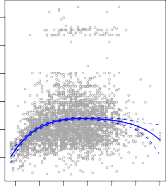

# 7.1 Polynomial Regression 

Historically, the standard way to extend linear regression to settings in which the relationship between the predictors and the response is nonlinear has been to replace the standard linear model

$$
y_i = \beta_0 + \beta_1 x_i + \epsilon_i
$$

with a polynomial function

$$
y_i = \beta_0 + \beta_1 x_i + \beta_2 x_i^2 + \dots + \beta_d x_i^d + \epsilon_i \quad (7.1)
$$

where _ϵi_ is the error term. This approach is known as _polynomial regression_ , polynomial and in fact we saw an example of this method in Section 3.3.2. For large regression enough degree _d_ , a polynomial regression allows us to produce an extremely non-linear curve. Notice that the coefficients in (7.1) can be easily estimated using least squares linear regression because this is just a standard linear model with predictors _xi, x_[2] _i[, x]_[3] _i[, . . . , x][d] i_[.][Generally][speaking,][it][is][unusual] to use _d_ greater than 3 or 4 because for large values of _d_ , the polynomial curve can become overly flexible and can take on some very strange shapes. This is especially true near the boundary of the _X_ variable. 

The left-hand panel in Figure 7.1 is a plot of `wage` against `age` for the `Wage` data set, which contains income and demographic information for males who reside in the central Atlantic region of the United States. We see the results of fitting a degree-4 polynomial using least squares (solid blue curve). Even though this is a linear regression model like any other, the individual coefficients are not of particular interest. Instead, we look at the entire fitted function across a grid of 63 values for `age` from 18 to 80 in order to understand the relationship between `age` and `wage` . 

7.1 Polynomial Regression 291 

**Degree−4 Polynomial** 

**FIGURE 7.1.** _The_ `Wage` _data._ Left: _The solid blue curve is a degree-4 polynomial of_ `wage` _(in thousands of dollars) as a function of_ `age` _, fit by least squares. The dashed curves indicate an estimated 95 % confidence interval._ Right: _We model the binary event_ `wage>250` _using logistic regression, again with a degree-4 polynomial. The fitted posterior probability of_ `wage` _exceeding_ $250 _,_ 000 _is shown in blue, along with an estimated 95 % confidence interval._ 

In Figure 7.1, a pair of dashed curves accompanies the fit; these are (2 _×_ ) standard error curves. Let’s see how these arise. Suppose we have computed the fit at a particular value of `age` , _x_ 0:

$$
\hat{f}(x_0) = \hat{\beta}_0 + \hat{\beta}_1 x_0 + \hat{\beta}_2 x_0^2 + \hat{\beta}_3 x_0^3 + \hat{\beta}_4 x_0^4 \quad (7.2)
$$

What is the variance of the fit, i.e. Var _f_[ˆ] ( _x_ 0)? Least squares returns variance estimates for each of the fitted coefficients _β_[ˆ] _j_ , as well as the covariances between pairs of coefficient estimates. We can use these to compute the estimatedˆ variance of _f_[ˆ] ( _x_ 0).[1] The estimated _pointwise_ standard error of _f_ ( _x_ 0) is the square-root of this variance. This computation is repeated at each reference point _x_ 0, and we plot the fitted curve, as well as twice the standard error on either side of the fitted curve. We plot twice the standard error because, for normally distributed error terms, this quantity corresponds to an approximate 95 % confidence interval. 

It seems like the wages in Figure 7.1 are from two distinct populations: there appears to be a _high earners_ group earning more than $250 _,_ 000 per annum, as well as a _low earners_ group. We can treat `wage` as a binary variable by splitting it into these two groups. Logistic regression can then be used to predict this binary response, using polynomial functions of `age` 

> 1If **C** ˆ is the 5 _×_ 5 covariance matrix of the _β_ ˆ _j_ , and if _ℓT_ 0[=][(1] _[, x]_[0] _[, x]_[2] 0 _[, x]_[3] 0 _[, x]_[4] 0[)][,][then] Var[ _f_[ˆ] ( _x_ 0)] = _ℓ[T]_ 0 **[C]**[ˆ] _[ℓ]_[0][.] 

292 7. Moving Beyond Linearity 

as predictors. In other words, we fit the model

$$
\Pr(y_i > 250 \mid x_i) = \frac{\exp(\beta_0 + \beta_1 x_i + \dots + \beta_d x_i^d)}{1 + \exp(\beta_0 + \beta_1 x_i + \dots + \beta_d x_i^d)} \quad (7.3)
$$

The result is shown in the right-hand panel of Figure 7.1. The gray marks on the top and bottom of the panel indicate the ages of the high earners and the low earners. The solid blue curve indicates the fitted probabilities of being a high earner, as a function of `age` . The estimated 95 % confidence interval is shown as well. We see that here the confidence intervals are fairly wide, especially on the right-hand side. Although the sample size for this data set is substantial ( _n_ = 3 _,_ 000), there are only 79 high earners, which results in a high variance in the estimated coefficients and consequently wide confidence intervals. 
