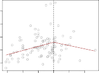

# _7.4.1 Piecewise Polynomials_ 

Instead of fitting a high-degree polynomial over the entire range of _X_ , _piecewise polynomial regression_ involves fitting separate low-degree polynomials piecewise over different regions of _X_ . For example, a piecewise cubic polynomial polynomial works by fitting a cubic regression model of the form regression 

polynomial regression 

$$
y_i = \beta_0 + \beta_1 x_i + \beta_2 x_i^2 + \beta_3 x_i^3 + \epsilon_i
$$

where the coefficients _β_ 0, _β_ 1, _β_ 2, and _β_ 3 differ in different parts of the range of _X_ . The points where the coefficients change are called _knots_ . 

For example, a piecewise cubic with no knots is just a standard cubic polynomial, as in (7.1) with _d_ = 3. A piecewise cubic polynomial with a single knot at a point _c_ takes the form 

knot 

$$
y_i = \begin{cases} 
\beta_{01} + \beta_{11} x_i + \beta_{21} x_i^2 + \beta_{31} x_i^3 + \epsilon_i & \text{if } x_i < c; \\
\beta_{02} + \beta_{12} x_i + \beta_{22} x_i^2 + \beta_{32} x_i^3 + \epsilon_i & \text{if } x_i \ge c. 
\end{cases}
$$

In other words, we fit two different polynomial functions to the data, one on the subset of the observations with _xi < c_ , and one on the subset of the observations with _xi ≥ c_ . The first polynomial function has coefficients 

7.4 Regression Splines 295 

**FIGURE 7.3.** _Various piecewise polynomials are fit to a subset of the_ `Wage` _data, with a knot at_ `age=50` _._ Top Left: _The cubic polynomials are unconstrained._ Top Right: _The cubic polynomials are constrained to be continuous at_ `age=50` _._ Bottom Left: _The cubic polynomials are constrained to be continuous, and to have continuous first and second derivatives._ Bottom Right: _A linear spline is shown, which is constrained to be continuous._ 

_β_ 01 _, β_ 11 _, β_ 21 _,_ and _β_ 31, and the second has coefficients _β_ 02 _, β_ 12 _, β_ 22 _,_ and _β_ 32. Each of these polynomial functions can be fit using least squares applied to simple functions of the original predictor. 

Using more knots leads to a more flexible piecewise polynomial. In general, if we place _K_ different knots throughout the range of _X_ , then we will end up fitting _K_ + 1 different cubic polynomials. Note that we do not need to use a cubic polynomial. For example, we can instead fit piecewise linear functions. In fact, our piecewise constant functions of Section 7.2 are piecewise polynomials of degree 0! 

The top left panel of Figure 7.3 shows a piecewise cubic polynomial fit to a subset of the `Wage` data, with a single knot at `age=50` . We immediately see a problem: the function is discontinuous and looks ridiculous! Since each polynomial has four parameters, we are using a total of eight _degrees of freedom_ in fitting this piecewise polynomial model. 

degrees of freedom 

296 7. Moving Beyond Linearity 
