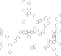

# _7.4.3 The Spline Basis Representation_ 

The regression splines that we just saw in the previous section may have seemed somewhat complex: how can we fit a piecewise degree- _d_ polynomial under the constraint that it (and possibly its first _d −_ 1 derivatives) be continuous? It turns out that we can use the basis model (7.7) to represent a regression spline. A cubic spline with _K_ knots can be modeled as

$$
y_i = \beta_0 + \beta_1 b_1(x_i) + \dots + \beta_{K+3} b_{K+3}(x_i) + \epsilon_i \quad (7.9)
$$

for an appropriate choice of basis functions _b_ 1 _, b_ 2 _, . . . , bK_ +3. The model (7.9) can then be fit using least squares. 

Just as there were several ways to represent polynomials, there are also many equivalent ways to represent cubic splines using different choices of basis functions in (7.9). The most direct way to represent a cubic spline using (7.9) is to start off with a basis for a cubic polynomial—namely, _x, x_[2] _,_ and _x_[3] —and then add one _truncated power basis_ function per knot. truncated 

> power basis 

> 3Cubic splines are popular because most human eyes cannot detect the discontinuity at the knots. 

7.4 Regression Splines 297 

**FIGURE 7.4.** _A cubic spline and a natural cubic spline, with three knots, fit to a subset of the_ `Wage` _data. The dashed lines denote the knot locations._ 

A truncated power basis function is defined as 

$$
h(x, \xi) = (x - \xi)_+^3 = \begin{cases} 
(x - \xi)^3 & \text{if } x > \xi, \\
0 & \text{otherwise}.
\end{cases}
$$

where _ξ_ is the knot. One can show that adding a term of the form _β_ 4 _h_ ( _x, ξ_ ) to the model (7.8) for a cubic polynomial will lead to a discontinuity in only the third derivative at _ξ_ ; the function will remain continuous, with continuous first and second derivatives, at each of the knots. 

In other words, in order to fit a cubic spline to a data set with _K_ knots, we perform least squares regression with an intercept and 3 + _K_ predictors, of the form _X, X_[2] _, X_[3] _, h_ ( _X, ξ_ 1) _, h_ ( _X, ξ_ 2) _, . . . , h_ ( _X, ξK_ ), where _ξ_ 1 _, . . . , ξK_ are the knots. This amounts to estimating a total of _K_ + 4 regression coefficients; for this reason, fitting a cubic spline with _K_ knots uses _K_ +4 degrees of freedom. 

Unfortunately, splines can have high variance at the outer range of the predictors—that is, when _X_ takes on either a very small or very large value. Figure 7.4 shows a fit to the `Wage` data with three knots. We see that the confidence bands in the boundary region appear fairly wild. A _natural spline_ is a regression spline with additional _boundary constraints_ : the natural function is required to be linear at the boundary (in the region where _X_ is spline smaller than the smallest knot, or larger than the largest knot). This additional constraint means that natural splines generally produce more stable estimates at the boundaries. In Figure 7.4, a natural cubic spline is also displayed as a red line. Note that the corresponding confidence intervals are narrower. 
