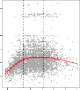

# **Natural Cubic Spline** 

**FIGURE 7.5.** _A natural cubic spline function with four degrees of freedom is fit to the_ `Wage` _data._ Left: _A spline is fit to_ `wage` _(in thousands of dollars) as a function of_ `age` _._ Right: _Logistic regression is used to model the binary event_ `wage>250` _as a function of_ `age` _. The fitted posterior probability of_ `wage` _exceeding_ $250 _,_ 000 _is shown. The dashed lines denote the knot locations._ 

option is to place more knots in places where we feel the function might vary most rapidly, and to place fewer knots where it seems more stable. While this option can work well, in practice it is common to place knots in a uniform fashion. One way to do this is to specify the desired degrees of freedom, and then have the software automatically place the corresponding number of knots at uniform quantiles of the data. 

Figure 7.5 shows an example on the `Wage` data. As in Figure 7.4, we have fit a natural cubic spline with three knots, except this time the knot locations were chosen automatically as the 25th, 50th, and 75th percentiles of `age` . This was specified by requesting four degrees of freedom. The argument by which four degrees of freedom leads to three interior knots is somewhat technical.[4] 

How many knots should we use, or equivalently how many degrees of freedom should our spline contain? One option is to try out different numbers of knots and see which produces the best looking curve. A somewhat more objective approach is to use cross-validation, as discussed in Chapters 5 and 6. With this method, we remove a portion of the data (say 10 %), fit a spline with a certain number of knots to the remaining data, and then use the spline to make predictions for the held-out portion. We repeat this process multiple times until each observation has been left out once, and 

> 4There are actually five knots, including the two boundary knots. A cubic spline with five knots has nine degrees of freedom. But natural cubic splines have two additional _natural_ constraints at each boundary to enforce linearity, resulting in 9 _−_ 4 = 5 degrees of freedom. Since this includes a constant, which is absorbed in the intercept, we count it as four degrees of freedom. 

7.4 Regression Splines 299 

**FIGURE 7.6.** _Ten-fold cross-validated mean squared errors for selecting the degrees of freedom when fitting splines to the_ `Wage` _data. The response is_ `wage` _and the predictor_ `age` _._ Left: _A natural cubic spline._ Right: _A cubic spline._ 

then compute the overall cross-validated RSS. This procedure can be repeated for different numbers of knots _K_ . Then the value of _K_ giving the smallest RSS is chosen. 

Figure 7.6 shows ten-fold cross-validated mean squared errors for splines with various degrees of freedom fit to the `Wage` data. The left-hand panel corresponds to a natural cubic spline and the right-hand panel to a cubic spline. The two methods produce almost identical results, with clear evidence that a one-degree fit (a linear regression) is not adequate. Both curves flatten out quickly, and it seems that three degrees of freedom for the natural spline and four degrees of freedom for the cubic spline are quite adequate. 

In Section 7.7 we fit additive spline models simultaneously on several variables at a time. This could potentially require the selection of degrees of freedom for each variable. In cases like this we typically adopt a more pragmatic approach and set the degrees of freedom to a fixed number, say four, for all terms. 
