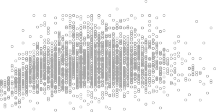

# _7.4.5 Comparison to Polynomial Regression_ 

Figure 7.7 compares a natural cubic spline with 15 degrees of freedom to a degree-15 polynomial on the `Wage` data set. The extra flexibility in the polynomial produces undesirable results at the boundaries, while the natural cubic spline still provides a reasonable fit to the data. Regression splines often give superior results to polynomial regression. This is because unlike polynomials, which must use a high degree (exponent in the highest monomial term, e.g. _X_[15] ) to produce flexible fits, splines introduce flexibility by increasing the number of knots but keeping the degree fixed. Generally, this approach produces more stable estimates. Splines also allow us to place more knots, and hence flexibility, over regions where the function _f_ seems to be changing rapidly, and fewer knots where _f_ appears more stable. 

300 7. Moving Beyond Linearity 

**FIGURE 7.7.** _On the_ `Wage` _data set, a natural cubic spline with 15 degrees of freedom is compared to a degree-_ 15 _polynomial. Polynomials can show wild behavior, especially near the tails._ 
