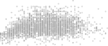

# **Smoothing Spline** 

**FIGURE 7.8.** _Smoothing spline fits to the_ `Wage` _data. The red curve results from specifying_ 16 _effective degrees of freedom. For the blue curve, λ was found automatically by leave-one-out cross-validation, which resulted in_ 6 _._ 8 _effective degrees of freedom._ 

is preferable, since in general simpler models are better unless the data provides evidence in support of a more complex model. 
