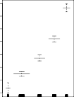

# _7.7.1 GAMs for Regression Problems_ 

A natural way to extend the multiple linear regression model

$$
y_i = \beta_0 + \beta_1 x_{i1} + \beta_2 x_{i2} + \dots + \beta_p x_{ip} + \epsilon_i \quad (7.15)
$$

in order to allow for non-linear relationships between each feature and the response is to replace each linear component _βjxij_ with a (smooth) nonlinear function _fj_ ( _xij_ ). We would then write the model as

$$
y_i = \beta_0 + f_1(x_{i1}) + f_2(x_{i2}) + \dots + f_p(x_{ip}) + \epsilon_i \quad (7.16)
$$

This is an example of a GAM. It is called an _additive_ model because we calculate a separate _fj_ for each _Xj_ , and then add together all of their contributions. 

In Sections 7.1–7.6, we discuss many methods for fitting functions to a single variable. The beauty of GAMs is that we can use these methods as building blocks for fitting an additive model. In fact, for most of the methods that we have seen so far in this chapter, this can be done fairly trivially. Take, for example, natural splines, and consider the task of fitting the model

$$
\text{wage} = \beta_0 + f_1(\text{year}) + f_2(\text{age}) + f_3(\text{education}) + \epsilon
$$

on the `Wage` data. Here `year` and `age` are quantitative variables, while the variable `education` is qualitative with five levels: `<HS` , `HS` , `<Coll` , `Coll` , `>Coll` , referring to the amount of high school or college education that an individual has completed. We fit the first two functions using natural splines. We 

7.7 Generalized Additive Models 307 

**FIGURE 7.12.** _Details are as in Figure 7.11, but now f_ 1 _and f_ 2 _are smoothing splines with four and five degrees of freedom, respectively._ 

fit the third function using a separate constant for each level, via the usual dummy variable approach of Section 3.3.1. 

Figure 7.11 shows the results of fitting the model (7.16) using least squares. This is easy to do, since as discussed in Section 7.4, natural splines can be constructed using an appropriately chosen set of basis functions. Hence the entire model is just a big regression onto spline basis variables and dummy variables, all packed into one big regression matrix. 

Figure 7.11 can be easily interpreted. The left-hand panel indicates that holding `age` and `education` fixed, `wage` tends to increase slightly with `year` ; this may be due to inflation. The center panel indicates that holding `education` and `year` fixed, `wage` tends to be highest for intermediate values of `age` , and lowest for the very young and very old. The right-hand panel indicates that holding `year` and `age` fixed, `wage` tends to increase with `education` : the more educated a person is, the higher their salary, on average. All of these findings are intuitive. 

Figure 7.12 shows a similar triple of plots, but this time _f_ 1 and _f_ 2 are smoothing splines with four and five degrees of freedom, respectively. Fitting a GAM with a smoothing spline is not quite as simple as fitting a GAM with a natural spline, since in the case of smoothing splines, least squares cannot be used. However, standard software such as the `Python` package `pygam` can be used to fit GAMs using smoothing splines, via an approach `pygam` known as _backfitting_ . This method fits a model involving multiple predic- backfitting tors by repeatedly updating the fit for each predictor in turn, holding the others fixed. The beauty of this approach is that each time we update a function, we simply apply the fitting method for that variable to a _partial residual_ .[6] 

The fitted functions in Figures 7.11 and 7.12 look rather similar. In most situations, the differences in the GAMs obtained using smoothing splines versus natural splines are small. 

> 6A partial residual for _X_ 3, for example, has the form _ri_ = _yi − f_ 1( _xi_ 1) _− f_ 2( _xi_ 2). If we know _f_ 1 and _f_ 2, then we can fit _f_ 3 by treating this residual as a response in a non-linear regression on _X_ 3. 

7. Moving Beyond Linearity 

308 

We do not have to use splines as the building blocks for GAMs: we can just as well use local regression, polynomial regression, or any combination of the approaches seen earlier in this chapter in order to create a GAM. GAMs are investigated in further detail in the lab at the end of this chapter. 

---

## Sub-Chapters (하위 목차)

### Pros and Cons of GAMs (가법 모형 GAM이 제공해주는 강력한 분리 해석 명료화 장점 및 한계점 주의 구조)
* [문서로 이동하기](./7_7_1_1_pros_and_cons_of_gams/)

기존 선형성의 거친 족쇄 모델 체인 제약을 우아하게 부수며 각 곡률 변화량을 정교하게 잡아내면서도, 모델 개별 변수 계수의 독립적 편향 해석력과 명징성을 그대로 유지하는 장점과, 역으로 변수 간 상호작용 항(Interaction Term) 삽입 탐색 시 수작업 조율이 고스란히 동반되는 한계점을 모두 검증합니다.
