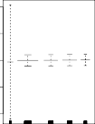

# _7.7.2 GAMs for Classification Problems_ 

GAMs can also be used in situations where _Y_ is qualitative. For simplicity, here we assume _Y_ takes on values 0 or 1, and let _p_ ( _X_ ) = Pr( _Y_ = 1 _|X_ ) be the conditional probability (given the predictors) that the response equals one. Recall the logistic regression model (4.6):

$$
\log \left( \frac{p(X)}{1 - p(X)} \right) = \beta_0 + \beta_1 X_1 + \beta_2 X_2 + \dots + \beta_p X_p \quad (7.17)
$$

The left-hand side is the log of the odds of _P_ ( _Y_ = 1 _|X_ ) versus _P_ ( _Y_ = 0 _|X_ ), which (7.17) represents as a linear function of the predictors. A natural way to extend (7.17) to allow for non-linear relationships is to use the model

$$
\log \left( \frac{p(X)}{1 - p(X)} \right) = \beta_0 + f_1(X_1) + f_2(X_2) + \dots + f_p(X_p) \quad (7.18)
$$

7.8 Lab: Non-Linear Modeling 309 

**FIGURE 7.13.** _For the_ `Wage` _data, the logistic regression GAM given in (7.19) is fit to the binary response_ `I(wage>250)` _. Each plot displays the fitted function and pointwise standard errors. The first function is linear in_ `year` _, the second function a smoothing spline with five degrees of freedom in_ `age` _, and the third a step function for_ `education` _. There are very wide standard errors for the first level_ `<HS` _of_ `education` _._ 

Equation 7.18 is a logistic regression GAM. It has all the same pros and cons as discussed in the previous section for quantitative responses. 

We fit a GAM to the `Wage` data in order to predict the probability that an individual’s income exceeds $250 _,_ 000 per year. The GAM that we fit takes the form

$$
\log \left( \frac{p(X)}{1 - p(X)} \right) = \beta_0 + \beta_1 \times \text{year} + f_2(\text{age}) + f_3(\text{education}) \quad (7.19)
$$

where

$$
p(X) = \Pr(\text{wage} > 250 \mid \text{year}, \text{age}, \text{education})
$$

Once again _f_ 2 is fit using a smoothing spline with five degrees of freedom, and _f_ 3 is fit as a step function, by creating dummy variables for each of the levels of education. The resulting fit is shown in Figure 7.13. The last panel looks suspicious, with very wide confidence intervals for level `<HS` . In fact, no response values equal one for that category: no individuals with less than a high school education make more than $250 _,_ 000 per year. Hence we refit the GAM, excluding the individuals with less than a high school education. The resulting model is shown in Figure 7.14. As in Figures 7.11 and 7.12, all three panels have similar vertical scales. This allows us to visually assess the relative contributions of each of the variables. We observe that `age` and `education` have a much larger effect than `year` on the probability of being a high earner. 
