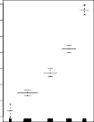

# 7.7 Generalized Additive Models 

In Sections 7.1–7.6, we present a number of approaches for flexibly predicting a response _Y_ on the basis of a single predictor _X_ . These approaches can be seen as extensions of simple linear regression. Here we explore the problem of flexibly predicting _Y_ on the basis of several predictors, _X_ 1 _, . . . , Xp_ . This amounts to an extension of multiple linear regression. 

_Generalized additive models_ (GAMs) provide a general framework for generalized extending a standard linear model by allowing non-linear functions of each additive of the variables, while maintaining _additivity_ . Just like linear models, GAMs model can be applied with both quantitative and qualitative responses. We first additivity 

306 7. Moving Beyond Linearity 

**FIGURE 7.11.** _For the_ `Wage` _data, plots of the relationship between each feature and the response,_ `wage` _, in the fitted model (7.16). Each plot displays the fitted function and pointwise standard errors. The first two functions are natural splines in_ `year` _and_ `age` _, with four and five degrees of freedom, respectively. The third function is a step function, fit to the qualitative variable_ `education` _._ 

examine GAMs for a quantitative response in Section 7.7.1, and then for a qualitative response in Section 7.7.2. 

---

## Sub-Chapters (하위 목차)

### 7.7.1 GAMs for Regression Problems (연속형 회귀 인퍼런스 타겟 문제에서의 GAMs 셋업 운용 방법)
* [문서로 이동하기](./7_7_1_gams_for_regression_problems/)

각 각의 변수 차별화된 고유 스플라인 함수 모델 구조 선형 결합 폼인 $f_1, f_2, ...$ 라인들에 어떻게 복잡 백피팅(Backfitting) 방식 혹은 보편적 로컬 블록 스캔 형태로 상호 잔차 덩어리들을 교대 할당시키며 구축하는지 스코어 모델링 전개를 이해합니다.

### 7.7.2 GAMs for Classification Problems (범주형 타겟 로지스틱 예측 클래스 분류 지표 문제 해결에서의 GAMs 확장 체인 방법)
* [문서로 이동하기](./7_7_2_gams_for_classification_problems/)

기반이 되는 이항 분포 구조 확률의 단골인 로지스틱 스코어 확률 방정식 모델 계수 내면의 선형 X 요소들도 마찬가지 수리 형식으로 각자의 스플라인 피팅망으로 얹어, 확률 타겟 공간 사이의 복잡 무쌍한 분류 함수 경계선 라인을 놀랍도록 유연 가동할 수 있음을 이론적 증명으로 묘사하고 관측 비교 검증합니다.
