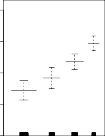

# 7.8 Lab: Non-Linear Modeling 

In this lab, we demonstrate some of the nonlinear models discussed in this chapter. We use the `Wage` data as a running example, and show that many of the complex non-linear fitting procedures discussed can easily be implemented in `Python` . 

310 7. Moving Beyond Linearity 



**FIGURE 7.14.** _The same model is fit as in Figure 7.13, this time excluding the observations for which_ `education` _is_ `<HS` _. Now we see that increased education tends to be associated with higher salaries._ 

As usual, we start with some of our standard imports. 

```
In [1]:importnumpyasnp,pandasaspd
frommatplotlib.pyplotimportsubplots
importstatsmodels.apiassm
fromISLPimportload_data
fromISLP.modelsimport(summarize,
poly,
ModelSpecasMS)
fromstatsmodels.stats.anovaimportanova_lm
```

We again collect the new imports needed for this lab. Many of these are developed specifically for the `ISLP` package. 

```
In [2]:frompygamimport(sass_gam,
lasl_gam,
fasf_gam,
LinearGAM,
LogisticGAM)
fromISLP.transformsimport(BSpline,
NaturalSpline)
fromISLP.modelsimportbs,ns
fromISLP.pygamimport(approx_lam ,
degrees_of_freedom ,
plotasplot_gam,
anovaasanova_gam)
```

---

## Sub-Chapters (하위 목차)

### 7.8.1 Polynomial Regression and Step Functions (수동형 다항식 스펙트럼 회귀 통계망 구축 및 계단식 가공 데이터 스텝 함수 변형 구간 실습 세선 구간)
* [문서로 이동하기](./7_8_1_polynomial_regression_and_step_functions/)

연령 데이터 칼럼(Age)과 임금 인프라 요인(Wage) 간의 관련성에 `poly(age, 4)` 식과 같이 코드 포맷 함수를 투여하거나, 혹은 특정 나이 및 세대 층위를 구간 범주화 컷 함수 판별식으로 매핑 필터링하여 이산적 정보망 차원 제어로 모델을 생성합니다.

### 7.8.2 Splines (B-Splines 베이시스 함수 기초 기반 스플라인 조각 시각화 랩 과정 구간)
* [문서로 이동하기](./7_8_2_splines/)

파이썬 기반 고급 회귀 팩토리 모형 추론 분석 파트 섹션에서 다변수 패키지로 1차 혹은 연속적으로 나눈 2차 이상 구간 인프라 매듭 지정점 스플라인 클래스 요소인 B-Spline 기반을 강제로 코딩 선언해주고 이가 나타내는 매끄러움을 추적 시각화로 그래픽 포인팅하는 플롯 차트 모델 구출 과정입니다.

### 7.8.3 Smoothing Splines and GAMs (페널티 기반 평활 최적 커브 스플라인 적합 팩터 및 고차원 구조 가법 통합 예측 모델 PyGAM 컴포넌트 실습 활용 구간)
* [문서로 이동하기](./7_8_3_smoothing_splines_and_gams/)

자유도(Degree of Freedom) 강도 조율율 파라미터 값 설정에 따른 내부 모델 곡면 잔차 거친 분산 추적 조종 패럴렐 통계 방식이나, 모델 인덱스 내의 예측 변수 2~3개가 서로 다른 차수 비선형 스플라인 곡면 꼴로 더해지는 PyGAM 등 파생 고급 패키지의 내부 사용법을 코드 데이터로 직접 임베드 구현해 봅니다.

### 7.8.4 Local Regression (로컬 구역 변동 표본 회귀 구간 데이터 분석 조립 실습 파라미터 제어)
* [문서로 이동하기](./7_8_4_local_regression/)

근거리 최적 로컬 이웃망의 데이터 스캐닝만 허용하는 Loess(Lowess) 평활화 타겟 수학 패키지 함수 모듈 등을 소환하여 사용자 예측 테스트 구간 목표 지점 근거리에 집중적으로 무게 추 가중치를 부여하는 등 국소 모델 선형 국면 피팅 파이썬 분석 실무 함수 제어기를 직접 구동해봅니다.
