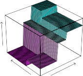

# _8.1.1 Regression Trees_ 

In order to motivate _regression trees_ , we begin with a simple example. 

regression tree 

© Springer Nature Switzerland AG 2023 G. James et al., https://doi.org/10.1007/978-3-031-38747-0_8 

331 

G. James et al., _An Introduction to Statistical Learning_ , Springer Texts in Statistics, 

8. Tree-Based Methods 

332 

**FIGURE 8.1.** _For the_ `Hitters` _data, a regression tree for predicting the log salary of a baseball player, based on the number of years that he has played in the major leagues and the number of hits that he made in the previous year. At a given internal node, the label (of the form Xj < tk) indicates the left-hand branch emanating from that split, and the right-hand branch corresponds to Xj ≥ tk. For instance, the split at the top of the tree results in two large branches. The left-hand branch corresponds to_ `Years<4.5` _, and the right-hand branch corresponds to_ `Years>=4.5` _. The tree has two internal nodes and three terminal nodes, or leaves. The number in each leaf is the mean of the response for the observations that fall there._ 

Predicting Baseball Players’ Salaries Using Regression Trees 

We use the `Hitters` data set to predict a baseball player’s `Salary` based on `Years` (the number of years that he has played in the major leagues) and `Hits` (the number of hits that he made in the previous year). We first remove observations that are missing `Salary` values, and log-transform `Salary` so that its distribution has more of a typical bell-shape. (Recall that `Salary` is measured in thousands of dollars.) 

Figure 8.1 shows a regression tree fit to this data. It consists of a series of splitting rules, starting at the top of the tree. The top split assigns observations having `Years<4.5` to the left branch.[1] The predicted salary for these players is given by the mean response value for the players in the data set with `Years<4.5` . For such players, the mean log salary is 5 _._ 107, and so we make a prediction of _e_[5] _[.]_[107] thousands of dollars, i.e. $165,174, for these players. Players with `Years>=4.5` are assigned to the right branch, and then that group is further subdivided by `Hits` . Overall, the tree stratifies or segments the players into three regions of predictor space: players who have played for four or fewer years, players who have played for five or more years and who made fewer than 118 hits last year, and players who have played for five or more years and who made at least 118 hits last year. These three regions can be written as _R_ 1 ={X _|_ `Years<4.5` }, _R_ 2 ={X _|_ `Years>=4.5` , `Hits<117.5` _}_ , and _R_ 3 ={X _|_ `Years>=4.5` , `Hits>=117.5` }. Figure 8.2 illustrates 

> 1Both `Years` and `Hits` are integers in these data; the function used to fit this tree labels the splits at the midpoint between two adjacent values. 

8.1 The Basics of Decision Trees 333 

**FIGURE 8.2.** _The three-region partition for the_ `Hitters` _data set from the regression tree illustrated in Figure 8.1._ 

the regions as a function of `Years` and `Hits` . The predicted salaries for these three groups are $1,000 _×e_[5] _[.]_[107] =$165,174, $1,000 _×e_[5] _[.]_[999] =$402,834, and $1,000 _×e_[6] _[.]_[740] =$845,346 respectively. 

In keeping with the _tree_ analogy, the regions _R_ 1, _R_ 2, and _R_ 3 are known as _terminal nodes_ or _leaves_ of the tree. As is the case for Figure 8.1, decision terminal trees are typically drawn _upside down_ , in the sense that the leaves are at node the bottom of the tree. The points along the tree where the predictor space leaf is split are referred to as _internal nodes_ . In Figure 8.1, the two internal internal nodes are indicated by the text `Years<4.5` and `Hits<117.5` . We refer to the node segments of the trees that connect the nodes as _branches_ . 

node leaf internal node branch 

We might interpret the regression tree displayed in Figure 8.1 as follows: `Years` is the most important factor in determining `Salary` , and players with less experience earn lower salaries than more experienced players. Given that a player is less experienced, the number of hits that he made in the previous year seems to play little role in his salary. But among players who have been in the major leagues for five or more years, the number of hits made in the previous year does affect salary, and players who made more hits last year tend to have higher salaries. The regression tree shown in Figure 8.1 is likely an over-simplification of the true relationship between `Hits` , `Years` , and `Salary` . However, it has advantages over other types of regression models (such as those seen in Chapters 3 and 6): it is easier to interpret, and has a nice graphical representation. 

Prediction via Stratification of the Feature Space 

We now discuss the process of building a regression tree. Roughly speaking, there are two steps. 

1. We divide the predictor space — that is, the set of possible values for _X_ 1 _, X_ 2 _, . . . , Xp_ — into _J_ distinct and non-overlapping regions, _R_ 1 _, R_ 2 _, . . . , RJ_ . 

334 8. Tree-Based Methods 

2. For every observation that falls into the region _Rj_ , we make the same prediction, which is simply the mean of the response values for the training observations in _Rj_ . 

For instance, suppose that in Step 1 we obtain two regions, _R_ 1 and _R_ 2, and that the response mean of the training observations in the first region is 10, while the response mean of the training observations in the second region is 20. Then for a given observation _X_ = _x_ , if _x ∈ R_ 1 we will predict a value of 10, and if _x ∈ R_ 2 we will predict a value of 20. 

We now elaborate on Step 1 above. How do we construct the regions _R_ 1 _, . . . , RJ_ ? In theory, the regions could have any shape. However, we choose to divide the predictor space into high-dimensional rectangles, or _boxes_ , for simplicity and for ease of interpretation of the resulting predictive model. The goal is to find boxes _R_ 1 _, . . . , RJ_ that minimize the RSS, given by

$$
\sum_{j=1}^J \sum_{i \in R_j} (y_i - \hat{y}_{R_j})^2 \quad (8.1)
$$

where _y_ ˆ _Rj_ is the mean response for the training observations within the _j_ th box. Unfortunately, it is computationally infeasible to consider every possible partition of the feature space into _J_ boxes. For this reason, we take a _top-down_ , _greedy_ approach that is known as _recursive binary splitting_ . The recursive approach is _top-down_ because it begins at the top of the tree (at which point binary all observations belong to a single region) and then successively splits the splitting predictor space; each split is indicated via two new branches further down on the tree. It is _greedy_ because at each step of the tree-building process, the _best_ split is made at that particular step, rather than looking ahead and picking a split that will lead to a better tree in some future step. 

In order to perform recursive binary splitting, we first select the predictor _Xj_ and the cutpoint _s_ such that splitting the predictor space into the regions _{X|Xj < s}_ and _{X|Xj ≥ s}_ leads to the greatest possible reduction in RSS. (The notation _{X|Xj < s}_ means _the region of predictor space in which Xj takes on a value less than s_ .) That is, we consider all predictors _X_ 1 _, . . . , Xp_ , and all possible values of the cutpoint _s_ for each of the predictors, and then choose the predictor and cutpoint such that the resulting tree has the lowest RSS. In greater detail, for any _j_ and _s_ , we define the pair of half-planes

$$
R_1(j, s) = \{X \mid X_j < s\} \quad \text{and} \quad R_2(j, s) = \{X \mid X_j \ge s\} \quad (8.2)
$$

and we seek the value of _j_ and _s_ that minimize the equation

$$
\sum_{i: x_i \in R_1(j, s)} (y_i - \hat{y}_{R_1})^2 + \sum_{i: x_i \in R_2(j, s)} (y_i - \hat{y}_{R_2})^2 \quad (8.3)
$$

where _y_ ˆ _R_ 1 is the mean response for the training observations in _R_ 1( _j, s_ ), and _y_ ˆ _R_ 2 is the mean response for the training observations in _R_ 2( _j, s_ ). Finding the values of _j_ and _s_ that minimize (8.3) can be done quite quickly, especially when the number of features _p_ is not too large. 

Next, we repeat the process, looking for the best predictor and best cutpoint in order to split the data further so as to minimize the RSS within 

8.1 The Basics of Decision Trees 335 

**FIGURE 8.3.** Top Left: _A partition of two-dimensional feature space that could not result from recursive binary splitting._ Top Right: _The output of recursive binary splitting on a two-dimensional example._ Bottom Left: _A tree corresponding to the partition in the top right panel._ Bottom Right: _A perspective plot of the prediction surface corresponding to that tree._ 

each of the resulting regions. However, this time, instead of splitting the entire predictor space, we split one of the two previously identified regions. We now have three regions. Again, we look to split one of these three regions further, so as to minimize the RSS. The process continues until a stopping criterion is reached; for instance, we may continue until no region contains more than five observations. 

Once the regions _R_ 1 _, . . . , RJ_ have been created, we predict the response for a given test observation using the mean of the training observations in the region to which that test observation belongs. 

A five-region example of this approach is shown in Figure 8.3. 

Tree Pruning 

The process described above may produce good predictions on the training set, but is likely to overfit the data, leading to poor test set performance. This is because the resulting tree might be too complex. A smaller tree 

336 8. Tree-Based Methods 

with fewer splits (that is, fewer regions _R_ 1 _, . . . , RJ_ ) might lead to lower variance and better interpretation at the cost of a little bias. One possible alternative to the process described above is to build the tree only so long as the decrease in the RSS due to each split exceeds some (high) threshold. This strategy will result in smaller trees, but is too short-sighted since a seemingly worthless split early on in the tree might be followed by a very good split—that is, a split that leads to a large reduction in RSS later on. 

Therefore, a better strategy is to grow a very large tree _T_ 0, and then _prune_ it back in order to obtain a _subtree_ . How do we determine the best prune way to prune the tree? Intuitively, our goal is to select a subtree that leads to the lowest test error rate. Given a subtree, we can estimate its test error using cross-validation or the validation set approach. However, estimating the cross-validation error for every possible subtree would be too cumbersome, since there is an extremely large number of possible subtrees. Instead, we need a way to select a small set of subtrees for consideration. 

subtree 

_Cost complexity pruning_ —also known as _weakest link pruning_ —gives us cost a way to do just this. Rather than considering every possible subtree, we consider a sequence of trees indexed by a nonnegative tuning parameter _α_ . For each value of _α_ there corresponds a subtree _T ⊂ T_ 0 such that

$$
\sum_{m=1}^{|T|} \sum_{i: x_i \in R_m} (y_i - \hat{y}_{R_m})^2 + \alpha |T| \quad (8.4)
$$

complexity pruning weakest link pruning

is as small as possible. Here _|T |_ indicates the number of terminal nodes of the tree _T_ , _Rm_ is the rectangle (i.e. the subset of predictor space) corresponding to the _m_ th terminal node, and _y_ ˆ _Rm_ is the predicted response associated with _Rm_ —that is, the mean of the training observations in _Rm_ . The tuning parameter _α_ controls a trade-off between the subtree’s complexity and its fit to the training data. When _α_ = 0, then the subtree _T_ will simply equal _T_ 0, because then (8.4) just measures the training error. However, as _α_ increases, there is a price to pay for having a tree with many terminal nodes, and so the quantity (8.4) will tend to be minimized for a smaller subtree. Equation 8.4 is reminiscent of the lasso (6.7) from Chapter 6, in which a similar formulation was used in order to control the complexity of a linear model. 

It turns out that as we increase _α_ from zero in (8.4), branches get pruned from the tree in a nested and predictable fashion, so obtaining the whole sequence of subtrees as a function of _α_ is easy. We can select a value of _α_ using a validation set or using cross-validation. We then return to the full data set and obtain the subtree corresponding to _α_ . This process is summarized in Algorithm 8.1. 

Figures 8.4 and 8.5 display the results of fitting and pruning a regression tree on the `Hitters` data, using nine of the features. First, we randomly divided the data set in half, yielding 132 observations in the training set and 131 observations in the test set. We then built a large regression tree on the training data and varied _α_ in (8.4) in order to create subtrees with different numbers of terminal nodes. Finally, we performed six-fold crossvalidation in order to estimate the cross-validated $\text{MSE}$ of the trees as 

8.1 The Basics of Decision Trees 337 

**Algorithm 8.1** _Building a Regression Tree_ 

1. Use recursive binary splitting to grow a large tree on the training data, stopping only when each terminal node has fewer than some minimum number of observations. 

2. Apply cost complexity pruning to the large tree in order to obtain a sequence of best subtrees, as a function of _α_ . 

3. Use K-fold cross-validation to choose _α_ . That is, divide the training observations into _K_ folds. For each _k_ = 1 _, . . . , K_ : 

   - (a) Repeat Steps 1 and 2 on all but the _k_ th fold of the training data. 

   - (b) Evaluate the mean squared prediction error on the data in the left-out _k_ th fold, as a function of _α_ . 

   - Average the results for each value of _α_ , and pick _α_ to minimize the average error. 

4. Return the subtree from Step 2 that corresponds to the chosen value of _α_ . 

a function of _α_ . (We chose to perform six-fold cross-validation because 132 is an exact multiple of six.) The unpruned regression tree is shown in Figure 8.4. The green curve in Figure 8.5 shows the CV error as a function of the number of leaves,[2] while the orange curve indicates the test error. Also shown are standard error bars around the estimated errors. For reference, the training error curve is shown in black. The CV error is a reasonable approximation of the test error: the CV error takes on its minimum for a three-node tree, while the test error also dips down at the three-node tree (though it takes on its lowest value at the ten-node tree). The pruned tree containing three terminal nodes is shown in Figure 8.1. 
