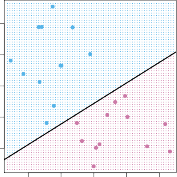

# _9.1.2 Classification Using a Separating Hyperplane_ 

Now suppose that we have an _n × p_ data matrix **X** that consists of _n_ training observations in _p_ -dimensional space,

$$
x_1 = \begin{pmatrix} x_{11} \\ \vdots \\ x_{1p} \end{pmatrix}, \dots, x_n = \begin{pmatrix} x_{n1} \\ \vdots \\ x_{np} \end{pmatrix}
$$

and that these observations fall into two classes—that is, _y_ 1 _, . . . , yn ∈ {−_ 1 _,_ 1 _}_ where _−_ 1 represents one class and 1 the other class. We also have a 

> 1The word _affine_ indicates that the subspace need not pass through the origin. 

9.1 Maximal Margin Classifier 369 

**FIGURE 9.1.** _The hyperplane_ 1 + 2 _X_ 1 + 3 _X_ 2 = 0 _is shown. The blue region is the set of points for which_ 1 + 2 _X_ 1 + 3 _X_ 2 _>_ 0 _, and the purple region is the set of points for which_ 1 + 2 _X_ 1 + 3 _X_ 2 _<_ 0 _._ 

test observation, a _p_ -vector of observed features _x[∗]_ = � _x∗_ 1 _. . . x[∗] p_ � _T_ . Our goal is to develop a classifier based on the training data that will correctly classify the test observation using its feature measurements. We have seen a number of approaches for this task, such as linear discriminant analysis and logistic regression in Chapter 4, and classification trees, bagging, and boosting in Chapter 8. We will now see a new approach that is based upon the concept of a _separating hyperplane_ . 

Suppose that it is possible to construct a hyperplane that separates the training observations perfectly according to their class labels. Examples of three such _separating hyperplanes_ are shown in the left-hand panel of Figure 9.2. We can label the observations from the blue class as _yi_ = 1 and those from the purple class as _yi_ = _−_ 1. Then a separating hyperplane has the property that 

separating hyperplane 

$$
\beta_0 + \beta_1 x_{i1} + \dots + \beta_p x_{ip} > 0 \quad \text{if } y_i = 1 \quad (9.4)
$$

and

$$
\beta_0 + \beta_1 x_{i1} + \dots + \beta_p x_{ip} < 0 \quad \text{if } y_i = -1 \quad (9.5)
$$

Equivalently, a separating hyperplane has the property that

$$
y_i (\beta_0 + \beta_1 x_{i1} + \dots + \beta_p x_{ip}) > 0 \quad (9.6)
$$

for all _i_ = 1 _, . . . , n_ . 

If a separating hyperplane exists, we can use it to construct a very natural classifier: a test observation is assigned a class depending on which side of the hyperplane it is located. The right-hand panel of Figure 9.2 shows an example of such a classifier. That is, we classify the test observation _x[∗]_ based on the sign of _f_ ( _x[∗]_ ) = _β_ 0+ _β_ 1 _x[∗]_ 1[+] _[β]_[2] _[x][∗]_ 2[+] _[· · ·]_[+] _[β][p][x][∗] p_[. If] _[ f]_[(] _[x][∗]_[)][ is positive,] then we assign the test observation to class 1, and if _f_ ( _x[∗]_ ) is negative, then we assign it to class _−_ 1. We can also make use of the _magnitude_ of _f_ ( _x[∗]_ ). If 

370 9. Support Vector Machines 

**FIGURE 9.2.** Left: _There are two classes of observations, shown in blue and in purple, each of which has measurements on two variables. Three separating hyperplanes, out of many possible, are shown in black._ Right: _A separating hyperplane is shown in black. The blue and purple grid indicates the decision rule made by a classifier based on this separating hyperplane: a test observation that falls in the blue portion of the grid will be assigned to the blue class, and a test observation that falls into the purple portion of the grid will be assigned to the purple class._ 

_f_ ( _x[∗]_ ) is far from zero, then this means that _x[∗]_ lies far from the hyperplane, and so we can be confident about our class assignment for _x[∗]_ . On the other hand, if _f_ ( _x[∗]_ ) is close to zero, then _x[∗]_ is located near the hyperplane, and so we are less certain about the class assignment for _x[∗]_ . Not surprisingly, and as we see in Figure 9.2, a classifier that is based on a separating hyperplane leads to a linear decision boundary. 
