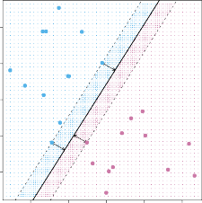

# _9.1.3 The Maximal Margin Classifier_ 

In general, if our data can be perfectly separated using a hyperplane, then there will in fact exist an infinite number of such hyperplanes. This is because a given separating hyperplane can usually be shifted a tiny bit up or down, or rotated, without coming into contact with any of the observations. Three possible separating hyperplanes are shown in the left-hand panel of Figure 9.2. In order to construct a classifier based upon a separating hyperplane, we must have a reasonable way to decide which of the infinite possible separating hyperplanes to use. 

A natural choice is the _maximal margin hyperplane_ (also known as the maximal _optimal separating hyperplane_ ), which is the separating hyperplane that margin is farthest from the training observations. That is, we can compute the (perpendicular) distance from each training observation to a given separatoptimal ing hyperplane; the smallest such distance is the minimal distance from the separating observations to the hyperplane, and is known as the _margin_ . The maximal margin hyperplane is the separating hyperplane for which the margin is margin largest—that is, it is the hyperplane that has the farthest minimum distance to the training observations. We can then classify a test observation based on which side of the maximal margin hyperplane it lies. This is known 

margin hyperplane optimal separating hyperplane margin 

9.1 Maximal Margin Classifier 371 

**FIGURE 9.3.** _There are two classes of observations, shown in blue and in purple. The maximal margin hyperplane is shown as a solid line. The margin is the distance from the solid line to either of the dashed lines. The two blue points and the purple point that lie on the dashed lines are the support vectors, and the distance from those points to the hyperplane is indicated by arrows. The purple and blue grid indicates the decision rule made by a classifier based on this separating hyperplane._ 

as the _maximal margin classifier_ . We hope that a classifier that has a large maximal margin on the training data will also have a large margin on the test data, margin and hence will classify the test observations correctly. Although the maxiclassifier mal margin classifier is often successful, it can also lead to overfitting when _p_ is large. 

If _β_ 0 _, β_ 1 _, . . . , βp_ are the coefficients of the maximal margin hyperplane, then the maximal margin classifier classifies the test observation _x[∗]_ based on the sign of _f_ ( _x[∗]_ ) = _β_ 0 + _β_ 1 _x[∗]_ 1[+] _[ β]_[2] _[x][∗]_ 2[+] _[ · · ·]_[ +] _[ β][p][x][∗] p_[.] 

Figure 9.3 shows the maximal margin hyperplane on the data set of Figure 9.2. Comparing the right-hand panel of Figure 9.2 to Figure 9.3, we see that the maximal margin hyperplane shown in Figure 9.3 does indeed result in a greater minimal distance between the observations and the separating hyperplane—that is, a larger margin. In a sense, the maximal margin hyperplane represents the mid-line of the widest “slab” that we can insert between the two classes. 

Examining Figure 9.3, we see that three training observations are equidistant from the maximal margin hyperplane and lie along the dashed lines indicating the width of the margin. These three observations are known as _support vectors_ , since they are vectors in _p_ -dimensional space (in Figure 9.3, support _p_ = 2) and they “support” the maximal margin hyperplane in the sense vector that if these points were moved slightly then the maximal margin hyperplane would move as well. Interestingly, the maximal margin hyperplane depends directly on the support vectors, but not on the other observations: a movement to any of the other observations would not affect the separating hyperplane, provided that the observation’s movement does not cause it to 

372 9. Support Vector Machines 

cross the boundary set by the margin. The fact that the maximal margin hyperplane depends directly on only a small subset of the observations is an important property that will arise later in this chapter when we discuss the support vector classifier and support vector machines. 
