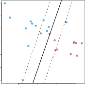

# _9.2.2 Details of the Support Vector Classifier_ 

The support vector classifier classifies a test observation depending on which side of a hyperplane it lies. The hyperplane is chosen to correctly separate most of the training observations into the two classes, but may 

9.2 Support Vector Classifiers 375 

**FIGURE 9.6.** Left: _A support vector classifier was fit to a small data set. The hyperplane is shown as a solid line and the margins are shown as dashed lines._ Purple observations: _Observations_ 3 _,_ 4 _,_ 5 _, and_ 6 _are on the correct side of the margin, observation_ 2 _is on the margin, and observation 1 is on the wrong side of the margin._ Blue observations: _Observations_ 7 _and_ 10 _are on the correct side of the margin, observation_ 9 _is on the margin, and observation_ 8 _is on the wrong side of the margin. No observations are on the wrong side of the hyperplane._ Right: _Same as left panel with two additional points,_ 11 _and_ 12 _. These two observations are on the wrong side of the hyperplane and the wrong side of the margin._ 

misclassify a few observations. It is the solution to the optimization problem

$$
\begin{align*}
& \underset{\beta_0, \dots, \beta_p, \epsilon_1, \dots, \epsilon_n, M}{\text{maximize}} M \quad (9.12) \\
& \text{subject to } \sum_{j=1}^p \beta_j^2 = 1, \quad (9.13) \\
& y_i (\beta_0 + \beta_1 x_{i1} + \dots + \beta_p x_{ip}) \ge M(1 - \epsilon_i), \quad (9.14) \\
& \epsilon_i \ge 0, \quad \sum_{i=1}^n \epsilon_i \le C, \quad (9.15)
\end{align*}
$$

where _C_ is a nonnegative tuning parameter. As in (9.11), _M_ is the width of the margin; we seek to make this quantity as large as possible. In (9.14), _ϵ_ 1 _, . . . , ϵn_ are _slack variables_ that allow individual observations to be on slack the wrong side of the margin or the hyperplane; we will explain them in greater detail momentarily. Once we have solved (9.12)–(9.15), we classify a test observation _x[∗]_ as before, by simply determining on which side of the hyperplane it lies. That is, we classify the test observation based on the sign of _f_ ( _x[∗]_ ) = _β_ 0 + _β_ 1 _x[∗]_ 1[+] _[ · · ·]_[ +] _[ β][p][x][∗] p_[.] 

variable 

The problem (9.12)–(9.15) seems complex, but insight into its behavior can be made through a series of simple observations presented below. First of all, the slack variable _ϵi_ tells us where the _i_ th observation is located, relative to the hyperplane and relative to the margin. If _ϵi_ = 0 then the _i_ th observation is on the correct side of the margin, as we saw in Section 9.1.4. If _ϵi >_ 0 then the _i_ th observation is on the wrong side of the margin, and we say that the _i_ th observation has _violated_ the margin. If _ϵi >_ 1 then it is on the wrong side of the hyperplane. 

376 9. Support Vector Machines 

We now consider the role of the tuning parameter _C_ . In (9.15), _C_ bounds the sum of the _ϵi_ ’s, and so it determines the number and severity of the violations to the margin (and to the hyperplane) that we will tolerate. We can think of _C_ as a _budget_ for the amount that the margin can be violated by the _n_ observations. If _C_ = 0 then there is no budget for violations to the margin, and it must be the case that _ϵ_ 1 = _· · ·_ = _ϵn_ = 0, in which case (9.12)–(9.15) simply amounts to the maximal margin hyperplane optimization problem (9.9)–(9.11). (Of course, a maximal margin hyperplane exists only if the two classes are separable.) For _C >_ 0 no more than _C_ observations can be on the wrong side of the hyperplane, because if an observation is on the wrong side of the hyperplane then _ϵi >_ 1, and (9.15) requires that[�] _[n] i_ =1 _[ϵ][i][≤][C]_[.][As][the][budget] _[C]_[increases,][we][become][more][tolerant][of] violations to the margin, and so the margin will widen. Conversely, as _C_ decreases, we become less tolerant of violations to the margin and so the margin narrows. An example is shown in Figure 9.7. 

In practice, _C_ is treated as a tuning parameter that is generally chosen via cross-validation. As with the tuning parameters that we have seen throughout this book, _C_ controls the bias-variance trade-off of the statistical learning technique. When _C_ is small, we seek narrow margins that are rarely violated; this amounts to a classifier that is highly fit to the data, which may have low bias but high variance. On the other hand, when _C_ is larger, the margin is wider and we allow more violations to it; this amounts to fitting the data less hard and obtaining a classifier that is potentially more biased but may have lower variance. 

The optimization problem (9.12)–(9.15) has a very interesting property: it turns out that only observations that either lie on the margin or that violate the margin will affect the hyperplane, and hence the classifier obtained. In other words, an observation that lies strictly on the correct side of the margin does not affect the support vector classifier! Changing the position of that observation would not change the classifier at all, provided that its position remains on the correct side of the margin. Observations that lie directly on the margin, or on the wrong side of the margin for their class, are known as _support vectors_ . These observations do affect the support vector classifier. 

The fact that only support vectors affect the classifier is in line with our previous assertion that _C_ controls the bias-variance trade-off of the support vector classifier. When the tuning parameter _C_ is large, then the margin is wide, many observations violate the margin, and so there are many support vectors. In this case, many observations are involved in determining the hyperplane. The top left panel in Figure 9.7 illustrates this setting: this classifier has low variance (since many observations are support vectors) but potentially high bias. In contrast, if _C_ is small, then there will be fewer support vectors and hence the resulting classifier will have low bias but high variance. The bottom right panel in Figure 9.7 illustrates this setting, with only eight support vectors. 

The fact that the support vector classifier’s decision rule is based only on a potentially small subset of the training observations (the support vectors) means that it is quite robust to the behavior of observations that are far away from the hyperplane. This property is distinct from some of 

9.3 Support Vector Machines 377 

**FIGURE 9.7.** _A support vector classifier was fit using four different values of the tuning parameter C in (9.12)–(9.15). The largest value of C was used in the top left panel, and smaller values were used in the top right, bottom left, and bottom right panels. When C is large, then there is a high tolerance for observations being on the wrong side of the margin, and so the margin will be large. As C decreases, the tolerance for observations being on the wrong side of the margin decreases, and the margin narrows._ 

the other classification methods that we have seen in preceding chapters, such as linear discriminant analysis. Recall that the LDA classification rule depends on the mean of _all_ of the observations within each class, as well as the within-class covariance matrix computed using _all_ of the observations. In contrast, logistic regression, unlike LDA, has very low sensitivity to observations far from the decision boundary. In fact we will see in Section 9.5 that the support vector classifier and logistic regression are closely related. 
