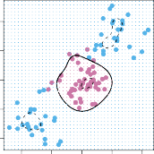

# _9.3.2 The Support Vector Machine_ 

The _support vector machine_ (SVM) is an extension of the support vector support classifier that results from enlarging the feature space in a specific way, vector using _kernels_ . We will now discuss this extension, the details of which are machine somewhat complex and beyond the scope of this book. However, the main kernel idea is described in Section 9.3.1: we may want to enlarge our feature space in order to accommodate a non-linear boundary between the classes. The kernel approach that we describe here is simply an efficient computational approach for enacting this idea. 

vector machine kernel 

We have not discussed exactly how the support vector classifier is computed because the details become somewhat technical. However, it turns out that the solution to the support vector classifier problem (9.12)–(9.15) involves only the _inner products_ of the observations (as opposed to the observations themselves). The inner product of two _r_ -vectors _a_ and _b_ is defined as _⟨a, b⟩_ =[�] _i[r]_ =1 _[a][i][b][i]_[.][Thus][the][inner][product][of][two][observations] _xi_ , _xi′_ is given by

$$
\langle x_i, x_{i'} \rangle = \sum_{j=1}^p x_{ij} x_{i'j} \quad (9.17)
$$

It can be shown that 

• The linear support vector classifier can be represented as

$$
f(x) = \beta_0 + \sum_{i=1}^n \alpha_i \langle x, x_i \rangle \quad (9.18)
$$

380 9. Support Vector Machines 

where there are _n_ parameters _αi, i_ = 1 _, . . . , n_ , one per training observation. 

- To estimate the parameters _α_ 1 _, . . . , αn_ and _β_ 0, all we need are the _n_ 

- �2� inner products _⟨xi, xi′ ⟩_ between all pairs of training observations. (The notation � _n_ 2� means _n_ ( _n −_ 1) _/_ 2, and gives the number of pairs among a set of _n_ items.) 

Notice that in (9.18), in order to evaluate the function _f_ ( _x_ ), we need to compute the inner product between the new point _x_ and each of the training points _xi_ . However, it turns out that _αi_ is nonzero only for the support vectors in the solution—that is, if a training observation is not a support vector, then its _αi_ equals zero. So if _S_ is the collection of indices of these support points, we can rewrite any solution function of the form (9.18) as

$$
f(x) = \beta_0 + \sum_{i \in \mathcal{S}} \alpha_i \langle x, x_i \rangle \quad (9.19)
$$

which typically involves far fewer terms than in (9.18).[2] 

To summarize, in representing the linear classifier _f_ ( _x_ ), and in computing 

its coefficients, all we need are inner products. 

Now suppose that every time the inner product (9.17) appears in the representation (9.18), or in a calculation of the solution for the support vector classifier, we replace it with a _generalization_ of the inner product of the form

$$
K(x_i, x_{i'}) \quad (9.20)
$$

where _K_ is some function that we will refer to as a _kernel_ . A kernel is a function that quantifies the similarity of two observations. For instance, we kernel could simply take

$$
K(x_i, x_{i'}) = \sum_{j=1}^p x_{ij} x_{i'j} \quad (9.21)
$$

which would just give us back the support vector classifier. Equation 9.21 is known as a _linear_ kernel because the support vector classifier is linear in the features; the linear kernel essentially quantifies the similarity of a pair of observations using Pearson (standard) correlation. But one could instead choose another form for (9.20). For instance, one could replace every instance of[�] _[p] j_ =1 _[x][ij][x][i][′][j]_[with][the][quantity] 

This is known as a _polynomial kernel_ of degree _d_ , where _d_ is a positive polynomial integer. Using such a kernel with _d >_ 1, instead of the standard linear kernel kernel (9.21), in the support vector classifier algorithm leads to a much more flexible decision boundary. It essentially amounts to fitting a support vector 

> 2By expanding each of the inner products in (9.19), it is easy to see that _f_ ( _x_ ) is a linear function of the coordinates of _x_ . Doing so also establishes the correspondence between the _αi_ and the original parameters _βj_ . 

9.3 Support Vector Machines 381 

**FIGURE 9.9.** Left: _An SVM with a polynomial kernel of degree 3 is applied to the non-linear data from Figure 9.8, resulting in a far more appropriate decision rule._ Right: _An SVM with a radial kernel is applied. In this example, either kernel is capable of capturing the decision boundary._ 

classifier in a higher-dimensional space involving polynomials of degree _d_ , rather than in the original feature space. When the support vector classifier is combined with a non-linear kernel such as (9.22), the resulting classifier is known as a support vector machine. Note that in this case the (non-linear) function has the form

$$
f(x) = \beta_0 + \sum_{i \in \mathcal{S}} \alpha_i K(x, x_i) \quad (9.23)
$$

The left-hand panel of Figure 9.9 shows an example of an SVM with a polynomial kernel applied to the non-linear data from Figure 9.8. The fit is a substantial improvement over the linear support vector classifier. When _d_ = 1, then the SVM reduces to the support vector classifier seen earlier in this chapter. 

The polynomial kernel shown in (9.22) is one example of a possible non-linear kernel, but alternatives abound. Another popular choice is the _radial kernel_ , which takes the form 

radial kernel 

$$
K(x_i, x_{i'}) = \exp \left( -\gamma \sum_{j=1}^p (x_{ij} - x_{i'j})^2 \right) \quad (9.24)
$$

In (9.24), _γ_ is a positive constant. The right-hand panel of Figure 9.9 shows an example of an SVM with a radial kernel on this non-linear data; it also does a good job in separating the two classes. 

How does the radial kernel (9.24) actually work? If a given test observation _x[∗]_ = ( _x[∗]_ 1 _[, . . . , x][∗] p_[)] _[T]_[is][far][from][a][training][observation] _[x][i]_[in][terms][of] Euclidean distance, then[�] _[p] j_ =1[(] _[x][∗] j[−][x][ij]_[)][2][will be large, and so] _[ K]_[(] _[x][∗][, x][i]_[) =] exp( _−γ_[�] _[p] j_ =1[(] _[x][∗] j[−][x][ij]_[)][2][)][will][be][tiny.][This][means][that][in][(][9.23][),] _[x][i]_[will] play virtually no role in _f_ ( _x[∗]_ ). Recall that the predicted class label for the test observation _x[∗]_ is based on the sign of _f_ ( _x[∗]_ ). In other words, training observations that are far from _x[∗]_ will play essentially no role in the predicted class label for _x[∗]_ . This means that the radial kernel has very _local_ 

382 9. Support Vector Machines 

**FIGURE 9.10.** _ROC curves for the_ `Heart` _data training set._ Left: _The support vector classifier and LDA are compared._ Right: _The support vector classifier is compared to an SVM using a radial basis kernel with γ_ = 10 _[−]_[3] _,_ 10 _[−]_[2] _, and_ 10 _[−]_[1] _._ 

behavior, in the sense that only nearby training observations have an effect on the class label of a test observation. 

What is the advantage of using a kernel rather than simply enlarging the feature space using functions of the original features, as in (9.16)? One advantage is computational, and it amounts to the fact that using kernels, one need only compute _K_ ( _xi, x[′] i_[)][ for all] � _n_ 2� distinct pairs _i, i[′]_ . This can be done without explicitly working in the enlarged feature space. This is important because in many applications of SVMs, the enlarged feature space is so large that computations are intractable. For some kernels, such as the radial kernel (9.24), the feature space is _implicit_ and infinite-dimensional, so we could never do the computations there anyway! 
