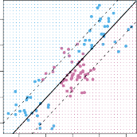

# 9.3 Support Vector Machines 

We first discuss a general mechanism for converting a linear classifier into one that produces non-linear decision boundaries. We then introduce the support vector machine, which does this in an automatic way. 

378 9. Support Vector Machines 

**FIGURE 9.8.** Left: _The observations fall into two classes, with a non-linear boundary between them._ Right: _The support vector classifier seeks a linear boundary, and consequently performs very poorly._ 

---

## Sub-Chapters (하위 목차)

### 9.3.1 Classification with Non-Linear Decision Boundaries (비선형 결정 경계를 활용한 분류 메커니즘)
* [문서로 이동하기](./9_3_1_with_non-linear_decision_boundaries_classification/)

서포트 벡터 분류기가 단순 선형(직선)이었던 반면, 파라미터 공간을 커스텀하여 2차/3차 원뿔 파형으로 파내면서 복잡한 커브 곡면의 판별식을 찾는 니즈를 봅니다.

### 9.3.2 The Support Vector Machine (커널 트릭 기반 서포트 벡터 머신)
* [문서로 이동하기](./9_3_2_the_support_vector_machine/)

어마어마한 다항식 공간을 직접 컴퓨터로 내적 연산하지 않고도 커널(Kernel) 함수 기믹만으로 유사 가중치를 동일하게 뽑아내는 컴퓨팅 혁신 트릭 과정을 학습합니다.

### 9.3.3 An Application to the Heart Disease Data (심장 질환 분류 도메인 적용 사례)
* [문서로 이동하기](./9_3_3_an_application_to_the_heart_disease_data/)

커널 SVM과 일반 LDA 분류기 등을 실제 심장병 로지스틱 예측 데이터에 동시 피팅하고 비교 테스트 커브 플롯을 렌더링하며 유연도 모델을 검토합니다.
