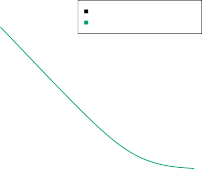

# 9.5 Relationship to Logistic Regression 

When SVMs were first introduced in the mid-1990s, they made quite a splash in the statistical and machine learning communities. This was due in part to their good performance, good marketing, and also to the fact that the underlying approach seemed both novel and mysterious. The idea of finding a hyperplane that separates the data as well as possible, while allowing some violations to this separation, seemed distinctly different from classical approaches for classification, such as logistic regression and linear discriminant analysis. Moreover, the idea of using a kernel to expand the feature space in order to accommodate non-linear class boundaries appeared to be a unique and valuable characteristic. 

However, since that time, deep connections between SVMs and other more classical statistical methods have emerged. It turns out that one can rewrite the criterion (9.12)–(9.15) for fitting the support vector classifier _f_ ( _X_ ) = _β_ 0 + _β_ 1 _X_ 1 + _· · ·_ + _βpXp_ as

$$
\min_{\beta_0, \dots, \beta_p} \left\{ \sum_{i=1}^n \max[0, 1 - y_i f(x_i)] + \lambda \sum_{j=1}^p \beta_j^2 \right\} \quad (9.25)
$$

where _λ_ is a nonnegative tuning parameter. When _λ_ is large then _β_ 1 _, . . . , βp_ are small, more violations to the margin are tolerated, and a low-variance but high-bias classifier will result. When _λ_ is small then few violations to the margin will occur; this amounts to a high-variance but low-bias 

9.5 Relationship to Logistic Regression 385 

classifier. Thus, a small value of _λ_ in (9.25) amounts to a small value of _C_ in (9.15). Note that the _λ_[�] _[p] j_ =1 _[β] j_[2][term][in][(][9.25][)][is][the][ridge][penalty][term] from Section 6.2.1, and plays a similar role in controlling the bias-variance trade-off for the support vector classifier. 

Now (9.25) takes the “Loss + Penalty” form that we have seen repeatedly throughout this book:

$$
\min_{\beta_0, \dots, \beta_p} \{ L(\mathbf{X}, \mathbf{y}, \beta) + \lambda P(\beta) \} \quad (9.26)
$$

In (9.26), _L_ ( **X** _,_ **y** _, β_ ) is some loss function quantifying the extent to which the model, parametrized by _β_ , fits the data ( **X** _,_ **y** ), and _P_ ( _β_ ) is a penalty function on the parameter vector _β_ whose effect is controlled by a nonnegative tuning parameter _λ_ . For instance, ridge regression and the lasso both take this form with

$$
L(\mathbf{X}, \mathbf{y}, \beta) = \sum_{i=1}^n \left( y_i - \beta_0 - \sum_{j=1}^p \beta_j x_{ij} \right)^2
$$

and with _P_ ( _β_ ) =[�] _[p] j_ =1 _[β] j_[2][for][ridge][regression][and] _[P]_[(] _[β]_[)][=][�] _[p] j_ =1 _[|][β][j][|]_[for] the lasso. In the case of (9.25) the loss function instead takes the form

$$
L(\mathbf{X}, \mathbf{y}, \beta) = \sum_{i=1}^n \max \left[ 0, 1 - y_i \left( \beta_0 + \sum_{j=1}^p \beta_j x_{ij} \right) \right] \quad (9.27)
$$

This is known as _hinge loss_ , and is depicted in Figure 9.12. However, it hinge loss turns out that the hinge loss function is closely related to the loss function used in logistic regression, also shown in Figure 9.12. 

An interesting characteristic of the support vector classifier is that only support vectors play a role in the classifier obtained; observations on the correct side of the margin do not affect it. This is due to the fact that the loss function shown in Figure 9.12 is exactly zero for observations for which _yi_ ( _β_ 0 + _β_ 1 _xi_ 1 + _· · ·_ + _βpxip_ ) _≥_ 1; these correspond to observations that are on the correct side of the margin.[3] In contrast, the loss function for logistic regression shown in Figure 9.12 is not exactly zero anywhere. But it is very small for observations that are far from the decision boundary. Due to the similarities between their loss functions, logistic regression and the support vector classifier often give very similar results. When the classes are well separated, SVMs tend to behave better than logistic regression; in more overlapping regimes, logistic regression is often preferred. 

When the support vector classifier and SVM were first introduced, it was thought that the tuning parameter _C_ in (9.15) was an unimportant “nuisance” parameter that could be set to some default value, like 1. However, the “Loss + Penalty” formulation (9.25) for the support vector classifier indicates that this is not the case. The choice of tuning parameter is very important and determines the extent to which the model underfits or overfits the data, as illustrated, for example, in Figure 9.7. 

> 3With this hinge-loss + penalty representation, the margin corresponds to the value one, and the width of the margin is determined by[�] _βj_[2][.] 

386 9. Support Vector Machines 

**FIGURE 9.12.** _The SVM and logistic regression loss functions are compared, as a function of yi_ ( _β_ 0 + _β_ 1 _xi_ 1 + _· · ·_ + _βpxip_ ) _. When yi_ ( _β_ 0 + _β_ 1 _xi_ 1 + _· · ·_ + _βpxip_ ) _is greater than 1, then the SVM loss is zero, since this corresponds to an observation that is on the correct side of the margin. Overall, the two loss functions have quite similar behavior._ 

We have established that the support vector classifier is closely related to logistic regression and other preexisting statistical methods. Is the SVM unique in its use of kernels to enlarge the feature space to accommodate non-linear class boundaries? The answer to this question is “no”. We could just as well perform logistic regression or many of the other classification methods seen in this book using non-linear kernels; this is closely related to some of the non-linear approaches seen in Chapter 7. However, for historical reasons, the use of non-linear kernels is much more widespread in the context of SVMs than in the context of logistic regression or other methods. 

Though we have not addressed it here, there is in fact an extension of the SVM for regression (i.e. for a quantitative rather than a qualitative response), called _support vector regression_ . In Chapter 3, we saw that support least squares regression seeks coefficients _β_ 0 _, β_ 1 _, . . . , βp_ such that the sum vector of squared residuals is as small as possible. (Recall from Chapter 3 that residuals are defined as _yi − β_ 0 _− β_ 1 _xi_ 1 _−· · · − βpxip_ .) Support vector regression instead seeks coefficients that minimize a different type of loss, where only residuals larger in absolute value than some positive constant contribute to the loss function. This is an extension of the margin used in support vector classifiers to the regression setting. 

vector regression 

9.6 Lab: Support Vector Machines 

387 
