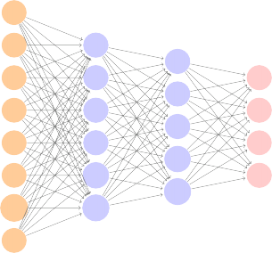

# 10.2 Multilayer Neural Networks 

Modern neural networks typically have more than one hidden layer, and often many units per layer. In theory a single hidden layer with a large number of units has the ability to approximate most functions. However, the learning task of discovering a good solution is made much easier with multiple layers each of modest size. 

We will illustrate a large dense network on the famous and publicly available `MNIST` handwritten digit dataset.[1] Figure 10.3 shows examples of these digits. The idea is to build a model to classify the images into their correct digit class 0–9. Every image has _p_ = 28 _×_ 28 = 784 pixels, each of which is an eight-bit grayscale value between 0 and 255 representing 

> 1See LeCun, Cortes, and Burges (2010) “The MNIST database of handwritten digits”, available at `http://yann.lecun.com/exdb/mnist` . 

10.2 Multilayer Neural Networks 403 

**FIGURE 10.3.** _Examples of handwritten digits from the_ `MNIST` _corpus. Each grayscale image has_ 28 _×_ 28 _pixels, each of which is an eight-bit number (0–255) which represents how dark that pixel is. The first 3, 5, and 8 are enlarged to show their 784 individual pixel values._ 

the relative amount of the written digit in that tiny square.[2] These pixels are stored in the input vector _X_ (in, say, column order). The output is the class label, represented by a vector _Y_ = ( _Y_ 0 _, Y_ 1 _, . . . , Y_ 9) of 10 dummy variables, with a one in the position corresponding to the label, and zeros elsewhere. In the machine learning community, this is known as _one-hot encoding_ . There are 60,000 training images, and 10,000 test images. 

On a historical note, digit recognition problems were the catalyst that accelerated the development of neural network technology in the late 1980s at AT&T Bell Laboratories and elsewhere. Pattern recognition tasks of this kind are relatively simple for humans. Our visual system occupies a large fraction of our brains, and good recognition is an evolutionary force for survival. These tasks are not so simple for machines, and it has taken more than 30 years to refine the neural-network architectures to match human performance. 

one-hot encoding 

Figure 10.4 shows a multilayer network architecture that works well for solving the digit-classification task. It differs from Figure 10.1 in several ways: 

- It has two hidden layers _L_ 1 (256 units) and _L_ 2 (128 units) rather than one. Later we will see a network with seven hidden layers. 

- It has ten output variables, rather than one. In this case the ten variables really represent a single qualitative variable and so are quite dependent. (We have indexed them by the digit class 0–9 rather than 

   - 1–10, for clarity.) More generally, in _multi-task learning_ one can pre- multi-task 

   - dict different responses simultaneously with a single network; they learning all have a say in the formation of the hidden layers. 

- The loss function used for training the network is tailored for the multiclass classification task. 

> 2In the analog-to-digital conversion process, only part of the written numeral may fall in the square representing a particular pixel. 

404 10. Deep Learning 

**FIGURE 10.4.** _Neural network diagram with two hidden layers and multiple outputs, suitable for the_ `MNIST` _handwritten-digit problem. The input layer has p_ = 784 _units, the two hidden layers K_ 1 = 256 _and K_ 2 = 128 _units respectively, and the output layer_ 10 _units. Along with intercepts (referred to as_ biases _in the deep-learning community) this network has 235,146 parameters (referred to as weights)._ 

The first hidden layer is as in (10.2), with

$$
A_k^{(1)} = h_k^{(1)}(X) = g \left( w_{k0}^{(1)} + \sum_{j=1}^p w_{kj}^{(1)} X_j \right) \quad (10.9)
$$

for _k_ = 1 _, . . . , K_ 1. The second hidden layer treats the activations _A_[(1)] _k_ of the first hidden layer as inputs and computes new activations 

$$
A_\ell^{(2)} = h_\ell^{(2)}(A^{(1)}) = g \left( w_{\ell 0}^{(2)} + \sum_{k=1}^{K_1} w_{\ell k}^{(2)} A_k^{(1)} \right) \quad (10.10)
$$

for _ℓ_ = 1 _, . . . , K_ 2 _._ Notice that each of the activations in the second layer _A_[(2)] _ℓ_ = _h_[(2)] _ℓ_[(] _[X]_[)][ is a function of the input vector] _[ X]_[. This is the case because] while they are explicitly a function of the activations _A_[(1)] _k_ from layer _L_ 1, these in turn are functions of _X_ . This would also be the case with more hidden layers. Thus, through a chain of transformations, the network is able to build up fairly complex transformations of _X_ that ultimately feed into the output layer as features. 

We have introduced additional superscript notation such as _h_[(2)] _ℓ_[(] _[X]_[)][and] _wℓj_[(2)] in (10.10) and (10.11) to indicate to which layer the activations and _weights_ (coefficients) belong, in this case layer 2. The notation **W** 1 in Fig- weights 

10.2 Multilayer Neural Networks 405 

ure 10.4 represents the entire matrix of weights that feed from the input layer to the first hidden layer _L_ 1. This matrix will have 785 _×_ 256 = 200 _,_ 960 elements; there are 785 rather than 784 because we must account for the intercept or _bias_ term.[3] 

Each element _A_[(1)] _k_ feeds to the second hidden layer _L_ 2 via the matrix of weights **W** 2 of dimension 257 _×_ 128 = 32 _,_ 896. 

bias 

We now get to the output layer, where we now have ten responses rather than one. The first step is to compute ten different linear models similar to our single model (10.1),

$$
Z_m = \beta_{m0} + \sum_{k=1}^{K_2} \beta_{mk} A_k^{(2)} \quad (10.11)
$$

for _m_ = 0 _,_ 1 _, . . . ,_ 9. The matrix **B** stores all 129 _×_ 10 = 1 _,_ 290 of these weights. 

If these were all separate quantitative responses, we would simply set each _fm_ ( _X_ ) = _Zm_ and be done. However, we would like our estimates to represent class probabilities _fm_ ( _X_ ) = Pr( _Y_ = _m|X_ ), just like in multinomial logistic regression in Section 4.3.5. So we use the special _softmax_ softmax activation function (see (4.13) on page 145),

$$
f_m(X) = \Pr(Y = m \mid X) = \frac{e^{Z_m}}{\sum_{\ell=0}^9 e^{Z_\ell}} \quad (10.12)
$$

for _m_ = 0 _,_ 1 _, . . . ,_ 9. This ensures that the 10 numbers behave like probabilities (non-negative and sum to one). Even though the goal is to build a classifier, our model actually estimates a probability for each of the 10 classes. The classifier then assigns the image to the class with the highest probability. 

To train this network, since the response is qualitative, we look for coefficient estimates that minimize the negative multinomial log-likelihood 

$$
-\sum_{i=1}^n \sum_{m=0}^9 y_{im} \log(f_m(x_i)) \quad (10.13)
$$

also known as the _cross-entropy_ . This is a generalization of the crite- crossrion (4.5) for two-class logistic regression. Details on how to minimize this objective are given in Section 10.7. If the response were quantitative, we would instead minimize squared-error loss as in (10.9). 

entropy 

Table 10.1 compares the test performance of the neural network with two simple models presented in Chapter 4 that make use of linear decision boundaries: multinomial logistic regression and linear discriminant analysis. The improvement of neural networks over both of these linear methods is dramatic: the network with dropout regularization achieves a test error rate below 2% on the 10 _,_ 000 test images. (We describe dropout regularization in Section 10.7.3.) In Section 10.9.2 of the lab, we present the code for fitting this model, which runs in just over two minutes on a laptop computer. 

> 3The use of “weights” for coefficients and “bias” for the intercepts _wk_ 0 in (10.2) is popular in the machine learning community; this use of bias is not to be confused with the “bias-variance” usage elsewhere in this book. 

10. Deep Learning 

406 

|10. Deep Learning||
|---|---|
|Method|Test Error|
|Neural Network + Ridge Regularization Neural Network + Dropout Regularization Multinomial Logistic Regression Linear Discriminant Analysis|2_._3% 1_._8% 7_._2% 12_._7%|

**TABLE 10.1.** _Test error rate on the_ `MNIST` _data, for neural networks with two forms of regularization, as well as multinomial logistic regression and linear discriminant analysis. In this example, the extra complexity of the neural network leads to a marked improvement in test error._ 

**FIGURE 10.5.** _A sample of images from the_ `CIFAR100` _database: a collection of natural images from everyday life, with 100 different classes represented._ 

Adding the number of coefficients in **W** 1, **W** 2 and **B** , we get 235 _,_ 146 in all, more than 33 times the number 785 _×_ 9 = 7 _,_ 065 needed for multinomial logistic regression. Recall that there are 60 _,_ 000 images in the training set. While this might seem like a large training set, there are almost four times as many coefficients in the neural network model as there are observations in the training set! To avoid overfitting, some regularization is needed. In this example, we used two forms of regularization: ridge regularization, which is similar to ridge regression from Chapter 6, and _dropout_ regularization. dropout We discuss both forms of regularization in Section 10.7. 
