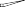

# _10.3.3 Architecture of a Convolutional Neural Network_ 

So far we have defined a single convolution layer — each filter produces a new two-dimensional feature map. The number of convolution filters in a convolution layer is akin to the number of units at a particular hidden layer in a fully-connected neural network of the type we saw in Section 10.2. This number also defines the number of channels in the resulting threedimensional feature map. We have also described a pooling layer, which reduces the first two dimensions of each three-dimensional feature map. Deep CNNs have many such layers. Figure 10.8 shows a typical architecture for a CNN for the `CIFAR100` image classification task. 

At the input layer, we see the three-dimensional feature map of a color image, where the channel axis represents each color by a 32 _×_ 32 twodimensional feature map of pixels. Each convolution filter produces a new channel at the first hidden layer, each of which is a 32 _×_ 32 feature map (after some padding at the edges). After this first round of convolutions, we now have a new “image”; a feature map with considerably more channels than the three color input channels (six in the figure, since we used six convolution filters). 

10.3 Convolutional Neural Networks 411 

**FIGURE 10.8.** _Architecture of a deep CNN for the_ `CIFAR100` _classification task. Convolution layers are interspersed with_ 2 _×_ 2 _max-pool layers, which reduce the size by a factor of 2 in both dimensions._ 

This is followed by a max-pool layer, which reduces the size of the feature map in each channel by a factor of four: two in each dimension. This convolve-then-pool sequence is now repeated for the next two layers. Some details are as follows: 

- Each subsequent convolve layer is similar to the first. It takes as input the three-dimensional feature map from the previous layer and treats it like a single multi-channel image. Each convolution filter learned has as many channels as this feature map. 

- Since the channel feature maps are reduced in size after each pool layer, we usually increase the number of filters in the next convolve layer to compensate. 

- Sometimes we repeat several convolve layers before a pool layer. This effectively increases the dimension of the filter. 

These operations are repeated until the pooling has reduced each channel feature map down to just a few pixels in each dimension. At this point the three-dimensional feature maps are _flattened_ — the pixels are treated as separate units — and fed into one or more fully-connected layers before reaching the output layer, which is a _softmax activation_ for the 100 classes (as in (10.13)). 

There are many tuning parameters to be selected in constructing such a network, apart from the number, nature, and sizes of each layer. Dropout learning can be used at each layer, as well as lasso or ridge regularization (see Section 10.7). The details of constructing a convolutional neural network can seem daunting. Fortunately, terrific software is available, with extensive examples and vignettes that provide guidance on sensible choices for the parameters. For the `CIFAR100` official test set, the best accuracy as of this writing is just above 75%, but undoubtedly this performance will continue to improve. 
