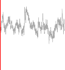

# _10.5.2 Time Series Forecasting_ 

Figure 10.14 shows historical trading statistics from the New York Stock Exchange. Shown are three daily time series covering the period December 3, 1962 to December 31, 1986:[18] 

> 17An `IMDb` leaderboard can be found at `https://paperswithcode.com/sota/ sentiment-analysis-on-imdb` . 

> 18These data were assembled by LeBaron and Weigend (1998) _IEEE Transactions on Neural Networks_ , 9(1): 213–220. 

10.5 Recurrent Neural Networks 421 

**FIGURE 10.14.** _Historical trading statistics from the New York Stock Exchange. Daily values of the normalized log trading volume, DJIA return, and log volatility are shown for a 24-year period from 1962–1986. We wish to predict trading volume on any day, given the history on all earlier days. To the left of the red bar (January 2, 1980) is training data, and to the right test data._ 

- `Log trading volume` . This is the fraction of all outstanding shares that are traded on that day, relative to a 100-day moving average of past turnover, on the log scale. 

- `Dow Jones return` . This is the difference between the log of the Dow Jones Industrial Index on consecutive trading days. 

- `Log volatility` . This is based on the absolute values of daily price movements. 

Predicting stock prices is a notoriously hard problem, but it turns out that predicting trading volume based on recent past history is more manageable (and is useful for planning trading strategies). 

An observation here consists of the measurements ( _vt, rt, zt_ ) on day _t_ , in this case the values for `log_volume` , `DJ_return` and `log_volatility` . There are a total of _T_ = 6 _,_ 051 such triples, each of which is plotted as a time series in Figure 10.14. One feature that strikes us immediately is that the dayto-day observations are not independent of each other. The series exhibit _auto-correlation_ — in this case values nearby in time tend to be similar autoto each other. This distinguishes time series from other data sets we have encountered, in which observations can be assumed to be independent of 

correlation 

422 10. Deep Learning 

**FIGURE 10.15.** _The autocorrelation function for_ `log_volume` _. We see that nearby values are fairly strongly correlated, with correlations above_ 0 _._ 2 _as far as 20 days apart._ 

each other. To be clear, consider pairs of observations ( _vt, vt−ℓ_ ), a _lag_ of _ℓ_ lag days apart. If we take all such pairs in the _vt_ series and compute their correlation coefficient, this gives the autocorrelation at lag _ℓ_ . Figure 10.15 shows the autocorrelation function for all lags up to 37, and we see considerable correlation. 

Another interesting characteristic of this forecasting problem is that the response variable _vt_ — `log_volume` — is also a predictor! In particular, we will use the past values of `log_volume` to predict values in the future. 
