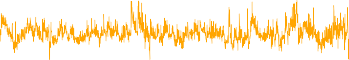

# RNN forecaster 

We wish to predict a value _vt_ from past values _vt−_ 1 _, vt−_ 2 _, . . ._ , and also to make use of past values of the other series _rt−_ 1 _, rt−_ 2 _, . . ._ and _zt−_ 1 _, zt−_ 2 _, . . ._ . Although our combined data is quite a long series with 6,051 trading days, the structure of the problem is different from the previous documentclassification example. 

- We only have one series of data, not 25,000. 

- We have an entire _series_ of targets _vt_ , and the inputs include past values of this series. 

How do we represent this problem in terms of the structure displayed in Figure 10.12? The idea is to extract many short mini-series of input sequences _X_ = _{X_ 1 _, X_ 2 _, . . . , XL}_ with a predefined length _L_ (called the _lag_ lag in this context), and a corresponding target _Y_ . They have the form

$$
Y_t = (v_t) \quad \text{and} \quad X_t = (v_{t-L}, \dots, v_{t-1})
$$

So here the target _Y_ is the value of `log_volume` _vt_ at a single timepoint _t_ , and the input sequence _X_ is the series of 3-vectors _{Xℓ}_ 1 _[L]_[each][consisting] of the three measurements `log_volume` , `DJ_return` and `log_volatility` from day _t − L_ , _t − L_ + 1, up to _t −_ 1. Each value of _t_ makes a separate ( _X, Y_ ) pair, for _t_ running from _L_ + 1 to _T_ . For the `NYSE` data we will use the past 

10.5 Recurrent Neural Networks 423 

**FIGURE 10.16.** _RNN forecast of_ `log_volume` _on the_ `NYSE` _test data. The black lines are the true volumes, and the superimposed orange the forecasts. The forecasted series accounts for 42% of the variance of_ `log_volume` _._ 

five trading days to predict the next day’s trading volume. Hence, we use _L_ = 5. Since _T_ = 6 _,_ 051, we can create 6,046 such ( _X, Y_ ) pairs. Clearly _L_ is a parameter that should be chosen with care, perhaps using validation data. 

We fit this model with _K_ = 12 hidden units using the 4,281 training sequences derived from the data before January 2, 1980 (see Figure 10.14), and then used it to forecast the 1,770 values of `log_volume` after this date. We achieve an _R_[2] = 0 _._ 42 on the test data. Details are given in Section 10.9.6. As a _straw man_ ,[19] using yesterday’s value for `log_volume` as the prediction for today has _R_[2] = 0 _._ 18. Figure 10.16 shows the forecast results. We have plotted the observed values of the daily `log_volume` for the test period 1980–1986 in black, and superimposed the predicted series in orange. The correspondence seems rather good. 

In forecasting the value of `log_volume` in the test period, we have to use the test data itself in forming the input sequences _X_ . This may feel like cheating, but in fact it is not; we are always using past data to predict the future. 

Autoregression 

The RNN we just fit has much in common with a traditional(AR) linear model, which we present now for comparison. We first consider _autoregression_ auto-regression the response sequence _vt_ alone, and construct a response vector **y** and a matrix **M** of predictors for least squares regression as follows:

$$
\mathbf{M} = \begin{pmatrix} v_1 & \dots & v_L \\ \vdots & \ddots & \vdots \\ v_{T-L} & \dots & v_{T-1} \end{pmatrix}, \quad \mathbf{y} = \begin{pmatrix} v_{L+1} \\ \vdots \\ v_{T} \end{pmatrix}
$$

**M** and **y** each have _T − L_ rows, one per observation. We see that the predictors for any given response _vt_ on day _t_ are the previous _L_ values 

> 19A straw man here refers to a simple and sensible prediction that can be used as a baseline for comparison. 

424 10. Deep Learning 

of the same series. Fitting a regression of **y** on **M** amounts to fitting the model

$$
v_t = \beta_0 + \sum_{j=1}^L \beta_j v_{t-j} + \epsilon_t
$$

and is called an order- _L_ autoregressive model, or simply AR( _L_ ). For the `NYSE` data we can include lagged versions of `DJ_return` and `log_volatility` , _rt_ and _zt_ , in the predictor matrix **M** , resulting in 3 _L_ + 1 columns. An AR model with _L_ = 5 achieves a test _R_[2] of 0 _._ 41, slightly inferior to the 0 _._ 42 achieved by the RNN. 

Of course the RNN and AR models are very similar. They both use the same response _Y_ and input sequences _X_ of length _L_ = 5 and dimension _p_ = 3 in this case. The RNN processes this sequence from left to right with the same weights **W** (for the input layer), while the AR model simply treats all _L_ elements of the sequence equally as a vector of _L × p_ predictors — a process called _flattening_ in the neural network literature. flattening Of course the RNN also includes the hidden layer activations _Aℓ_ which transfer information along the sequence, and introduces additional nonlinearity. From (10.19) with _K_ = 12 hidden units, we see that the RNN has 13 + 12 _×_ (1 + 3 + 12) = 205 parameters, compared to the 16 for the AR(5) model. 

An obvious extension of the AR model is to use the set of lagged predictors as the input vector to an ordinary feedforward neural network (10.1), and hence add more flexibility. This achieved a test _R_[2] = 0 _._ 42, slightly better than the linear AR, and the same as the RNN. 

All the models can be improved by including the variable `day_of_week` corresponding to the day _t_ of the target _vt_ (which can be learned from the calendar dates supplied with the data); trading volume is often higher on Mondays and Fridays. Since there are five trading days, this one-hot encodes to five binary variables. The performance of the AR model improved to _R_[2] = 0 _._ 46 as did the RNN, and the nonlinear AR model improved to _R_[2] = 0 _._ 47. 

We used the most simple version of the RNN in our examples here. Additional experiments with the LSTM extension of the RNN yielded small improvements, typically of up to 1% in _R_[2] in these examples. We give details of how we fit all three models in Section 10.9.6. 
