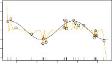

# 10.8 Interpolation and Double Descent 

Throughout this book, we have repeatedly discussed the bias-variance tradeoff, first presented in Section 2.2.2. This trade-off indicates that statistical learning methods tend to perform the best, in terms of test-set error, for an intermediate level of model complexity. In particular, if we plot “flexibility” on the _x_ -axis and error on the _y_ -axis, then we generally expect to see that test error has a U-shape, whereas training error decreases monotonically. Two “typical” examples of this behavior can be seen in the right-hand panel of Figure 2.9 on page 29, and in Figure 2.17 on page 39. One implication of the bias-variance trade-off is that it is generally not a good idea to _interpolate_ the training data — that is, to get zero training error — since interpolate that will often result in very high test error. 

However, it turns out that in certain specific settings it can be possible for a statistical learning method that interpolates the training data to perform well — or at least, better than a slightly less complex model that does not quite interpolate the data. This phenomenon is known as _double descent_ , and is displayed in Figure 10.20. “Double descent” gets its name from the fact that the test error has a U-shape before the interpolation threshold is reached, and then it descends again (for a while, at least) as an increasingly flexible model is fit. 

We now describe the set-up that resulted in Figure 10.20. We simulated _n_ = 20 observations from the model

$$
Y = \cos(2X) + \epsilon
$$

where _X ∼ U_ [ _−_ 5 _,_ 5] (uniform distribution), and _ϵ ∼ N_ (0 _, σ_[2] ) with _σ_ = 0 _._ 3. We then fit a natural spline to the data, as described in Section 7.4, with _d_ 

10.8 Interpolation and Double Descent 433 

**FIGURE 10.21.** _Fitted functions f_[ˆ] _d_ ( _X_ ) _(orange), true function f_ ( _X_ ) _(black) and the observed_ 20 _training data points. A different value of d (degrees of freedom) is used in each panel. For d ≥_ 20 _the orange curves all interpolate the training points, and hence the training error is zero._ 

degrees of freedom.[22] Recall from Section 7.4 that fitting a natural spline with _d_ degrees of freedom amounts to fitting a least-squares regression of the response onto a set of _d_ basis functions. The upper-left panel of Figure 10.21 shows the data, the true function _f_ ( _X_ ), and _f_[ˆ] 8( _X_ ), the fitted natural spline with _d_ = 8 degrees of freedom. 

Next, we fit a natural spline with _d_ = 20 degrees of freedom. Since _n_ = 20, this means that _n_ = _d_ , and we have zero training error; in other words, we have interpolated the training data! We can see from the top-right panel of Figure 10.21 that _f_[ˆ] 20( _X_ ) makes wild excursions, and hence the test error will be large. 

We now continue to fit natural splines to the data, with increasing values of _d_ . For _d >_ 20, the least squares regression of _Y_ onto _d_ basis functions is not unique: there are an infinite number of least squares coefficient estimates that achieve zero error. To select among them, we choose the one with the smallest sum of squared coefficients,[�] _[d] j_ =1 _[β]_[ˆ] _j_[2][.][This][is][known][as] the _minimum-norm_ solution. 

The two lower panels of Figure 10.21 show the minimum-norm natural spline fits with _d_ = 42 and _d_ = 80 degrees of freedom. Incredibly, _f_[ˆ] 42( _X_ ) is quite a bit _less_ less wild than _f_[ˆ] 20( _X_ ), _even though it makes use of more degrees of freedom_ . And _f_[ˆ] 80( _X_ ) is not much different. How can this be? Essentially, _f_[ˆ] 20( _X_ ) is very wild because there is just a single way to interpolate _n_ = 20 observations using _d_ = 20 basis functions, and that single way results in a somewhat extreme fitted function. By contrast, there are an 

> 22This implies the choice of _d_ knots, here chosen at _d_ equi-probability quantiles of the training data. When _d > n_ , the quantiles are found by interpolation. 

434 10. Deep Learning 

infinite number of ways to interpolate _n_ = 20 observations using _d_ = 42 or _d_ = 80 basis functions, and the smoothest of them — that is, the minimum norm solution — is much less wild than _f_[ˆ] 20( _X_ )! 

In Figure 10.20, we display the training error and test error associated with _f_[ˆ] _d_ ( _X_ ), for a range of values of the degrees of freedom _d_ . We see that the training error drops to zero once _d_ = 20 and beyond; i.e. once the interpolation threshold is reached. By contrast, the test error shows a _U_ - shape for _d ≤_ 20, grows extremely large around _d_ = 20, and then shows a second region of descent for _d >_ 20. For this example the signal-to-noise ratio — Var( _f_ ( _X_ )) _/σ_[2] — is 5 _._ 9, which is quite high (the data points are close to the true curve). So an estimate that interpolates the data and does not wander too far inbetween the observed data points will likely do well. 

In Figures 10.20 and 10.21, we have illustrated the double descent phenomenon in a simple one-dimensional setting using natural splines. However, it turns out that the same phenomenon can arise for deep learning. Basically, when we fit neural networks with a huge number of parameters, we are sometimes able to get good results with zero training error. This is particularly true in problems with high signal-to-noise ratio, such as natural image recognition and language translation, for example. This is because the techniques used to fit neural networks, including stochastic gradient descent, naturally lend themselves to selecting a “smooth” interpolating model that has good test-set performance on these kinds of problems. Some points are worth emphasizing: 

- _The double-descent phenomenon does not contradict the bias-variance trade-off, as presented in Section 2.2.2._ Rather, the double-descent curve seen in the right-hand side of Figure 10.20 is a consequence of the fact that the _x_ -axis displays the number of spline basis functions used, which does not properly capture the true “flexibility” of models that interpolate the training data. Stated another way, in this example, the minimum-norm natural spline with _d_ = 42 has lower variance than the natural spline with _d_ = 20. 

- _Most of the statistical learning methods seen in this book do not exhibit double descent._ For instance, regularization approaches typically do not interpolate the training data, and thus double descent does not occur. This is not a drawback of regularized methods: they can give great results _without interpolating the data_ ! In particular, in the examples here, if we had fit the natural splines using ridge regression with an appropriately-chosen penalty rather than least squares, then we would not have seen double descent, and in fact would have obtained better test error results. 

- _In Chapter 9, we saw that maximal margin classifiers and SVMs that have zero training error nonetheless often achieve very good test error._ This is in part because those methods seek smooth minimum norm solutions. This is similar to the fact that the minimum-norm natural spline can give good results with zero training error. 

- _The double-descent phenomenon has been used by the machine learning community to explain the successful practice of using an over-_ 

10.9 Lab: Deep Learning 435 

_parametrized neural network (many layers, and many hidden units), and then fitting all the way to zero training error._ However, fitting to zero error is not always optimal, and whether it is advisable depends on the signal-to-noise ratio. For instance, we may use ridge regularization to avoid overfitting a neural network, as in (10.31). In this case, provided that we use an appropriate choice for the tuning parameter _λ_ , we will never interpolate the training data, and thus will not see the double descent phenomenon. Nonetheless we can get very good test-set performance, likely much better than we would have achieved had we interpolated the training data. Early stopping during stochastic gradient descent can also serve as a form of regularization that prevents us from interpolating the training data, while still getting very good results on test data. 

To summarize: though double descent can sometimes occur in neural networks, we typically do not want to rely on this behavior. Moreover, it is important to remember that the bias-variance trade-off always holds (though it is possible that test error as a function of flexibility may not exhibit a U-shape, depending on how we have parametrized the notion of “flexibility” on the _x_ -axis). 
