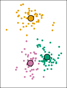
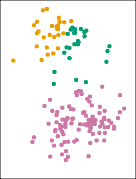

# **Algorithm 12.2** _K-Means Clustering_ 

1. Randomly assign a number, from 1 to _K_ , to each of the observations. These serve as initial cluster assignments for the observations. 

2. Iterate until the cluster assignments stop changing: 

   - (a) For each of the _K_ clusters, compute the cluster _centroid_ . The _k_ th cluster centroid is the vector of the _p_ feature means for the observations in the _k_ th cluster. 

   - (b) Assign each observation to the cluster whose centroid is closest (where _closest_ is defined using Euclidean distance). 

Algorithm 12.2 is guaranteed to decrease the value of the objective (12.17) at each step. To understand why, the following identity is illuminating:

$$
\frac{1}{|C_k|} \sum_{i, i' \in C_k} \sum_{j=1}^p (x_{ij} - x_{i'j})^2 = 2 \sum_{i \in C_k} \sum_{j=1}^p (x_{ij} - \bar{x}_{kj})^2 \quad (12.19)
$$

where _x_ ¯ _kj_ = _|C_ 1 _k|_ � _i∈Ck[x][ij]_[is][the][mean][for][feature] _[j]_[in][cluster] _[C][k]_[.] In Step 2(a) the cluster means for each feature are the constants that minimize the sum-of-squared deviations, and in Step 2(b), reallocating the observations can only improve (12.18). This means that as the algorithm is run, the clustering obtained will continually improve until the result no longer changes; the objective of (12.17) will never increase. When the result no longer changes, a _local optimum_ has been reached. Figure 12.8 shows the progression of the algorithm on the toy example from Figure 12.7. _K_ -means clustering derives its name from the fact that in Step 2(a), the cluster centroids are computed as the mean of the observations assigned to each cluster. 

Because the _K_ -means algorithm finds a local rather than a global optimum, the results obtained will depend on the initial (random) cluster assignment of each observation in Step 1 of Algorithm 12.2. For this reason, it is important to run the algorithm multiple times from different random 

524 12. Unsupervised Learning 

**FIGURE 12.8.** _The progress of the K-means algorithm on the example of Figure 12.7 with K=3._ Top left: _the observations are shown._ Top center: _in Step 1 of the algorithm, each observation is randomly assigned to a cluster._ Top right: _in Step 2(a), the cluster centroids are computed. These are shown as large colored disks. Initially the centroids are almost completely overlapping because the initial cluster assignments were chosen at random._ Bottom left: _in Step 2(b), each observation is assigned to the nearest centroid._ Bottom center: _Step 2(a) is once again performed, leading to new cluster centroids._ Bottom right: _the results obtained after ten iterations._ 

initial configurations. Then one selects the _best_ solution, i.e. that for which the objective (12.17) is smallest. Figure 12.9 shows the local optima obtained by running _K_ -means clustering six times using six different initial cluster assignments, using the toy data from Figure 12.7. In this case, the best clustering is the one with an objective value of 235.8. 

As we have seen, to perform _K_ -means clustering, we must decide how many clusters we expect in the data. The problem of selecting _K_ is far from simple. This issue, along with other practical considerations that arise in performing _K_ -means clustering, is addressed in Section 12.4.3. 

12.4 Clustering Methods 525 

**FIGURE 12.9.** _K-means clustering performed six times on the data from Figure 12.7 with K_ = 3 _, each time with a different random assignment of the observations in Step 1 of the K-means algorithm. Above each plot is the value of the objective (12.17). Three different local optima were obtained, one of which resulted in a smaller value of the objective and provides better separation between the clusters. Those labeled in red all achieved the same best solution, with an objective value of 235.8._ 
