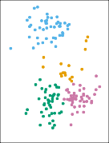

# _12.4.1 K-Means Clustering_ 

_K_ -means clustering is a simple and elegant approach for partitioning a data set into _K_ distinct, non-overlapping clusters. To perform _K_ -means clustering, we must first specify the desired number of clusters _K_ ; then the _K_ -means algorithm will assign each observation to exactly one of the _K_ clusters. Figure 12.7 shows the results obtained from performing _K_ -means clustering on a simulated example consisting of 150 observations in two dimensions, using three different values of _K_ . 

The _K_ -means clustering procedure results from a simple and intuitive mathematical problem. We begin by defining some notation. Let _C_ 1 _, . . . , CK_ denote sets containing the indices of the observations in each cluster. These sets satisfy two properties: 

1. _C_ 1 _∪ C_ 2 _∪· · · ∪ CK_ = _{_ 1 _, . . . , n}_ . In other words, each observation belongs to at least one of the _K_ clusters. 

2. _Ck ∩ Ck′_ = _∅_ for all _k_ = _k[′]_ . In other words, the clusters are nonoverlapping: no observation belongs to more than one cluster. 

522 12. Unsupervised Learning 

**FIGURE 12.7.** _A simulated data set with 150 observations in two-dimensional space. Panels show the results of applying K-means clustering with different values of K, the number of clusters. The color of each observation indicates the cluster to which it was assigned using the K-means clustering algorithm. Note that there is no ordering of the clusters, so the cluster coloring is arbitrary. These cluster labels were not used in clustering; instead, they are the outputs of the clustering procedure._ 

For instance, if the _i_ th observation is in the _k_ th cluster, then _i ∈ Ck_ . The idea behind _K_ -means clustering is that a _good_ clustering is one for which the _within-cluster variation_ is as small as possible. The within-cluster variation for cluster _Ck_ is a measure _W_ ( _Ck_ ) of the amount by which the observations within a cluster differ from each other. Hence we want to solve the problem

$$
\underset{C_1, \dots, C_K}{\text{minimize}} \left\{ \sum_{k=1}^K W(C_k) \right\} \quad (12.16)
$$

In words, this formula says that we want to partition the observations into _K_ clusters such that the total within-cluster variation, summed over all _K_ clusters, is as small as possible. 

Solving (12.15) seems like a reasonable idea, but in order to make it actionable we need to define the within-cluster variation. There are many possible ways to define this concept, but by far the most common choice involves _squared Euclidean distance_ . That is, we define

$$
W(C_k) = \frac{1}{|C_k|} \sum_{i, i' \in C_k} \sum_{j=1}^p (x_{ij} - x_{i'j})^2 \quad (12.17)
$$

where _|Ck|_ denotes the number of observations in the _k_ th cluster. In other words, the within-cluster variation for the _k_ th cluster is the sum of all of the pairwise squared Euclidean distances between the observations in the _k_ th cluster, divided by the total number of observations in the _k_ th cluster. Combining (12.15) and (12.16) gives the optimization problem that defines 

12.4 Clustering Methods 523 

_K_ -means clustering, 

$$
\underset{C_1, \dots, C_K}{\text{minimize}} \left\{ \sum_{k=1}^K \frac{1}{|C_k|} \sum_{i, i' \in C_k} \sum_{j=1}^p (x_{ij} - x_{i'j})^2 \right\} \quad (12.18)
$$

Now, we would like to find an algorithm to solve (12.17)—that is, a method to partition the observations into _K_ clusters such that the objective of (12.17) is minimized. This is in fact a very difficult problem to solve precisely, since there are almost _K[n]_ ways to partition _n_ observations into _K_ clusters. This is a huge number unless _K_ and _n_ are tiny! Fortunately, a very simple algorithm can be shown to provide a local optimum—a _pretty good solution_ —to the _K_ -means optimization problem (12.17). This approach is laid out in Algorithm 12.2. 

---

## Sub-Chapters (하위 목차)

### Algorithm 12.2 K-Means Clustering (K-평균 알고리즘)
* [문서로 이동하기](./12_4_1_1_algorithm_12.2_k-means_clustering/)

각 노드들의 중심(Centroid)을 구하고 데이터를 계속 가까운 중심으로 재배정하는 과정을 더 이상 이동이 없을 때까지 반복하는 휴리스틱 루프 방식을 봅니다.
