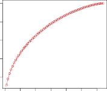

# _12.5.4 NCI60 Data Example_ 

Unsupervised techniques are often used in the analysis of genomic data. In particular, PCA and hierarchical clustering are popular tools. We illustrate these techniques on the `NCI60` cancer cell line microarray data, which consists of 6830 gene expression measurements on 64 cancer cell lines. 

```
In [47]:NCI60=load_data('NCI60')
nci_labs=NCI60['labels']
nci_data=NCI60['data']
```

Each cell line is labeled with a cancer type. We do not make use of the cancer types in performing PCA and clustering, as these are unsupervised techniques. But after performing PCA and clustering, we will check to see the extent to which these cancer types agree with the results of these unsupervised techniques. 

The data has 64 rows and 6830 columns. 

```
In [48]:nci_data.shape
```

```
Out[48]:(64,6830)
```

We begin by examining the cancer types for the cell lines. 

```
In [49]:nci_labs.value_counts()
```

|**`Out[49]:`**|`label`||
|---|---|---|
||`NSCLC`|`9`|
||`RENAL`|`9`|
||`MELANOMA`|`8`|
||`BREAST`|`7`|
||`COLON`|`7`|
||`LEUKEMIA`|`6`|
||`OVARIAN`|`6`|


12.5 Lab: Unsupervised Learning 

547 

```
CNS5
PROSTATE2
K562A-repro1
K562B-repro1
MCF7A-repro1
MCF7D-repro1
UNKNOWN1
dtype:int64
```

PCA on the NCI60 Data 

We first perform PCA on the data after scaling the variables (genes) to have standard deviation one, although here one could reasonably argue that it is better not to scale the genes as they are measured in the same units. 

```
In [50]:scaler=StandardScaler()
nci_scaled=scaler.fit_transform(nci_data)
nci_pca=PCA()
nci_scores=nci_pca.fit_transform(nci_scaled)
```

We now plot the first few principal component score vectors, in order to visualize the data. The observations (cell lines) corresponding to a given cancer type will be plotted in the same color, so that we can see to what extent the observations within a cancer type are similar to each other. 

```
In [51]:cancer_types=list(np.unique(nci_labs))
nci_groups=np.array([cancer_types.index(lab)
forlabinnci_labs.values])
fig,axes=plt.subplots(1,2,figsize=(15,6))
ax=axes[0]
ax.scatter(nci_scores[:,0],
nci_scores[:,1],
c=nci_groups,
marker='o',
s=50)
ax.set_xlabel('PC1');ax.set_ylabel('PC2')
ax=axes[1]
ax.scatter(nci_scores[:,0],
nci_scores[:,2],
c=nci_groups,
marker='o',
s=50)
ax.set_xlabel('PC1');ax.set_ylabel('PC3');
```

The resulting plots are shown in Figure 12.17. On the whole, cell lines corresponding to a single cancer type do tend to have similar values on the first few principal component score vectors. This indicates that cell lines from the same cancer type tend to have pretty similar gene expression levels. 

We can also plot the percent variance explained by the principal components as well as the cumulative percent variance explained. This is similar to the plots we made earlier for the `USArrests` data. 

```
In [52]:fig,axes=plt.subplots(1,2,figsize=(15,6))
ax=axes[0]
ticks=np.arange(nci_pca.n_components_)+1
```

548 12. Unsupervised Learning 


**FIGURE 12.17.** _Projections of the_ `NCI60` _cancer cell lines onto the first three principal components (in other words, the scores for the first three principal components). On the whole, observations belonging to a single cancer type tend to lie near each other in this low-dimensional space. It would not have been possible to visualize the data without using a dimension reduction method such as PCA, since based on the full data set there are_ �6 _,_ 8302 � _possible scatterplots, none of which would have been particularly informative._ 

```
ax.plot(ticks,
nci_pca.explained_variance_ratio_ ,
marker='o')
ax.set_xlabel('PrincipalComponent');
ax.set_ylabel('PVE')
ax=axes[1]
ax.plot(ticks,
nci_pca.explained_variance_ratio_.cumsum(),
marker='o');
ax.set_xlabel('PrincipalComponent')
ax.set_ylabel('CumulativePVE');
```

The resulting plots are shown in Figure 12.18. 

We see that together, the first seven principal components explain around 40% of the variance in the data. This is not a huge amount of the variance. However, looking at the scree plot, we see that while each of the first seven principal components explain a substantial amount of variance, there is a marked decrease in the variance explained by further principal components. That is, there is an _elbow_ in the plot after approximately the seventh principal component. This suggests that there may be little benefit to examining more than seven or so principal components (though even examining seven principal components may be difficult). 

Clustering the Observations of the NCI60 Data 

We now perform hierarchical clustering of the cell lines in the `NCI60` data using complete, single, and average linkage. Once again, the goal is to find out whether or not the observations cluster into distinct types of cancer. Euclidean distance is used as the dissimilarity measure. We first write a short function to produce the three dendrograms. 

12.5 Lab: Unsupervised Learning 549 



**FIGURE 12.18.** _The PVE of the principal components of the_ `NCI60` _cancer cell line microarray data set._ Left: _the PVE of each principal component is shown._ Right: _the cumulative PVE of the principal components is shown. Together, all principal components explain 100,% of the variance._ 

```
In [53]:defplot_nci(linkage,ax,cut=-np.inf):
cargs={'above_threshold_color':'black',
'color_threshold':cut}
hc=HClust(n_clusters=None,
distance_threshold=0,
linkage=linkage.lower()).fit(nci_scaled)
linkage_=compute_linkage(hc)
dendrogram(linkage_,
ax=ax,
labels=np.asarray(nci_labs),
leaf_font_size=10,
**cargs)
ax.set_title('%sLinkage'%linkage)
returnhc
```

Let’s plot our results. 

```
In [54]:fig,axes=plt.subplots(3,1,figsize=(15,30))
ax=axes[0];hc_comp=plot_nci('Complete',ax)
ax=axes[1];hc_avg=plot_nci('Average',ax)
ax=axes[2];hc_sing=plot_nci('Single',ax)
```

The results are shown in Figure 12.19. We see that the choice of linkage certainly does affect the results obtained. Typically, single linkage will tend to yield _trailing_ clusters: very large clusters onto which individual observations attach one-by-one. On the other hand, complete and average linkage tend to yield more balanced, attractive clusters. For this reason, complete and average linkage are generally preferred to single linkage. Clearly cell lines within a single cancer type do tend to cluster together, although the clustering is not perfect. We will use complete linkage hierarchical clustering for the analysis that follows. 

550 12. Unsupervised Learning 


**FIGURE 12.19.** _The_ `NCI60` _cancer cell line microarray data, clustered with average, complete, and single linkage, and using Euclidean distance as the dissimilarity measure. Complete and average linkage tend to yield evenly sized clusters whereas single linkage tends to yield extended clusters to which single leaves are fused one by one._ 

12.5 Lab: Unsupervised Learning 551 

We can cut the dendrogram at the height that will yield a particular number of clusters, say four: 

```
In [55]:linkage_comp=compute_linkage(hc_comp)
comp_cut=cut_tree(linkage_comp ,n_clusters=4).reshape(-1)
pd.crosstab(nci_labs['label'],
pd.Series(comp_cut.reshape(-1),name='Complete'))
```

There are some clear patterns. All the leukemia cell lines fall in one cluster, while the breast cancer cell lines are spread out over three different clusters. 

We can plot a cut on the dendrogram that produces these four clusters: 

```
In [56]:fig,ax=plt.subplots(figsize=(10,10))
plot_nci('Complete',ax,cut=140)
ax.axhline(140,c='r',linewidth=4);
```

The `axhline()` function draws a horizontal line line on top of any existing set of axes. The argument `140` plots a horizontal line at height 140 on the dendrogram; this is a height that results in four distinct clusters. It is easy to verify that the resulting clusters are the same as the ones we obtained in `comp_cut` . 

We claimed earlier in Section 12.4.2 that _K_ -means clustering and hierarchical clustering with the dendrogram cut to obtain the same number of clusters can yield very different results. How do these `NCI60` hierarchical clustering results compare to what we get if we perform _K_ -means clustering with _K_ = 4? 

```
In [57]:nci_kmeans=KMeans(n_clusters=4,
random_state=0,
n_init=20).fit(nci_scaled)
pd.crosstab(pd.Series(comp_cut,name='HClust'),
pd.Series(nci_kmeans.labels_,name='K-means'))
```

```
Out[57]:K-means0123
HClust
028390
17000
20008
30900
```

We see that the four clusters obtained using hierarchical clustering and _K_ -means clustering are somewhat different. First we note that the labels in the two clusterings are arbitrary. That is, swapping the identifier of the cluster does not change the clustering. We see here Cluster 3 in _K_ -means clustering is identical to cluster 2 in hierarchical clustering. However, the other clusters differ: for instance, cluster 0 in _K_ -means clustering contains a portion of the observations assigned to cluster 0 by hierarchical clustering, as well as all of the observations assigned to cluster 1 by hierarchical clustering. 

Rather than performing hierarchical clustering on the entire data matrix, we can also perform hierarchical clustering on the first few principal component score vectors, regarding these first few components as a less noisy version of the data. 

552 12. Unsupervised Learning 

**`In [58]:`** 

`hc_pca = HClust(n_clusters=None, distance_threshold=0, linkage='complete' ).fit(nci_scores[:,:5]) linkage_pca = compute_linkage(hc_pca) fig, ax = plt.subplots(figsize=(8,8)) dendrogram(linkage_pca , labels=np.asarray(nci_labs), leaf_font_size=10, ax=ax, **cargs) ax.set_title("Hier. Clust. on First Five Score Vectors") pca_labels = pd.Series(cut_tree(linkage_pca , n_clusters=4).reshape(-1), name='Complete-PCA') pd.crosstab(nci_labs['label'], pca_labels)` 
