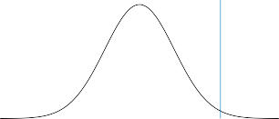

# Step 1: Define the Null and Alternative Hypotheses 

In hypothesis testing, we divide the world into two possibilities: the _null hypothesis_ and the _alternative hypothesis_ . The null hypothesis, denoted _H_ 0, null is the default state of belief about the world.[4] For instance, null hypotheses associated with the two questions posed earlier in this chapter are as follows: 

hypothesis alternative hypothesis 

1. The true coefficient _βj_ in a linear regression of _Y_ onto _X_ 1 _, . . . , Xp_ equals zero. 

2. There is no difference between the expected blood pressure of mice in the control and treatment groups. 

The null hypothesis is boring by construction: it may well be true, but we might hope that our data will tell us otherwise. 

The alternative hypothesis, denoted _Ha_ , represents something different and unexpected: for instance, that there _is_ a difference between the expected blood pressure of the mice in the two groups. Typically, the alternative hypothesis simply posits that the null hypothesis does not hold: if the null hypothesis states that _there is no difference between A and B_ , then the alternative hypothesis states that _there is a difference between A and B_ . 

It is important to note that the treatment of _H_ 0 and _Ha_ is asymmetric. _H_ 0 is treated as the default state of the world, and we focus on using data to reject _H_ 0. If we reject _H_ 0, then this provides evidence in favor of _Ha_ . We can think of rejecting _H_ 0 as making a _discovery_ about our data: namely, we are discovering that _H_ 0 does not hold! By contrast, if we fail to reject _H_ 0, then our findings are more nebulous: we will not know whether we failed to reject _H_ 0 because our sample size was too small (in which case testing _H_ 0 again on a larger or higher-quality dataset might lead to rejection), or whether we failed to reject _H_ 0 because _H_ 0 really holds. 

Step 2: Construct the Test Statistic 

Next, we wish to use our data in order to find evidence for or against the null hypothesis. In order to do this, we must compute a _test statistic_ , test statistic denoted _T_ , which summarizes the extent to which our data are consistent with _H_ 0. The way in which we construct _T_ depends on the nature of the null hypothesis that we are testing. 

To make things concrete, let _x[t]_ 1 _[, . . . , x][t] nt_[denote][the][blood][pressure][mea-] surements for the _nt_ mice in the treatment group, and let _x[c]_ 1 _[, . . . , x][c] nc_[denote] the blood pressure measurements for the _nc_ mice in the control group, and _µt_ = E( _X[t]_ ), _µc_ = E( _X[c]_ ). To test _H_ 0 : _µt_ = _µc_ , we make use of a _two-sample t-statistic_ ,[5] defined as 

two-sample _t_ -statistic 

> 4 _H_ 0 is pronounced “H naught” or “H zero”. 

560 13. Multiple Testing 

**FIGURE 13.1.** _The density function for the N_ (0 _,_ 1) _distribution, with the vertical line indicating a value of_ 2 _._ 33 _. 1% of the area under the curve falls to the right of the vertical line, so there is only a 2% chance of observing a N_ (0 _,_ 1) _value that is greater than_ 2 _._ 33 _or less than −_ 2 _._ 33 _. Therefore, if a test statistic has a N_ (0 _,_ 1) _null distribution, then an observed test statistic of T_ = 2 _._ 33 _leads to a p-value of 0.02._

$$
T = \frac{\hat{\mu}_t - \hat{\mu}_c}{s \sqrt{1/n_t + 1/n_c}} \quad (13.1)
$$

where _µ_ ˆ _t_ = _n_ 1 _t_ � _ni_ =1 _t[x] i[t]_[,] _[µ]_[ˆ] _[c]_[=] _n_ 1 _c_ � _ni_ =1 _c[x] i[c]_[,][and] 

is an estimator of the pooled standard deviation of the two samples.[6] Here, _s_[2] _t_[and] _[s]_[2] _c_[are][unbiased][estimators][of][the][variance][of][the][blood][pressure][in] the treatment and control groups, respectively. A large (absolute) value of _T_ provides evidence against _H_ 0 : _µt_ = _µc_ , and hence evidence in support of _Ha_ : _µt_ = _µc_ . 

Step 3: Compute the _p_ -Value 

In the previous section, we noted that a large (absolute) value of a twosample _t_ -statistic provides evidence against _H_ 0. This begs the question: _how large is large?_ In other words, how much evidence against _H_ 0 is provided by a given value of the test statistic? 

The notion of a _p-value_ provides us with a way to formalize as well as _p_ -value answer this question. The _p_ -value is defined as the probability of observing a test statistic equal to or more extreme than the observed statistic, _under the assumption that H_ 0 _is in fact true_ . Therefore, a small _p_ -value provides evidence _against H_ 0. 

> 5The _t_ -statistic derives its name from the fact that, under _H_ 0, it follows a _t_ - distribution. 

> 6Note that (13.2) assumes that the control and treatment groups have equal variance. Without this assumption, (13.2) would take a slightly different form. 

13.1 A Quick Review of Hypothesis Testing 561 

To make this concrete, suppose that _T_ = 2 _._ 33 for the test statistic in (13.1). Then, we can ask: what is the probability of having observed such a large value of _T_ , if indeed _H_ 0 holds? It turns out that under _H_ 0, the distribution of _T_ in (13.1) follows approximately a _N_ (0 _,_ 1) distribution[7] — that is, a normal distribution with mean 0 and variance 1. This distribution is displayed in Figure 13.1. We see that the vast majority — 98% — of the _N_ (0 _,_ 1) distribution falls between _−_ 2 _._ 33 and 2 _._ 33. This means that under _H_ 0, we would expect to see such a large value of _|T |_ only 2% of the time. Therefore, the _p_ -value corresponding to _T_ = 2 _._ 33 is 0 _._ 02. 

The distribution of the test statistic under _H_ 0 (also known as the test statistic’s _null distribution_ ) will depend on the details of what type of null null hypothesis is being tested, and what type of test statistic is used. In general, most commonly-used test statistics follow a well-known statistical distribution under the null hypothesis — such as a normal distribution, a _t_ -distribution, a _χ_[2] -distribution, or an _F_ -distribution — provided that the sample size is sufficiently large and that some other assumptions hold. Typically, the `R` function that is used to compute a test statistic will make use of this null distribution in order to output a _p_ -value. In Section 13.5, we will see an approach to estimate the null distribution of a test statistic using re-sampling; in many contemporary settings, this is a very attractive option, as it exploits the availability of fast computers in order to avoid having to make potentially problematic assumptions about the data. 

distribution 

The _p_ -value is perhaps one of the most used and abused notions in all of statistics. In particular, it is sometimes said that the _p_ -value is the probability that _H_ 0 holds, i.e., that the null hypothesis is true. This is not correct! The one and only correct interpretation of the _p_ -value is as the fraction of the time that we would expect to see such an extreme value of the test statistic[8] if we repeated the experiment many many times, _provided H_ 0 _holds_ . 

In Step 2 we computed a test statistic, and noted that a large (absolute) value of the test statistic provides evidence against _H_ 0. In Step 3 the test statistic was converted to a _p_ -value, with small _p_ -values providing evidence against _H_ 0. What, then, did we accomplish by converting the test statistic from Step 2 into a _p_ -value in Step 3? To answer this question, suppose a data analyst conducts a statistical test, and reports a test statistic of _T_ = 17 _._ 3. Does this provide strong evidence against _H_ 0? It’s impossible to know, without more information: in particular, we would need to know 

7More precisely, assuming that the observations are drawn from a normal distribution, then _T_ follows a _t_ -distribution with _nt_ + _nc −_ 2 degrees of freedom. Provided that _nt_ + _nc −_ 2 is larger than around 40, this is very well-approximated by a _N_ (0 _,_ 1) distribution. In Section 13.5, we will see an alternative and often more attractive way to approximate the null distribution of _T_ , which avoids making stringent assumptions about the data. 8A _one-sided p_ -value is the probability of seeing such an extreme value of the test statistic; e.g. the probability of seeing a test statistic greater than or equal to _T_ = 2 _._ 33. A _two-sided p_ -value is the probability of seeing such an extreme value of the _absolute_ test statistic; e.g. the probability of seeing a test statistic greater than or equal to 2 _._ 33 or less than or equal to _−_ 2 _._ 33. The default recommendation is to report a two-sided _p_ -value rather than a one-sided _p_ -value, unless there is a clear and compelling reason that only one direction of the test statistic is of scientific interest. 

562 13. Multiple Testing 

|13. Multiple Testing||
|---|---|
||**Truth** _H_0 _Ha_|
|**Decision** Reject _H_0 Do Not Reject _H_0|Type I Error Correct Correct Type II Error|

**TABLE 13.1.** _A summary of the possible scenarios associated with testing the null hypothesis H_ 0 _. Type I errors are also known as false positives, and Type II errors as false negatives._ 

what value of the test statistic should be expected, under _H_ 0. This is exactly what a _p_ -value gives us. In other words, a _p_ -value allows us to transform our test statistic, which is measured on some arbitrary and uninterpretable scale, into a number between 0 and 1 that can be more easily interpreted. 
