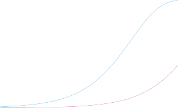

# _13.3.1 What is the Family-Wise Error Rate?_ 

Recall that the Type I error rate is the probability of rejecting _H_ 0 if _H_ 0 is true. The _family-wise error rate_ (FWER) generalizes this notion to the set- family-wise ting of _m_ null hypotheses, _H_ 01 _, . . . , H_ 0 _m_ , and is defined as the probability error rate of making _at least one_ Type I error. To state this idea more formally, consider Table 13.2, which summarizes the possible outcomes when performing _m_ hypothesis tests. Here, _V_ represents the number of Type I errors (also known as false positives or false discoveries), _S_ the number of true positives, _U_ the number of true negatives, and _W_ the number of Type II errors (also known as false negatives). Then the family-wise error rate is given by

$$
\text{FWER} = \Pr(V \ge 1) \quad (13.2)
$$

A strategy of rejecting any null hypothesis for which the _p_ -value is below _α_ (i.e. controlling the Type I error for each null hypothesis at level _α_ ) leads to a FWER of

$$
\text{FWER} = 1 - (1 - \alpha)^m \quad (13.3)
$$

Recall from basic probability that if two events _A_ and _B_ are independent, then Pr( _A ∩ B_ ) = Pr( _A_ ) Pr( _B_ ). Therefore, if we make the additional rather strong assumptions that the _m_ tests are independent and that all _m_ null hypotheses are true, then

$$
\text{FWER} = 1 - (1 - \alpha)^m \approx m\alpha \quad (13.4)
$$

566 13. Multiple Testing 

**FIGURE 13.2.** _The family-wise error rate, as a function of the number of hypotheses tested (displayed on the log scale), for three values of α: α_ = 0 _._ 05 _(orange), α_ = 0 _._ 01 _(blue), and α_ = 0 _._ 001 _(purple). The dashed line indicates_ 0 _._ 05 _. For example, in order to control the FWER at_ 0 _._ 05 _when testing m_ = 50 _null hypotheses, we must control the Type I error for each null hypothesis at level α_ = 0 _._ 001 _._ 

Hence, if we test only one null hypothesis, then FWER( _α_ ) = 1 _−_ (1 _− α_ )[1] = _α_ , so the Type I error rate and the FWER are equal. However, if we perform _m_ = 100 independent tests, then FWER( _α_ ) = 1 _−_ (1 _− α_ )[100] . For instance, taking _α_ = 0 _._ 05 leads to a FWER of 1 _−_ (1 _−_ 0 _._ 05)[100] = 0 _._ 994. In other words, we are virtually guaranteed to make at least one Type I error! 

Figure 13.2 displays (13.5) for various values of _m_ , the number of hypotheses, and _α_ , the Type I error. We see that setting _α_ = 0 _._ 05 results in a high FWER even for moderate _m_ . With _α_ = 0 _._ 01, we can test no more than five null hypotheses before the FWER exceeds 0 _._ 05. Only for very small values, such as _α_ = 0 _._ 001, do we manage to ensure a small FWER, at least for moderately-sized _m_ . 

We now briefly return to the example in Section 13.1.1, in which we consider testing a single null hypothesis of the form _H_ 0 : _µt_ = _µc_ using a two-sample _t_ -statistic. Recall from Figure 13.1 that in order to guarantee that the Type I error does not exceed 0 _._ 02, we decide whether or not to reject _H_ 0 using a cutpoint of 2 _._ 33 (i.e. we reject _H_ 0 if _|T | ≥_ 2 _._ 33). Now, what if we wish to test 10 null hypotheses using two-sample _t_ -statistics, instead of just one? We will see in Section 13.3.2 that we can guarantee that the FWER does not exceed 0 _._ 02 by rejecting only null hypotheses for which the _p_ -value falls below 0 _._ 002. This corresponds to a much more stringent cutpoint of 3 _._ 09 (i.e. we should reject _H_ 0 _j_ only if its test statistic _|Tj| ≥_ 3 _._ 09, for _j_ = 1 _, . . . ,_ 10). In other words, controlling the FWER at level _α_ amounts to a much higher bar, in terms of evidence required to reject any given null hypothesis, than simply controlling the Type I error for each null hypothesis at level _α_ . 

13.3 The Family-Wise Error Rate 567 

||13.3 The Family-Wise Error Rate 5|
|---|---|
|Manager|Mean, ¯_x_ Standard Deviation, _s_ _t_-statistic _p_-value|
|One Two Three Four Five|3.0 7.4 2.86 0.006 -0.1 6.9 -0.10 0.918 2.8 7.5 2.62 0.012 0.5 6.7 0.53 0.601 0.3 6.8 0.31 0.756|

**TABLE 13.3.** _The first two columns correspond to the sample mean and sample standard deviation of the percentage excess return, over n_ = 50 _months, for the first five managers in the_ `Fund` _dataset. The last two columns provide the t-statistic ([√] n · X/S_[¯] _) and associated p-value for testing H_ 0 _j_ : _µj_ = 0 _, the null hypothesis that the (population) mean return for the jth hedge fund manager equals zero._ 
