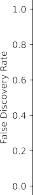

# _13.6.4 A Re-Sampling Approach_ 

Here, we implement the re-sampling approach to hypothesis testing using the `Khan` dataset, which we investigated in Section 13.5. First, we merge the training and testing data, which results in observations on 83 patients for 2,308 genes. 

```
In [23]:Khan=load_data('Khan')
D=pd.concat([Khan['xtrain'],Khan['xtest']])
D['Y']=pd.concat([Khan['ytrain'],Khan['ytest']])
D['Y'].value_counts()
```

```
Out[23]:
```

```
229
425
318
111
Name:Y,dtype:int64
```

There are four classes of cancer. For each gene, we compare the mean expression in the second class (rhabdomyosarcoma) to the mean expression in the fourth class (Burkitt’s lymphoma). Performing a standard two-sample _t_ -test using `ttest_ind()` from `scipy.stats` on the 11th gene produces a `ttest_ind()` test-statistic of -2.09 and an associated _p_ -value of 0.0412, suggesting modest evidence of a difference in mean expression levels between the two cancer types. 

```
In [24]:D2=D[lambdadf:df['Y']==2]
D4=D[lambdadf:df['Y']==4]
gene_11='G0011'
observedT,pvalue=ttest_ind(D2[gene_11],
D4[gene_11],
equal_var=True)
observedT,pvalue
```

```
Out[24]:(-2.094,0.041)
```

However, this _p_ -value relies on the assumption that under the null hypothesis of no difference between the two groups, the test statistic follows a _t_ -distribution with 29 + 25 _−_ 2 = 52 degrees of freedom. Instead of using this theoretical null distribution, we can randomly split the 54 patients into two groups of 29 and 25, and compute a new test statistic. Under the null hypothesis of no difference between the groups, this new test statistic should have the same distribution as our original one. Repeating this 

13.6 Lab: Multiple Testing 591 

process 10,000 times allows us to approximate the null distribution of the test statistic. We compute the fraction of the time that our observed test statistic exceeds the test statistics obtained via re-sampling. 

```
In [25]:B=10000
Tnull=np.empty(B)
D_=np.hstack([D2[gene_11],D4[gene_11]])
n_=D2[gene_11].shape[0]
D_null=D_.copy()
forbinrange(B):
rng.shuffle(D_null)
ttest_=ttest_ind(D_null[:n_],
D_null[n_:],
equal_var=True)
Tnull[b]=ttest_.statistic
(np.abs(Tnull)>np.abs(observedT)).mean()
```

```
Out[25]:0.0398
```

This fraction, 0.0398, is our re-sampling-based _p_ -value. It is almost identical to the _p_ -value of 0.0412 obtained using the theoretical null distribution. We can plot a histogram of the re-sampling-based test statistics in order to reproduce Figure 13.7. 

```
In [26]:fig,ax=plt.subplots(figsize=(8,8))
ax.hist(Tnull,
bins=100,
density=True,
facecolor='y',
label='Null')
xval=np.linspace(-4.2,4.2,1001)
ax.plot(xval,
t_dbn.pdf(xval,D_.shape[0]-2),
c='r')
ax.axvline(observedT,
c='b',
label='Observed')
ax.legend()
ax.set_xlabel("NullDistributionofTestStatistic");
```

The re-sampling-based null distribution is almost identical to the theoretical null distribution, which is displayed in red. 

Finally, we implement the plug-in re-sampling FDR approach outlined in Algorithm 13.4. Depending on the speed of your computer, calculating the FDR for all 2,308 genes in the `Khan` dataset may take a while. Hence, we will illustrate the approach on a random subset of 100 genes. For each gene, we first compute the observed test statistic, and then produce 10,000 re-sampled test statistics. This may take a few minutes to run. If you are in a rush, then you could set `B` equal to a smaller value (e.g. `B=500` ). 

```
In [27]:m,B=100,10000
idx=rng.choice(Khan['xtest'].columns,m,replace=False)
T_vals=np.empty(m)
Tnull_vals=np.empty((m,B))
forjinrange(m):
col=idx[j]
```

13. Multiple Testing 

592 

```
T_vals[j]=ttest_ind(D2[col],
D4[col],
equal_var=True).statistic
D_=np.hstack([D2[col],D4[col]])
D_null=D_.copy()
forbinrange(B):
rng.shuffle(D_null)
ttest_=ttest_ind(D_null[:n_],
D_null[n_:],
equal_var=True)
Tnull_vals[j,b]=ttest_.statistic
```

Next, we compute the number of rejected null hypotheses _R_ , the estimated number of false positives _V_[�] , and the estimated FDR, for a range of threshold values _c_ in Algorithm 13.4. The threshold values are chosen using the absolute values of the test statistics from the 100 genes. 

```
In [28]:cutoffs=np.sort(np.abs(T_vals))
FDRs,Rs,Vs=np.empty((3,m))
forjinrange(m):
R=np.sum(np.abs(T_vals)>=cutoffs[j])
V=np.sum(np.abs(Tnull_vals)>=cutoffs[j])/B
Rs[j]=R
Vs[j]=V
FDRs[j]=V/R
```

Now, for any given FDR, we can find the genes that will be rejected. For example, with FDR controlled at 0.1, we reject 15 of the 100 null hypotheses. On average, we would expect about one or two of these genes (i.e. 10% of 15) to be false discoveries. At an FDR of 0.2, we can reject the null hypothesis for 28 genes, of which we expect around six to be false discoveries. 

The variable `idx` stores which genes were included in our 100 randomlyselected genes. Let’s look at the genes whose estimated FDR is less than 0.1. 

```
In [29]:sorted(idx[np.abs(T_vals)>=cutoffs[FDRs<0.1].min()])
```

At an FDR threshold of 0.2, more genes are selected, at the cost of having a higher expected proportion of false discoveries. 

```
In [30]:sorted(idx[np.abs(T_vals)>=cutoffs[FDRs<0.2].min()])
```

The next line generates Figure 13.11, which is similar to Figure 13.9, except that it is based on only a subset of the genes. 

```
In [31]:fig,ax=plt.subplots()
ax.plot(Rs,FDRs,'b',linewidth=3)
ax.set_xlabel("NumberofRejections")
ax.set_ylabel("FalseDiscoveryRate");
```

13.7 Exercises 593 



**FIGURE 13.11.** _The estimated false discovery rate versus the number of rejected null hypotheses, for 100 genes randomly selected from the_ `Khan` _dataset._ 
