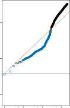

# FDR _≤ q._ 

In other words, this procedure ensures that, on average, no more than a fraction _q_ of the rejected null hypotheses are false positives. Remarkably, this holds regardless of how many null hypotheses are true, and regardless of the distribution of the _p_ -values for the null hypotheses that are false. Therefore, the Benjamini–Hochberg procedure gives us a very easy way to determine, given a set of _m p_ -values, which null hypotheses to reject in order to control the FDR at any pre-specified level _q_ . 

> 16However, the proof is well beyond the scope of this book. 

576 13. Multiple Testing 

**FIGURE 13.6.** _Each panel displays the same set of m_ = 2 _,_ 000 _ordered p-values for the_ `Fund` _data. The green lines indicate the p-value thresholds corresponding to FWER control, via the Bonferroni procedure, at levels α_ = 0 _._ 05 (left) _, α_ = 0 _._ 1 (center) _, and α_ = 0 _._ 3 (right) _. The orange lines indicate the p-value thresholds corresponding to FDR control, via Benjamini–Hochberg, at levels q_ = 0 _._ 05 (left) _, q_ = 0 _._ 1 (center) _, and q_ = 0 _._ 3 (right) _. When the FDR is controlled at level q_ = 0 _._ 1 _, 146 null hypotheses are rejected_ (center) _; the corresponding p-values are shown in blue. When the FDR is controlled at level q_ = 0 _._ 3 _, 279 null hypotheses are rejected_ (right) _; the corresponding p-values are shown in blue._ 

There is a fundamental difference between the Bonferroni procedure of Section 13.3.2 and the Benjamini–Hochberg procedure. In the Bonferroni procedure, in order to control the FWER for _m_ null hypotheses at level _α_ , we must simply reject null hypotheses for which the _p_ -value is below _α/m_ . This threshold of _α/m_ does not depend on anything about the data (beyond the value of _m_ ), and certainly does not depend on the _p_ -values themselves. By contrast, the rejection threshold used in the Benjamini– Hochberg procedure is more complicated: we reject all null hypotheses for which the _p_ -value is less than or equal to the _L_ th smallest _p_ -value, where _L_ is itself a function of all _m p_ -values, as in (13.10). Therefore, when conducting the Benjamini–Hochberg procedure, we cannot plan out in advance what threshold we will use to reject _p_ -values; we need to first see our data. For instance, in the abstract, there is no way to know whether we will reject a null hypothesis corresponding to a _p_ -value of 0.01 when using an FDR threshold of 0 _._ 1 with _m_ = 100; the answer depends on the values of the other _m −_ 1 _p_ -values. This property of the Benjamini–Hochberg procedure is shared by the Holm procedure, which also involves a data-dependent _p_ -value threshold. 

Figure 13.6 displays the results of applying the Bonferroni and Benjamini– Hochberg procedures on the `Fund` data set, using the full set of _m_ = 2 _,_ 000 fund managers, of which the first five were displayed in Table 13.3. When the FWER is controlled at level 0 _._ 3 using Bonferroni, only one null hypothesis is rejected; that is, we can conclude only that a single fund manager is beating the market. This is despite the fact that a substantial portion of 

13.5 A Re-Sampling Approach to _p_ -Values and False Discovery Rates 

577 

the _m_ = 2 _,_ 000 fund managers appear to have beaten the market without performing correction for multiple testing — for instance, 13 of them have _p_ -values below 0 _._ 001. By contrast, when the FDR is controlled at level 0 _._ 3, we can conclude that 279 fund managers are beating the market: we expect that no more than around 279 _×_ 0 _._ 3 = 83 _._ 7 of these fund managers had good performance only due to chance. Thus, we see that FDR control is much milder — and more powerful — than FWER control, in the sense that it allows us to reject many more null hypotheses, with a cost of substantially more false positives. 

The Benjamini–Hochberg procedure has been around since the mid1990s. While a great many papers have been published since then proposing alternative approaches for FDR control that can perform better in particular scenarios, the Benjamini–Hochberg procedure remains a very useful and widely-applicable approach. 
